HelixScreen provides built-in tools for the most common Klipper calibration tasks.

> **Looking for touchscreen calibration?** See the [Touch Calibration Guide](/1.1/guide/touch-calibration/).

---

## Bed Mesh

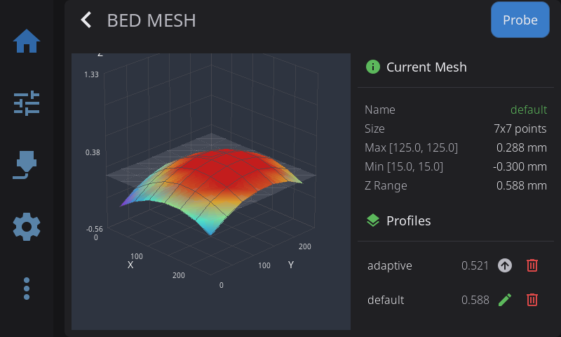

The Bed Mesh panel has two parts: a 3D visualization of your bed surface on the left, and information cards on the right.

**Visualization (left):**

- **Color gradient**: Blue (low) to Red (high)
- **Touch to rotate** the 3D view
- **Pinch** to zoom in on the spot, **two-finger drag** to move a zoomed view around; pinching all the way out returns to the full view
- When no mesh is loaded, the panel shows a "No mesh loaded" placeholder

**Current Mesh card (right):** shows the active profile name, mesh size (probe-point grid), highest and lowest points, and the overall Z range (variance).

**Probe a new mesh:** tap **Probe** in the panel header. HelixScreen first asks which profile to store the new mesh in. The name starts as `default`, the profile Klipper loads at startup; type another name to keep the new mesh separate. Tap **Start** to probe. When probing finishes, HelixScreen asks whether to save the printer configuration so the mesh survives a restart.

The visualization mode (3D, 2D, or Auto) can be changed in **Settings > Appearance > Bed Mesh Render**.

### Profile Management

The **Profiles** card on the right lists your saved mesh profiles. Each row shows the profile name and its Z range, with action icons on the right:

| Icon | Appears on | What It Does |
|------|-----------|--------------|
| **Load** (up arrow) | Inactive profiles | Loads that saved mesh, making it the active profile |
| **Rename** (pencil) | The active profile | Opens the rename dialog (see below) |
| **Delete** (trash) | Every profile | Removes that saved profile |

Tapping a row (or its Load icon) loads that profile.

**Renaming a profile:**

1. Tap the **pencil** icon on the active profile
2. The rename dialog shows the current name and a field for the new name
3. Enter a new profile name and tap **Rename**. Klipper reserves `default` for new calibrations, so a profile cannot be renamed to it.

**After renaming or deleting**, HelixScreen asks **"Save changes to persist them across restarts?"** Profile changes only live in memory until saved:

- Tap **Save** to write the change to your printer's saved configuration. This persists the change across restarts but **restarts Klipper**.
- Tap **Don't Save** to keep the change for the current session only — it will be lost when the printer reboots.

---

## Screws Tilt Adjust

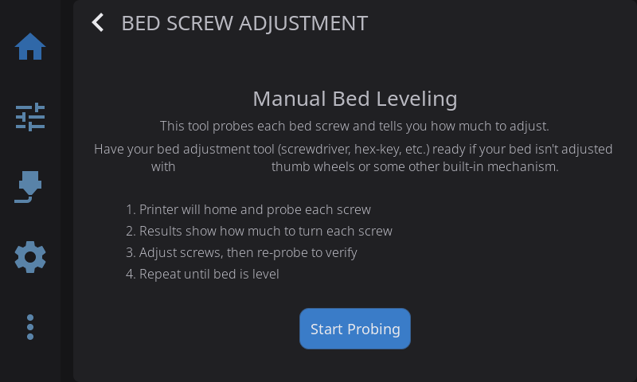

Assisted manual bed leveling:

1. Navigate to **Advanced > Screws Tilt**
2. Tap **Measure** to probe all bed screw positions
3. View adjustment amounts (e.g., "CW 00:15" = clockwise 15 minutes)
4. Adjust screws and re-measure until level

**Color coding:**

- **Green**: Level (within tolerance)
- **Yellow**: Minor adjustment needed
- **Red**: Significant adjustment needed

### Sharing the Results

Next to **Done** and **Re-probe** in the results view, a **share button** (QR icon) opens a card with every screw's name, probed height, and adjustment spelled out, plus a QR code alongside. The QR encodes exactly the same results as plain text — scan it with any phone camera and the numbers appear there, ready to paste into your notes or a forum post. A printer has no clipboard to copy from, so the QR is how the values leave the screen.

The reference screw is labeled **base** (it is the one everything else is measured against), and a screw needing no adjustment shows `--`.

---

## Input Shaper

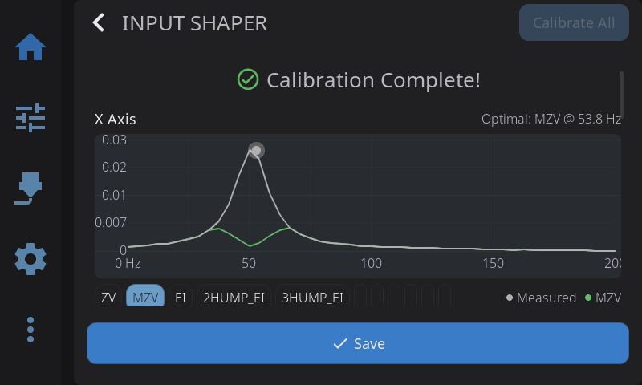

Tune vibration compensation for smoother, faster prints:

1. Navigate to **Advanced > Input Shaper**
2. Review your current shaper configuration displayed at the top
3. Pre-flight check verifies accelerometer is connected
4. Select axis to test (X or Y)
5. Tap **Calibrate** to run the resonance test. While the printer sweeps, a progress bar fills from 0 to 100%; the sweep covers the frequency range your printer's own resonance-tester config specifies, so progress tracks the real sweep rather than a fixed span. Once the sweep finishes it is replaced by a spinner with an "Analyzing data... Ns" counter while the printer's host crunches the samples. On slower printers the analysis alone can take a few minutes per axis; that wait is why the whole run gets a 10-minute timeout
6. View the **frequency response chart**; tap a shaper's chip to select it - the chart highlights what that shaper would leave behind
7. Review the **comparison table** showing recommended shaper and alternatives (frequency, vibration reduction, smoothing)
8. Check the **change summary** under the table: it shows what was active before the run ("ei @ 69.8 Hz -> mzv @ 53.8 Hz") and, when the chart has data, how much vibration the old setting would leave on today's measurements versus the new one ("Old setting on today's data: 8.4% residual - now: 7.8%")
9. Tap **Save**. One button does both jobs: it writes your selected shaper for each axis to the Klipper config and restarts the printer's firmware, so the new setting is active immediately and persists across reboots.

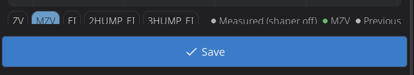

**Chart features:**
- The chart plots **relative vibration** (see the caption above each chart): lower is less residual vibration
- The legend keys all three curve kinds: **Measured (shaper off)** is the raw vibration your printer produced during the test, the shaper chips show the vibration each shaper would leave behind, and **Previous** shows what your old setting would have left behind (only shown when a previous setting existed)
- The shaper chips act as a selector, not a stack of switches: one shaper per axis is selected, the selected chip is what **Save** writes, and tapping the selected chip again keeps it selected
- Platform-adaptive: full interactive charts on desktop, simplified on embedded hardware
- Per-axis results shown independently

> **Creality K1/K2 note:** some Creality firmware versions overwrite the saved X-axis result with the Y-axis values when you calibrate both axes. HelixScreen detects this and shows a warning on the X results card — the X values it measured were correct, but the printer's saved config discards them. (On a Y-only run the warning appears on the Y card instead, since there is no X card to carry it.) Re-run **Calibrate X** alone and save if you want the measured X values kept.

> **Requirement:** Accelerometer must be configured in Klipper for measurements. If no accelerometer is detected, the pre-flight check will show a warning.

---

## Probe Management

View and control your Z probe from **Advanced > Probe Management**. HelixScreen auto-detects your probe type and shows the appropriate controls.

**Supported probe types:**

| Probe | Detected As | Type-Specific Controls |
|-------|-------------|----------------------|
| **Cartographer** | Cartographer | Calibrate, Touch Cal, Scan Cal |
| **Beacon** | Beacon | Calibrate, Auto-Calibrate |
| **BTT Eddy / Mellow Fly Eddy** | Eddy Current | Calibrate, Drive Current Cal |
| **BLTouch** | BLTouch | Deploy, Stow, Reset, Self-Test |
| **Voron Tap** | Voron Tap | — |
| **Klicky** | Klicky | Deploy, Dock |
| **Standard probe** | Probe | — |

**Universal actions** (all probe types):

| Button | What It Does |
|--------|--------------|
| **Accuracy Test** | Runs `PROBE_ACCURACY` to check probe repeatability |
| **Z-Offset Cal** | Opens the interactive Z-offset calibration panel |
| **Bed Mesh** | Opens the bed mesh calibration panel |

**Configuration:** Tap any config row (X/Y offset, samples, speed, retract distance, tolerance) to edit probe settings directly — changes are saved to your Klipper config with a firmware restart.

---

## Z-Offset Calibration

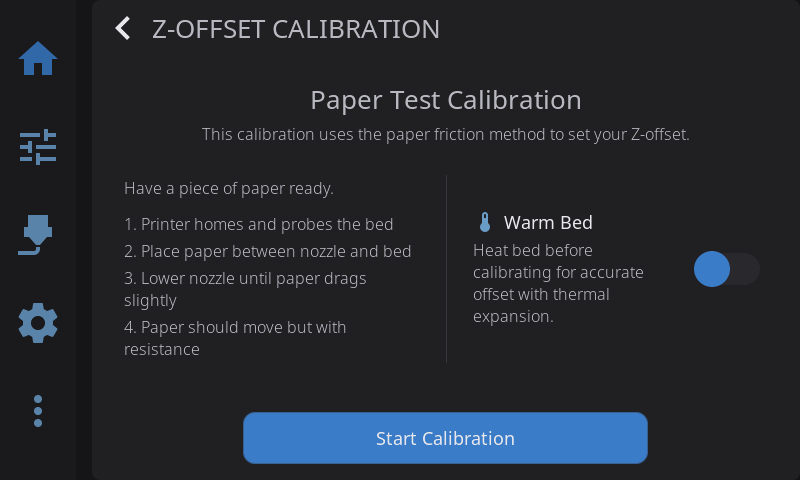

Interactive panel for dialing in your Z-offset when not printing. Works with all probe types — Cartographer, Beacon, BLTouch, eddy current probes, and standard probes.

1. Navigate to **Advanced > Z-Offset**, or tap **Z-Offset Cal** in the Probe Management overlay
2. Optionally enable **Warm Bed** to heat the bed before calibrating (accounts for thermal expansion)
3. Tap **Start** — the printer homes and begins the calibration sequence
4. Use the **+/−** adjustment buttons to lower the nozzle (paper test: adjust until paper drags slightly)
5. Tap **Accept** when satisfied, or **Abort** to cancel
6. The offset is saved to your Klipper config automatically

HelixScreen picks the right calibration command for your setup (`PROBE_CALIBRATE`, `Z_ENDSTOP_CALIBRATE`, or `SET_GCODE_OFFSET`) based on your printer's detected probe configuration.

> **Quick access:** A **Z Calibration** button is also available on the Controls panel for one-tap access.

> **Tool changer?** Some printers can also measure Z automatically for every tool, including the reference one, as part of [automatic Tool Offsets calibration](#tool-offsets-beta) — on those, this paper-test flow is hidden. Most tool changers only measure the *other* tools' offsets relative to the reference tool, so the paper test stays available to set the reference tool's own Z.

---

## Tool Offsets *(Beta)*

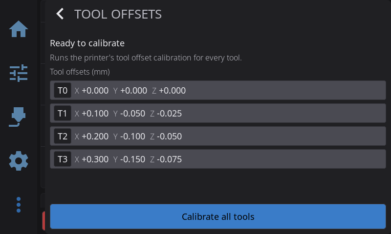

For tool-changer printers that can measure their own tool positions: one tap calibrates every tool's X, Y, and Z offset in a single automated pass, instead of adjusting each tool by hand.

### Requirements

This screen only appears on a tool changer whose firmware exposes the calibration macro. If your printer doesn't have it, use the regular [Z-Offset Calibration](#z-offset-calibration) flow instead — it still works per-tool.

Every tool your printer reports gets its own row, however many there are:

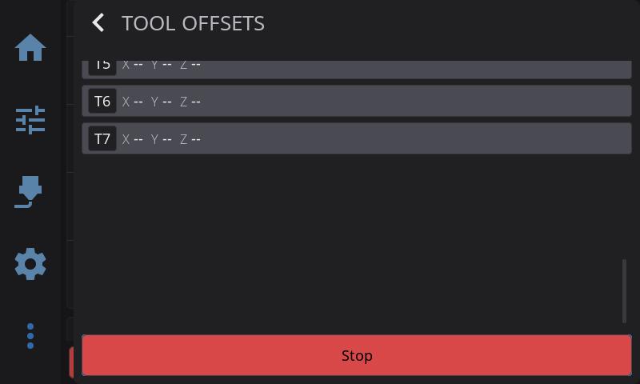

A tool that has never been calibrated shows `--` on each axis instead of a number, so it's never mistaken for a tool that measured exactly zero.

### Running a Calibration

1. Navigate to **Advanced > Tool Offsets** —

   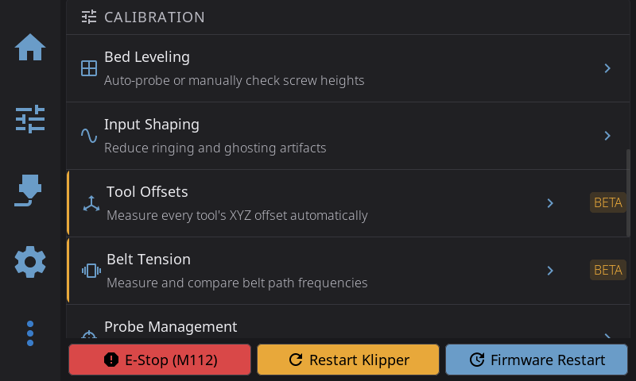

   — or tap **Tool Offsets** on the Controls panel:

   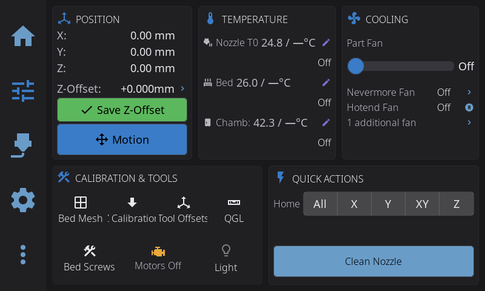

2. Clean every nozzle first — the confirmation dialog reminds you:

   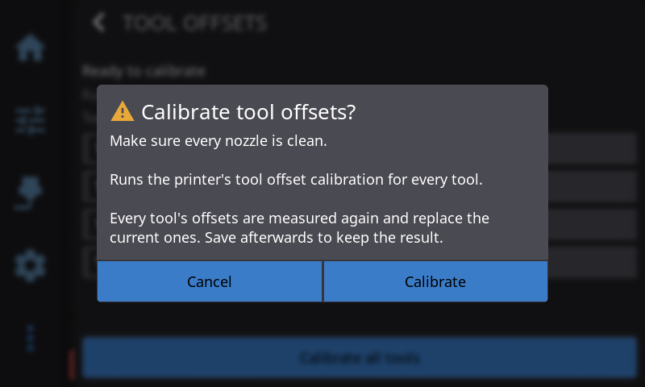

3. Tap **Calibrate all tools**, then confirm. The printer measures each tool in turn against its sensor; the row for whichever tool is currently being probed gets a highlighted border so it's clear which one is changing, while the rest keep showing their last known values

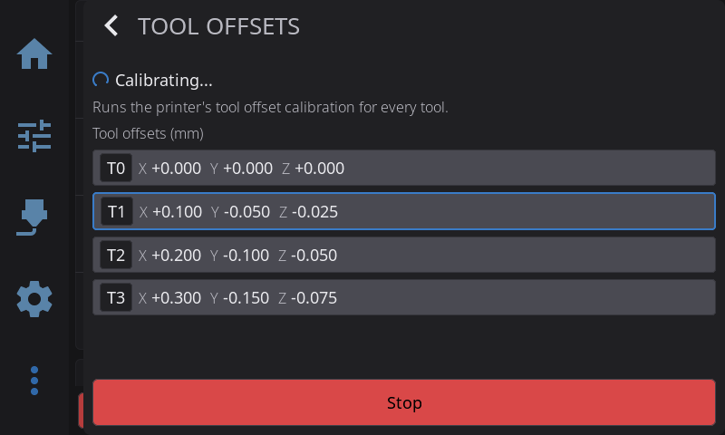

4. When the status line reads **Calibration complete**, tap **Save offsets** to write the results to your Klipper config (this briefly restarts Klipper, same as any other offset save)

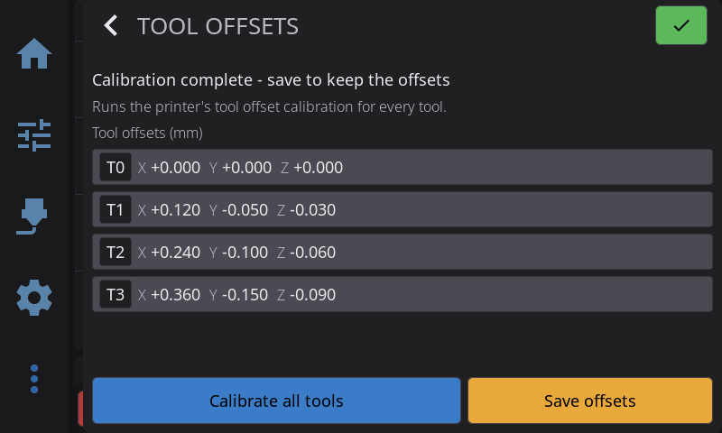

5. If the run fails partway through, the status line explains why and the run stops there — clean the affected tool's nozzle and try again

Tapping **Stop** during a run performs an emergency stop, since the calibration macro can't be paused partway through — only cancelled outright.

---

## Belt Tension

Belt Tension is not available yet. The pluck tuner that was in the 1.1 beta gave readings too
inconsistent to adjust a belt by on real printers, so it has been withdrawn. Its replacement
drives each belt path with the motors using Klipper's `TEST_RESONANCES` and compares the two
responses, which gives the same excitation every run. Progress is tracked in
[#1721](https://github.com/prestonbrown/helixscreen/issues/1721).

---

## Pressure Advance

Some printers can measure pressure advance themselves instead of printing a tuning tower you judge by eye. On those, a **Pressure Adv.** button appears in the Controls panel's **Calibration & Tools** card, and a **Pressure Advance** row under **Advanced > Calibration**. Today that is the **Snapmaker U1** and the **FlashForge Creator 5 Pro**; on other printers both stay hidden.

1. Tap either entry and pick the tool to measure. Picking a tool mounts it.
2. Set the nozzle temperature for the filament that's loaded, or tap a material preset.
3. Tap **Start** and confirm. Filament must be loaded: the printer heats the nozzle and extrudes a series of short test moves, which takes a few minutes (about 3 on the U1, up to 5 on the Creator 5 Pro).
4. Read the result. A value outside the usual range for the extruder is flagged so you can measure again.

Where the result goes depends on the printer:

- **Snapmaker U1:** the printer applies the value and keeps it for that tool.
- **Creator 5 Pro:** the printer keeps nothing. Copy the value into the filament's slicer profile.

Leaving the screen while it is still heating stops the run. Once measuring has started, **Stop** ends the run on the screen, but the printer finishes that measurement on its own and the nozzle stays hot.

---

## Heater Calibration (PID / MPC)

Calibrate temperature controllers for stable heating. HelixScreen supports two calibration methods:

- **PID** — Classic proportional-integral-derivative tuning. Works on all Klipper firmware.
- **MPC** *(Beta)* — Model Predictive Control. A physics-based thermal model that can provide more stable temperatures. Requires [Kalico](https://github.com/KalicoCrew/kalico) firmware (a Klipper fork with MPC support).

### PID Calibration

1. Navigate to **Advanced > Heater Calibration**
2. Select **Nozzle** or **Bed**
3. Choose a **material preset** (PLA, PETG, ABS, etc.) or enter a custom target temperature
4. Optionally set **fan speed** — calibrating with the fan on gives more accurate results for printing conditions
5. Tap **Start** to begin automatic tuning

**During calibration:**
- **Live temperature graph** shows the heater cycling in real-time
- **Progress percentage** updates as calibration proceeds
- **Abort button** available if you need to stop early
- A **20-minute timeout** acts as a safety net for stuck calibrations (slow-cooling beds can legitimately take longer than 15 minutes, so the limit sits above that)

**When complete:**
- View new PID values (Kp, Ki, Kd) with **old-to-new deltas** so you can see what changed
- Tap **Save Config** to persist the new values to your Klipper configuration

> **Tip:** Run PID tuning after any hardware change (new heater, thermistor, or hotend) and with the fan speed you typically use while printing.

### MPC Calibration (Beta — Kalico Only)

If you are running Kalico firmware and have [beta features enabled](/1.1/guide/beta-features/), a **Method** selector appears with MPC and PID options. HelixScreen auto-detects Kalico — the selector only appears when it is detected.

1. Navigate to **Advanced > Heater Calibration**
2. Select **MPC** in the Method selector (marked with a BETA badge)
3. Select **Nozzle** or **Bed**
4. Choose a target temperature preset
5. For nozzle calibration, select a **fan calibration level**: Quick (3 points), Detailed (5 points), or Thorough (7 points) — more points improve accuracy but take longer
6. If switching from PID to MPC for the first time, enter your **heater wattage** (check your heater's rating — typically 40–60W for hotends)
7. Tap **Start**

**First-time MPC switch:** If your heater is currently configured for PID, HelixScreen will automatically update your Klipper configuration to MPC mode and restart Klipper before beginning calibration. A progress screen shows "Updating Configuration..." during this step.

**When complete:**
- View MPC model parameters: Heat Capacity, Sensor Response, Ambient Transfer, and Fan Transfer (nozzle only)
- Results are automatically saved to your Klipper configuration

---

---

## See Also

- [Motion & Positioning](/1.1/guide/motion/) — Jog controls used during manual calibration
- [Settings: Printing](/1.1/guide/settings/printing/) — Machine limits and Z movement configuration
- [Printing](/1.1/guide/printing/) — Z-offset fine-tuning during active prints

---

**Next:** [Settings](/1.1/guide/settings/) | **Prev:** [Barcode Scanner](/1.1/guide/barcode-scanner/) | [Back to User Guide](/1.1/guide/)
