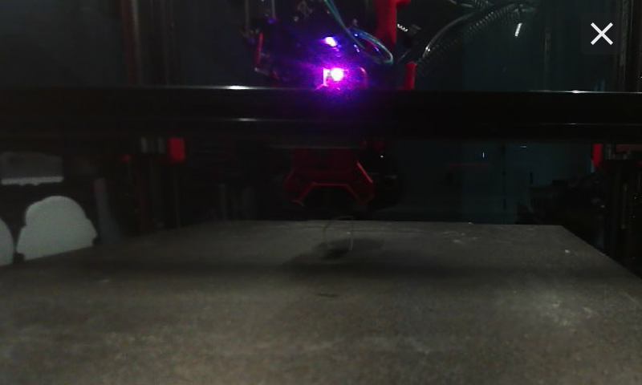

If your printer has a webcam configured in Moonraker, HelixScreen can show the live feed both as a home-dashboard widget and as a standalone fullscreen viewer. You can rotate and flip the image to match how your camera is mounted.

---

## Viewing the Camera

There are two ways to see the feed:

- **Home widget** — add the Camera widget from the Home dashboard's edit mode (long-press the dashboard, then tap Add Widget). It shows the live feed inline. Tap it to expand into the fullscreen viewer.
- **Camera button while printing**: when HelixScreen runs on a separate screen or device from the printer (not on the printer itself) and a webcam is detected, the print screen's header shows a **Camera** button that opens the fullscreen viewer.
- **Standalone fullscreen viewer** — open **Settings > Devices > Camera** to view the live feed fullscreen without adding a widget. This entry only appears when a webcam is detected (an enabled webcam configured in Moonraker).

The feed is decoded as an MJPEG stream when one is available. If only a snapshot URL is configured, HelixScreen falls back to periodically polling that snapshot image instead.

---

## Choosing Between Several Cameras

When Moonraker lists more than one enabled webcam, HelixScreen picks one automatically: the first camera whose service is an MJPEG streamer (mjpegstreamer, ustreamer) and whose serving process is running, otherwise the first camera with a usable snapshot image, polled. That automatic choice is what the standalone fullscreen viewer and the QR scanner always show.

The home widget can be pointed at a specific camera instead. Open the camera configuration (edit mode, then the gear icon) and choose it under **Source**:

- **Automatic** — the camera HelixScreen would pick on its own.
- A named camera — one of the enabled webcams in Moonraker's list. A camera whose service is not MJPEG (WebRTC, HLS, an IP camera) is marked **Snapshot only**: HelixScreen will poll its snapshot image rather than stream it. A camera whose service is not running is marked **Unavailable**.

The choice is saved with the widget by name, so it survives a change of the printer's address. If the named camera later disappears from Moonraker, is disabled, or its service stops, the widget falls back to the automatic choice rather than showing **No Camera**, and returns to the named camera when it is back. Each widget has its own Source, so two camera widgets on one dashboard can show two different feeds — each one is a separate stream and a separate decode, so expect the extra CPU cost on small boards.

---

## Stream Status

While the camera is connecting or unavailable, the widget shows a status message over a spinner:

| Status | Meaning |
|--------|---------|
| **Connecting Camera…** | HelixScreen is establishing the stream; the status clears once the first frame arrives |
| **No Camera** | No webcam is configured, or the stream couldn't be reached |

At the smallest widget size (1x1) the camera shows only an icon and does not stream — make the widget larger to see the live feed.

---

## Rotation & Flip

To correct a camera that's mounted upside-down or mirrored, open the camera configuration:

1. Enter Home dashboard **edit mode**.
2. Tap the gear icon on the Camera widget.

The configuration dialog offers:

- **Source** — which camera to show (see above); only listed when Moonraker names at least one camera
- **Rotation** — 0°, 90°, 180°, or 270°
- **Flip** — Horizontal and/or Vertical

Tap **Save** to apply, or **Cancel** to discard. The transform is saved with the widget so it persists across restarts.

---

## Performance Notes

HelixScreen throttles the camera stream to keep the UI responsive and save resources:

- The stream runs at the frame rate configured in Moonraker (defaulting to 15 fps if not specified).
- While another overlay is covering the widget, the stream is **paused** and resumes when the overlay closes.
- During Home dashboard edit mode, the frame rate is **reduced** so editing stays smooth.
- When the display goes to sleep, the camera stream **stops** entirely and restarts on wake.

---

**Next:** [Print History](/1.1/guide/print-history/) | **Prev:** [Security & Screen Lock](/1.1/guide/security/) | [Back to User Guide](/1.1/guide/)
