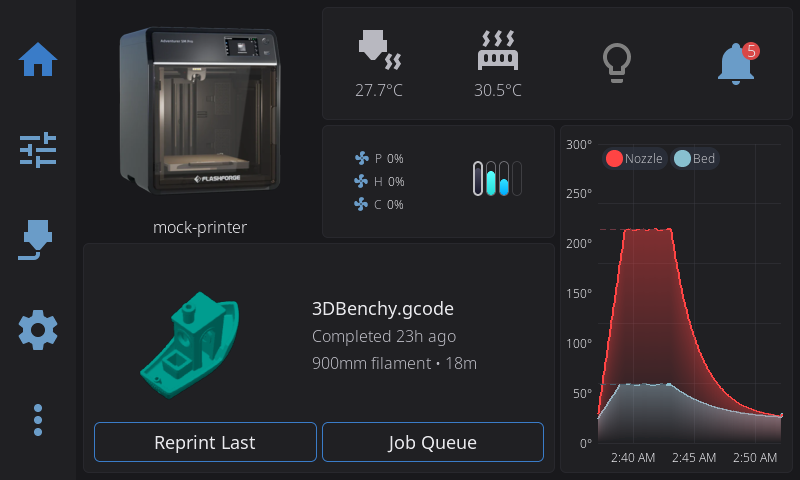

The Home Panel is your printer dashboard — a fully customizable grid of widgets spread across multiple pages, like home screens on a phone. You choose what appears, where it goes, how big each widget is, and can rearrange everything with drag-and-drop.

<!-- Screenshot: default home panel layout, idle printer -->

---

## The Widget Grid

Your dashboard is built from **widgets** — individual cards that display printer information and controls. Widgets live on a flexible grid:

- The grid is sized from your screen so that **cells come out square** — how many you get
  depends on the screen, from 6x4 on a small 800x480 panel up to 8x5 on a 1024x600 or
  1280x720 one
- Each widget occupies one or more grid cells
- Widgets cannot overlap — the grid enforces clean layouts
- **Everything saves automatically** and persists across restarts and updates

Most widgets don't draw their own box. Instead, neighbouring widgets sit on one **shared card background** that flows around the whole group, so a cluster of small readouts reads as a single panel rather than a row of separate tiles. A few widgets bring their own surface and stay visually distinct — Print Status, Camera, Nozzle Temperatures and the AMS spool view — and Printer Image and Tips deliberately float on the bare background. Move a widget and the card reshapes itself around wherever it lands.

When you first launch HelixScreen, a default layout is created with your printer image, print status, temperatures, and other commonly used widgets, arranged to suit your screen. From there, you can customize everything.

### On ultrawide and portrait screens

There is no fixed grid to fall off. Both directions are worked out from the screen with the
same square cell, so an unusually shaped screen simply gets an unusually shaped grid.

- **Ultrawide** (e.g. 1920x440): a lot more columns, the same handful of rows — 23 columns by 5 rows.
- **Portrait** (e.g. 480x800): the grid turns with the screen — 4 columns by 6 rows. A tall,
  narrow 320x1480 panel gets 4 columns by 17 rows.

Ultrawide and portrait screens each start from **their own default layout**, not a stretched
landscape one. **Tips** is part of the portrait layout, running full width above the print
status card; it is left out only on the shortest portrait panels, where a band of rotating
hints costs more of the screen than it earns. Any widget left out of a default layout is
still in the Widget Catalog if you want it.

Buttons, input fields, and headers are sized from the screen's *height* on portrait panels, so a tall screen gets taller, easier-to-hit controls rather than the cramped ones its narrow width would otherwise imply.

> Portrait overall is still alpha, but the home dashboard is not the only panel that adapts — Print Status, Print Tune, Motion, Bed Mesh and the temperature graph rearrange for a tall screen too. Panels outside that set fall back to the landscape layout. See [Ultrawide or portrait screen looks stretched, cramped, or clipped](../TROUBLESHOOTING.md#ultrawide-or-portrait-screen-looks-stretched-cramped-or-clipped).

---

## Multiple Pages

Your dashboard can have **multiple pages** of widgets — just like home screens on a phone. Each page has its own independent grid layout.

### Navigating Between Pages

- **Swipe left or right** anywhere on the widget grid to move between pages
- **Dot indicators** at the bottom of the screen show which page you're on and how many pages you have
- If you only have one page, the dots are hidden, in Edit Mode too. Swiping still works for one thing: the screen to the right of your page holds the **Add page** tile (see below), and you can swipe over to it

### The Main Page

One page is designated as the **main page** (the first page by default). This is the page shown when you first connect to your printer.

**Home button behavior:**

- From any other panel, tapping the **Home** button takes you back to the Home panel — to whichever page you were last viewing
- Tapping **Home** again while already on the Home panel jumps to the **main page**
- So the main page is always at most **two taps** of the Home button away

### Adding a Page

**The easy way: the Add page tile.** A tile with a **+** sits one swipe past your last page, labelled **Add page**.

1. Swipe to your last page, then one more: the **Add page** tile slides in
2. Tap the **+**. The new page is created right away and you land on it, empty and ready for widgets (see [Adding a Widget](#adding-a-widget))

You can stay in Edit Mode or not - the tile and its + work either way.

**By dragging a widget:** a new page also starts with a widget on it, when you drag one past the edge of the first or last page.

1. Enter **Edit Mode** (long-press the widget grid)
2. Pick up a widget (see [Moving a Widget](#moving-a-widget)) and carry it across the right edge of each page until you are on your **last page**
3. Keep going past the right edge of your last page: an empty page slides in, with the widget still under your finger
4. Drop the widget anywhere on it. The new page is created past the last one, with the widget where you dropped it. Drag back instead and no page is created
5. Add more widgets to the new page (see [Adding a Widget](#adding-a-widget))

At the **left edge of your first page** nothing slides in; the page is made when you let go. Drag the widget until most of it is past the left edge of your first page (over the navigation bar, in landscape) and release. The new page is created **before** your first one, with the widget at its left side, and every other page shifts one to the right with all its widgets.

Swiping never takes you past your last page, except to the Add page tile: the empty page slides in only while you drag a widget onto it. If the widget you dragged was the last one on its page, that page is removed as the new one is created (see [Moving a Widget to Another Page](#moving-a-widget-to-another-page)).

### Page Limit

The dashboard supports up to **8 pages**. At the limit there is no Add page tile to swipe to, and dragging a widget past the edge of your first or last page creates nothing.

### Deleting a Page

While in Edit Mode, any page other than the main page shows a **red trash button** in its top-right corner (it appears only when you have more than one page). Tap it, confirm, and the page is removed along with every widget on it. The main page has no delete button.

---

## Edit Mode

Edit Mode is how you customize your dashboard layout. While in Edit Mode, all normal widget interactions (tapping to open overlays, etc.) are disabled so you can freely rearrange things.

> **Edit Mode is on by default.** If it triggers accidentally when a finger rests on the screen (common on a tablet lying flat), you have two options: turn it off entirely with **Allow Home Screen Editing** under **Settings → Touch & Input**, or raise the **Long Press Time** slider in the same page so a longer hold is required. Both take effect immediately.

**Page swiping in Edit Mode:** Swiping between pages works in Edit Mode just as it does outside it: between your pages, plus the Add page tile past your last one, and never further. Swiping pauses from the moment your finger lands on the selected widget until you lift it, while you drag or resize a widget, and while the Widget Catalog is open. To take a widget to another page, or to a new page before your first or past your last one, drag it across the page border - see [Moving a Widget to Another Page](#moving-a-widget-to-another-page).

### Entering Edit Mode

**Long-press** (press and hold for about half a second) **anywhere on the widget grid**. You'll see:

- A faint **grid of dots** appears showing the underlying grid structure. **Every dot you can see is somewhere the selected widget is allowed to land** — see [Snapping and half cells](#snapping-and-half-cells) below
- **Corner brackets** appear on the widget under your finger, indicating it's selected
- All normal widget tap actions are disabled — you can touch anything without triggering it

The widget you long-pressed is selected, not picked up, however long you keep holding. To move it, lift your finger and press it again.

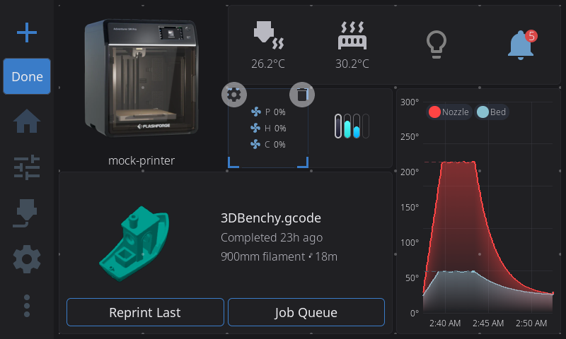

### Selecting a Widget

- **Tap any widget** to select it — animated corner brackets appear at its edges
- The corner brackets **pulse** gently to indicate the active selection
- **Tap empty space** to deselect the current widget
- Only one widget can be selected at a time
- Pressing a widget that is not selected only selects it, even if your finger then slides: a slide across the grid swipes pages rather than dragging a widget

### Moving a Widget

1. **Select** a widget by tapping it (the widget you long-pressed to enter Edit Mode is already selected)
2. **Press it again and drag** it to a new position. You can also skip the tap: **press and hold** any widget for about half a second to pick it up, then drag
3. As you drag, a **snap preview** appears showing where the widget will land:
   - **Blue/accent preview** = valid drop position
   - **Red preview** = invalid position (would overlap another widget)
   - Carrying a widget past the edge of the grid doesn't make it invalid: the preview stays at the nearest position inside the grid
4. **Release** to drop the widget - it lands in the grid position the preview showed
5. If the position is invalid, the widget returns to its original spot and stays selected

### Moving a Widget to Another Page

1. Start dragging a widget
2. Carry it past the left or right edge of the page until most of the widget is over the border, or hold your finger near the edge of the widget area for a moment (in landscape, the left edge is the one beside the navigation bar)
3. The neighbouring page slides in, with the widget still under your finger. At the left edge of your first page there is no page to slide in: letting go there creates a new page in front (see [Adding a Page](#adding-a-page))
4. Drop the widget where you want it

**Creating a page by dropping:** drag a widget past your last page and an empty page slides in. Drop the widget anywhere on it and the page is created, with the widget where you dropped it. Drag back instead and no page is created. At the **left edge of your first page** no page slides in: release the widget with most of it past that edge and a new page is created **before** your first one, with the widget at its left side. At the 8-page limit neither edge creates a page.

**Empty pages remove themselves:** when a page's last widget is moved to another page or removed, the empty page is deleted from your layout. The main page is never removed this way. A page that still holds widgets greyed out because their hardware isn't detected is not empty, and stays.


### Resizing a Widget

Almost every widget is resizable. **Print Controls** keeps its fixed 2x1 size and **Power** keeps a one-cell minimum; everything else can be made bigger or smaller within the sizes in the tables below:

1. **Select** the widget by tapping it
2. Look for **thin edge lines** along the sides of the selected widget — these are the resize handles
3. **Drag from any edge** to resize in that direction
4. As you drag, two previews appear:
   - A thin border follows your finger exactly (pixel-tracking)
   - A grid-snapped preview shows the final size
5. The widget snaps to valid grid sizes based on its constraints:
   - Each widget has a **minimum** and **maximum** size (see the widget table below)
   - Resizing stops at the grid boundary
   - Resizing stops if it would overlap another widget
6. **Release** to apply the new size — the widget rebuilds at its new dimensions

Some widgets adapt their content based on size. For example, the Digital Clock shows just the time at 1x1, adds the date at 2x1, and shows uptime too at 2x2 or larger.

### Snapping and half cells

Widgets place and resize in half-cell steps. What varies is which axes a widget takes those steps on:

| Widget | What it can do |
|--------|----------------|
| **Print Status**, **Camera**, **Printer Image**, **Temperature Graph**, **Tips**, **Job Queue**, **Print Stats**, **Multi-Filament System Status**, **Active Spool**, **Nozzle Temperatures**, **Temperatures**, **Fan Speeds**, **Tool Switcher**, **Clog Detection**, **Digital Clock** | Move **and resize** in half-cell steps on **both** axes - so 1.5x1 and 2x2.5 are real sizes |
| **Preheat**, **Macro Button** | Half-cell steps **across** only - useful when a long macro name is getting cut off |
| **Network**, **LED Light**, **LED Controls**, **Filament Sensor**, **Notifications**, **G-code Console**, **Macros**, **Motion**, **Bypass**, **Fan**, **Temperature Sensors**, the single **Nozzle**, **Bed** and **Chamber** temperature tiles, **Shutdown/Reboot**, **Lock Screen**, **Firmware Restart** | Move **and resize** in half-cell steps on both axes. These are the centred-icon tiles: they start at half a cell wide by one cell tall and grow as large as you like, stepping their icon and text up to whatever the new size carries |
| **Power** | Resizes in half-cell steps like the tiles above, but never below one whole cell - its round device badge does not shrink |
| **Humidity**, **Width Sensor** | Snap to whole cells in both directions (1x1 up to 2x2) |

On the smallest panels (about 480 pixels wide or less), half-cell steps are not offered at all: every widget snaps to whole cells there, because half a cell cannot carry an icon and a reading side by side.

The floor across the grid: no widget goes below half a cell wide by one cell tall, and the height floor is one whole cell for every widget. Some of the bigger widgets - **Preheat**, **Print Status**, **Print Controls**, **Job Queue**, **Clog Detection** - have a two-cell minimum width.

You don't have to remember which is which. The dot grid tells you: **whole-cell dots are always drawn, and the smaller, fainter half-cell dots in between appear only while a widget that can use them is selected** - and only on the axis it can use them on. If you see the extra dots, you can snap to them. If you don't, the widget you have selected snaps to whole cells.

Half-cell sizes are also why the Widget Catalog occasionally shows a size like "1.5x1" on a badge.


### Adding a Widget

In Edit Mode there are two ways to open the Widget Catalog:

- Tap the **+** button at the start of the navigation bar (the navigation bar runs along the bottom of the screen in portrait)
- **Long-press an empty area** of the grid — this also tells HelixScreen where you want the widget to go

**The Widget Catalog** opens on a list of **5 categories** - Print & Status, Temperature & Cooling, Filament, Controls, and System, each showing how many widgets it holds. Tap a category to see the widgets inside it. A **back button** in the header returns you to the category list, so you can browse another category without closing the catalog.

A **search box** at the top of the catalog matches widget names and descriptions. Typing switches the list to the matching widgets, wherever their category; clear the box to get the category list back.

Widgets this printer cannot use (missing hardware, wrong platform) sit in their own **Unavailable on this printer** section at the bottom of the category list, each with the reason in brackets after its name. Inside search results they appear inline, dimmed with the same reason. A category whose every widget is unavailable is hidden from the category list rather than shown empty.

Inside a category, each widget entry shows:
- Widget name and description
- Size badge in cells (e.g., "2x1" means two cells wide by one tall)
- Widgets already on your dashboard are **dimmed** and labeled "Placed"

Tap any available widget to add it. HelixScreen places it near where you long-pressed, or finds the best available spot if that area is occupied. If there's no room at the widget's usual size, HelixScreen tries smaller sizes, down to the widget's minimum, before telling you there isn't enough room.

The **Reset** button in the catalog header resets your whole dashboard — see [Resetting to Defaults](#resetting-to-defaults).

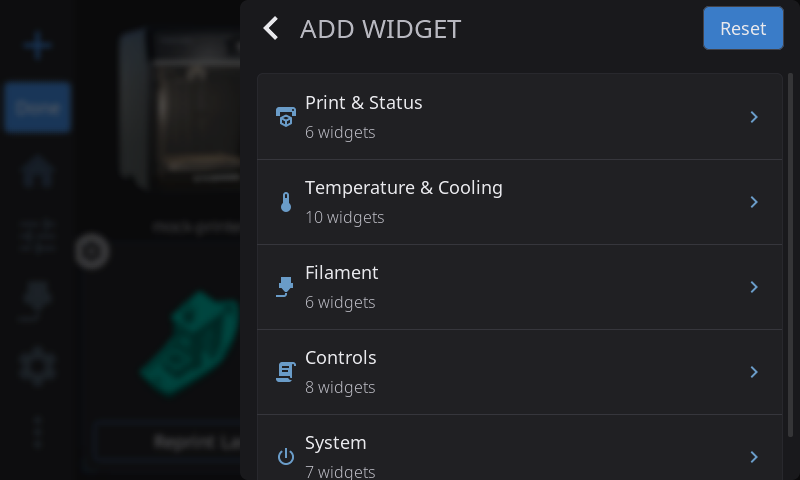

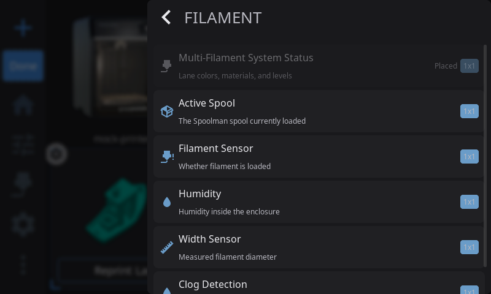

### Removing a Widget

1. **Select** the widget you want to remove
2. A **trash icon** appears at the widget's upper-right corner - tap it
3. The widget is removed from your grid

Removing a widget you can add only once keeps its settings, so adding it back from the Widget Catalog brings them back. A widget you can add more than once, like Fan, Macro Button, or LED Light, is added as a new copy each time, and removing a copy you added deletes that copy along with its settings.

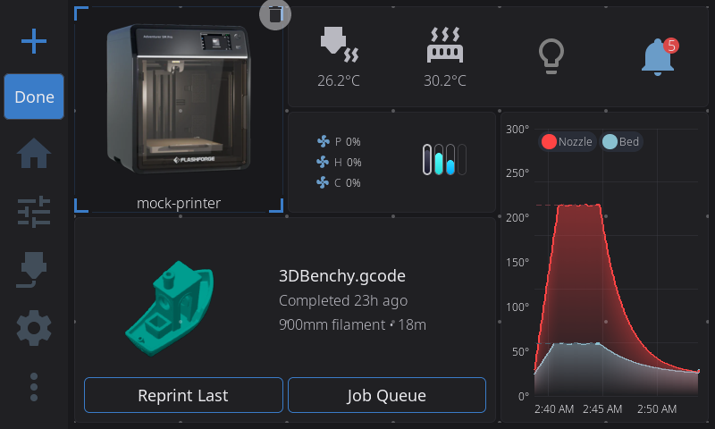

### Configuring a Widget

Some widgets have settings you can change directly from Edit Mode. When you select one of these configurable widgets, a **gear icon** appears in the upper-left corner (the trash icon is in the upper-right).

**Configurable widgets:**

| Widget | What the gear button does |
|--------|--------------------------|
| **Temperatures** | Toggles between Stack and Carousel display mode |
| **Fan Speeds** | Toggles between Stack and Carousel display mode |
| **Temperature Sensors** | Toggles between single-sensor and Carousel display mode |
| **Fan** | Opens the fan picker — choose which fan to monitor |
| **Temperature Graph** | Opens a configuration modal — toggle sensors on/off and customize series colors |
| **Macro Button** | Opens the config modal — pick the macro, its icon and color, and whether running it asks for confirmation |
| **Print Status** | Opens the section picker — choose which sections to show |
| **Filament Sensor** | Opens the sensor source picker - choose which sensor the tile follows: Auto, Runout, Toolhead, or Entry |
| **Power** | Opens the device picker — choose which power device to bind |
| **Camera** | Opens the camera configuration modal - pick which webcam the widget shows (Automatic, or one of your printer's named webcams), and set rotation and flip |
| **Clog Detection** | Opens the Clog Detection config modal — set detection source, mode, and thresholds |

**To configure a widget:**

1. Enter Edit Mode (long-press the widget grid)
2. **Tap** the widget you want to configure — corner brackets and action buttons appear
3. **Tap the gear icon** in the upper-left corner
4. For Temperatures/Fan Speeds: the widget immediately switches between Stack and Carousel mode. Tap the gear again to switch back.
5. For Macro Buttons: a config modal opens with three tabs. **Macro** lists all available Klipper macros — tap one to assign it, and the button updates immediately. **Appearance** sets the icon and color. **Options** holds **Require Confirmation?**, described below.
6. For Filament Sensor: a picker opens listing the sensor sources (Auto, Runout, Toolhead, Entry). Tap one to assign it - the tile updates immediately.


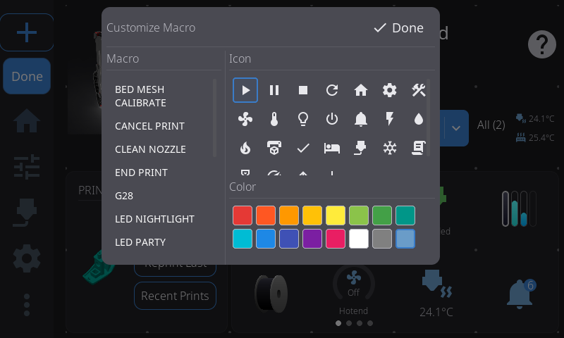

### Resetting to Defaults

Open the Widget Catalog (the **+** button in Edit Mode) and tap **Reset** in its header to restore the default widget layout.

This is a full reset, so be sure before you confirm it:

- **All pages** collapse back to a single page — any extra pages you created are removed
- Widget positions, sizes, and the set of enabled widgets all go back to defaults
- **Per-widget settings go too** — display modes, the fan each Fan widget watches, the macro on each Macro Button. The layout is rebuilt from scratch, not adjusted

The default layout is authored per screen shape rather than being one arrangement stretched to fit, so what you get depends on your panel. On a typical 800x480 landscape screen: **Printer Image** in the top-left, a block of small readouts (nozzle, bed, LED, notifications, fan, filament) to its right, the **Temperature Graph** down the right side, and **Print Status** as a wide band across the bottom. Bigger screens get the same shape with more room, and add **Tips** as a footer band. Portrait and ultrawide screens have their own layouts. Anything not placed by the default layout auto-fills the leftover cells.

### Exiting Edit Mode

- Tap the **Done** button in the navigation bar
- The other navigation buttons are disabled while you edit. If something else takes you off the Home panel, Edit Mode exits automatically and saves your changes

---

## Available Widgets

> **Sizes** are listed as columns x rows. For example, "2x1" means 2 columns wide and 1 row tall. A width of "0.5" means half a cell, and "Full grid" means the widget can be stretched across the whole dashboard.

These are the same 5 groups the Widget Catalog uses on the device.

### Print & Status

| Widget | Description | Default | Min | Max | Resizable | Hardware Required |
|--------|-------------|---------|-----|-----|-----------|-------------------|
| **Printer Image** | Your printer's photo, with live chips for the heaters, part fan and light while they are in use (see [Status Chips on the Printer Image](#status-chips-on-the-printer-image)). Tap a chip for that part's controls, or the picture itself to open the Printer Manager overlay where you can change the name, image, and see hardware info. | 2x2 | 1x1 | 4x3 | Yes | — |
| **Print Status** | Tracks the print job in all three of its states - idle (pick a file), preparing (pre-print steps with a progress bar), and printing (filename, percentage, ETA, elapsed time). Pauses scheduled in the G-code (M600, PAUSE and friends) show as ticks on the progress bar and arc, so you can see a filament change coming. Tap opens the full Print Status overlay whenever a job is preparing or printing, or the file browser when idle. | 2x2 | 2x1 | Full width x3 | Yes | — |
| **Print Controls** | Pause, resume, and stop buttons for the running print, right on the dashboard. | 2x1 | 2x1 | 2x1 | No | — |
| **Print Stats** | Print history statistics — total prints, success rate, and total print time. Tap to open the full print history overlay. | 2x2 | 2x1 | 3x2 | Yes | — |
| **Job Queue** | Shows the number of queued print jobs. Tap to open the Job Queue Manager modal (see [Job Queue Manager](#job-queue-manager) below). | 2x2 | 2x2 | 4x3 | Yes | — |

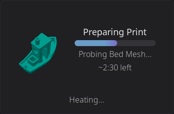
| **Camera** | Live webcam feed from your MJPEG stream. Tap to go fullscreen. Automatically detects webcams configured in Moonraker. See [Camera Widget](#camera-widget) below for setup tips. | 2x2 | 1x1 | 4x3 | Yes | Webcam configured |

### Temperature & Cooling

| Widget | Description | Default | Min | Max | Resizable | Hardware Required |
|--------|-------------|---------|-----|-----|-----------|-------------------|
| **Nozzle Temperature** | Live nozzle temperature for the active extruder, with an animated heating icon that pulses when the heater is active. Tap to open the temperature graph overlay. (Singular - shows one nozzle. For all extruders at once, use **Nozzle Temperatures** below.) | 1x1 | 0.5x1 | Full grid | Yes | — |
| **Nozzle Temperatures** | Shows **all** extruder temperatures at once, each as a labeled row with current and target readings color-coded by state (green at-temp, red heating, blue cooling, gray off), plus a bed row at the bottom. On multi-tool printers each extruder gets its own row, labeled "Nozzle 1", "Nozzle 2", … at wider sizes, with shorter "Tool 1"-style labels or bare numbers where the row is narrow (toolchangers with named tools keep their configured names). Tap a nozzle row to open the nozzle temperature graph, or the bed row for the bed graph. (Plural - for single-extruder printers the singular **Nozzle Temperature** widget is simpler.) | 1x2 | 1x1 | 2x3 | Yes | — |
| **Bed Temperature** | Live bed temperature with current and target readings. Tap to open the temperature graph overlay. | 1x1 | 0.5x1 | Full grid | Yes | — |
| **Chamber Temperature** | Live chamber temperature with current and target readings, shown with a chamber icon and an animated heating indicator. Tap to open the temperature graph overlay focused on the chamber. Only available on printers with a chamber temperature sensor or heater. | 1x1 | 0.5x1 | Full grid | Yes | Chamber sensor or heater |
| **Temperatures** | Stacked view showing nozzle, bed, and chamber temperatures in one widget. Each row shows current temp and target. Also available in Carousel mode (see [Display Modes](#display-modes-stack-vs-carousel) below). Tap any reading to open the temperature graph. | 1x1 | 1x1 | 3x2 | Yes | — |
| **Temperature Sensors** | Monitor additional temperature sensors (chamber, enclosure heater, etc.) in a single-sensor or carousel view. You can add multiple instances, each configured to a different sensor. Also available in Carousel mode. | 1x1 | 0.5x1 | Full grid | Yes | Extra temp sensors |
| **Temperature Graph** | Live temperature chart with configurable sensor series. Shows colored lines for each sensor with optional target setpoint lines. Content adapts to size — larger sizes show legends, axis labels, gradients, and temperature readouts. Tap to open the full-screen graph overlay. Configure which sensors to display via the gear icon in Edit Mode. You can add multiple instances. | 2x2 | 1x1 | Full width x4 | Yes | — |
| **Preheat** | Quick preheat buttons with material selection. Tap a material to instantly set nozzle and bed temperatures to that material's profile. | 3x1 | 2x1 | 4x1 | Horizontal only | — |
| **Fan Speeds** | Part cooling, hotend, and auxiliary fan speeds at a glance. Fan icons spin when running. Also available in Carousel mode with arc slider controls. Tap to open the Fan Control overlay. You can add multiple instances. | 1x1 | 1x1 | 3x2 | Yes | — |
| **Fan** | Monitor a single fan's speed. Tap to open a fan picker to choose which fan to display. You can add multiple instances, each showing a different fan. Configure via the gear icon in Edit Mode. | 1x1 | 0.5x1 | Full grid | Yes | — |

### Filament

| Widget | Description | Default | Min | Max | Resizable | Hardware Required |
|--------|-------------|---------|-----|-----|-----------|-------------------|
| **Active Spool** | Shows the currently loaded Spoolman spool — displays the spool color, material type, brand, and remaining weight. Tap to edit the active spool. At compact sizes (1x1) shows just the colored spool icon; at wider sizes shows material details alongside. | 1x1 | 1x1 | 4x2 | Yes | Spoolman configured |
| **AMS Status** | A live view of your multi-material spool lanes. At 1x it's a compact row of colored bars — one per lane, each filled to show roughly how much filament is left. At 2x and wider it switches to a detailed view: a small spool for each lane with its lane number, material type (PLA, PETG…), and percent remaining, and the currently loaded lane's number badge is highlighted green. The spools size to fit the widget — 2 across at 2x, 4 across at 4x — and any lanes that don't fit scroll sideways. Tap for the full AMS panel. | 1x1 | 1x1 | 4x2 | Yes | AMS/MMU detected |
| **Filament Sensor** | Filament runout detection status. Tap to load, unload, or purge filament - what happens depends on what's going on: if the sensor is turned off, tapping opens its settings instead; while a print is running the modal is a status readout only; and if the print is paused you also get **Resume Print** and **Cancel Print**, so a runout pause can be dealt with without leaving the home screen. Cancelling asks you to confirm first. Configurable via the gear icon in Edit Mode - choose which sensor the tile follows. See [Configuring a Widget](#configuring-a-widget) above. | 1x1 | 0.5x1 | Full grid | Yes | Filament sensor |
| **Width Sensor** | Live filament width reading from a diameter sensor. | 1x1 | 1x1 | 2x2 | Yes | Width sensor |
| **Clog Detection** | Filament clog and flow health monitor. Shows the FlowGuard bar, and a buffer sync meter on Happy Hare printers. Tap to open the Buffer Status detail modal. Configurable via the gear icon in Edit Mode. See [Clog Detection Widget](#clog-detection-widget) below. | 2x1 | 2x1 | 4x2 | Yes | AMS/MMU detected |
| **Bypass** | One-tap toggle for external-spool bypass. Shows the bypass state (icon changes, and the external spool's color and material while engaged) - tap to toggle. Same guards as the AMS panel's bypass toggle: if filament is loaded from a lane it unloads first, and while a job holds the printer (preparing, printing, or paused) the tap is refused with a "Bypass cannot be changed while printing" warning. | 1x1 | 0.5x1 | Full grid | Yes | Filament system with bypass |
| **Humidity** | Enclosure humidity reading from a connected sensor. | 1x1 | 1x1 | 2x2 | Yes | Humidity sensor |

### Controls

| Widget | Description | Default | Min | Max | Resizable | Hardware Required |
|--------|-------------|---------|-----|-----|-----------|-------------------|
| **Macro Button** | One-tap buttons to run configured macros. Add as many Macro Button widgets as you like, each independently configurable — assign a macro to each via the gear icon in Edit Mode. See [Macro Button confirmation](#macro-button-confirmation). | 1x1 | 1x1 | 2x1 | Horizontal only | — |
| **Macros** | One-tap shortcut to open the [Macros](advanced.md#macro-execution) panel for browsing and executing Klipper macros. | 1x1 | 0.5x1 | Full grid | Yes | — |
| **G-code Console** | One-tap shortcut to open the [G-code Console](advanced.md#g-code-console) overlay for sending commands and viewing Klipper responses. See [G-code Console Widget](#g-code-console-widget) below. | 1x1 | 0.5x1 | Full grid | Yes | — |
| **Motion** | One-tap shortcut to open the [Motion](/1.1/guide/motion/) panel for jogging the toolhead and homing. | 1x1 | 0.5x1 | Full grid | Yes | — |
| **Tool Switcher** | Quick tool switching for multi-tool printers (IDEX, toolchangers, multi-head). Shows the available tools and lets you switch the active tool with one tap. See [Tool Switcher Widget](#tool-switcher-widget) below. | 1x1 | 1x1 | 2x2 | Yes | Multi-tool printer |
| **Power** | Toggle a Moonraker power device (PSU, lights, etc.) with one tap. You can add multiple instances, each bound to a different device. Shows the device name, state, and a customizable icon. | 1x1 | 1x1 | Full grid | Yes | Power devices |
| **LED Light** | Turns one light on or off — pick which one, or **All lights**, from the gear icon in Edit Mode; defaults to the chamber light. At 2x1 or wider, an arrow next to the bulb opens full color, brightness, and effects for it in the LEDs overlay. You can add more than one, each controlling a different light. | 1x1 | 0.5x1 | Full grid | Yes | A light HelixScreen can switch |
| **LED Controls** | One-tap shortcut to open the LEDs overlay directly, on whichever light you last looked at (or the chamber light). | 1x1 | 0.5x1 | Full grid | Yes | Any LED device |

### System

| Widget | Description | Default | Min | Max | Resizable | Hardware Required |
|--------|-------------|---------|-----|-----|-----------|-------------------|
| **Network** | Current network connection status - WiFi signal strength (with bar indicator) or Ethernet. | 1x1 | 0.5x1 | Full grid | Yes | — |
| **Notifications** | Shows pending notification count with a severity badge (info/warning/error). Tap to open the notification history overlay. | 1x1 | 0.5x1 | Full grid | Yes | — |
| **Digital Clock** | Current time and date. Respects your 12/24-hour preference from display settings. Content adapts to size: time only at 1x1, time + date at 2x1, time + date + system uptime at 2x2+. Resizes in half-cell steps — see [Snapping and half cells](#snapping-and-half-cells). | 2x1 | 1x1 | 3x3 | Yes | — |
| **Tips** | Rotating helpful tips about 3D printing and HelixScreen features. Tap any tip to see the full article. Tips rotate automatically. | 4x2 | 2x1 | Full width x2 | Horizontal only | — |
| **Shutdown/Reboot** | Shutdown or reboot your printer's host system. Shows a confirmation dialog before acting. | 1x1 | 0.5x1 | Full grid | Yes | — |
| **Firmware Restart** | Restart the Klipper firmware. Useful when Klipper enters SHUTDOWN state. This widget automatically appears during firmware errors even if disabled. | 1x1 | 0.5x1 | Full grid | Yes | — |
| **Lock Screen** | Locks the screen immediately. Set a PIN in Settings > System > Security first, otherwise there is nothing to unlock with. | 1x1 | 0.5x1 | Full grid | Yes | — |

#### Shutdown/Reboot Widget

The Shutdown/Reboot widget puts one-tap host shutdown/reboot on your home panel — a faster alternative to the **Shutdown** and **Reboot** entries on the **Advanced** panel. A confirmation dialog always appears first, so there's no risk of an accidental shutdown. For switching a PSU or smart plug instead, see the **Power** widget above.


### Hardware-Gated Widgets

Some widgets depend on specific hardware being detected by Klipper. If the hardware isn't present:

- The widget still **appears** in the Widget Catalog, under the **Unavailable on this printer** section at the bottom of the category list - **dimmed and untappable**, with the reason added to its name in parentheses, for example "Humidity (No humidity sensor detected)". In search results it shows up inline, dimmed the same way
- If hardware is detected later (plugged in, configured), the widget becomes available automatically
- If hardware is removed after placing a widget, the widget **greys out automatically** and can't be tapped, but keeps its grid position, and it works again if the hardware returns

| Widget | Required Hardware |
|--------|-------------------|
| Camera | Webcam configured in Moonraker (crowsnest, camera-streamer, etc.) |
| Chamber Temperature | A chamber temperature sensor (`[temperature_sensor chamber]`) or chamber heater (`[heater_generic chamber]`) in Klipper |
| AMS Status | AMS, AFC (Box Turtle), Happy Hare, ACE (Anycubic ACE Pro), or compatible MMU system |
| Bypass | A filament system with a bypass — Creality CFS, FlashForge AD5X IFS, AFC (Box Turtle), or Happy Hare with `has_bypass` enabled |
| Clog Detection | AMS, AFC, Happy Hare, or compatible MMU with clog/flow detection |
| LED Light | A light HelixScreen can switch: a Klipper LED (neopixel, dotstar, led), a light `[output_pin]`, a WLED strip, or an On/Off or Toggle macro device |
| LED Controls | Any of those, or a preset-only macro device |
| Power | Moonraker power devices (PSU control, smart plugs) |
| Filament Sensor | `[filament_switch_sensor]` or `[filament_motion_sensor]` in Klipper |
| Humidity | `[temperature_sensor]` with humidity capability |
| Width Sensor | `[hall_filament_width_sensor]` in Klipper |
| Temperature Sensors | Extra `[temperature_sensor]` entries beyond nozzle and bed |

---

## Display Modes: Stack vs. Carousel

The **Temperatures**, **Fan Speeds**, and **Temperature Sensors** widgets each support two visual modes:

### Stack Mode (Default)

Compact vertical rows showing all values simultaneously. Each row has an icon, current reading, and target (if applicable). Best when you want to see everything at once without swiping.

### Carousel Mode

Full-size swipeable pages with one item per page. Indicator dots at the bottom show which page you're on. Swipe left and right to browse.

**Temperatures carousel** — each sensor (nozzle, bed, chamber) gets its own full-size page with a large animated icon and temperature readout. The nozzle icon pulses when heating. Tap any page to open the temperature graph overlay for that sensor.

**Fan Speeds carousel** — each fan gets an interactive page with a **270-degree arc slider**. Drag the arc to change fan speed directly, without opening a separate control panel. The fan icon spins at a speed proportional to the actual fan RPM.

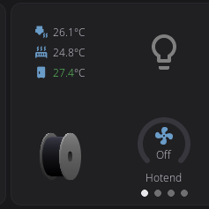
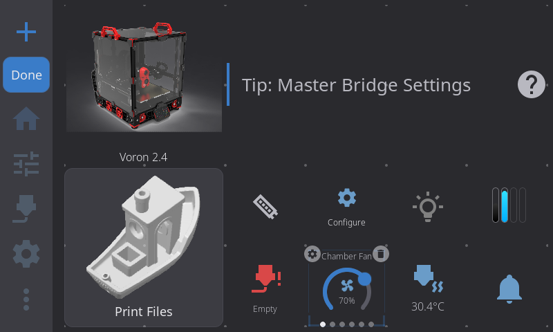

### Switching Modes

Long-press the grid to enter Edit Mode, select the Temperatures, Fan Speeds, or Temperature Sensors widget, and tap the **gear icon** in the upper-left corner. Each tap toggles the mode. Your preference is saved per widget and persists across restarts.

---

## Widget Interactions

While **not** in Edit Mode, widgets respond to taps and other gestures:

| Widget | Tap Action |
|--------|------------|
| Printer Image | Opens Printer Manager overlay; a status chip opens that part's controls |
| Print Status | Opens Print Status overlay (preparing or printing) or File Browser (idle) |
| Print Controls | Pauses, resumes, or stops the print — one button each |
| Print Stats | Opens print history overlay |
| Job Queue | Opens Job Queue Manager modal |
| Digital Clock | — (display only) |
| Notifications | Opens notification history |
| Tips | Opens the full tip article |
| Network | — (display only) |
| Camera | Opens fullscreen camera view |
| Nozzle Temperature | Opens temperature graph overlay |
| Nozzle Temperatures | Tap a nozzle row opens the nozzle graph; tap the bed row opens the bed graph |
| Bed Temperature | Opens temperature graph overlay |
| Chamber Temperature | Opens temperature graph overlay focused on the chamber |
| Temperatures | Opens temperature graph for the tapped sensor |
| Temperature Sensors | — (display only) |
| Temperature Graph | Opens full-screen temperature graph overlay |
| Preheat | Sets nozzle and bed temperature to the tapped material profile |
| Humidity | — (display only) |
| Fan Speeds (stack) | Opens Fan Control overlay |
| Fan Speeds (carousel) | Drag the arc slider to adjust speed directly |
| Fan | Opens fan picker to select which fan to display |
| AMS Status | Opens AMS panel overlay |
| Filament Sensor | Opens a load/unload/purge dialog (idle or paused), a status-only dialog (printing), or the sensor's settings (sensor turned off) |
| Width Sensor | — (display only) |
| Clog Detection | Opens the Buffer Status detail modal |
| LED Light | Toggles its light on or off; on a 2x1 or wider tile, the arrow opens the LEDs overlay for it |
| LED Controls | Opens the LEDs overlay |
| Macro Button | Runs the configured macro — asking for parameters or confirmation first, unless you turned that off ([details](#macro-button-confirmation)) |
| Macros | Opens the Macros panel overlay |
| G-code Console | Opens the G-code Console overlay |
| Motion | Opens the Motion panel overlay |
| Tool Switcher | Switches the active tool (compact size opens a tool picker; larger sizes show tappable tool pills) |
| Power | Toggles the bound power device |
| Shutdown/Reboot | Shows confirmation, then shuts down/reboots |
| Firmware Restart | Restarts Klipper firmware |
| Lock Screen | Locks the screen immediately; requires PIN to unlock |

---

## Macro Button Confirmation

By default, tapping a Macro Button asks you something before it runs anything. If
the macro takes parameters, you get a form to fill in. If it takes none, you get a
"Run MACRO?" dialog — the one controlled by **Settings > Safety & Alerts > Confirm before
running macros**.

That is the right default for a button sitting on the home screen, but it gets in
the way of the macros you added a button for precisely because you run them
constantly and always the same way.

**Require Confirmation?** turns it off, per button:

1. Enter Edit Mode (long-press the widget grid) and tap the Macro Button
2. Tap the gear icon, then the **Options** tab
3. Turn **Require Confirmation?** off

That button now runs its macro on a single tap, with no parameters and no dialog.
Every other Macro Button keeps its own setting — this is per widget, not global.

Two things it does not change:

- **Dangerous macros always confirm.** `EMERGENCY_STOP`, `FIRMWARE_RESTART`,
  `RESTART`, `SHUTDOWN`, `SAVE_CONFIG` and `M112` show their warning dialog no
  matter what this is set to.
- **Macros that need parameters get none.** Turning confirmation off means the
  macro runs with its defaults. If a macro genuinely needs a value from you each
  time, leave confirmation on.

---

## Job Queue Manager

Tap the **Job Queue** widget to open the queue manager — a full-screen modal for managing your print queue.

### Queue State

At the top, you'll see the current queue state:

- **Queue: Ready** - the queue is active. It starts jobs in order by itself only if Moonraker's `automatic_transition` is enabled in `moonraker.conf`; otherwise you start each one (see [Printing - Queueing a Print](printing.md#queueing-a-print))
- **Queue: Paused** - the queue is paused; queued jobs won't start automatically

Tap the **Start** or **Pause** button to toggle the queue state.

### Job List

Below the state indicator, all queued jobs are listed with:

- **Filename** — the name of the queued G-code file
- **Time queued** — how long the job has been waiting (e.g., "Queued 2h 15m ago", "Just queued")

### Actions

**Open a job:** Tap any job in the list to open it in the file view with the pre-print options it was queued with already set. Check that the bed is clear, then tap **Print** - the job leaves the queue only once the print actually starts, so backing out of the file view leaves it queued. The tap only goes through when the printer is genuinely free - not just finished with the last print, but also not busy starting one (the heating, homing, and leveling before the first layer count as busy). While a job is preparing or printing, the job stays in the queue and a notice tells you so; try again once the printer is free.

Jobs queued from HelixScreen's file view carry their saved options; jobs queued from another interface open with their default options. See [Printing - Queueing a Print](printing.md#queueing-a-print).

**Delete a job:** Tap the **trash icon** on the right side of any job row. The job is immediately removed from the queue.

**Close:** Tap the **X** button in the top-right corner to close the modal.

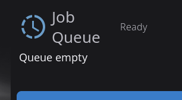

### Sync with Other Interfaces

The job queue is managed by Moonraker, so jobs added from Mainsail, Fluidd, or the Moonraker API appear here automatically. Likewise, jobs deleted or started from HelixScreen are reflected in those other interfaces.

---

## Clog Detection Widget

The Clog Detection widget monitors your filament path health in real time — detecting clogs, flow issues, and buffer sync problems. It only appears when a compatible filament system is detected (Happy Hare, AFC, or another MMU with clog detection).

### What It Shows

The widget displays a **carousel** with one or two pages depending on your hardware:

**Page 1 — FlowGuard bar** (always shown)

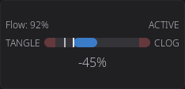

A horizontal scale that fills as your clog or flow reading moves, shifting from green (healthy) through orange to red (danger). Every part of it has one job:

| Where | What it tells you |
|-------|-------------------|
| **Top left** | Which sensor is measuring — `Clog Auto`, `Clog Manual`, `FlowGuard` or `AFC buffer` |
| **Top right** | How worried it is, as an icon: a **check** while healthy, a **warning triangle** once the reading reaches the danger threshold, and a **red nozzle** once your firmware has actually flagged a fault |
| **The bar** | The reading. A shaded red band marks the danger zone, with a bright amber line where that zone begins |
| **Ticks** | A bright tick at the current reading, a fainter one at the worst value seen this print |
| **Underneath** | The reading as a number — headroom in mm, flow deviation as a percentage, or distance to fault |

The bar adapts to your detection backend:

| Backend | End labels | What the bar shows |
|---------|-----------|--------------------|
| **Encoder** | *(none)* | Clog percentage (0–100%) — how much the encoder reading deviates from expected. Fills from the left. |
| **Flowguard** | TANGLE ... CLOG | Flow deviation (−100 to +100). Fills **out from the middle**: toward TANGLE when filament is over-feeding, toward CLOG when it is under-feeding. Both ends are shaded, because either extreme is a fault. |
| **AFC** | *(none)* | Buffer fault proximity (0–100%) — how close the buffer is to a fault condition. |

Only Flowguard carries end labels, because only Flowguard has two directions that mean different faults. The other two fill from nothing toward their danger band, which the shading already shows — so the labels come off and the scale gets the width instead.

When there is nothing to report at all — an AFC buffer that is armed but not currently tracking — the bar sits empty and the status icon shows a check, rather than leaving you with a blank scale and no number.

> The same reading is drawn as an arc gauge in the filament sidebar and on the loaded-spool card, where the space is tall and narrow rather than wide and short.

**Page 2 — Buffer Sync Meter** (any printer reporting proportional buffer pressure)

A visual representation of the physical buffer plunger position. Two nested rectangles show the buffer housing and plunger — the plunger slides up or down to indicate filament tension:

- **Center position** = balanced, healthy tension
- **Shifted up** = filament under compression (being pushed)
- **Shifted down** = filament under tension (being pulled)
- Color shifts from green → orange → red as the bias increases

A percentage label shows the exact bias reading (e.g., "+5%", "−10%"). Swipe between pages using the indicator dots at the bottom.

### Tapping the Widget

Tap the Clog Detection widget to open the **Buffer Status** modal — a detailed read-only view of your filament path health:

The same FlowGuard bar sits across the top, so the modal shows everything the widget did and more - the reading, the danger threshold and the worst value seen this print.

**Happy Hare printers also show:**
- Filament tension description (e.g., "Slight tension", "Balanced")
- Spool motor state
- Gear sync status
- Flow rate
- Full-size buffer meter visualization

**AFC printers also show:**
- Advancing/trailing buffer state
- Distance to fault (in mm)

### Configuring Clog Detection

In Edit Mode, select the Clog Detection widget and tap the **gear icon** to open the configuration modal:

| Setting | Options |
|---------|---------|
| **Detection Source** | Auto (recommended), Encoder, Flowguard, or AFC |
| **Detection Mode** | Auto or Manual — in Manual mode, a G-code command is sent to the firmware |
| **Detection Length** | Filament distance threshold (Manual mode only) |
| **Danger Threshold** | Override the computed danger zone percentage |

**Auto** mode is recommended — HelixScreen automatically selects the best source based on your detected hardware.

---

## G-code Console Widget

The G-code Console widget gives you quick access to a full-featured command console for sending G-code commands directly to Klipper.

### Opening the Console

Tap the G-code Console widget on the Home Panel. A full-screen console overlay opens with your recent command history.

### Using the Console

**Sending commands:**
- Type a G-code command in the text field at the bottom (e.g., `G28`, `M114`, `FIRMWARE_RESTART`)
- Press **Enter** to send

**Navigating history:**
- Press the **Up arrow** to recall previous commands
- Press the **Down arrow** to move forward through history
- The arrows recall your last 20 sent commands (the scrolling log above shows a larger history loaded from Moonraker's G-code store)

**Reading output:**
- Commands you sent appear in the scrolling log
- Klipper responses appear below each command
- **Error messages** are highlighted in red
- Color-coded output from plugins like AFC and Happy Hare is preserved
- Periodic temperature status messages (T:/B: reports) are filtered out to reduce noise

**Scrolling:**
- The console auto-scrolls to the newest entry as responses arrive
- Scroll up manually to pause auto-scroll and read older output
- Scroll back to the bottom to resume auto-scrolling

---

## Tool Switcher Widget

The Tool Switcher widget lets you change the active tool on multi-tool printers — IDEX machines, toolchangers, and other multi-head setups. It only appears in the Widget Catalog when more than one tool is detected.

### How It Looks

The widget adapts to its size:

- **Compact (1x1)** - shows a swap icon above the current tool's label (e.g., "Tool 1"). Tap it to open a **tool picker** popup listing every tool. The active tool is highlighted; tap any other tool to switch to it.
- **Larger sizes** — shows a row (or two rows) of tappable **tool pills**, one per tool. The active tool's pill is highlighted. If there are more tools than fit, the row scrolls horizontally and keeps the active tool in view.

The widget updates automatically when the active tool changes — whether you switch it here, run a tool-change macro, or it changes during a print.

### Switching Tools

Tap a tool (or pick one from the popup) to make it active.

- **When idle**, the tool change happens immediately.
- **When printing or paused**, a confirmation dialog appears first — changing tools mid-print can cause issues, so you have to confirm before it proceeds.

Tapping the tool that's already active does nothing.

> **Tool Switcher vs. Active Tool Badge:** The Tool Switcher is an optional, interactive widget you add to your dashboard. The [Active Tool Badge](#active-tool-badge) is a small read-only indicator that always appears in the top bar on multi-tool printers. The badge shows the current tool; the widget lets you change it.

---

## Grid Layout Details

### Grid Dimensions

There is no fixed grid size. HelixScreen divides your screen by a target cell size, so cells
come out roughly square and you get as many of them as the screen can hold. A bigger screen
means more cells, not bigger ones — which is the point: a widget takes up about the same
share of a 480x272 panel as it does of a 1280x720 one.

| Screen | Grid | Total Cells |
|--------|------|-------------|
| 480x272 | 6 columns x 4 rows | 24 |
| 480x320 | 5 columns x 4 rows | 20 |
| 800x480 | 6 columns x 4 rows | 24 |
| 1024x600 | 8 columns x 5 rows | 40 |
| 1280x720 | 8 columns x 5 rows | 40 |
| 480x800 (portrait) | 4 columns x 6 rows | 24 |
| 320x1480 (tall portrait) | 4 columns x 17 rows | 68 |
| 1920x440 (ultrawide) | 23 columns x 5 rows | 115 |

Rotating a screen turns the grid with it, give or take a cell: 1024x600 gives 8x5, and the
same panel mounted portrait gives 5x7. It is not an exact swap, because the space left over
after the navigation bar and margins is not the same in both orientations.

### Auto-Placement

When widgets don't have an explicit position (newly added, or after a reset), HelixScreen places them automatically:

1. Larger widgets (multi-cell) are placed first to ensure they get contiguous space
2. Smaller widgets (1x1) fill the remaining gaps
3. Placement scans from top-left to bottom-right

### When the Grid Is Full

If every cell is taken, a widget that has nowhere to sit is set aside rather than switched
off. It stays enabled and comes back on its own the moment a cell frees up - when you remove
another widget, when hardware another widget depends on goes away, or when the same layout is
shown on a screen with a bigger grid. You do not have to re-add it from the catalog.

You will see a *"'Fan Speeds' removed — grid full"* message only when the widget was actually
on your screen and lost its spot. A widget that never had a spot is set aside quietly.

A widget that is simply **too big for the grid at any size** is a different case: it cannot
be placed no matter what you remove, so it is switched off and put back in the Widget
Catalog, and the message tells you that is the reason. See
[A widget disappeared from the home screen](../TROUBLESHOOTING.md#a-widget-disappeared-from-the-home-screen).

### What Happens on Upgrade

When you update HelixScreen and new widgets are added:

- **Your existing layout is preserved** — nothing moves
- New widgets are appended with their default enabled/disabled state
- If a new widget is enabled by default, it auto-places into available grid space
- If the grid is full, a new widget stays enabled but unplaced until you make room. It still
  appears in the Widget Catalog as available, so you can try to place it and get a
  *"Not enough room for this widget"* message rather than silence, and it drops into place by
  itself as soon as a cell frees up

If you downgrade and a widget type no longer exists, it's silently removed from your layout. Upgrading again restores it.

**The exception is an update that changes the shape of the grid itself.** A saved position means "column 5, row 3, two cells wide" — if an update changes how many cells your screen gets, those numbers count something different. Rather than scatter your widgets or reset them, HelixScreen converts the arrangement onto the new grid. When that happens:

- **Your arrangement is carried over**, in proportion. A widget that filled the left third of the screen still fills the left third; two widgets that were touching stay touching
- **Sizes can shift slightly.** The new grid does not divide the screen the same way, so a widget lands on the nearest size it is allowed to hold. Some widgets have a minimum of one full cell and will grow to it
- **A widget that will not fit is re-placed automatically**, and only that widget. On a screen that got shorter or narrower this can happen to one or two of them; the rest keep their spots
- **Which widgets you have is remembered.** A widget you deleted with the trash button stays gone; one you added stays added, including extra Macro Buttons, Power widgets, and other multiples
- **Per-widget settings are kept** — display modes, assigned fans and macros all survive
- Extra pages are kept, and widgets are converted within the page they were already on

Your printer keeps working the whole time — this only moves tiles around. The conversion happens the first time the home screen is drawn after the update, so the layout you see on that first boot is the one that is saved.

---

## Active Tool Badge

On printers with more than one extruder (IDEX, toolchangers, multi-head systems), temperature tiles and the print status card show a small badge on the nozzle icon:

- Shows the active tool's number, counting from 1 ("1", "2", …) to match the "Nozzle 1" row labels
- Updates automatically when tools are switched during a print or via macros
- Color-coded to match the tool's filament color (if configured via Spoolman or AMS)
- Only visible on multi-tool printers - single-extruder printers won't see it

---

## Emergency Stop

The red **Emergency Stop** button in the top bar halts all printer motion immediately. By default, a confirmation dialog appears before executing. You can disable the confirmation in **Settings > Safety & Alerts > E-Stop Confirmation**.

---

## LED Controls

Tap the **LED Controls** widget, or the arrow on a wider **LED Light** button, to open the **LEDs** overlay — one tab per light, each showing only the controls that light actually supports.

### Tabs

A tab per light runs along the top in a row that scrolls sideways once you have more than fit. Each tab carries a small dot: filled in that light's current color while it's on, hollow while it's off, or a dimmed ring for a light whose on/off state HelixScreen can't read (a macro-driven light). Tapping a tab only changes which light you're looking at — it never changes what a Home Panel Light button or Automatic LED Control targets.

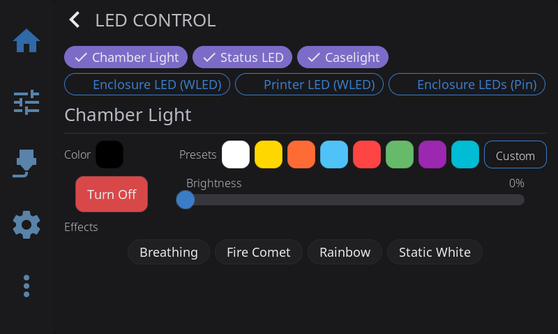

### Power & Brightness

Most lights show a round power button above a tall brightness slider:

- **Power button** — fills with the light's current color while on, an outline while off. Tap to toggle. Turning a light off this way also stops any effect running on it.
- **Brightness slider** — drag to set 0-100%; 0% turns the light off. The fill matches the light's current color, with the percentage shown inside it.

A light with no brightness control (a plain on/off `[output_pin]`, or a macro Toggle device) shows just a centered button in that spot.

### White (Color-Capable Klipper LEDs)

RGBW and RGB lights show three fixed white swatches — **Cool**, **Neutral**, **Warm**. Tap one to set that white level: on an RGBW light it drives the dedicated white channel, on RGB it's mixed from the color channels. A neopixel counts as RGBW when its `color_order` includes a `W`. A ring shows which one (if any) matches the light's current look.

### Color

Color-capable lights also show a row of preset color swatches, plus a rainbow **Custom** swatch at the end that opens the full color picker. A ring shows which preset matches the light's current color.

### Effects & Presets

- **Klipper LED effects** ([klipper-led_effect](https://github.com/julianschill/klipper-led_effect)): the effects defined for that light appear as chips, plus a **None** chip that stops whichever one is running. Tap a chip to activate its effect.
- **WLED presets**: the presets you've configured on that WLED device appear as chips — tap to activate. WLED lights get power and brightness here, but no color controls.
- **Non-color Klipper lights and PWM output pins**: quick level chips (10/25/50/75/100%) appear instead, since there's nothing else to show.

### Macro-Driven Lights

A light backed by a Klipper macro can't show a power dot or button, because HelixScreen has no way to read whether it's actually on:

- **On/Off devices** (configured in [LED Settings](settings/led-settings.md#macro-devices)): separate **On** and **Off** buttons take the place of the slider
- **Toggle devices**: a single **Toggle** button
- **Preset devices**: named preset buttons fill the whole page

---

## Camera Widget

The Camera widget shows a live view from your webcam. It works with any MJPEG stream configured in Moonraker (crowsnest, camera-streamer, ustreamer, etc.).

### Setup

1. Make sure your webcam is working in Mainsail or Fluidd first
2. Open **Edit Mode** on the Home Panel (long-press)
3. Tap **+** to open the Widget Catalog
4. Add the **Camera** widget
5. Resize to your preferred size (up to 4x3)

Tap the camera feed to open a **fullscreen view**. Tap again or press back to return.

### Rotation & Flip

If your camera is mounted at an angle or its image comes in mirrored, you can correct it without changing anything in Moonraker:

1. Enter **Edit Mode** (long-press the grid)
2. **Tap** the Camera widget to select it
3. **Tap the gear icon** in the upper-left corner to open the Camera configuration modal
4. Adjust the settings and tap **Save** (or **Cancel** to discard)

The modal offers:

- **Source** - which webcam the widget shows: **Automatic** (the printer's preferred camera), or one of your printer's named webcams. The choice is saved per widget, so two Camera widgets can show two different feeds. If the named camera disappears from Moonraker, the widget falls back to the automatic choice until it returns. See [Camera](/1.1/guide/camera/) for details.
- **Rotation** — rotate the feed by **0°, 90°, 180°, or 270°**. The current rotation is highlighted.
- **Flip** — toggle **Horizontal** and/or **Vertical** mirroring. Each can be on or off independently.

Your rotation and flip choices are applied on top of (combined with) any flip Moonraker is already doing, so if Moonraker already mirrors the image, toggling the matching flip here cancels it back out.

### Stream Status

While the feed is loading or unavailable, the widget shows a status message instead of video:

- **No Camera** — no webcam is configured or detected yet
- **Connecting Camera...** — the stream is being established
- **Error messages** — if the stream can't be reached, the underlying error is shown so you know what went wrong

Once the first frame arrives, the status text disappears and the live image takes over.

At the smallest size (1x1) the widget shows only a camera icon and does not stream — tap it to open the fullscreen view, which starts the stream on demand. To save power, the stream also pauses automatically when the screen sleeps or when another overlay covers the widget, and throttles down while you're in Edit Mode.

### Frame Rate

The camera's target frame rate is read from your Moonraker webcam configuration (defaulting to 15 fps if not set). There's no separate frame-rate control in HelixScreen — adjust it in Moonraker (the same place Mainsail and Fluidd read it from).

### Performance Tip

For the best camera streaming performance on Raspberry Pi, install `libturbojpeg0`:

```bash
sudo apt install libturbojpeg0
```

This enables SIMD-accelerated JPEG decoding, which is **3-5x faster** than the built-in software decoder. HelixScreen detects and uses it automatically — no configuration needed. Without it, the camera still works fine, just with slightly higher CPU usage.

> **Note:** This only applies to Raspberry Pi. The installer attempts to install this package automatically, but if it fails (e.g., offline install), you can add it later with the command above.

---

## Printer Manager

**Tap the Printer Image widget** to open the Printer Manager overlay. This is your central place to view and customize your printer's identity.

### Changing the Printer Name

1. Tap the **printer image** on the Home Panel to open the Printer Manager
2. Tap the **printer name** (shown with a pencil icon) — it becomes an editable text field
3. Type your new name (e.g., "Workshop Voron", "Printer #2")
4. Press **Enter** to save, or **Escape** to cancel

The name defaults to "My Printer" if left empty. It's saved to your config file and persists across restarts.

> **Auto-import:** If you've already named your printer in Mainsail or Fluidd, HelixScreen automatically picks up that name on first connection — no need to re-enter it.

> **Sync:** When you rename your printer in HelixScreen, the new name is automatically pushed to Mainsail and Fluidd so all your interfaces stay in sync.

> **Tip:** You can also set the name directly in the config file under the `printer_name` key — see [Configuration Reference](../CONFIGURATION.md#name).

### Correcting the Printer Model

Directly below the printer name, the **model row** shows the model HelixScreen has recorded for this printer — or nothing at all, when detection could not identify it with confidence. Tap the row to change it:

1. Tap the **printer image** on the Home Panel to open the Printer Manager
2. Tap the **model row** (marked with a pencil icon)
3. Pick the model that matches your printer from the list
4. The overlay closes and the choice is saved immediately

The list is filtered to your printer's motion type, the same way the setup wizard filters it. Picking a model loads that printer's known behaviour — the print macros HelixScreen calls, which fans it treats as part cooling versus hotend, and how its calibration flows behave.

**When you need this:** automatic detection declines to guess when the evidence is inconclusive, and on printers that look identical over the network it can settle on the wrong sibling. Correcting the model here fixes both cases — no need to delete the printer and run setup again. Detection will not overwrite a model you chose yourself.

### Changing the Printer Image

1. Tap the **printer image** on the Home Panel to open the Printer Manager
2. Tap the **printer image** again (marked with a pencil badge) to open the Image Picker
3. The picker shows a scrollable list on the left and a live preview on the right
4. Choose from one of three sources:
   - **Auto-Detect** (default) — HelixScreen selects an image based on your printer type reported by Klipper
   - **Shipped Images** — Over 25 pre-rendered images covering Voron, Creality, FlashForge, Anycubic, RatRig, FLSUN, and more
   - **Custom Images** — Your own images (see below)
5. Tap an image to select it — your choice takes effect immediately

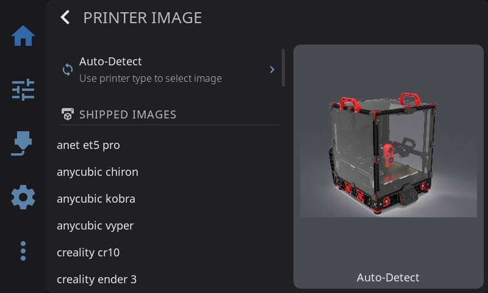

### Status Chips on the Printer Image

While the printer is working, small chips on the printer image show what each part is doing:

- **Nozzle, bed and chamber** - a temperature chip appears while the heater has a target, and stays, greyed, until a heater you turned off has cooled below 50°C. The chamber chip appears only on printers with a chamber heater.
- **Part fan** - shows its speed while it is running.
- **Light** - shows while your chamber light is on.

Tap a heater chip for its temperature graph, the fan chip for the fan controls, or the light chip for the chamber light's page in the LEDs overlay.

On the most common printers the shipped pictures know where each part is, so each chip points at its part: beside the picture with a line to it on a wide tile, or on top of it on a small one. On other pictures, including your own photos, the chips sit along the edge of the picture until you tag its parts.

### Tagging the Printer's Parts

To place the chips on a picture that does not know its parts yet, or to correct a shipped picture you disagree with:

1. Open the Image Picker (see [Changing the Printer Image](#changing-the-printer-image)) and select the picture
2. Tap **Tag parts** under the preview
3. Tap each part as you are asked: the nozzle tip, the part cooling fan, the bed's front-left corner, the bed's front-right corner, an empty spot inside the enclosure, and the light. The fan, enclosure and light can be skipped with **Skip** if your printer does not have them; **Undo** steps back one tap
4. Check where the chips will sit, then tap **Save**

Your tags are kept for that picture, as long as its size does not change: replace a custom image with a file of different dimensions and you will need to tag it again. **Reset tags**, which appears once a picture has your own tags, puts the picture back to its shipped positions (or to chips along the edge, for a picture that has none).

### Using Custom Printer Images

You can use your own printer photo or rendering:

**Option A: Copy to the custom images folder**

| Platform | Custom images directory |
|----------|----------------------|
| MainsailOS (Pi) | `~/helixscreen/config/custom_images/` |
| AD5M Forge-X | `/opt/helixscreen/config/custom_images/` |
| AD5M Klipper Mod | `/root/printer_software/helixscreen/config/custom_images/` |
| K1 Simple AF | `/usr/data/helixscreen/config/custom_images/` |

Copy a PNG, JPEG, BMP, or GIF file into the directory, then open the Image Picker — your image appears under the Custom Images section.

**Option B: Import from a USB drive**

1. Insert a USB drive containing image files into your printer's host
2. Open the Image Picker
3. A **USB Import** section appears at the bottom showing images found on the drive
4. Tap an image to import it — HelixScreen copies and converts it automatically
5. Once imported, the image appears under Custom Images and the drive can be removed

**Image requirements:**
- Formats: PNG, JPEG, BMP, or GIF
- Maximum file size: 5 MB
- Maximum dimensions: 2048x2048 pixels (resize before importing if larger)
- HelixScreen automatically generates optimized display variants

**Removing a custom image:**

Delete the image files from the `custom_images/` directory via SSH:

```bash
cd ~/helixscreen/config/custom_images/   # adjust path for your platform
rm my-printer.png my-printer-300.bin my-printer-150.bin
```

If the deleted image was active, HelixScreen falls back to auto-detect.

### Software Versions

Below the identity card, the overlay displays current software versions for Klipper, Moonraker, and HelixScreen, with update indicators when new versions are available.

### Hardware Capabilities

A row of chips shows detected hardware capabilities: Probe, Bed Mesh, Heated Bed, LEDs, ADXL, QGL, Z-Tilt, and others depending on your Klipper configuration.

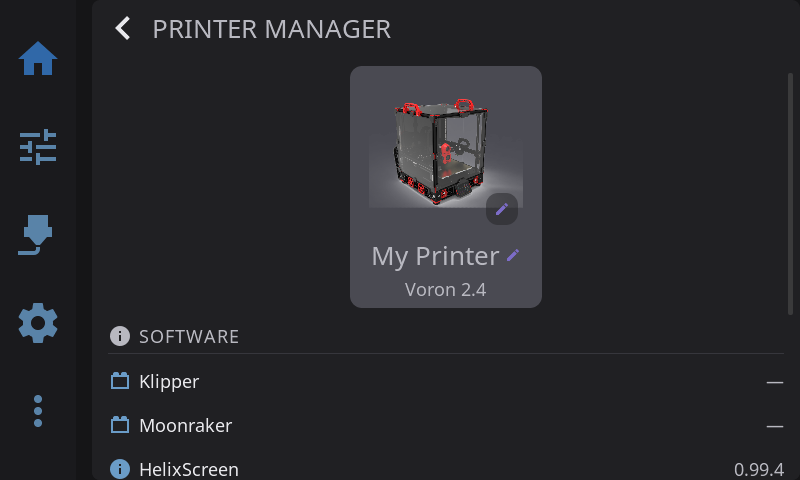

### Managing Multiple Printers

> Requires [beta features](/1.1/guide/beta-features/) to be enabled and at least two printers configured.

When you have multiple printers configured, the Printer Manager overlay shows a **Manage Printers** button at the bottom. Tap it to open the printer management screen (same as Settings > Connection > Printers).

You can also switch printers directly from the **navigation bar**. When multiple printers are configured, a badge with your printer's name appears in the nav bar. Tap it to see a quick-switch menu listing all your printers — tap any printer to switch instantly.

#### Adding Your First Extra Printer

1. Enable [beta features](/1.1/guide/beta-features/) if you haven't already
2. Go to **Settings** > **Printers** (under the Printer section)
3. Tap **Add Printer**
4. The Setup Wizard launches — enter the new printer's IP address and port, select hardware, and complete the wizard
5. After the wizard finishes, you're connected to the new printer

#### Switching Between Printers

**Quick switch (fastest):**
1. Tap the **printer name badge** in the navigation bar (bottom of screen)
2. Tap the printer you want to switch to
3. HelixScreen reconnects and shows a "Connected to [name]" toast

**From Settings:**
1. Go to **Settings** > **Printers**
2. Tap the printer you want to switch to
3. The active printer is marked with a checkmark

#### Removing a Printer

1. Go to **Settings** > **Printers**
2. Tap the **trash icon** next to the printer you want to remove
3. Confirm the deletion
4. You cannot delete the printer you're currently connected to, and you cannot delete the last remaining printer

> **Note:** Removing a printer only removes it from HelixScreen. It does not affect the printer itself, its Klipper configuration, or Moonraker.

---

**Next:** [Printing](/1.1/guide/printing/) | **Prev:** [Supported Printers](/1.1/guide/supported-printers/) | [Back to User Guide](/1.1/guide/)
