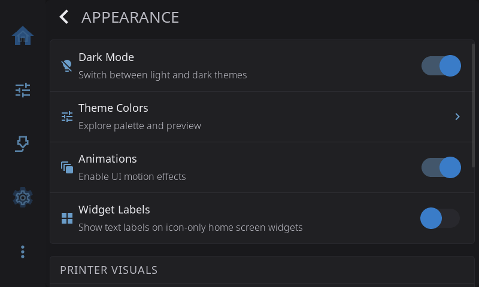
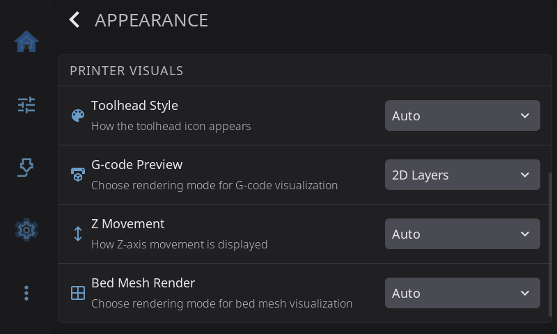
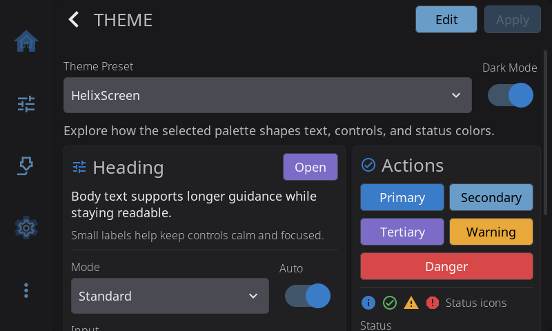

**Settings > Appearance** changes how HelixScreen looks. Use it to switch between light and dark, pick or edit a color theme, turn motion effects on or off, and choose how your printer is drawn on screen. Nothing here changes what the printer does.

On the Settings screen, the **Appearance** row shows the mode and the theme you're using, for example *Dark Mode · Nord*.

---

## Dark Mode

Switches between the light and dark version of your theme. **On** (dark) by default. The switch is greyed out when your theme only comes in one version (see the Modes column in [Built-in Themes](#built-in-themes)).

---

## Theme Colors

Opens the theme explorer, where you browse, preview and apply color themes.

To change your theme:

1. Tap **Theme Colors**.
2. Open the **Theme Preset** menu and pick a theme. The preview cards, buttons and status colors update as you go.
3. If the theme has both a light and a dark version, the **Dark Mode** switch picks which one you see.
4. Tap **Apply**. The new theme takes effect everywhere right away. No restart needed.

### Built-in Themes

Eighteen themes come with HelixScreen, listed alphabetically in the Theme Preset menu. Every theme has a dark version. All but the four marked **Dark only** also have a light version.

| Theme | Look | Modes |
|-------|------|-------|
| **Ayu** | Warm gold accent with coral errors on slate | Light + dark |
| **Catppuccin** | Soft pastels on gentle lavender | Light + dark |
| **ChatGPT** | Understated greys with green and red status colors | Light + dark |
| **Cupertino** | Apple-style system colors on near-black | Light + dark |
| **Dracula** | Violet on deep slate with bright green highlights | Dark only |
| **Everforest** | Muted forest green and clay | Light + dark |
| **Gruvbox** | Warm retro earth tones: amber, olive, brick | Light + dark |
| **Hazard** | Safety-vest yellow, warning orange and danger red on powder-black, with sharp corners and brass seams | Dark only |
| **HelixScreen** | The default: balanced blue on charcoal | Light + dark |
| **Kanagawa** | Soft wave-blue and gold on deep indigo | Light + dark |
| **Material Design** | Material blues and greens on grey | Light + dark |
| **Midnight** | Near-black navy, dim and low-glare | Dark only |
| **Nord** | Arctic blues and frost tones | Light + dark |
| **One Dark** | The Atom editor look: blue and green on charcoal | Light + dark |
| **Rose Pine** | Muted rose, iris and pine on soft charcoal | Light + dark |
| **Solarized** | The classic muted scheme on deep teal | Light + dark |
| **Tokyo Night** | City-at-night blues with pastel highlights | Light + dark |
| **Yami** | Vivid blue on deep grey, high contrast | Dark only |

### Editing a Custom Theme

Tap **Edit** in the theme explorer to open the theme editor. You can recolor a theme and change its corners, borders and shadows. Everything around the editor updates as you go, so you see the result straight away.

The editor has two sections:

- **Theme Colors**: 16 color swatches, each labeled with what it colors (background, text, primary, success, warning and so on). Tap a swatch, then pick a ready-made color or mix your own.
- **Style Properties**: four sliders.

| Slider | What it does |
|--------|--------------|
| **Border Radius** | How rounded corners are, from square to fully round |
| **Border Width** | How thick borders are |
| **Border Opacity** | How visible borders are (0 is invisible, 255 is solid) |
| **Shadow Intensity** | How strong drop shadows are (0 turns them off) |

### Light and Dark Palettes

A theme can have a separate light and dark palette, and the editor changes one at a time. Pick which one before you tap **Edit**: turn the explorer's **Dark Mode** switch on to edit the dark palette, or off to edit the light one. The switch only appears for themes that have both. Saving keeps both palettes, including the one you didn't touch.

> **Tip:** To tune both palettes, edit one and save. Then flip the Dark Mode switch, tap **Edit** again and adjust the other.

### Saving Your Changes

Three buttons sit at the bottom of the editor:

| Button | What it does |
|--------|--------------|
| **Reset** | For a built-in theme, puts the original colors back. For a theme you made, goes back to its last saved state |
| **Save As New** | Saves your changes as a new theme and leaves the original alone |
| **Save** | Saves over the current theme. Greyed out until you've changed something |

**Save As New** asks for a name. It suggests "*theme name* Copy". Tap **Save** and the new theme is applied and added to the Theme Preset menu.

Both **Save** and **Save As New** apply the theme right away. If you try to leave the editor with unsaved changes, HelixScreen asks **Discard Changes?** first.

> **Note:** Themes you make or edit are stored on the printer in `~/helixscreen/config/themes/`. They survive updates, and you can copy them to another printer.

---

## Animations

Turns motion effects on or off, such as screens sliding in and confetti when a print finishes. It starts on wherever the hardware handles it well, and off on slower hardware and on screens whose picture HelixScreen has to rotate itself. Turn it off if the screen feels slow, for example on a Raspberry Pi 3.

---

## Widget Labels

Shows a text label under icon-only widgets on the home screen. **Off** by default. Turn it on while you're learning the icons, and off for a cleaner look on small screens once you know what each icon means.

---

## Printer Visuals

The rows under **PRINTER VISUALS** change how your printer and its data are drawn. The printer itself behaves exactly the same whatever you pick.

### Toolhead Style

The toolhead picture used on the Home screen and the print status screen.

| Option | Picture |
|--------|---------|
| **Auto** (default) | HelixScreen works out your toolhead from its printer list or your Klipper config |
| **Stealthburner** | Voron Stealthburner |
| **A4T** | Armored Turtle A4T |
| **AntHead** | AntHead |
| **JabberWocky** | JabberWocky |

Leave it on **Auto** unless HelixScreen shows the wrong toolhead, or you've fitted an aftermarket one. Printers with their own built-in toolhead picture (such as the Creality K1 and K2) get it automatically; those pictures aren't in the menu.

### G-code Preview

How the print status screen draws the file that's printing.

| Option | What you see |
|--------|--------------|
| **Auto** (default) | HelixScreen picks for your hardware: 3D where the screen can handle it, lighter views where it can't |
| **3D View** | A 3D model of the toolpath you can turn and zoom |
| **2D Layers** | A flat view of one layer at a time. Lighter than 3D |
| **Thumbnail Only** | Just the picture your slicer saved in the file. The lightest option |

Pick a lighter option if the print status screen is slow on your printer.

### Z Movement

Which way the Z buttons on the Motion screen are labeled.

| Option | Labels |
|--------|--------|
| **Auto** (default) | Chosen from your printer type (bed slinger, CoreXY or delta) |
| **Bed Moves** | The buttons describe the bed moving |
| **Nozzle Moves** | The buttons describe the nozzle moving |

Only the labels change. The printer receives exactly the same commands. Change it if the arrows point the opposite way to what you see your printer do.

### Bed Mesh Render

How bed mesh results are drawn: **Auto**, **3D View** or **2D Heatmap**. The heatmap is lighter on slow hardware and easier to read at a glance.

---

[Back to Settings](/1.1/guide/settings/) | [Prev: Display](/1.1/guide/settings/display/) | [Next: Touch & Input](/1.1/guide/settings/touch-input/)
