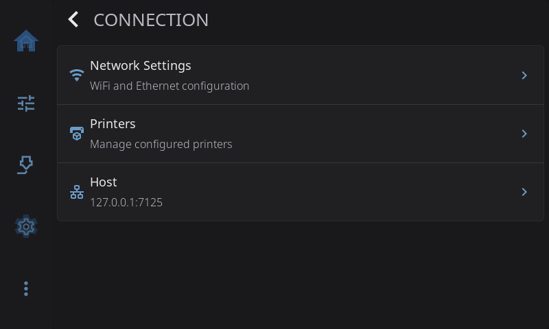
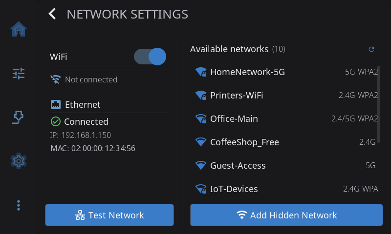
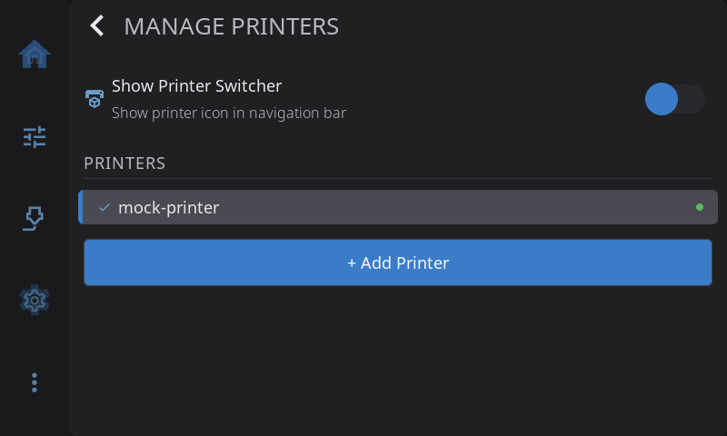

**Settings > Connection** is about how HelixScreen reaches your network and your printers. Come here to join a Wi-Fi network, check your Ethernet connection, add or switch printers, or point HelixScreen at a different Moonraker address.

On the Settings screen, the **Connection** row shows how the screen is connected right now: the Wi-Fi network name (for example *Wi-Fi HomeNet*), *Ethernet*, or *Not connected*.

---

## Network Settings

> Hidden on Android, where the phone or tablet manages its own network.

Opens the network screen. It has two columns.

**Left: your connection**

- **WiFi**: turn Wi-Fi on or off and see the network name, IP address, MAC address and signal strength. A **2.4GHz** tag appears if your hardware only supports that band.
- **Ethernet**: the IP and MAC address of the wired connection. Read-only.
- **Test Network**: checks that the internet is reachable. Greyed out when nothing is connected.

**Right: available networks**

- The Wi-Fi networks in range, with their signal strength.
- Tap a network to join it. Enter the password if it asks.
- **Add Hidden Network** joins a network that doesn't broadcast its name.
- **Refresh** scans again.

Joining Wi-Fi while Ethernet is connected shows a warning first that the wired connection will drop, because some boards have one network chip and can't use both at once (#1542). If joining fails, the screen tells you why. If an administrator has blocked the Wi-Fi radio (for example with `rfkill`), HelixScreen leaves it blocked unless you set up Wi-Fi in HelixScreen on that printer (#1697).

---

## Printers

Opens **Manage Printers**, the list of every printer this screen knows about.

- **Switch printers**: tap a printer in the list. HelixScreen disconnects from the current printer, connects to the new one, confirms with a message and takes you to the Home screen.
- **Add a printer**: tap **+ Add Printer**. The setup wizard runs for the new printer, skipping the Wi-Fi and language steps you already did. You can cancel at any time and go back to your current printer.
- **Delete a printer**: tap the trash icon next to a printer you aren't using and confirm. You can't delete the last printer.
- **Show Printer Switcher**: adds a printer icon to the navigation bar, so you can switch printers from any screen.

See [Getting Started](/1.1/guide/getting-started/) for adding a second printer.

---

## Host

Shows the Moonraker address HelixScreen is connected to, such as `192.168.1.50:7125`.

To connect to a different address:

1. Tap **Host**.
2. Enter the printer's IP address or host name, and the port (usually 7125).
3. Tap **Test Connection**. **Save** unlocks once the test succeeds.
4. Tap **Save**. HelixScreen disconnects and reconnects at the new address.

Host names are looked up again every time HelixScreen reconnects, so if your router gives the printer a new IP address, HelixScreen finds it again without a restart.

---

[Back to Settings](/1.1/guide/settings/) | [Prev: Safety & Alerts](/1.1/guide/settings/safety/) | [Next: Language & Time](/1.1/guide/settings/language-time/)
