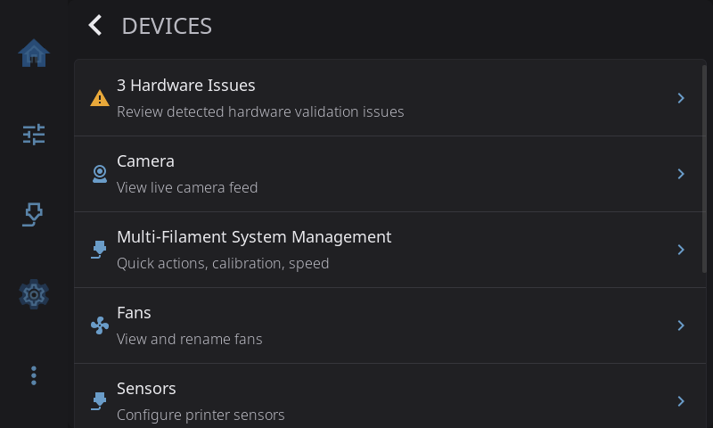
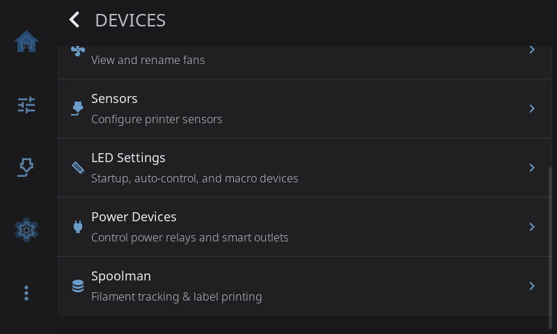
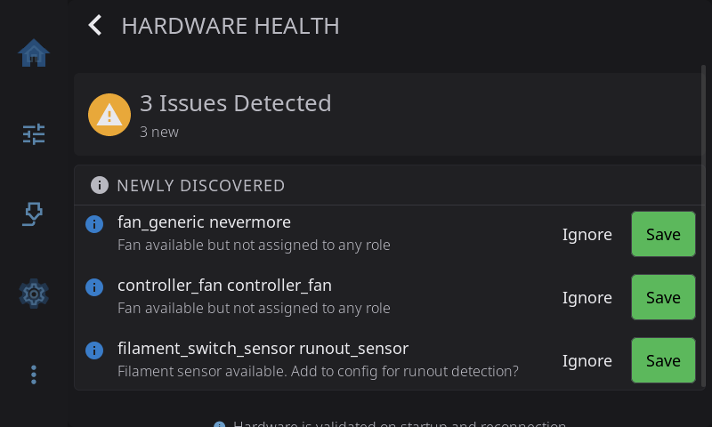

**Settings > Devices** is where you look after the hardware and services around your printer: its camera, filament system, fans, sensors, lights, power switches and Spoolman. Rows only appear for things HelixScreen finds in your Klipper and Moonraker setup, so your list may be shorter than the one pictured.

On the Settings screen, the **Devices** row shows a one-line health check: *All healthy*, *Needs attention* (Hardware Health lists something worth a look) or *Problem found* (hardware the printer needs is missing).

---

## Hardware Health

Compares the hardware Klipper reports with what HelixScreen expects, and lists anything that doesn't match. The row itself shows the result: **No Hardware Issues**, or a count such as **3 Hardware Issues**. Its icon turns amber when something needs attention and red when something is critical.

Tap it to see the list:

| Kind | Meaning |
|------|---------|
| **Critical** | Hardware the printer needs is missing, such as the nozzle heater |
| **Warning** | Hardware that used to be there is gone, such as a bed sensor |
| **Info** | New hardware HelixScreen hasn't seen before |
| **Session** | Hardware changed since HelixScreen last ran |

For anything that isn't critical you can:

- **Ignore**: mark it as optional. HelixScreen won't warn about it again, even if it goes missing.
- **Save**: add it to the expected list. HelixScreen will warn you if it disappears later.

Check this page after you add or remove hardware, so HelixScreen's list matches your printer.

---

## Camera

> Only shown when a webcam is set up in Moonraker. Not available on the ESP32 screen.

Opens your printer's camera full screen. See [Camera](/1.1/guide/camera/) for rotation, stream status and the home screen camera widget.

---

## Multi-Filament System Management

> Only shown when HelixScreen finds a multi-filament system.

Opens quick actions, calibration and speed settings for your filament system: AFC, Happy Hare, ACE and the other systems HelixScreen supports. Most of what's inside depends on your hardware, but four switches can appear on any system:

| Switch | When it appears | What it does |
|--------|-----------------|--------------|
| **Unloads After Print** | AFC only | Pulls the filament back to its lane when a print finishes |
| **Keep Spool Info on Eject** | Systems that track a spool per lane (AFC, Happy Hare) | Remembers a lane's spool when you eject it, so putting the same spool back after maintenance needs no new selection. On by default. Only applies to spools chosen in HelixScreen: spools assigned elsewhere clear with the lane (for those, use your firmware's own option, such as AFC's `remember_spool`). If your firmware's option already covers every lane, it takes over and this switch is greyed out |
| **Always Show Bypass Spool** | AFC only | Keeps the external spool on the filament path even while bypass is off. AFC reports a bypass sensor whether or not one is wired, so the spool is hidden until you actually use bypass |
| **Enable Bypass Controls** | Only when your firmware reports **no** bypass | Shows the bypass controls and external spool anyway, for printers where you feed filament straight to the extruder. Applies to the Anycubic ACE Pro, Snapmaker U1, tool changers, QIDI Box and any Happy Hare setup with `has_bypass: 0` |

What **Enable Bypass Controls** gets you depends on the system:

- **Happy Hare**: `MMU_SELECT_BYPASS` works whether or not `[mmu_machine] has_bypass` is set, so the bypass becomes fully usable. This helps `mmu_vendor: Other` setups, such as a QIDI Box run through Happy Hare, and uncalibrated type-A selectors.
- **Creality CFS**: bypass always works and is always shown, so the switch never appears.
- **Snapmaker, tool changers, QIDI Box, and an ACE without a bypass switch**: there's no bypass command, so the Bypass switch says the operation isn't supported. The setting still lets you record the material and color you loaded by hand, which keeps filament tracking and temperature presets right. An ACE Pro with a fifth spool on its bypass switch and bypass macros does get a working Bypass switch.

See [Filament: When Bypass Doesn't Appear](../filament.md#when-bypass-doesnt-appear).

---

## Fans

> Only shown when HelixScreen finds fans.

Lists every fan and its current speed. Tap a fan to rename it, for example from "fan_generic exhaust_fan" to "Exhaust". The new name is used everywhere fans appear. See [Fans](/1.1/guide/fans/).

---

## Sensors

> Only shown when HelixScreen finds sensors.

Lists your printer's sensors and lets you give each filament sensor a job:

| Role | What HelixScreen does with it |
|------|------------------------------|
| **None** | Nothing. The sensor is there but not watched |
| **Runout** | Pauses the print when the filament runs out |
| **Toolhead** | Watches for filament at the toolhead |
| **Entry** | Watches for filament where it enters the extruder path |

HelixScreen tells switch sensors and motion sensors apart on its own; you don't choose. Other sensors (accelerometers, probes, humidity, filament width, color) are listed for information only.

The roles only decide what HelixScreen watches, with one exception. When you turn on bypass on a filament system, HelixScreen turns the toolhead runout sensor on at the printer if the filament system's software had left it off (common on Creality printers), and turns it off again when you leave bypass. That way a bypass print is still protected from running out. It happens automatically and doesn't change your settings here.

See [Sensors](/1.1/guide/sensors/) for the full guide.

---

## LED Settings

> Only shown when HelixScreen finds LEDs or lights.

Chooses which lights HelixScreen controls, what they do on their own during printing, and any macro-driven lights. See [LED Settings](/1.1/guide/settings/led-settings/) for the full guide.

---

## Power Devices

> Only shown when power devices are set up in Moonraker.

Turns individual relays and smart plugs on or off. It's the same screen as **Advanced > Power Devices**, or a long-press on the power button on the home screen. See [Power Device Control](../advanced.md#power-device-control).

---

## Spoolman

Connects HelixScreen to your [Spoolman](https://github.com/Donkie/Spoolman) server for spool tracking, weight updates, label printing and barcode scanning. For the bigger picture, see [Filament Tracking & Spoolman](/1.1/guide/filament-tracking/).

### Server Setup

If Spoolman isn't set up yet, this is what you see. Enter your Spoolman server's IP address (or host name) and port (7912 by default), then tap **Connect**. HelixScreen checks the connection and sets up Moonraker for you. You don't need to edit `moonraker.conf`.

### Server Status

Once connected, the page shows your Spoolman server and two buttons: **Change** to point at a different server, and **Remove** to disconnect it.

### Sync with Spoolman

Turn this on to keep spool weights up to date. HelixScreen asks Spoolman for new weights regularly and shows the filament left on the Home and Filament screens. Weights are also updated when a print starts, pauses or finishes.

### Refresh Interval

How often HelixScreen asks Spoolman for new weights: **30 seconds**, **1 minute**, **2 minutes** or **5 minutes**. Shorter is more up to date but uses more network traffic.

### Label Printer

Sets up a printer for spool labels with QR codes. See [Label Printing](/1.1/guide/label-printing/) for setup and supported printers. Not available on the ESP32 screen.

### Barcode Scanner

Chooses the USB or Bluetooth scanner used to scan the QR codes on your spool labels. HelixScreen finds scanners with "barcode" or "scanner" in their name on its own. If yours has a generic name (such as "TMS HIDKeyBoard"), pick it from the list here. Your choice is kept after a restart. See [Barcode Scanner](/1.1/guide/barcode-scanner/). Not available on the ESP32 screen.

---

[Back to Settings](/1.1/guide/settings/) | [Prev: Printing](/1.1/guide/settings/printing/) | [Next: Safety & Alerts](/1.1/guide/settings/safety/)
