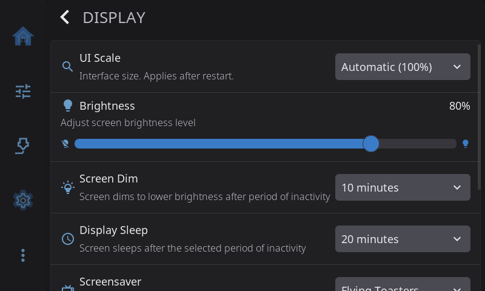
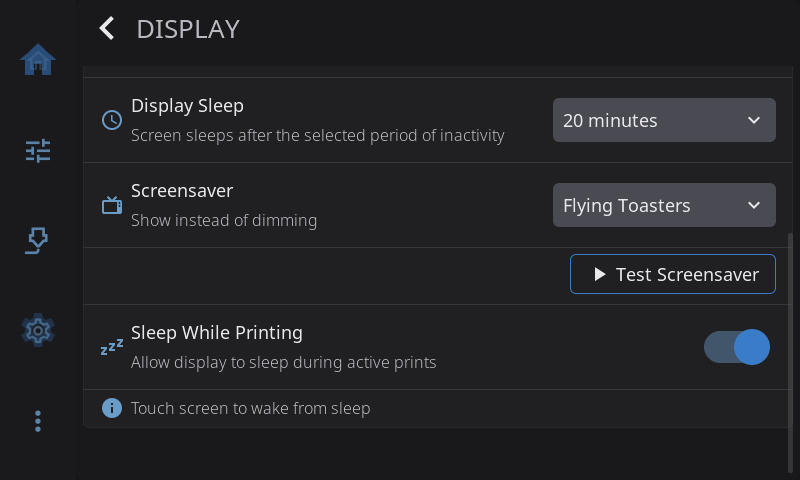

**Settings > Display** controls the screen itself. Use it to turn the picture to match how the screen is mounted, make the interface bigger or smaller, set the brightness, and choose when the screen dims, sleeps or shows a screensaver.

On the Settings screen, the **Display** row shows your brightness and sleep time, for example *80% · sleep 10 min*. It reads *80% · never sleeps* when sleep is off, and just *Sleep 10 min* on a screen that can't change its brightness.





---

## Screen Rotation

Turns the picture to match how the screen is mounted: **Normal**, **90° Clockwise**, **180° Upside Down** or **270° Clockwise**. It's the first row on the page, so you can reach it without scrolling while the picture is sideways.

The new rotation applies the next time HelixScreen starts. When you pick one, HelixScreen offers to restart right away. Touch follows the new orientation on its own.

This row is hidden on the desktop simulator. There you rotate the window from your operating system instead.

> If taps land in the wrong place after rotating, the screen needs touch calibration, not a different rotation. See the [Touch Calibration guide](/1.1/guide/touch-calibration/).

---

## UI Scale

Sets how big everything is drawn. Choose **Automatic**, or a size from 100% to 200%.

**Automatic** picks a size from how densely your screen packs its pixels, so buttons and text stay the same physical size on any screen. On every supported printer this works out to 100%. It only makes the interface bigger on very sharp screens, such as an Android phone or tablet. The menu shows the size it picked, for example *Automatic (158%)*.

Pick a percentage yourself if you'd like things bigger or smaller, or if Automatic guesses wrong on a screen HelixScreen doesn't know. 100% always draws the interface at its designed size.

**The new size appears after you restart HelixScreen.** Your choice is saved straight away.

Each size keeps its own home screen layout, because a different size fits a different number of widgets. If you rearrange your home screen at one size and then switch, switching back brings your first arrangement back.

---

## Brightness

A slider from 10% to 100% (80% to start with). Only shown on screens whose backlight HelixScreen can control. Android handles brightness itself, so the slider is hidden there.

On the Creality K2, the bottom of the slider stays a little brighter than the number suggests. The K2 panel turns fully off below about 20% of its range, so HelixScreen never dims it that far.

---

## Screen Dim

How long the screen waits with nobody touching it before it dims: **Never**, **30 seconds**, **1 minute**, **2 minutes**, **5 minutes** or **10 minutes** (the default). Only shown on screens that can change their brightness.

---

## Display Sleep

How long the screen waits before it turns off completely: **Never**, **1 minute**, **5 minutes**, **10 minutes**, **20 minutes** (the default) or **30 minutes**. Touch the screen to wake it.

Sleeping turns the backlight off. On the rare screen with no adjustable backlight, HelixScreen powers the panel down instead. If your screen stays faintly lit while asleep, or doesn't come back when you touch it, you can force the behavior in `settings.json`:

```json
"display": { "panel_power_off": 1 }
```

Use `0` if `1` made things worse.

---

## Screensaver

An animation that plays while the screen is idle. It starts when the screen would dim and stops when the screen goes to sleep. On a screen with no brightness control, the screensaver is the only sign that the screen is idle.

| Option | What you see |
|--------|--------------|
| **Off** | No screensaver. The screen just dims and sleeps |
| **Flying Toasters** (default on most screens) | The classic flying toasters |
| **Starfield** | Stars streaming past |
| **3D Pipes** | Pipes growing across the screen |
| **Bouncing Printer** | Your printer drifts around and bounces off the edges, changing color at every wall. Land a corner and it celebrates |
| **Fireworks** | Fireworks over hills at night |

Each screensaver checks how much processor time it takes on your printer. If it would slow the printer down, it lowers its frame rate or detail. If that's still too much, it shows a black screen instead. It remembers the result and checks again after an update.

### Test Screensaver

Appears under the Screensaver row when a screensaver is selected. Tap it to see the screensaver right away instead of waiting for the screen to go idle. Touch the screen to stop it.

---

## Sleep While Printing

Lets the screen dim and sleep during a print, on the same timers as the rest of the time. **On** by default. Turn it off to keep the screen lit for the whole print, so you can check progress at a glance without touching it.

---

[Back to Settings](/1.1/guide/settings/) | [Next: Appearance](/1.1/guide/settings/appearance/)
