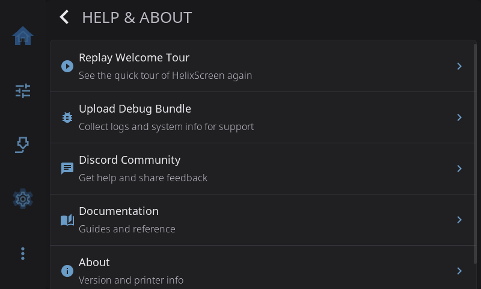
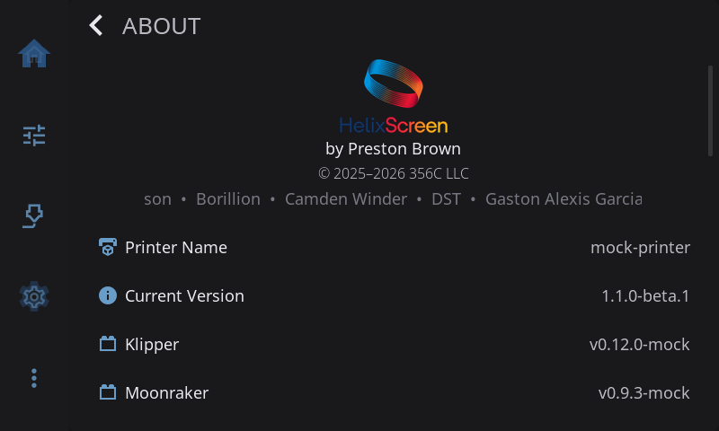

**Settings > Help & About** is where to go when you need help: replay the welcome tour, send a debug bundle to support, or find the community and the docs. **About** at the bottom shows which versions you're running. Updates have their own page: see [Updates](/1.1/guide/settings/updates/).

---

## Replay Welcome Tour

Plays the short guided tour again. HelixScreen goes to the Home screen and starts the tour from the beginning.

The tour first appears after you finish the setup wizard. It highlights one part of the screen at a time, in eight steps, with **Skip** to leave early and **Next** to move on (it reads **Done** on the last step). A counter shows how far along you are.

It covers:

1. **Welcome to HelixScreen**: a quick hello.
2. **Your printer at a glance**: tap any home tile to open its full controls or switch it on or off.
3. **Customize your home screen**: long-press any tile to enter edit mode, then move, resize, remove or add widgets.
4. **Print status**: watch a print and pause, resume or cancel it.
5. **Controls**: move the toolhead, home axes, level the bed, and adjust temperatures and fans.
6. **Filament**: load, unload and swap spools, and keep an eye on your filament system.
7. **Advanced**: macros, the G-code console, calibration tools and firmware updates.
8. **Settings**: network, display, sound, printer setup and more.

Leaving the Home screen ends the tour. It also comes back by itself after an update that adds new tour steps.

---

## Upload Debug Bundle

Sends the HelixScreen team what they need to look into a problem you're having.

1. Tap **Upload Debug Bundle**.
2. HelixScreen gathers your logs, system details and settings. Personal data is removed.
3. Tap **Upload**.
4. You get a share code. Give that code to the HelixScreen team on Discord or GitHub.

> **Tip:** For a bug report, set **Settings > System > [Log Level](system.md#log-level)** to **Debug**, reproduce the problem, then send the bundle.

### What a debug bundle contains

- **Logs**: recent HelixScreen log output, from the very start of startup. That includes problems that happen while your settings are still loading, such as a settings file that couldn't be read or had to be restored from backup.
- **Settings**: your HelixScreen settings, without passwords or API keys.
- **Printer configuration**: your Klipper `printer.cfg` and the files it includes, so support can see how your printer is set up (cleaned as described below).
- **Macro names**: the names of your G-code macros, not what they do.
- **System details**: operating system, hardware and screen size.
- **Crash data**: the crash report, if HelixScreen crashed.
- **Crash history**: earlier crash reports and their GitHub issue numbers, so support can spot repeat problems.
- **Device ID**: a doubly scrambled ID used only to match up telemetry. It doesn't identify you.

Before anything is uploaded, HelixScreen removes passwords, API keys and tokens, webhook URLs (Discord, Slack, Telegram, Pushover, ntfy, IFTTT), usernames and passwords inside URLs, email addresses and MAC addresses.

Your `printer.cfg` is your own file, and HelixScreen can only remove things it recognizes. File paths stay as they are, so an include from `/home/yourname/…` shows that name. If your printer config holds something unusual you'd rather not share, check it before you send the code. And a share code is only as private as the people you give it to.

**Which builds can upload.** Only official release builds send bundles. If you built HelixScreen yourself, the upload stops with "Upload unavailable in this build". Add `HELIX_DIAGNOSTIC_UPLOADS=1` to `helixscreen.env` to allow uploads on that install, or `0` to block them on any build.

---

## Discord Community

Shows a QR code for the HelixScreen Discord, **discord.gg/RZCT2StKhr**. Scan it with your phone for help from other users and the developers, or to share feedback.

---

## Documentation

Shows a QR code for these guides at **helixscreen.org/docs**.

---

## About

Shows which versions of everything you're running. Tap **About** to open it.

| Row | What it shows |
|-----|---------------|
| **HelixScreen logo** | Credits, copyright and a scrolling list of contributors |
| **Printer Name** | The name you gave your printer in the setup wizard |
| **Current Version** | Your HelixScreen version |
| **Klipper** | Your Klipper version |
| **Moonraker** | Your Moonraker version |
| **OS** | The operating system on the computer running HelixScreen |
| **Host** | That computer's hardware type. Not shown on Android |
| **Install Root** | Where HelixScreen is installed. Not shown on Android |
| **Config Dir** | Where HelixScreen keeps its settings. Not shown on Android |
| **Logs** | Where HelixScreen writes its log |
| **Cache Dir** | Where HelixScreen keeps its cache (files it can rebuild). Not shown on Android |
| **Print Hours** | Your total printing time. Tap it to open the [History Dashboard](/1.1/guide/print-history/) |
| **Open Source Licenses** | The licenses of the open source software HelixScreen uses |

The install, config, log and cache locations are useful when support asks where a file is.

### Easter Eggs

- Tap **Printer Name** seven times for a hidden Snake game.
- Tap **Current Version** seven times to turn beta features on or off, like Android's "tap build number" trick.

### Enabling Beta Features

Tap **Current Version** seven times in **Settings > Help & About > About**. A message at the top of the screen reads **Beta features: ON**.

With beta features on:

- The **Update Channel** menu in [Updates](updates.md#update-channel) gains a third choice, **Dev**.
- More rows appear on the Advanced screen (Configure PRINT_START, Tool Offsets, Belt Tension; some only on printers whose hardware supports them).

Tap seven more times to turn them off again. See [Beta Features](/1.1/guide/beta-features/) for the full list.

---

[Back to Settings](/1.1/guide/settings/) | [Prev: Updates](/1.1/guide/settings/updates/)
