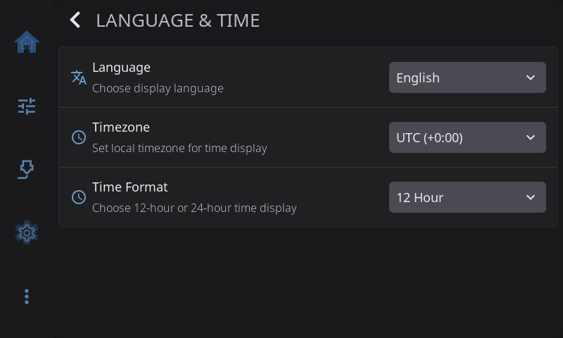

**Settings > Language & Time** sets the language HelixScreen uses and how it shows the time. Set your timezone here so print finish times and the clock match your wall clock.

On the Settings screen, the **Language & Time** row shows your choices, for example *English · 24-hour*.

---

## Language

The language for everything on screen: English, German, Spanish, French, Italian, Japanese, Portuguese, Russian or Chinese. The screen switches as soon as you pick one. No restart needed.

---

## Timezone

Your local timezone, so print finish times, time remaining and the clock widget show the right time. Most printers start out on UTC. Pick from a list of common timezones. Each one shows its offset from UTC, for example "Eastern (-5:00)". Daylight saving time is handled for you.

---

## Time Format

**12 Hour** (such as 3:45 PM, the default) or **24 Hour** (such as 15:45). Applies to every time shown in HelixScreen.

---

[Back to Settings](/1.1/guide/settings/) | [Prev: Connection](/1.1/guide/settings/connection/) | [Next: System](/1.1/guide/settings/system/)
