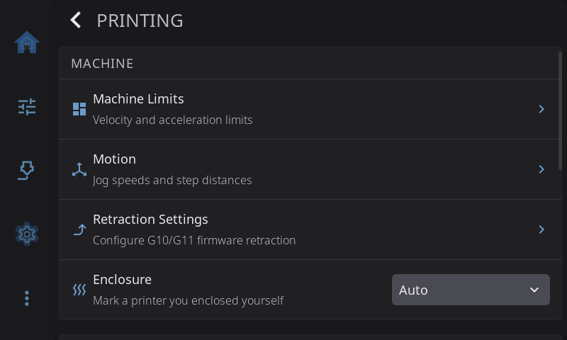
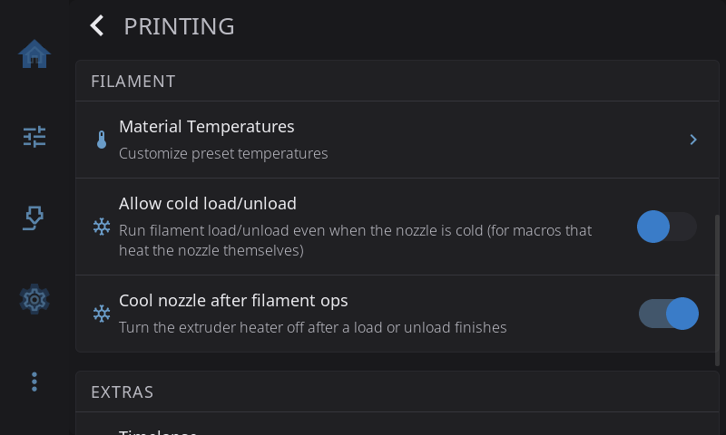
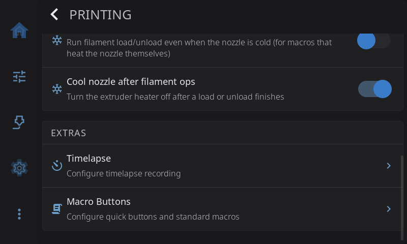

**Settings > Printing** holds the settings that change how your printer moves, heats and handles filament, and the buttons and macros HelixScreen runs for you. The page has three sections:

- **MACHINE**: Machine Limits, Motion, Retraction Settings and Enclosure
- **FILAMENT**: Material Temperatures, Allow cold load/unload and Cool nozzle after filament ops
- **EXTRAS**: Timelapse and Macro Buttons

Looking for how the printer is *drawn* (toolhead picture, G-code preview, Z button labels, bed mesh view)? That's in [Appearance](appearance.md#printer-visuals).







---

## Machine Limits

Opens sliders for your printer's speed and acceleration limits. Use them to test or troubleshoot motion. A banner at the top reminds you: **Changes are temporary and reset on printer reboot.** To change the limits for good, edit `printer.cfg`.

> **Tap a value to type an exact number.** The sliders are quick but coarse. Max Acceleration covers 500 to 50000 in a few hundred pixels, so landing on exactly 3000 by dragging is luck. Tap the number next to a slider to open a keypad instead.

| Setting | Range | What it limits |
|---------|-------|----------------|
| **Max Velocity** | 50 to 1000 mm/s | The fastest the toolhead moves |
| **Max Acceleration** | 500 to 50000 mm/s² | How quickly it speeds up |
| **Accel to Decel** | 500 to 50000 mm/s² | How hard moves slow down |
| **Square Corner Velocity** | 1.0 to 20.0 mm/s | The speed carried through a sharp corner. Half steps such as 5.5 can be typed on the keypad |
| **Extrude Speed** | 1 to 50 mm/s | The speed of the manual extrude and retract buttons |

> **Extrude Speed is kept.** Unlike the limits above, it's a HelixScreen setting. It's remembered after a restart.

Under the sliders, a **Config-defined** section shows your **Max Z Velocity** and **Max Z Accel**. They come from your Klipper config and can't be changed here.

**Reset** at the bottom puts the limits back to your printer's configured values.

---

## Motion

Jog speeds and how far each jog pad button moves. See [Motion](../motion.md#motion-settings) for what each one does.

---

## Retraction Settings

> Only shown when firmware retraction (`[firmware_retraction]`) is set up in Klipper.

Sets the firmware retraction that `G10`/`G11` use. **Changes apply straight away**, even mid-print, so you can tune while you watch.

As with Machine Limits, **tap a value to type an exact number**. Distances take two decimals, such as 0.85 mm.

| Setting | Range | What it does |
|---------|-------|--------------|
| **Enable Retraction** | On or off | Turns firmware retraction on or off |
| **Retract Length** | 0.00 to 6.00 mm | How much filament to pull back. 0.4 to 2 mm for direct drive, 4 to 6 mm for Bowden |
| **Retract Speed** | 10 to 80 mm/s | How fast to pull back |
| **Unretract Extra** | 0.00 to 1.00 mm | Extra filament pushed out afterwards to make up for oozing |
| **Unretract Speed** | 10 to 60 mm/s | How fast to push it back |

---

## Enclosure

Tells HelixScreen whether your printer is enclosed. **Auto** (the default) counts the printer as enclosed when its model is known to ship enclosed, or when a chamber heater is set up. Choose **Enclosed** if you've enclosed an open-frame printer yourself, or **Open frame** if HelixScreen thinks your printer is enclosed and it isn't.

It matters for [drying filament on the bed](../temperature.md#drying-filament-on-the-bed), which is only offered on an enclosed printer.

---

## Material Temperatures

Sets the preheat temperatures for each filament material (PLA, PETG, ABS, TPU and so on). The presets on the Home, Controls and Filament screens use these. For each material you can set:

- **Nozzle Temperature**: the nozzle target. It's limited to what your printer and nozzle allow.
- **Bed Temperature**: the bed target.
- **Preheat Macro**: a Klipper macro to run when you preheat this material.
- **Macro Handles Heating**: when on, your macro sets the temperatures. When off, HelixScreen sets the temperatures first and then runs your macro.

See [Per-Material Preheat Macros](#per-material-preheat-macros) for when the macro runs.

### Editing materials and brands by hand

Everything on this screen and in the filament catalog (the brand and material picker) is also stored in one file, `user_filaments.json`. On most installs it's in `~/printer_data/config/helixscreen/`, so you can open it from Mainsail's or Fluidd's config file list. The copy in the install folder's `config/` folder (for example `~/helixscreen/config/`) is a link to the same file.

The file has two lists: `types` for materials (PLA, PETG and so on) and `filaments` for branded products.

```json
{
  "types": [
    {"name": "PLA", "nozzle_min": 205, "nozzle_max": 225, "bed": 65},
    {"name": "ABS", "chamber": 50, "preheat_macro": "PREHEAT_ABS", "macro_handles_heating": true},
    {"name": "PEKK", "nozzle_min": 330, "nozzle_max": 360, "bed": 120, "chamber": 80}
  ],
  "filaments": [
    {"id": "mybrand-pla-basic", "brand": "MyBrand", "name": "PLA Basic", "type": "PLA",
     "nozzle": 215, "nozzle_min": 200, "nozzle_max": 230, "bed": 60}
  ]
}
```

**Materials (`types`).** An entry with the `name` of a built-in material changes only the fields you list. Everything else keeps its built-in value. The Material Temperatures screen writes to this list too, so a change on the screen shows up in the file and the other way round. An entry with a new `name` adds a material. It then appears in the Material Temperatures list and can be used as a product's `type`.

- Fields: `nozzle_min`, `nozzle_max`, `bed`, `chamber` (0 means no chamber heat), `preheat_macro`, `macro_handles_heating`, `dry_temp`, `dry_time` (minutes), `density` (g/cm³), `category` and `compat_group`.
- Write numbers as plain numbers: `205`, not `"205"`. A field holding text or `null` is ignored (with a warning in the log) and the built-in value stays.
- A new material must set `nozzle_min` and `nozzle_max`, with `nozzle_max` at least `nozzle_min`. One without a usable nozzle range is skipped, with a warning in the log. Set `bed` too; anything else you leave out is 0. Its `compat_group` is its own name unless you set one, so endless spool never swaps it for a different material. Set `compat_group` to an existing group (for example `"PLA"`) only if it really can stand in for that group.
- The built-in list is the `types` section of `assets/filaments.json` in the HelixScreen install folder. Read it for names and defaults, but don't edit it: updates replace it.
- **Reset to Default** on the Material Temperatures screen removes your temperature and macro changes for a built-in material. A material you added has no default, so the button is hidden for it.

**Brands and products (`filaments`).**

- `id`, `brand`, `name` and `type` are required. The `id` must be unique. Lowercase with dashes is the convention.
- `nozzle`, `nozzle_min`, `nozzle_max`, `bed` and `density` are optional. Anything you leave out comes from the product's material, including your changes in `types`.
- To change a built-in product, use its `id` and list only the fields you want to change. Built-in products are in the `filaments` section of `assets/filaments.json`.
- Temperatures set on a product override those of its material.

Restart HelixScreen after editing so every screen picks up the change. A file that is only a list of products (`[ ... ]`) still works; HelixScreen rewrites it in the form above the next time it saves. If the file stops being valid JSON, HelixScreen ignores it until it's fixed. The next save from the screen then copies it to `user_filaments.json.bak` and starts fresh.

On older versions this file lived only in the install folder, where a Mainsail or Fluidd update deletes it. If you added products on an older version, copy the file somewhere safe before updating.

**Material temperatures from older versions.** Older versions kept Material Temperatures changes in `settings.json` under `material_overrides`. The first time a newer version starts, HelixScreen moves them into `types` in `user_filaments.json` and removes them from `settings.json`. If `user_filaments.json` isn't valid at that moment, they stay put and the move is tried again next start. Going back to an older version loses them, because older versions only look in `settings.json`. Which material each preset button uses stays in `settings.json` under `preset_materials`, a list of four entries such as `{"type": "PETG"}`. Stop HelixScreen before editing `settings.json`, because it rewrites the whole file whenever it saves a setting.

---

## Allow cold load/unload

| Setting | What happens |
|---------|--------------|
| **Off** (default) | Loading and unloading are blocked while the nozzle is too cold to extrude |
| **On** | Loading and unloading run on a cold nozzle, and HelixScreen never heats it for you first |

By default HelixScreen won't load or unload filament while the nozzle is too cold, the same safety check Klipper makes. Turn this on if your load and unload macros heat the nozzle themselves, so they aren't blocked before they get the chance.

With it on, HelixScreen also skips its own preheat. Your macro runs straight away and is in charge of the temperature. This applies wherever you start a load or unload, including the Filament screen and your filament system's own screen.

You don't need it for printers whose stock macros HelixScreen already knows heat on their own (QIDI's `M604` and `M603`, for example), or for filament systems that heat as part of loading (AFC, CFS, QIDI Box, AD5X IFS). HelixScreen detects those and skips its preheat whatever this switch says.

---

## Cool nozzle after filament ops

| Setting | What happens |
|---------|--------------|
| **On** (default) | The nozzle heater turns off a couple of minutes after a load or unload finishes |
| **Off** | The nozzle stays at whatever temperature the load or unload left it at |

A filament change heats the nozzle to printing temperature. Left alone, it would stay hot, using power and slowly cooking the filament inside. So HelixScreen turns the heater off when you're done. It waits two minutes first, so you can do several loads and unloads in a row without the nozzle cooling in between. Each new load or unload restarts the wait. Nothing happens during a print: the print looks after its own temperatures.

**Turn this off if your filament system already does it.** [AFC](/1.1/guide/filament/) has its own cool-down after loading, and other filament systems are adding the same. Two timers controlling one heater only confuses things, so keep one and switch the other off.

The setting is per printer, so an AFC printer can turn it off while your other printers keep it. To change the two-minute wait, see [`cooldown_delay_seconds`](../../CONFIGURATION.md#cooldown_delay_seconds).

---

## Timelapse

> Only shown when the [Moonraker-Timelapse](https://github.com/mainsail-crew/moonraker-timelapse) plugin is installed.

Sets up how HelixScreen records timelapse videos of your prints.

| Setting | Options | What it does |
|---------|---------|--------------|
| **Enable Timelapse** | On or off | Turns recording on or off |
| **Recording Mode** | Layer or Hyperlapse | **Layer** takes one frame per layer, best for most prints. **Hyperlapse** takes frames at a fixed time interval, better for very long prints |
| **Framerate** | 15, 24, 30 or 60 fps | How fast the finished video plays. 30 fps is the default |
| **Auto-render video** | On or off | Makes the video file automatically when the print finishes |

Changes are saved straight away and sent to Moonraker. The print status screen also has a timelapse switch, so you can turn recording on or off without leaving the print.

If the plugin isn't installed yet, HelixScreen shows an **Install Wizard** that walks you through the commands. See [Advanced > Timelapse](../advanced.md#timelapse). To watch recorded videos, use **Advanced > Timelapse Videos**.

---

## Macro Buttons

Chooses what HelixScreen's quick buttons run, and which of your Klipper macros it uses for common jobs such as loading filament or cleaning the nozzle.

### Quick Buttons

The Controls panel's **Quick Actions** card has four quick buttons under the Home row. Each one runs one of the [standard actions](#standard-macros) below, or toggles the printer light:

| Setting | Default |
|---------|---------|
| **Quick Button 1** | Clean Nozzle |
| **Quick Button 2** | Bed Level |
| **Quick Button 3** | (Empty) |
| **Quick Button 4** | (Empty) |

- **A standard action** runs whatever macro that action is assigned to under Standard Macros. If your printer has no macro for it, the button shows greyed out.
- **Light** turns the button into an on/off switch for the chamber light, like a home screen LED Light widget left on its default. It hides while no light is controllable.
- **(Empty)** hides the button.

While a light is controllable and no Quick Button is set to **Light**, the first button you have never set that would otherwise be empty shows the light, and its dropdown reads **Light**. Picking **(Empty)** for that button turns the light off there and keeps it off.

**Cool Down** (on the Preheat widget while a heater is on, and on the Filament panel) runs the `cooldown` G-code from `settings.json`. By default it turns off the extruder and bed heaters. Override it when cooling down should do more, such as turning off a chamber heater or bed fans:

```
SET_HEATER_TEMPERATURE HEATER=extruder TARGET=0
SET_HEATER_TEMPERATURE HEATER=heater_bed TARGET=0
SET_FAN_SPEED FAN=bed_fan SPEED=0
```

See the [default_macros reference](../../CONFIGURATION.md#default_macros) for the format.

### Standard Macros

HelixScreen looks for common macros in your Klipper config and uses them for each job below. It recognizes common spellings, such as both `CLEAN_NOZZLE` and `NOZZLE_CLEAN`. You can pick a different macro for any slot:

| Slot | Used for | Macros it looks for |
|------|----------|---------------------|
| **Load Filament** | Loading filament | LOAD_FILAMENT, M701 |
| **Unload Filament** | Unloading filament | UNLOAD_FILAMENT, M702 |
| **Purge** | Purging or priming the nozzle | PURGE, PURGE_LINE, LINE_PURGE, PRIME_LINE |
| **Pause** | Pausing a print | PAUSE, M600 |
| **Resume** | Resuming a print | RESUME |
| **Cancel** | Cancelling a print | CANCEL_PRINT |
| **Bed Mesh** | Bed mesh calibration | BED_MESH_CALIBRATE |
| **Bed Level** | Manual bed leveling | BED_SCREWS_ADJUST, SCREWS_TILT_CALCULATE |
| **Clean Nozzle** | Nozzle cleaning | CLEAN_NOZZLE, NOZZLE_CLEAN |
| **Heat Soak** | Chamber heat soak | HEAT_SOAK |
| **Park** | Parking the toolhead (Motion screen, Move tab) | PARK, PARK_TOOLHEAD, TOOLHEAD_PARK |

If your printer has no matching macro, some slots fall back to HelixScreen's helper macros, which you install from **Advanced > Install Helper Macros**. Leave a slot empty to turn that job off.

**Load Filament and Unload Filament on a multi-filament printer.** Left on **(Auto)**, these two use your filament system directly instead of running a macro. If you pick a macro, your macro takes over and the filament system's own loading is skipped, so anything it would have done is now up to your macro. Set the slot back to **(Auto)** to hand the job back. The other slots aren't affected. See [Customizing which macro runs](../filament.md#customizing-which-macro-runs) for a step-by-step guide.

### Per-Material Preheat Macros

Each material in [Material Temperatures](#material-temperatures) can run its own Klipper macro when you preheat it. Use this when preheating needs more than temperatures, such as turning on bed fans for ABS or starting a chamber heater.

The macro runs from the **Preheat widget** on the Home or Controls screen and from the **material preset buttons on the Filament screen**, including the active-spool preset. On the Filament screen, tap a preset to preheat it, or long-press it to choose which material the button uses. The separate nozzle, bed and chamber temperature controls never run a material's macro.

**Macro Handles Heating** doesn't turn the macro on or off: the macro runs either way. When it's on, the macro must set every temperature itself. When there's no macro, or the macro doesn't exist on this printer, the button just sets the preset temperatures. A manual preheat doesn't keep a hotter nozzle target from before; loading and unloading keep their own heating.

---

[Back to Settings](/1.1/guide/settings/) | [Prev: Sound](/1.1/guide/settings/sound/) | [Next: Devices](/1.1/guide/settings/devices/)
