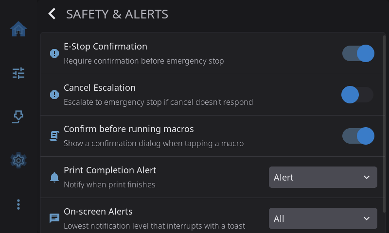

**Settings > Safety & Alerts** decides how careful HelixScreen is and how loudly it tells you things. Use it to add a confirmation to the emergency stop or to macros, to set a safety net for cancels that hang, to control camera failure detection, and to choose how finished prints and other messages are announced.

---

## E-Stop Confirmation

| Setting | What happens |
|---------|--------------|
| **On** (default) | E-Stop asks you to confirm first |
| **Off** | Tapping E-Stop stops the printer immediately |

The confirmation guards against stopping a print by accident. Turn it off if you want the fastest possible emergency stop.

---

## Cancel Escalation

Some printers take a long time to finish cancelling a print: parking tools, cooling down, running a long `CANCEL_PRINT` macro. Cancel Escalation is a safety net. If a cancel hasn't finished after a set time, HelixScreen sends an emergency stop (`M112`).

**Off** by default.

**Leave it off** on tool changers that park tools when cancelling, on printers with long `CANCEL_PRINT` macros, and on any printer whose cancel is expected to take more than a few seconds.

**Turn it on** on simple printers where a cancel should be quick, or if you've had cancels that got stuck and never returned to idle.

### Escalation Timeout

> Only shown while Cancel Escalation is on.

How long to wait before the emergency stop: **15**, **30** (default), **60** or **120 seconds**.

---

## Confirm before running macros

| Setting | What happens |
|---------|--------------|
| **On** (default) | HelixScreen asks before running a macro |
| **Off** | Tapping a macro button runs it straight away |

Keep it on if you have macros that move the toolhead, heat the printer or do anything else you wouldn't want set off by a stray tap. Turn it off if you run macros often and trust your fingers. Macros that take parameters always open a form first, whatever this says.

---

## Spaghetti Detection

> Only shown on printers with built-in camera failure detection: the Creality K2 Plus, and the Snapmaker U1 with defect detection.

While a print runs, the printer's camera watches for "spaghetti": a print that has come loose or is piling up as a tangle of plastic.

| Setting | What happens |
|---------|--------------|
| **On** (default) | The camera is checked for failures during every print |
| **Off** | Nothing is watched and no detection alerts appear |

The first time HelixScreen starts on a K2 Plus that had its own detection settings, it copies your on/off and pause choices over once. After that, they're set here.

### Pause on Detection

| Setting | What happens |
|---------|--------------|
| **On** (default) | A detected failure pauses the print and opens a dialog where you can resume, cancel, or turn detection off |
| **Off** | A detected failure only shows a warning. The print keeps going |

Greyed out while Spaghetti Detection is off. Hidden on printers whose firmware pauses the print on its own when it sees a failure (the Snapmaker U1).

See [Print Monitoring](/1.1/guide/print-monitoring/) for what the detection dialog offers.

---

## Print Completion Alert

How HelixScreen tells you a print has finished, been cancelled or failed, when you're not already looking at the print status screen.

| Setting | What you get |
|---------|--------------|
| **Off** | Nothing on screen. The sound still plays if sounds are on |
| **Notification** | A short message at the top of the screen |
| **Alert** (default) | A full-screen summary of the print (time, layers, filament used), with confetti when it succeeded |

A failed print always gets the full alert, whatever you choose, because errors need your attention. If the print status screen is already open when the print ends, there's no extra alert: that screen shows the result.

The end-of-print sound plays for every finished, cancelled or failed print as long as the master Sounds switch is on.

---

## On-screen Alerts

Toasts are the short messages that slide in at the top of the screen, like "Filament loaded", "Saved" or "Update available". If the informational ones feel chatty, choose the least important kind that's still allowed to interrupt you:

| Setting | What still shows |
|---------|------------------|
| **All** (default) | Everything: info, success, warnings and errors |
| **Warnings & errors** | Info and success messages are held back |
| **Errors only** | Only errors |

Held-back messages aren't lost. They still go into the notification history, which you open from the Notifications widget on the Home screen. This setting never hides a full-screen error, and never hides the [Print Completion Alert](#print-completion-alert).

---

[Back to Settings](/1.1/guide/settings/) | [Prev: Devices](/1.1/guide/settings/devices/) | [Next: Connection](/1.1/guide/settings/connection/)
