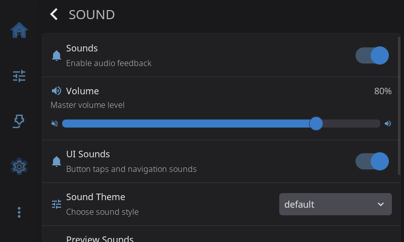
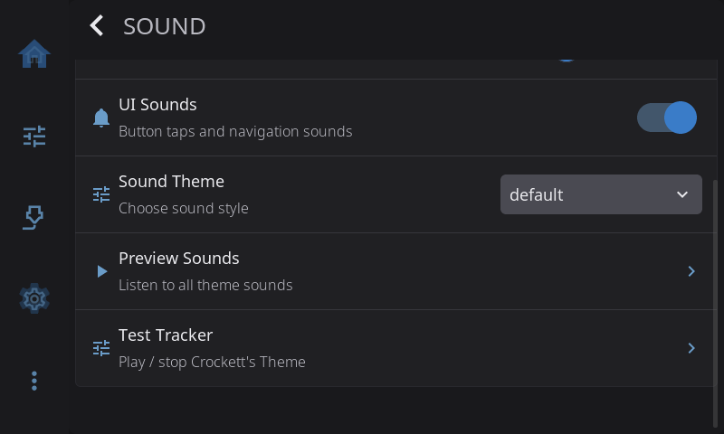

**Settings > Sound** turns sounds on or off and sets how loud they are and what they sound like. The **Sound** row only appears on the Settings screen when HelixScreen finds a speaker or buzzer it can use (see [Supported Hardware](#supported-hardware)).

On the Settings screen, the **Sound** row shows your volume, for example *Volume 60%*, or *Muted* when sounds are off.

---

## Sounds

The master switch. Turns every sound on or off. **Off** on a fresh install, so turn it on to hear anything. When it's off, the rest of the rows on this page are hidden.

> The Sound options are there as soon as HelixScreen starts, before the printer connects. If no speaker is found once the printer connects, they're hidden.

---

## Volume

Sets the volume for every sound, from 0% to 100%. Starts at 80%.

---

## UI Sounds

Button taps, switch clicks and the sounds for opening and closing screens. **On** by default. Turn it off to keep only the sounds that matter: print finished, errors and alarms.

---

## Sound Theme

Picks the style of every sound. A test sound plays when you switch. The five built-in themes:

| Theme | Sound |
|-------|-------|
| **Default** | Balanced and understated. Soft clicks, smooth navigation chirps and a melodic fanfare when a print finishes |
| **Minimal** | Only the important events: print finished, errors and alarms. No button or navigation sounds |
| **Retro** | 8-bit chiptune. Square-wave arpeggios, a victory fanfare and buzzy retro alarms |
| **Miami Vice** | Punchy 80s synth with a driving rhythm and a soaring lead for print finished |
| **Crockett's Theme** | Warm, cinematic 80s synth with long sustains and filter sweeps. Startup plays the Crockett's Theme melody |

You can also make your own theme. See [Custom Sound Themes](#custom-sound-themes).

---

## Output Device

Chooses which sound card plays HelixScreen's sounds, for example an HDMI screen with its own speakers or the board's built-in output. Only shown on printers that play sound through a Linux sound card (ALSA) and have a list of devices to choose from.

---

## Preview Sounds

Opens a screen with a button for every sound in the current theme. Tap one to hear it. Useful for comparing themes or testing a theme you made.

---

## Test Tracker

Plays, or stops, the Crockett's Theme music track. Use it to check that music plays properly on your printer. Only shown on printers that can play music tracks.

---

## What Sounds When

| Event | Sound | When it plays |
|-------|-------|---------------|
| Button press | Short click | You tap a button |
| Switch on | Rising chirp | You turn a switch on |
| Switch off | Falling chirp | You turn a switch off |
| Navigate forward | Rising tone | A screen opens |
| Navigate back | Falling tone | You go back or close a screen |
| Print complete | Victory melody | A print finishes |
| Print cancelled | Falling tone | A print is cancelled |
| Error alert | Pulsing alarm | Something went seriously wrong |
| Error notification | Short buzz | An error message pops up |
| Critical alarm | Urgent siren | A critical failure needs your attention |
| Test sound | Short beep | You tap a button in Preview Sounds |
| Startup | Theme jingle | HelixScreen starts |

The first five are **UI sounds** and follow the UI Sounds switch. The rest play whenever the master Sounds switch is on.

---

## Custom Sound Themes

You can add your own theme without touching the HelixScreen install:

1. SSH into your printer.
2. Create the sounds folder if it isn't there yet: `mkdir -p ~/helixscreen/config/sounds`
3. Copy a built-in theme to start from: `cp ~/helixscreen/assets/config/sounds/default.json ~/helixscreen/config/sounds/mytheme.json`
4. Edit the file. Change the `"name"` field, then change the sounds.
5. Your theme appears in the Sound Theme menu right away.

Custom themes can use everything the built-in ones do: four wave shapes (square, saw, triangle, sine), envelopes, pitch sweeps, filters with sweeps, LFO modulation, chords of up to 4 notes, note names (C4, F#5, Bb3) and note lengths (8n, 4n., 16t) with a tempo.

A custom theme with the same file name as a built-in one replaces it.

The full file format is in the [Sound System developer docs](../../../devel/SOUND_SYSTEM.md#sound-theme-json-schema).

---

## Supported Hardware

| Hardware | How it plays |
|----------|--------------|
| **Desktop (SDL)** | Full sound through your computer's speakers. The best quality |
| **Linux sound card (ALSA)** | Full sound with 4 notes at once, plus music tracks for richer themes |
| **FlashForge AD5X** | The printer's speaker. Chords, full themes and music (including the startup jingle) played as tone sequences |
| **FlashForge AD5M / AD5M Pro** | The printer's buzzer. Tones only: no startup music and no music themes |
| **Other Klipper printers** | Beeps sent through Moonraker. Needs `[output_pin beeper]` in your Klipper config. Simple beeps only |

If no sound hardware is found, the Sound row and page are hidden.

**Turning sound off completely.** On some hardware (for example the Artillery M1 Pro) the sound drivers work but use too much processor time. If the printer slows down with sound on, add `"disable_sound": true` to `settings.json`, or start HelixScreen with `--no-sound`. That stops the sound system from starting at all. The Sounds switch only mutes it.

---

## Sound Troubleshooting

**There's no Sound row in Settings.**
HelixScreen didn't find a speaker or buzzer. On a Klipper printer, check that `printer.cfg` has an `[output_pin beeper]` section, then restart HelixScreen.

**Sounds are too quiet or too loud.**
Move the Volume slider. Themes differ in loudness too, so try another theme.

**The print-finished sound doesn't play.**
Check that the master Sounds switch is on. The UI Sounds switch doesn't affect it.

**Button clicks get on my nerves.**
Turn off UI Sounds. Buttons, switches and screen changes go quiet, and important sounds still play.

**Sounds work on my computer but not on the printer.**
Check that the printer has sound hardware. On a Klipper printer, check that `[output_pin beeper]` is set up, and test it by sending `M300` from the Klipper console.

---

[Back to Settings](/1.1/guide/settings/) | [Prev: Touch & Input](/1.1/guide/settings/touch-input/) | [Next: Printing](/1.1/guide/settings/printing/)
