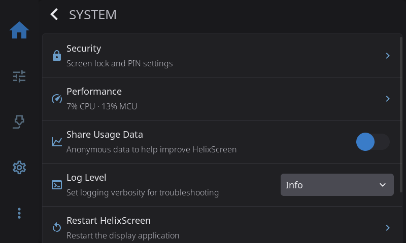
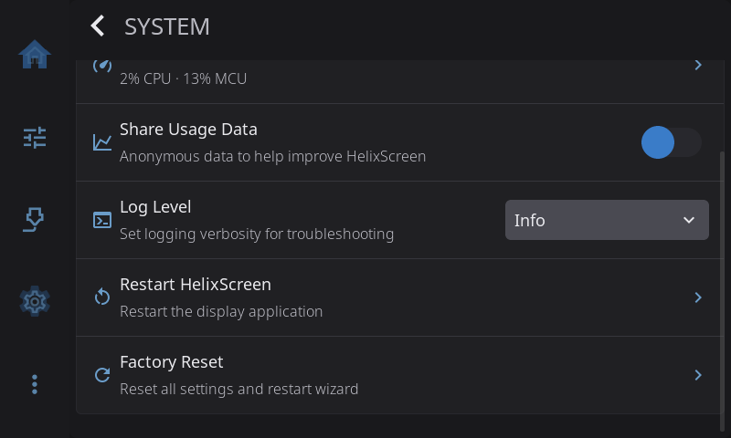

**Settings > System** looks after HelixScreen itself: the screen lock, anonymous usage data, how much it logs, and restarting or resetting it. Network and printer connections are in [Connection](/1.1/guide/settings/connection/), and touch settings are in [Touch & Input](/1.1/guide/settings/touch-input/).

---

## Security

Locks the screen with a PIN, so nobody can use your printer's controls without it. Tap **Security** to set it up.

**With no PIN set:**

- **Set PIN**: choose a 4 to 6 digit PIN and enter it twice.

**With a PIN set:**

- **Change PIN**: enter your current PIN, then the new one twice.
- **Remove PIN**: turn the lock off. You'll need to enter your current PIN.
- **Auto-lock**: lock the screen automatically when it goes to sleep (see [Display Sleep](display.md#display-sleep)).

When the screen is locked, a keypad covers it. Enter your PIN and tap the check mark. A wrong PIN shows a short error. While a print is running, an **Emergency Stop** button stays in the top-right corner of the lock screen, so you can always stop the printer without unlocking.

HelixScreen never saves your PIN itself, only a scrambled version of it that can't be turned back into the digits. A factory reset removes the PIN. See [Security](/1.1/guide/security/) for more.

---

## Performance

> Only shown once HelixScreen has performance readings.

The row shows how busy things are right now, for example *95% CPU · 13% MCU*. Tap it for live processor and memory use on the computer running HelixScreen, plus the load on each of your printer's controller boards. Check it when prints stutter or the screen feels slow, to see whether the host or a board is overloaded.

---

## Share Usage Data

Sends anonymous usage data that helps improve HelixScreen. **Off** until you turn it on. Nothing personal is sent: no names, printer names or file names. See [Telemetry & Privacy](/1.1/legal/telemetry/) for exactly what is and isn't collected.

### View Telemetry Data

> Only shown while Share Usage Data is on.

Shows exactly what would be sent, before it's sent.

---

## Log Level

How much detail HelixScreen writes to its log. Raise it when you're chasing a problem or preparing a bug report.

| Level | What it records |
|-------|-----------------|
| **Warn** | Only errors and warnings |
| **Info** (default) | Connections, screen changes and other milestones |
| **Debug** | Changes of state and messages to and from the printer. Use this for bug reports |
| **Trace** | Everything, including screen drawing. Very long and rarely needed |

The change takes effect straight away. Set **Debug**, reproduce the problem, send a [debug bundle](help-about.md#upload-debug-bundle), then set it back to **Info**.

> **Tip:** Debug and Trace use more processor time and fill the log faster. Don't leave them on.

---

## Restart HelixScreen

Restarts the screen app (not the printer). A short "Restarting HelixScreen..." message appears first. Use it after changing a setting that needs a restart, such as [UI Scale](display.md#ui-scale), or if the screen stops responding properly.

---

## Factory Reset

Erases **all** HelixScreen settings and starts the setup wizard again. HelixScreen asks you to confirm first. A factory reset clears:

- Display, appearance, sound and all other preferences
- LED setup
- Your printers and how to connect to them
- Sensor roles and the Hardware Health expected list
- The screen lock PIN

It **doesn't touch** your Klipper config, Moonraker or any files on the printer.

---

[Back to Settings](/1.1/guide/settings/) | [Prev: Language & Time](/1.1/guide/settings/language-time/) | [Next: Updates](/1.1/guide/settings/updates/)
