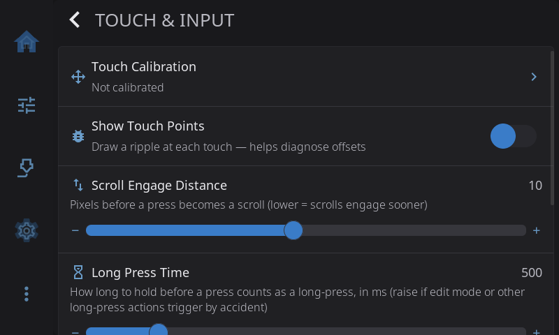
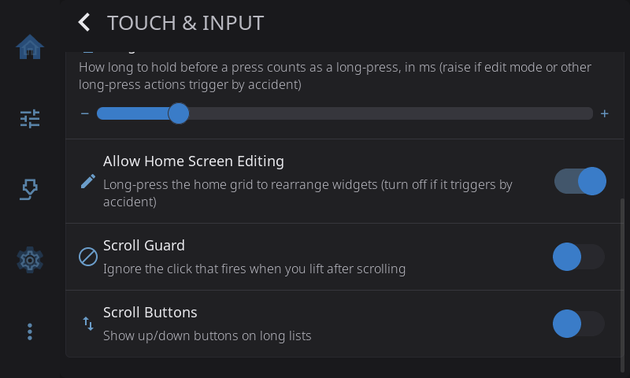

**Settings > Touch & Input** is about how the screen reads your finger. Come here when taps land in the wrong place, when scrolling sets off buttons by accident, when long-presses trigger too easily, or when you'd like buttons for scrolling long lists. On Android it also holds the keyboard and navigation bar options.

---

## Touch Calibration

Fixes taps that register in the wrong place. The row shows **Calibrated** or **Not calibrated**. It appears on any screen with a touch panel, so you can recalibrate whenever you like, even on a screen that looked fine at setup.

1. Tap **Touch Calibration**.
2. Tap each crosshair as it appears (3 points, 7 taps each).
3. Tap around the test area to check that taps land where your finger is.
4. Tap **Accept** to save, or **Retry** to do it again.

For other ways to start calibration (a config option, an environment variable or a command) and details per printer, see the [Touch Calibration guide](/1.1/guide/touch-calibration/).

---

## Show Touch Points

Draws a ripple wherever the screen detects a touch. **Off** by default. Turn it on when taps feel offset or buttons don't respond where you expect, tap around, and you'll see exactly where the screen thinks your finger is. Turn it off when you're done. Takes effect right away.

> The same switch can be turned on permanently with `HELIX_DEBUG_TOUCH=1` in `helixscreen.env`.

---

## Scroll Engage Distance

How far your finger has to move before a press turns into a scroll instead of a tap. Range 1 to 20 pixels, default 10.

| If this happens | Try |
|---|---|
| Scrolling a list taps whatever was under your finger | **5** |
| Most screens | **10** (default) |
| Taps feel twitchy, and small wobbles start a scroll | **15** |

Takes effect after a restart. HelixScreen offers to restart when you change it.

---

## Long Press Time

How long you hold your finger down before it counts as a long-press. Range 300 to 1500 milliseconds, default 500 (half a second).

Long-press opens home screen edit mode, deletes a file card, edits macros and more. If those happen when you only meant to rest a finger on the glass (common with a tablet lying flat), raise this to 800 or 1000. Takes effect right away.

---

## Allow Home Screen Editing

Whether a long-press on the home screen opens edit mode, where you move, resize, add and remove widgets. **On** by default.

Turn it off if edit mode keeps opening by accident. Turn it back on when you want to rearrange. If you'd rather keep editing available, raising [Long Press Time](#long-press-time) makes accidental edits rarer instead. Takes effect right away.

---

## Scroll Guard

Ignores the stray tap some touch panels send when you lift your finger after scrolling. For a short moment after each scroll (80 ms by default), a new press doesn't count as a tap. Turn it on if finishing a scroll sometimes presses whatever was under your finger. **Off** by default; the FlashForge AD5M and AD5X presets turn it on. Most Raspberry Pi screens don't need it.

Takes effect after a restart. HelixScreen offers to restart when you change it. It only works on printers with a built-in touchscreen; on the desktop simulator and on Android the switch does nothing.

> Still getting stray taps with Scroll Guard on? Some panels need a longer pause. See [Accidental Button Presses After Scrolling](../../TROUBLESHOOTING.md#accidental-button-presses-after-scrolling) to lengthen it with `scroll_guard_cooldown_ms`. For taps that fire *while* you're still scrolling, lower [Scroll Engage Distance](#scroll-engage-distance) instead.

---

## System Keyboard *(Android only)*

Uses Android's own keyboard for text fields instead of HelixScreen's on-screen keyboard. Handy if you already have a keyboard you like on your phone or tablet.

---

## Keep Navigation Bar *(Android only)*

Keeps Android's navigation bar (back, home, recents) on screen all the time. When it's off (the default), HelixScreen runs full screen: swipe up from the bottom edge to show the bar, and it hides again after a few seconds. Turn this on if you use 3-button navigation instead of gestures. The status bar stays hidden either way.

---

## Scroll Buttons

Adds up and down buttons to screens that are too long to fit. **Off** by default, except on the ESP32 screen, where dragging is slow and the buttons start on. Turn it on if you'd rather tap through a list than drag it, especially on small screens or screens where dragging feels unreliable.

When it's on, a screen that needs scrolling gets a slim column of arrow buttons on its right edge. The content moves over a little to make room, so the buttons never cover anything. Each tap scrolls about one screen, with a little overlap so you keep your place. The up arrow dims at the top of the list and the down arrow dims at the bottom. Screens that already fit get no buttons, and neither do the small tiles on the home screen, where the arrows would cover most of the tile.

Dragging still works as usual. With [Animations](appearance.md#animations) on, the list glides to its new position. With Animations off, it jumps there.

---

[Back to Settings](/1.1/guide/settings/) | [Prev: Appearance](/1.1/guide/settings/appearance/) | [Next: Sound](/1.1/guide/settings/sound/)
