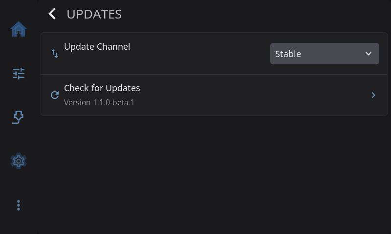

**Settings > Updates** is where HelixScreen updates itself. Pick which releases you want, check for a new one and install it, all from the touchscreen.

On the Settings screen, the **Updates** row tells you where things stand: *Up to date*, the version waiting for you (for example *1.1.1 available*), *Checking…*, *Check failed*, or your installed version (such as *Version 1.1.0*) before the first check. On printers whose firmware updates HelixScreen, it reads *Managed by firmware*.

---

## Update Channel

Which releases you get:

| Channel | What you get |
|---------|--------------|
| **Stable** | Tested releases only. Recommended |
| **Beta** | Preview builds with new features. May have rough edges |
| **Dev** | Development builds. Only listed once [beta features](help-about.md#enabling-beta-features) are on, and needs a `dev_url` in `/var/lib/helixscreen/update_urls.json` (a file only root can edit; see [CONFIGURATION](/1.1/reference/configuration/)) |

Changing the channel checks the new channel straight away.

> **Note:** Choosing **Dev** without a `dev_url` in `update_urls.json` shows "Dev channel requires dev_url in update_urls.json" and doesn't check. Dev builds are meant for people working on HelixScreen. Most people should stay on **Stable** or **Beta**.

---

## Check for Updates

Looks for a newer release on your channel. Until you check, the row shows the version you have. After a check, it shows the result, such as the version that's available.

If there's a new version, a dialog walks you through installing it:

1. **Update Available**: shows the new version. Tap **Install** to start, or **Cancel**.
2. **Downloading...**: a progress bar shows the download. You can still **Cancel** here. The dialog closes at once, but the download finishes its current piece in the background before it's thrown away. If you start another update before then, you'll see **Update Failed** with "Previous download still finishing". Wait a few seconds and tap **Retry**.
3. **Verifying...**: HelixScreen checks the download before installing it.
4. **Installing...**: the new version is put in place. **Don't turn off the printer now.**
5. **Update installed!**: the new version is in place.
6. **Hang on, we'll be right back!**: HelixScreen restarts into the new version.

Steps 5 and 6 only flash up for a moment. The install is already done by then; the pause just lets you see it worked.

If something goes wrong, **Update Failed** offers **Retry** to try again or **Close** to give up for now.

> **Caution:** Once installing starts, leave the printer on until HelixScreen restarts by itself. Cutting power during an install can leave HelixScreen broken.

On Android, installing opens the Play Store.

---

## Install Update

> Only shown when a check has found a version to install.

Opens the update dialog above at the **Update Available** step, so you can install a version you found earlier.

If you switched to a channel whose latest release is older than the version you have (going from Beta back to Stable, for example), HelixScreen first asks **Install Older Version?**. Anything added since that older version will be gone.

---

## When updates come from somewhere else

Some installs can't update themselves. The page tells you so instead of showing buttons that wouldn't work.

- **Software Updates: Managed by your firmware.** Your printer's firmware includes HelixScreen and updates it along with everything else. The channel, check and install rows are hidden. Update the printer's firmware to get a newer HelixScreen.
- **Software Updates: Not available here. Update from a terminal.** HelixScreen can see new versions but can't write to its own install folder. Tap the row for a QR code that links to instructions: you run the HelixScreen installer with `--update` from a terminal on the printer. [Upgrading](/1.1/upgrading/) lists the other ways to update.

---

[Back to Settings](/1.1/guide/settings/) | [Prev: System](/1.1/guide/settings/system/) | [Next: Help & About](/1.1/guide/settings/help-about/)
