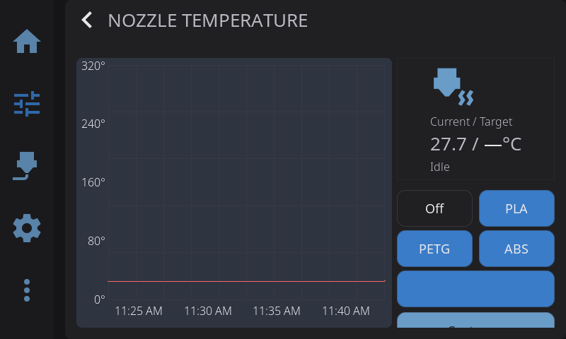
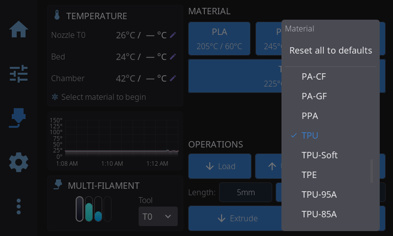

---

## Nozzle Temperature Panel

- **Current temperature**: Live reading from thermistor
- **Target input**: Tap to enter exact temperature
- **Presets**: Quick buttons for common temperatures
- **Temperature graph**: History over time

---

## Bed Temperature Panel

Same layout as nozzle control:

- Current and target temperature
- Presets for common materials
- Temperature graph

### Drying Filament on the Bed

On an enclosed printer with a heated bed, HelixScreen can dry filament on the build plate. Tap **Dry Filament** on the bed card (or **Advanced > Dry Filament**), pick the material and tap **Start** once you have ticked **I understand**. The material list shows the bed temperature and time each one uses: bed temperatures are capped at 90°C and at your bed's maximum, for 12 hours. If a chamber heater that can dry filament is fitted, you can run it at the same time.

What happens next:

1. If filament may still be loaded at the toolhead, HelixScreen offers to unload it first, so it does not soften in the extruder. If a sensor says the toolhead is empty, this step is skipped. You can skip it either way.
2. The printer homes, then moves the plate almost as far from the nozzle as it goes, stopping 20mm short of the end so anything under a plate that moves down stays clear, and parks the toolhead over the back of the plate.
3. Clear the area above and below the plate, lay the spools on the plate, cover them with a box (a printed lid or the filament's packaging) and close the door. Tap **Start drying**. If you change your mind before placing anything, tap **No spools placed** instead.
4. A banner at the top of the screen shows the time left. Halfway through, HelixScreen reminds you to flip the spools over. Use gloves: the plate is hot.
5. At the end the bed turns off. Once it has cooled below 40°C, HelixScreen asks you to take the spools off and confirm.

If a chamber heater dries alongside the bed, it runs at a drying temperature for the air around the spools, lower than the bed's (50°C for PLA, where the bed runs at 70°C). The printer's motors stay powered for the whole run and for up to 24 hours after it until you confirm the spools are off, so a gantry or bed does not sink onto them in the meantime.

From the moment HelixScreen asks you to place the spools until you confirm they are off, it will not home, move the printer, restart Klipper or start a print, and the banner stays up, even after a restart or a power cut. Only **No spools placed** or confirming removal ends that. Tap the banner to stop a run early, or to confirm the spools are off before the bed has cooled.

**Some spools are not heat-resistant enough and can deform.** HelixScreen cannot stop Mainsail, a macro run from elsewhere, or a print sent from a slicer while the spools are on the bed.

Dry Filament appears only on printers with a heated bed, at least 130 mm of Z travel, and an enclosure HelixScreen knows about. If you enclosed your printer yourself, set **Settings > Printing > Enclosure** to **Enclosed** (see [Enclosure](settings/printing.md#enclosure)). Open-frame printers never offer it.

---

## Temperature Presets

Built-in presets:

| Material | Nozzle | Bed | Chamber |
|----------|--------|-----|---------|
| Off | 0°C | 0°C | 0°C |
| PLA | 205°C | 60°C | — |
| PETG | 245°C | 80°C | — |
| ABS | 255°C | 100°C | 60°C |

Tap a preset to set the target temperature immediately. If your printer has a chamber heater, presets that include a chamber temperature will set it automatically — materials that don't need an enclosed chamber (PLA, PETG) leave the chamber heater off.

### Reassigning a Preset's Filament Type

The three preset buttons shown on the temperature panel (PLA, PETG, ABS) aren't
fixed — you can point any of them at a different filament type from the built-in
materials database. (A fourth default, TPU, ships with the presets but isn't shown
on the temperature panel; it surfaces on the filament and PID calibration panels.)

1. **Long-press** a preset button until the material picker appears.
2. Scroll the list and tap the filament type you want. The button's label and its
   temperatures update immediately, and the choice is remembered across restarts.
3. To undo all changes, long-press any preset button and tap **Reset to
   defaults** at the top of the list — this restores PLA / PETG / ABS.

> **Tip:** A short tap still just applies the button's temperatures. Only a long-press opens the picker.

### Spool Preset

When you have a filament loaded — either via an [external spool configuration](filament.md#external-spool-configuration) or an active AMS slot — and the material doesn't match one of the standard presets (PLA, PETG, ABS, TPU), an additional **spool preset** button appears below the standard presets.

The spool preset shows the material name and recommended temperature (e.g., "PA-CF (265°C)"). Tap it to set the temperature for that specific material. This appears on both the Nozzle and Bed temperature panels.

---

## Multi-Extruder Temperature Control

On printers with multiple extruders, an extruder selector appears at the top of the Temperature Control panel:

- **Tap an extruder** to switch which one you are controlling
- Each extruder has independent temperature targets and presets
- Toolchanger printers show tool names (T0, T1) rather than "Nozzle 1", "Nozzle 2"
- The selector only appears when Klipper reports more than one extruder

On a single-extruder printer none of this appears — there is no selector and the panel simply shows your one nozzle.

---

## Chamber Temperature Panel

If your printer has a chamber heater or chamber temperature sensor configured in Klipper, you can access the Chamber Temperature panel a few ways: tap the chamber row in the **Temperatures** widget, or add the dedicated **Chamber Temperature** widget to your Home Panel and tap it. Both open the temperature graph overlay focused on the chamber.

- **Heated chambers** (`heater_generic chamber`): Full control panel with current/target temperature, presets, and a live temperature graph with a green trace
- **Sensor-only chambers** (`temperature_sensor chamber`): Monitoring mode — shows the current chamber temperature and graph, with a "Monitoring" status instead of heating controls. Presets and target input are hidden since there's no heater to control.

Chamber mode works like the nozzle and bed modes of the same overlay, just with chamber-specific presets and colors.

### Chamber Heater Diagnostics

Some add-on chamber heaters — currently the BIGTREETECH Panda Breath, with either its stock firmware or the third-party DragonBreath firmware — also report their health. When yours does, a **diagnostics card** appears below the temperature graph in chamber mode. It shows only what your heater actually reports, so the card is smaller on some setups than others:

- **Heater element temperature** — how hot the heating element itself is, usually a bit above chamber air temperature while heating. *DragonBreath only.*
- **Filter fan** — the current filter-fan speed, and a toggle to run the filtration fan without heating. A **Device** badge means the heater is running the fan on its own initiative (during warm-up, or a purge after heating), and the toggle is disabled because it cannot override that. *DragonBreath only.*
- **Fault banner** — when the heater reports a problem (over-temperature, sensor failure, communications loss), a red banner shows the reason with a **Reset** button to clear a latched fault. *DragonBreath only* — the stock firmware reports no faults to Klipper.
- **Offline banner** — the heater is a separate box on your network, and it can drop off while Klipper keeps reporting its last temperature. When that happens the card says **Heater offline**, so a reading that has quietly stopped updating does not look healthy. Brief dropouts are ignored; only a sustained outage raises it. *Both firmwares.*
- **Mode: External** — something other than your setpoint is driving the heater: the unit's own web page, a button on it, or its built-in Auto mode holding a target of its own. Informational, not a problem. *Both firmwares.*

The card only appears when the heater provides diagnostics; printers with a plain heated chamber see no change.

### Drying Filament in the Chamber

A Panda Breath on its **stock firmware** can also dry filament, and HelixScreen can start and stop that from the chamber card. Tap **Start Drying**, pick a material preset, and tap **Start**. Each preset shows the temperature and time the heater will actually use: the heater caps drying at 60°C and runs in whole hours, so a longer or hotter preset is rounded to what it can do.

While a run is going the card shows the chamber temperature next to the drying target, and the time left, with a **Stop** button. On its own the heater often cannot bring a whole enclosure up to the target, especially with the bed off, so a chamber that levels off below the target is expected. The run still ends on the heater's own timer.

**Heat the bed too** (on by default when your printer has a heated bed) heats the bed to 70°C for the length of the run, which helps the chamber get warmer. Do not leave plastic spools sitting on a hot bed. HelixScreen turns the bed back off when the run ends, whether it finishes, you tap **Stop**, or the heater stops it itself. If you have set a different bed temperature in the meantime, or a print has started, the bed is left alone.

Klipper's idle timeout would otherwise switch the heaters off a few minutes into a run, because nothing moves; HelixScreen holds it off for the length of the run and puts your configured value back afterwards. You cannot start a drying run while a print is running: drying takes over the chamber heater. DragonBreath firmware has no drying control in Klipper, so on DragonBreath you start drying from the unit itself.

Don't have your heater showing up yet? See [Add-On Chamber Heater Setup](/1.1/guide/chamber-heater/).

**Heating vs. Maintaining vs. Off:** On printers that coordinate the chamber heater and a cooling fan (such as the Creality K2), the chamber status shows one of three states:

- **Off** — no chamber temperature is being held
- **Maintaining** — holding a *cooling ceiling* of 40°C or below. The printer isn't actively heating; it's keeping the chamber from rising above your setpoint (useful for materials like PLA in an enclosure). The displayed target is the ceiling it's holding.
- **Heating** — actively heating the chamber to a setpoint above 40°C (for materials like ABS or ASA)

You set any of these the same way — just pick a preset or enter a temperature. The printer decides whether to maintain or heat based on the value, and the panel shows which it's doing.

**Cooldown:** When you tap **Off** or cool down the printer, HelixScreen also turns off the chamber heater (if present) along with the nozzle and bed.

---

## Temperature Graph Overlay

Tap any temperature card (nozzle, bed, or chamber) on the Controls or Print Status panels to open the unified temperature graph overlay. This single overlay replaces the separate per-heater graphs with a combined view.

### Layout

The overlay has a **side-by-side layout**:

- **Left (66%)** — Live temperature graph with all sensors plotted together
- **Right (33%)** — Heater controls for whichever sensor you tapped (presets, target temperature, custom input)

If you have a chamber sensor with no heater, the right column shows the current temperature but hides the preset buttons and custom input since there's nothing to control.

### Sensor Chips

Above the graph, a row of **sensor chips** lets you toggle which traces are visible:

- Each chip shows a colored dot matching its graph line and the sensor name
- Tap a chip to show or hide that sensor's trace
- When you open the overlay from a specific card, only the relevant sensor is shown by default — tap other chips to add more traces
- Chips wrap across multiple lines if you have many sensors

### Graph Features

- **Solid line** — Current temperature
- **Dashed line** — Target temperature (for heaters)
- **Auto-scaling Y axis** — Adjusts range automatically based on visible temperatures
- **Color-coded traces** — Nozzle (red), Bed (cyan), Chamber (green), additional sensors (yellow, purple, orange, blue)

### Multi-Extruder Support

When multiple extruders are configured, the nozzle controls include an extruder selector row. Tap an extruder to switch which one the right-column presets and target apply to. Each extruder's temperature trace is shown independently on the graph.

### Setting Temperature

From the right column:

- Tap a **material preset** (Off, PLA, PETG, ABS) to set that temperature immediately
- If a non-standard filament is loaded, tap the **spool preset** to set the recommended temperature for that material
- Tap **Custom...** to enter an exact temperature via the on-screen keypad

---

**Next:** [Motion & Positioning](/1.1/guide/motion/) | **Prev:** [Print Monitoring & Failure Detection](/1.1/guide/print-monitoring/) | [Back to User Guide](/1.1/guide/)
