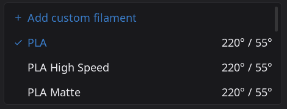

A hands-on guide for contributing layout fixes and alternate screen layouts to HelixScreen. Whether you're fixing clipping at 480x320 or building a portrait layout from scratch, this document covers everything you need. XML changes don't require a rebuild -- just relaunch the app.

For C++ internals, threading, and observer patterns, see the [Deep Dive References](#10-deep-dive-references) at the bottom.

---

## 1. Quick Start

Build once, then iterate on XML without rebuilding:

```bash
# Build the binary
make -j

# Run at any screen size (mock printer, debug logging)
./build/bin/helix-screen --test -vv -s 800x480
```

The `-s WIDTHxHEIGHT` flag sets the window size. The `--test` flag runs against a mock printer so you don't need real hardware. `-vv` gives you debug-level logs (helpful when things don't look right).

### Common sizes to test

| Size | Category | Notes |
|------|----------|-------|
| `480x272` | Micro | Smallest supported. Has its own `ui_xml/micro/` overrides. |
| `480x320` | Tiny | Where most bugs live. |
| `800x480` | Standard / Medium | The "default" target. Most common screen. |
| `1024x600` | Large | Waveshare 7" and similar. |
| `1280x720` | XLarge | Larger desktop-class displays. |
| `1920x480` | Ultrawide | Bar-style displays. Very wide, very short. |
| `480x800` | Portrait | Rotated standard display. |
| `320x1480` | Tall portrait | Waveshare 11.9". Narrow axis 320 picks a small tier while 1480px of height goes unspent. |

### Screenshots

Take a screenshot of a specific panel at a specific size:

```bash
# Saves to /tmp/ui-screenshot-<name>.png
./scripts/screenshot.sh helix-screen tiny-home home --test -s 480x320
```

This requires ImageMagick. You can also press **S** while the app is running for a quick screenshot.

### Force a layout

```bash
./build/bin/helix-screen --test -vv --layout ultrawide -s 1920x480
```

### Navigation panels

`home`, `print-select`, `controls`, `filament`, `settings`, `advanced`

### Key overlays

`motion`, `print-status`, `console`, `bed-mesh`, `input-shaper`, `macros`, `spoolman`, `ams`

### The golden rule

**XML changes don't need a rebuild.** Edit any `.xml` file in `ui_xml/`, relaunch the app, and see your changes immediately. This makes layout iteration very fast.

---

## 2. Screen Breakpoints

There is **one tier table and two ladders**. Both feed the same seven tiers below; they differ only in which screen dimension they measure. Most tokens resolve from the cramped axis; height tokens resolve from the vertical axis.

### The 7-tier system

| Tier | Index | Suffix | Axis range | Target Devices | Fallback |
|------|-------|--------|-------------|----------------|----------|
| MICRO | 0 | `_micro` | <= 272px | 480x272 | Falls back to `_tiny` |
| TINY | 1 | `_tiny` | 273 -- 390px | 480x320 | Falls back to `_small` |
| SMALL | 2 | `_small` | 391 -- 460px | 480x400, 1920x440 | **Required** (core tier) |
| MEDIUM | 3 | `_medium` | 461 -- 550px | 800x480 | **Required** (core tier) |
| LARGE | 4 | `_large` | 551 -- 700px | 1024x600 | **Required** (core tier) |
| XLARGE | 5 | `_xlarge` | 701 -- 1000px | 1280x720, 1024x768 | Falls back to `_large` |
| XXLARGE | 6 | `_xxlarge` | > 1000px | 1440p, 4K | Falls back to `_xlarge` |

Every responsive value needs three core variants: `_small`, `_medium`, and `_large`. The `_tiny`, `_micro`, `_xlarge`, and `_xxlarge` tiers are optional -- define them only when values actually need to differ from their fallback tier.

The **index** column matters for XML reactive bindings. The `ui_breakpoint` subject holds the current breakpoint as an integer, and you can use `bind_flag_if_*` or `bind_style_if_*` with these values. For example, `ref_value="0"` means Micro, `ref_value="2"` means Small.

### The two ladders

| Ladder | Measures | Selects for | Function |
|--------|----------|-------------|----------|
| **Cramped axis** (default) | `min(width, height)` | Fonts, spacing, widths, column counts, everything axis-neutral | `responsive_dimension()` |
| **Vertical axis** | `height` | Height tokens — how much room there is to stack things | `responsive_vertical_dimension()` |

The cramped axis is the design constraint for anything that has to *fit across*: on a landscape panel it is usually the height, which is why this was long described as height-based; on a portrait panel it is the width. The vertical axis is the constraint for anything that *stacks*: a row height on a 1480px-tall panel has no reason to be sized as if the screen were 320px.

On landscape and square displays `min(w, h) == h`, so the two ladders pick the same tier and nothing differs. **Only portrait geometry sees a difference.**

Worked example — the 320x1480 Waveshare 11.9":

| | Axis value | Tier | `#space_lg` | `#button_height` |
|---|---|---|---|---|
| Cramped | 320 | TINY | **8px** | — |
| Vertical | 1480 | XXLARGE | — | **96px** |

So padding stays tight (the panel really is only 320px wide) while buttons become credible touch targets instead of the 32px the cramped ladder alone would have given them.

**Which subject holds which.** The `ui_breakpoint` LVGL subject holds the **cramped-axis** tier, and only that — every `bind_flag_if_eq` / `bind_style_if_*` `ref_value` in `ui_xml/` is written against it. There is no subject for the vertical tier; it exists only in C++, inside token resolution. If you need a *structural* portrait decision in XML, use `ui_breakpoint` plus the layout variant directories, not a second tier value.

Background: prestonbrown/helixscreen#1209.

### How it works

In `globals.xml`, you define the suffixed variants of each token:

```xml
<px name="space_lg_small" value="12"/>
<px name="space_lg_medium" value="16"/>
<px name="space_lg_large" value="20"/>
```

At startup, `theme_manager` measures the axis that token follows, picks the matching suffix, and registers the **base name** (`space_lg`) pointing to the correct value. So when your XML says `style_pad_all="#space_lg"`, it resolves to 12, 16, or 20 depending on the screen.

One function does the choosing for every token: `theme_manager_resolve_px_tokens()` (`src/ui/theme_manager.cpp`). Both the startup registration and the resize path apply its output verbatim, so a token cannot get one tier at boot and another after a rotation.

### CRITICAL: Never define the base name in globals.xml

This is the most common mistake. Do NOT do this:

```xml
<!-- WRONG -- this will silently break responsive overrides -->
<px name="space_lg" value="16"/>
<px name="space_lg_small" value="12"/>
<px name="space_lg_medium" value="16"/>
<px name="space_lg_large" value="20"/>
```

LVGL ignores duplicate variable registrations. If the base name `space_lg` is already registered (from the first line), the responsive override from `theme_manager` is silently discarded. Only define the suffixed variants.

### CRITICAL: Responsive tokens only work at the top level of `ui_xml/`

Token discovery does not recurse. `theme_manager_find_xml_files()` skips subdirectories, so only `ui_xml/*.xml` is ever scanned for suffixed tokens. A `<px name="nav_width_small">` declared in `ui_xml/components/`, `ui_xml/portrait/`, `ui_xml/micro/` or any other subdirectory is never registered, and every `#nav_width` that reads it silently resolves to nothing.

That is deliberate. Discovery is alphabetical last-wins, so if variant directories were scanned a portrait-only token would shadow its base token *globally* — including while the standard layout is active — rather than only when that variant is in use.

So declare responsive tokens in `ui_xml/globals.xml` (or another top-level token file such as `ams_tokens.xml`) and reference them with `#token` from the variant file. Non-responsive component-local `<consts>` are fine inside `ui_xml/components/`; they resolve through the component's own scope and never reach discovery.

`scripts/check_responsive_token_scope.py` fails the build if a suffixed token is declared below the top level. Background: prestonbrown/helixscreen#1211.

### Which font tiers actually exist

Not every font tier is present on every target, and not every present tier is registered at any given moment. Three separate layers decide whether `#font_heading` resolves to anything:

**1. Build time.** `FONT_TIERS` (set per platform in `mk/cross.mk`, defaulting to `all` in `mk/fonts.mk`) decides which faces are linked into the binary at all. CC1 gets `micro tiny`; AD5M and K1 get `medium large`; pi32 gets `small medium`; desktop gets `all`. From that, `HELIX_MAX_FONT_TIER` is derived, and `theme_manager` uses it to tell an expected-missing font (pruned by tier) from an unexpected-missing one (a build bug). A `<string name="foo_xxlarge">` naming a face outside the target's tiers is dead on that target -- this is why the hero icon tokens are capped at `mdi_icons_64`.

**2. Startup.** `AssetManager::register_fonts()` registers the faces for the current breakpoint and everything below it, deliberately skipping larger tiers to avoid ~500-800KB of `.rodata`.

**3. Runtime.** `AssetManager::register_fonts_for_tier()` is the re-entrant form. A breakpoint that *rises* registers the additional tiers; a same-or-lower tier is a no-op. Fonts are **never unregistered** -- live widgets hold pointers into that static `.rodata`, so the set only ever grows, bounded by `HELIX_MAX_FONT_TIER`. On a resize, `theme_manager_refresh_layout_constants()` runs the tier registration first, then re-points the font tokens, then re-runs the switch size presets. That order is load-bearing: re-pointing tokens at tiers whose faces were never registered would silently bounce them back down.

**The limitation, stated plainly:** updating a token does not restyle widgets that already exist. `style_text_font` is resolved to a concrete `lv_font_t*` at parse time and baked into the widget's style, and the same is true of every `px` token -- this is not new with the font work. So a runtime resize is picked up by anything built *afterwards* (overlays, modals, print-select cards, later-created switches) but **not** by the six root panels, which are built eagerly at startup and never rebuilt. Making those follow a resize needs `NavigationManager::rebuild_active_views()`, which is what hot reload uses. This only matters on desktop SDL and Android; on-device rotation is fixed at startup.

---

## 3. Design Tokens

Design tokens are the shared vocabulary for spacing, sizing, and typography. Use them everywhere instead of hardcoded values. They automatically adapt to the current breakpoint.

### Spacing Tokens

| Token | Small | Medium | Large | Use Case |
|-------|-------|--------|-------|----------|
| `#space_xxs` | 2px | 3px | 4px | Keypad rows, compact icon gaps |
| `#space_xs` | 4px | 5px | 6px | Button icon+text gaps, dense info |
| `#space_sm` | 6px | 7px | 8px | Tight layouts, minor separations |
| `#space_md` | 8px | 10px | 12px | Standard flex gaps, compact padding |
| `#space_lg` | 12px | 16px | 20px | Container padding, major sections |
| `#space_xl` | 16px | 20px | 24px | Emphasis cards, major separations |
| `#space_2xl` | 24px | 32px | 40px | Toast/overlay offsets |

In XML:
```xml
<lv_obj style_pad_all="#space_lg" style_pad_gap="#space_md"/>
```

In C++:
```cpp
int padding = theme_manager_get_spacing("space_lg");
```

### Font Tokens

| Token | Component | Small | Medium | Large |
|-------|-----------|-------|--------|-------|
| `#font_heading` | `<text_heading>` | noto_sans_20 | noto_sans_26 | noto_sans_28 |
| `#font_body` | `<text_body>` | noto_sans_14 | noto_sans_18 | noto_sans_20 |
| `#font_small` | `<text_small>` | noto_sans_light_12 | noto_sans_light_16 | noto_sans_light_18 |
| `#font_xs` | `<text_xs>` | noto_sans_light_10 | noto_sans_light_12 | noto_sans_light_14 |

You almost never need to reference font tokens directly. Use the semantic `<text_*>` components instead (see [Pre-Themed Widgets](#5-pre-themed-widgets)).

### Component Tokens

| Token | Axis | Small | Medium | Large | Purpose |
|-------|------|-------|--------|-------|---------|
| `#button_height` | vertical | 48px | 52px | 72px | Standard button height |
| `#button_height_sm` | vertical | 40px | 40px | 40px | Small buttons (back, icon-only) |
| `#button_height_lg` | vertical | 64px | 70px | 96px | Large buttons |
| `#header_height` | vertical | 48px | 56px | 60px | Panel header height |
| `#input_height` | vertical | 48px | 52px | 56px | Text input / dropdown height |
| `#temp_card_height` | vertical | 64px | 72px | 80px | Temperature card in print status |
| `#dialog_content_max` | vertical | 260px | 320px | 440px | Max height of a modal's scrollable body |
| `#dialog_content_pinned_max` | vertical | 164px | 207px | 272px | Same, plus one pinned block below the scroll area (measured 85% cap − chrome, #1277) |
| `#dialog_content_tall_chrome_max` | vertical | 176px | 229px | 282px | Same, plus a second button row with its divider (measured 85% cap − chrome, #1277) |
| `#badge_size` | neutral | 16px | 18px | 20px | Status badge diameter |
| `#nav_width` | horizontal | 76px | 104px | 132px | Nav bar width — see note below |
| `#icon_size` | neutral | md | lg | xl | Responsive icon size string |
| `#spinner_lg` | neutral | 48px | 56px | 64px | Large spinner |
| `#spinner_md` | neutral | 24px | 28px | 32px | Standard spinner |
| `#spinner_sm` | neutral | 16px | 18px | 20px | Small spinner |
| `#spinner_xs` | neutral | 12px | 14px | 16px | Compact spinner |

The **Axis** column says which ladder the token resolves from (see [The two ladders](#the-two-ladders)). `vertical` follows the screen height; `horizontal` and `neutral` both follow the cramped axis today — the distinction is documentation of intent, not yet two different code paths. All the `#space_*` tokens are neutral.

Two tokens in that list do not follow the ordinary rules:

- **`#nav_width`** is declared in `ui_xml/navigation_bar.xml`, not `globals.xml`, and resolves through its own ladder (`helix::nav_width_suffix()`) rather than the general one. The nav bar is a full-height vertical strip, so its width tracks the *horizontal* axis and has an extra ultrawide case.
- **`#border_radius`** is not a `globals.xml` triplet at all and is deliberately absent from the table. The theme picks a size name (None / Minimal / Subtle / Soft / Rounded / Bold / Pill / Full) and `BorderRadiusSizes` (`include/border_radius_sizes.h`) resolves it per breakpoint in C++. Do not add `border_radius_*` variants to `globals.xml`. The fixed `#border_radius_small` / `#border_radius_sm` (both 4px) are separate — they exist for swatches and badges that always want 4px regardless of theme.

### Adding New Tokens

**First, classify the axis.** Do this before writing the triplet — it decides which ladder the token resolves from:

| Axis | What it covers | Examples |
|------|----------------|----------|
| **vertical** | Heights, top/bottom padding, vertical maxima — anything sized by how much room there is to stack | `button_height`, `header_height`, `dialog_content_max` |
| **horizontal** | Widths, left/right extents, column counts | `nav_width`, `field_w_num` |
| **axis-neutral** | Applies to both axes, or to neither (square things, opacity-like scalars) | `space_*`, `icon_size`, `badge_size`, the spinner sizes |

**If in doubt, neutral.** Neutral is the default and needs no code change at all.

How the choice is expressed in code:

- **vertical** — add the exact base name to `VERTICAL_AXIS_TOKENS` in `src/ui/theme_manager.cpp`. That array is the single classification list; `theme_manager_token_uses_vertical_axis()` reads it, and `theme_manager_resolve_px_tokens()` is the only thing that calls it, so both registration sites stay in step automatically. Exact names, not a `*_height` convention — `dialog_content_max` is a vertical maximum that does not end in `_height`.
- **horizontal** and **axis-neutral** — nothing to do. Both resolve from the cramped axis, which is correct for widths (in portrait the cramped axis *is* the width) and is the deliberate compromise for neutrals.

`space_*` stays neutral on purpose. It feeds `pad_top`/`pad_bottom` and `pad_left`/`pad_right` alike, so splitting it means classifying every `#space_*` reference site across `ui_xml/` — that reference count, not the declarations, is the cost driver.

Then follow the triplet pattern in `globals.xml`:

```xml
<!-- In globals.xml — define suffixed variants only -->
<px name="my_widget_height_small" value="48"/>
<px name="my_widget_height_medium" value="56"/>
<px name="my_widget_height_large" value="72"/>
```

Then use the base name in your layout:

```xml
<!-- In your panel XML -->
<lv_obj height="#my_widget_height"/>
```

From C++:
```cpp
int h = theme_manager_get_spacing("my_widget_height");
```

### The limit: `height="content"` rows ignore height tokens

A row declared `height="content"` is sized by its font and its padding. **No height token reaches it** — not `#button_height`, not any token you migrate to the vertical ladder.

That covers the whole `setting_*_row` family (`setting_action_row.xml`, `setting_toggle_row.xml`, and friends), and therefore most of Settings. Migrating a token and then finding that Settings did not move is the expected result, not a broken migration. Moving those rows means moving the font/padding tier, which is a different mechanism — see [Which font tiers actually exist](#which-font-tiers-actually-exist) and prestonbrown/helixscreen#1210.

---

## 4. Color System

HelixScreen uses 16 semantic color tokens. These work across light and dark modes automatically -- you just reference the token name and the system resolves the right value.

### Color Tokens

| Token | Purpose |
|-------|---------|
| `#screen_bg` | Main application background |
| `#overlay_bg` | Sidebar/panel backgrounds |
| `#card_bg` | Card surfaces |
| `#elevated_bg` | Elevated surfaces (dialogs, inputs) |
| `#border` | Borders and dividers |
| `#text` | Primary text |
| `#text_muted` | Secondary/dimmed text |
| `#text_subtle` | Hint/tertiary text |
| `#primary` | Primary accent color |
| `#secondary` | Secondary accent |
| `#tertiary` | Tertiary accent |
| `#info` | Info state (purple in Nord) |
| `#success` | Success state (green) |
| `#warning` | Warning state (amber) |
| `#danger` | Error/danger (red) |
| `#focus` | Focus ring outline |

### Using colors in XML

Just reference the token. The system handles light/dark mode for you:

```xml
<lv_obj style_bg_color="#card_bg"/>
<text_body style_text_color="#warning" text="High temperature"/>
```

### Theme JSON structure

Themes are defined in `config/themes/`. Here's a snippet from `nord.json`:

```json
{
  "name": "Nord",
  "dark": {
    "screen_bg": "#2e3440",
    "card_bg": "#434c5e",
    "text": "#eceff4",
    "text_muted": "#d8dee9",
    "primary": "#88c0d0",
    "danger": "#bf616a",
    "success": "#a3be8c",
    "warning": "#ebcb8b"
  },
  "light": {
    "screen_bg": "#eceff4",
    "card_bg": "#ffffff",
    "text": "#2e3440",
    "text_muted": "#3b4252",
    "primary": "#5e81ac",
    "danger": "#b23a48",
    "success": "#3fa47d",
    "warning": "#b08900"
  },
  "border_radius": 12,
  "border_width": 1,
  "border_opacity": 40
}
```

### C++ color access

```cpp
// Token lookup -- correct
lv_color_t bg = theme_manager_get_color("card_bg");

// Hex string parsing -- correct
lv_color_t red = theme_manager_parse_hex_color("#FF0000");

// WRONG -- parse_hex_color does NOT look up tokens
// lv_color_t bad = theme_manager_parse_hex_color("#card_bg");
```

### Adding custom colors in globals.xml

Define `_light` and `_dark` variants. The system auto-discovers them by suffix:

```xml
<color name="my_custom_light" value="#E0E0E0"/>
<color name="my_custom_dark" value="#3B4252"/>

<!-- Usage in any XML layout -->
<lv_obj style_bg_color="#my_custom"/>
```

---

## 5. Pre-Themed Widgets

HelixScreen provides semantic widgets that already have the right colors, fonts, spacing, and responsive behavior baked in. **Use these instead of raw LVGL widgets** whenever possible -- it saves you from manually specifying styles and keeps things consistent.

### Typography

| Widget | Font Token | Text Style | Use Case |
|--------|-----------|------------|----------|
| `<text_heading>` | font_heading | Muted | Section titles |
| `<text_body>` | font_body | Primary | Body paragraphs |
| `<text_muted>` | font_body | Muted | Secondary metadata |
| `<text_small>` | font_small | Muted | Helper text |
| `<text_xs>` | font_xs | Muted | Compact info, badges |
| `<text_button>` | font_body | Primary | Button labels (centered) |

All of these support `bind_text="subject_name"` for dynamic content and `text="static text"` for fixed content. You can override the color with `style_text_color="#token"`.

```xml
<text_heading text="Temperature"/>
<text_body bind_text="nozzle_temp_display"/>
<text_muted text="Last updated 5 min ago"/>
<text_small text="Firmware v1.2.3"/>
```

They also accept the text as inline element content instead of a `text=` attribute -- `<text_muted>Last updated 5 min ago</text_muted>` is equivalent to the `text_muted` line above, and is translatable by default. See "Inline Text Content" in `LVGL9_XML_GUIDE.md` for the full rules.

### ui_card

A standard card surface with `card_bg` background, themed border, and `border_radius` already applied.

```xml
<ui_card width="100%" height="content">
  <text_heading text="Temperature"/>
  <text_body bind_text="nozzle_temp"/>
</ui_card>
```

Don't re-specify `style_radius`, `style_bg_color`, or `style_border_*` -- they're already themed.

### ui_button

Themed button with automatic contrast text color and responsive height.

Variants: `primary`, `secondary`, `danger`, `success`, `warning`, `tertiary`, `ghost`

```xml
<ui_button variant="primary" text="Save"/>
<ui_button variant="danger" text="Delete" icon="trash_can"/>
<ui_button variant="ghost" text="Cancel"/>
<ui_button icon="settings"/>  <!-- Icon only, no text -->
```

### icon

Material Design Icons with size and color variants.

Size variants: `xs` (16px), `sm` (24px), `md` (32px), `lg` (48px), `xl` (64px).

Color variants: `text`, `muted`, `primary`, `secondary`, `tertiary`, `success`, `warning`, `danger`, `info`, `disabled`.

```xml
<icon src="home" size="lg" variant="primary"/>
<icon src="settings" size="#icon_size" variant="muted"/>  <!-- Responsive sizing -->
```

### spinner

Responsive loading spinner. Sizes adapt per breakpoint.

```xml
<spinner size="lg"/>  <!-- 48/56/64px depending on breakpoint -->
<spinner size="md"/>  <!-- 24/28/32px -->
<spinner size="sm"/>  <!-- 16/18/20px -->
```

### dividers

Simple horizontal and vertical dividers with themed colors.

```xml
<divider_horizontal/>
<divider_vertical/>
```

### ui_severity_card

A card with a severity-colored left border. Great for status messages.

Severities: `info`, `success`, `warning`, `error`

```xml
<ui_severity_card severity="warning">
  <text_body text="Nozzle temperature is high"/>
</ui_severity_card>
```

### ui_switch

Responsive toggle switch. Sizes scale with the current breakpoint.

```xml
<ui_switch size="medium" checked="true"/>
```

Sizes: `tiny`, `small`, `medium`, `large`

### ui_markdown

Theme-aware markdown viewer for rich text content.

```xml
<ui_markdown bind_text="release_notes" width="100%"/>
```

### Widget Defaults -- DON'T re-specify

These widgets come pre-themed. Adding redundant style attributes clutters the XML and can conflict with theming:

| Widget | Already Themed (skip these) |
|--------|---------------------------|
| `ui_card` | `style_radius`, `style_bg_color`, `style_border_*` |
| `ui_button` | `style_radius`, `style_bg_color`, height, text color |
| `text_*` | `style_text_font`, `style_text_color` |
| `icon` | Font selection |
| `divider_*` | `style_bg_color`, width/height |
| `ui_markdown` | All styling |

### Shared styles (`ui_xml/styles.xml`)

A `<styles>` block is file-local. When two files want the same style, it lives in
`ui_xml/styles.xml` instead -- the shared style library. Any XML file borrows from it
by dotted name, where the prefix is that file's basename:

```xml
<!-- The definition, ui_xml/styles.xml -->
<style name="press_wash" bg_color="#primary" bg_opa="30%" radius="#border_radius"/>

<!-- Any other file, borrowing it -->
<style name="styles.press_wash" selector="pressed"/>
```

`press_wash` is the pressed-state feedback for clickable rows (a primary-color wash
while the finger is down); it backs the filament catalog rows
(`components/filament_catalog_row.xml`, `components/filament_catalog_add_row.xml`) and
the external spool row in `filament_panel.xml`. `metadata_strip` is the other one --
the translucent strip at the bottom of a g-code preview card, shared by
`components/print_status_preview_card.xml` and `print_file_detail.xml`, which keep
their own (genuinely different) placement inline.



Check `styles.xml` before writing a local `<style>` that is really a look another
screen already has -- and when a second file copies one of your local styles, promote
it into the library rather than forking it.

**A borrowed style is a raw pointer into another file's scope.** `lv_obj_add_style()`
stores `&style`, and that storage belongs to `styles.xml`'s component scope, not to
yours. Nothing instantiates `styles.xml`, so its instance count is permanently zero,
and the engine used to free the whole scope the moment the file was re-registered --
which every hot-reload save does -- leaving every borrower holding a dangling style.
It detonated far away, in the next `lv_obj_report_style_change(NULL)` at theme init.
Fixed in helix-xml `3177f3f7`: a lookup that crosses a scope boundary marks the
lender, and a marked scope is held instead of freed. The mark is one-way, so a file
that lends styles is held until `lv_xml_component_deinit()` -- one retained scope per
hot-reload save of `styles.xml`, which is why the library is worth keeping small.

**Registration order matters.** `styles.xml` is registered from
`register_xml_components()` (`src/xml_registration.cpp`), which runs *after*
`theme_manager_init()` has injected the theme constants. Style `#token` values resolve
at registration time, so a theme-token style placed in `globals.xml` (parsed before
theme init) registers empty -- theme-aware styles must live in `styles.xml`.

---

## 6. XML Layout Essentials

This section covers the patterns you'll use most in layout work. For a complete reference, see [LVGL9_XML_GUIDE.md](/dev/reference/xml-guide/) and [LVGL9_XML_ATTRIBUTES_REFERENCE.md](https://github.com/prestonbrown/helixscreen/blob/main/docs/devel/LVGL9_XML_ATTRIBUTES_REFERENCE.md).

### Flex Layout

Almost everything uses flexbox. The three flows you'll see:

```xml
<lv_obj flex_flow="row"/>        <!-- Horizontal: children side by side -->
<lv_obj flex_flow="column"/>     <!-- Vertical: children stacked -->
<lv_obj flex_flow="row_wrap"/>   <!-- Horizontal, wraps to new rows when full -->
```

### flex_grow

Children with `flex_grow` expand to fill remaining space in their parent. The parent **must** have an explicit size (not `content`).

```xml
<lv_obj flex_flow="row" width="100%" height="100%">
  <lv_obj flex_grow="3" height="100%"><!-- Left column, 30% --></lv_obj>
  <lv_obj flex_grow="7" height="100%"><!-- Right column, 70% --></lv_obj>
</lv_obj>
```

### Centering (THE GOTCHA)

Unlike CSS flexbox, LVGL needs **three** properties to fully center items -- not two. This trips up almost everyone:

```xml
<!-- Fully centered column -->
<lv_obj flex_flow="column"
        style_flex_main_place="center"
        style_flex_cross_place="center"
        style_flex_track_place="center">
  <text_body text="I am actually centered"/>
</lv_obj>
```

Without `style_flex_track_place`, children with explicit widths stay left-aligned even though the other two properties suggest centering. If something isn't centering the way you expect, add `style_flex_track_place="center"` first.

### Gaps and Padding

```xml
<!-- Gap between children -->
<lv_obj flex_flow="row" style_pad_gap="#space_md">
  <ui_button text="A"/>
  <ui_button text="B"/>
</lv_obj>

<!-- Internal padding around all edges -->
<lv_obj style_pad_all="#space_lg">
  <text_body text="Content with breathing room"/>
</lv_obj>
```

### Conditional Visibility

Show or hide elements based on subject values:

```xml
<!-- Hide this widget when status == 0 -->
<lv_obj>
  <bind_flag_if_eq subject="status" flag="hidden" ref_value="0"/>
</lv_obj>

<!-- Show only when connected (hide when not equal to 1) -->
<lv_obj>
  <bind_flag_if_not_eq subject="connected" flag="hidden" ref_value="1"/>
</lv_obj>
```

Available operators: `bind_flag_if_eq`, `bind_flag_if_not_eq`, `bind_flag_if_gt`, `bind_flag_if_ge`, `bind_flag_if_lt`, `bind_flag_if_le`.

### Event Callbacks

```xml
<lv_button name="save_btn">
  <event_cb trigger="clicked" callback="on_save_clicked"/>
  <text_body text="Save"/>
</lv_button>
```

Callbacks are registered in C++. For layout-only work, just keep existing `<event_cb>` elements in place -- don't remove them or rename them.

### Visual Debugging

When you can't tell why something is overflowing or misaligned, add a temporary background color to see the actual widget bounds:

```xml
<lv_obj style_bg_color="#ff0000" style_bg_opa="100%">
  <!-- Now you can see exactly where this container starts and ends -->
</lv_obj>
```

Remove the debug styles before submitting your PR.

### lv_obj Defaults in HelixScreen

Our theme makes `lv_obj` a pure layout container by default: transparent background, no border, no padding, sized to content. You don't need to clear any of these -- just use `lv_obj` as a flexbox wrapper and it stays invisible.

**Scrolling is the exception.** Our theme does not touch `LV_OBJ_FLAG_SCROLLABLE`, and LVGL's own default for it is ON. A wrapper you think of as inert can still absorb drags and pick up a page-scroll gutter. Add `scrollable="false"` on any container that is not a real scroll region.

### Common Gotchas

| Wrong | Right | Why |
|-------|-------|-----|
| `width="LV_SIZE_CONTENT"` | `width="content"` | XML uses string names, not C constants |
| `flex_align="center center"` | `style_flex_main_place="center"` | `flex_align` is silently ignored |
| `style_img_recolor` | `style_image_recolor` | Full words, not abbreviations |
| `<lv_dropdown options="A\nB\nC"/>` | `options="A&#10;B&#10;C"` | Use XML entity for newlines |
| Hardcoded `style_pad_all="12"` | `style_pad_all="#space_lg"` | Always use design tokens |
| Hardcoded `style_text_font="..."` | `<text_body>` | Use semantic typography components |
| `style_bg_color="#2e3440"` | `style_bg_color="#screen_bg"` | Use color tokens, not hex values |
| `width="#overlay_width_destination"` | *(no width attribute)* | Overlay width is resolved at push time |
| `<lv_obj>` layout wrapper with no `scrollable` attribute | `<lv_obj scrollable="false">` | LVGL's scrollable default is ON and our theme does not override it, so the wrapper absorbs drags and can get a page-scroll gutter |
| `height="100%"` inside a `height="content"` parent | `height="content"` | The two depend on each other and both collapse to zero |
| `flex_grow` on children of a `*_wrap` container | percentage widths + `style_flex_main_place="space_between"` | Grow items contribute zero base size, so nothing ever wraps |
| `<style flex_flow="row"/>` | `<style layout="flex" flex_flow="row"/>` | `flex_flow` in a style is inert without `layout="flex"` |

The last three are explained in full, with the `ctl geom` signatures that identify
them, in `LVGL9_XML_GUIDE.md` under "Flex Layout".

### Overlay width — don't set it

An overlay is one of two things, and the difference is visible against the nav
dock:

| | width | looks like |
|---|---|---|
| **Destination** | `screen - nav` | flush against the dock; a place you park |
| **Transient layer** | `screen - nav - space_lg` | a gap showing the dimmed backdrop; you'll go back |

Settings is a destination, so everything you reach *inside* Settings is flush —
Settings › Network is a sub-screen of Settings, not a layer over it. AMS and
Print Status are destinations too: people live on those screens. Console, Bed
Mesh, Motion and the calibration panels are transient layers — tools you open
and return from.

**Which one you get is not yours to choose in XML.** It depends on how the user
reached the overlay, and the same overlay can be reached both ways: Fan Control
opened from Controls is a transient layer, and opened from Settings › Fans it's
a drill-down. `NavigationManager::push_overlay()` resolves it against the live
navigation stack on every push, so just leave `width` off:

```xml
<view name="my_overlay" extends="overlay_panel" title="My Overlay" title_tag="My Overlay">
```

Two things you *can* declare, both in C++:

- **A long-dwell screen** that should be a destination from every entry point:
  override `IPanelLifecycle::is_destination()` to return `true`. See
  `include/ui_panel_ams.h`.
- **A deliberately odd width** that is neither class — `widget_catalog_overlay`
  is `width="70%"` so the home grid stays visible behind it. Set the width in
  XML and call `NavigationManager::set_overlay_width_unmanaged()` once after
  creating the widget, or push will overwrite it.

`scripts/check_overlay_width.py` fails the build if XML names a width class.
Background: `include/overlay_class.h` and prestonbrown/helixscreen#1178.

---

## 7. Layout Overrides

HelixScreen supports layout-specific XML overrides so you can rearrange panels for different screen shapes without touching the standard layouts.

### Layout types

| Layout | Detection | Example Screens |
|--------|-----------|-----------------|
| `standard` | Normal landscape (4:3 to 16:9) | 800x480, 1024x600, 1280x720 |
| `ultrawide` | Aspect ratio > 2.5:1 | 1920x480, 1920x400 |
| `portrait` | Aspect ratio < 0.8:1 | 480x800, 600x1024 |
| `micro` | Min dimension <= 272, landscape | 480x272 |
| `micro_portrait` | Min dimension <= 272, portrait | 272x480 |
| `tiny` | Max dimension <= 480, landscape | 480x320, 320x240 |
| `tiny_portrait` | Max dimension <= 480, portrait | 320x480, 240x320 |

Detection lives in `LayoutManager::detect()` (`src/layout_manager.cpp`). Portrait
sub-classes (`micro_portrait`, `tiny_portrait`) fall back through the shared
`portrait/` layer before the standard layout -- see `variant_chain()`.

Force a layout with `--layout ultrawide` on the command line, or set `display.layout` in `settings.json`.

### Directory structure

```
ui_xml/
  globals.xml              <-- Shared by ALL layouts (never override this)
  home_panel.xml           <-- Standard home panel
  controls_panel.xml       <-- Standard controls panel
  ...                      <-- ~230 top-level XML files (components/ holds ~100 more)
  micro/                   <-- Micro (480x272) overrides (4 files)
    controls_panel.xml
    header_bar.xml
    ...
  portrait/                <-- Portrait overrides (4 files)
  micro_portrait/          <-- Micro-portrait overrides (dir present, empty)
  ultrawide/               <-- Does NOT exist yet (no overrides created)
  tiny/, tiny_portrait/    <-- Do NOT exist yet
```

### How overrides work

If `ui_xml/<layout>/<panel>.xml` exists, it's used instead of `ui_xml/<panel>.xml`. Otherwise the standard version is loaded. You only need to override the panels that actually need different layouts -- everything else falls through automatically.

### Creating an override

1. Copy the standard layout as a starting point:
   ```bash
   cp ui_xml/controls_panel.xml ui_xml/ultrawide/controls_panel.xml
   ```

2. Edit the copy for the target screen shape.

3. Test it:
   ```bash
   ./build/bin/helix-screen --test -vv --layout ultrawide -s 1920x480
   ```

4. No rebuild needed. XML loads at runtime.

### The rules you must follow

When creating a layout override, you're rearranging the same content for a different screen shape. The C++ code still expects certain widgets, bindings, and callbacks to exist.

1. **Keep all named widgets** that C++ looks up via `lv_obj_find_by_name()`. Search the panel's `.cpp` file to find required names:
   ```bash
   grep lv_obj_find_by_name src/ui/panels/controls_panel.cpp
   ```

2. **Keep all subject bindings** (`bind_text`, `bind_value`, `bind_flag_if_*`, etc.). These connect the UI to live data.

3. **Keep all event callbacks** (`<event_cb>` elements). These wire up button presses and interactions.

4. **Use design tokens** for all colors, spacing, and fonts. No hardcoded values.

5. **Don't change existing values in globals.xml.** They're shared across all layouts. *Adding* a new suffixed token there is correct, and is the only place a variant-specific token can live -- token discovery never recurses into `ui_xml/` subdirectories, so a `<px name="foo_small">` declared next to your override is silently never registered (see section 2).

You're free to rearrange the visual hierarchy, change flex directions, adjust sizes, hide optional decorative elements, or add new layout containers. Just preserve the functional widgets.

### Design guidelines by layout type

**Ultrawide (1920x480):** Tons of horizontal space, very little vertical. Favor `flex_flow="row"` to spread content across columns. Aim for everything visible at once with no scrolling. Think "dashboard with columns" -- put related info side by side instead of stacking it.

**Portrait (480x800):** Lots of vertical space, narrow width. Content stacks naturally with `flex_flow="column"`. The navbar probably needs to move to the bottom of the screen. Consider overriding `navigation_bar.xml` and `app_layout.xml` to change the overall chrome.

**Tiny (480x320):** Very limited in both directions. Reduce information density, use bigger touch targets (48px minimum), show fewer labels. Hide optional elements with conditional visibility or just remove decorative content.

### Priority panels to override

Start with the panels that matter most:

| Priority | Panel | Why |
|----------|-------|-----|
| High | `home_panel.xml` | First thing users see |
| High | `app_layout.xml` | Overall chrome (navbar + content area) |
| High | `navigation_bar.xml` | Nav position/orientation differs per layout |
| Medium | `controls_panel.xml` | Multiple cards that benefit from rearranging |
| Medium | `print_status_panel.xml` | Important during active prints |
| Medium | `settings_panel.xml` | Compact 6-row category menu; sub-panels may benefit from multi-column |
| Low | Overlays | Usually modal dialogs that adapt reasonably well |

### Responsive Setting Rows (no micro/ overrides)

The setting row components (`setting_toggle_row`, `setting_slider_row`, `setting_dropdown_row`, `setting_action_row`, `setting_section_header`) handle the Micro breakpoint responsively within a single XML file. There are no `micro/` directory overrides for settings -- do not create them.

The pattern used by all setting rows:

1. **Two `bind_style_if_*` for padding** -- compact padding on Micro (breakpoint 0), standard padding on Tiny and above (breakpoint >= 1):

```xml
<styles>
  <style name="pad_standard" pad_left="#space_lg" pad_right="#space_lg"
         pad_top="#space_lg" pad_bottom="#space_lg" pad_gap="#space_sm"/>
  <style name="pad_micro" pad_left="#space_md" pad_right="#space_md"
         pad_top="#space_lg" pad_bottom="#space_lg" pad_gap="#space_sm"/>
</styles>

<view ...>
  <bind_style_if_eq name="pad_micro" subject="ui_breakpoint" ref_value="0"/>
  <bind_style_if_ge name="pad_standard" subject="ui_breakpoint" ref_value="1"/>
```

2. **Description text hidden on small screens** -- the description label is hidden on Micro and Tiny (breakpoint < 2) via `bind_flag_if_lt`:

```xml
<text_small name="description" text="$description">
  <bind_flag_if_lt subject="ui_breakpoint" flag="hidden" ref_value="2"/>
</text_small>
```

3. **Info icon for small screens** -- an info icon appears on Micro/Tiny when a description prop is non-empty. Uses the parse-time `hidden_if_empty` attribute so it never renders when there is no description, and `bind_flag_if_gt` to hide it on Medium and above:

```xml
<lv_obj name="info_btn" clickable="true" hidden_if_empty="$description">
  <bind_flag_if_gt subject="ui_breakpoint" flag="hidden" ref_value="1"/>
  <icon src="info_outline" size="sm" variant="muted"/>
  <event_cb trigger="clicked" callback="on_setting_info_clicked"/>
</lv_obj>
```

Tapping the info icon toggles the description label's visibility inline.

This same responsive pattern should be used for any new setting row components. The convention is: **make the component responsive internally rather than creating a `micro/` override file**.

---

## 8. What Needs Work

This is where to start if you want to contribute. Issues are organized by severity and area. All observations below are primarily at 480x320 unless noted otherwise.

### Global Issues (affect multiple panels)

These cut across many screens and are high-value fixes:

- **Numeric keypad overlay** doesn't fit vertically at 480x320 -- bottom rows are cut off. This affects every panel that uses the keypad for numeric input.
- **Many modals** don't respect viewport height -- content clips at top and bottom on small screens.
- **Navbar icons** are clipped at 480x320, outlines overlap, and click targets may overlap each other.
- **Temperature labels** collide with values on the controls and filament panels.
- **Settings dropdown menus** are hardcoded too wide for small screens.

### Broken / Needs Major Rework (at 480x320)

These are the most impactful fixes:

- **Print Select list view** -- The most broken screen. Padding is wrong, row sizing is off, horizontal overflow everywhere.
- **Print Status overlay** -- Action buttons, temperature cards, and metadata are all fighting for space. Nothing fits.
- **Filament panel** -- Multi-filament card is invisible, material buttons crush the operations section.

### Needs Moderate Fixes (at 480x320)

Usable but clearly broken in places:

- **Controls panel** -- Position card labels overlap the header, Z-offset value wraps, cooling section overflows, quick actions are clipped.
- **Print Select card view** -- Metadata area is too tall, squeezing the file thumbnails.
- **PID Calibration** -- Chips are clipped, text doesn't wrap, slider padding is off, values wrap awkwardly.

### Minor / Cosmetic

Things that work but could look better:

- **Home panel** -- Tip text is borderline too large, status icon temperature padding is slightly off.
- **Print File Detail** -- Pre-print options are cramped when toggles are present.
- **Z-Offset Calibration** -- Slightly too tall for the viewport, could use scroll.
- **Spoolman** -- Too much padding, wasted space.
- **Print History list** -- Filter fields are too wide.

### Looking Good Already (at 480x320)

These panels work well and can serve as reference for how to do things right:

- Motion overlay
- Advanced settings
- Settings panel (except dropdown widths)
- Theme view and edit
- Print History dashboard

### Ultrawide Status

- Not started -- `ui_xml/ultrawide/` does not exist yet, so ultrawide screens
  currently fall through to the standard layout.
- Wide open for contributions. Force it with `--layout ultrawide -s 1920x480`.

### Portrait / Micro Status

- `ui_xml/portrait/` exists with four overrides (`app_layout.xml`,
  `navigation_bar.xml`, `print_status_panel.xml`, `print_tune_panel.xml`).
- `ui_xml/micro/` exists with four overrides (`controls_panel.xml`, `header_bar.xml`,
  `theme_editor_overlay.xml`, `theme_preview_overlay.xml`).
- `ui_xml/micro_portrait/` exists as a directory but has no overrides yet.
- `tiny/`, `tiny_portrait/` do not exist yet. Wide open for contributions.

---

## 9. Testing Your Changes

### Screenshot commands for each breakpoint

```bash
# Micro (480x272)
./scripts/screenshot.sh helix-screen micro-home home --test -s 480x272

# Tiny (480x320)
./scripts/screenshot.sh helix-screen tiny-home home --test -s 480x320

# Standard/Medium (800x480)
./scripts/screenshot.sh helix-screen medium-home home --test -s 800x480

# Large (1024x600)
./scripts/screenshot.sh helix-screen large-home home --test -s 1024x600

# XLarge (1280x720)
./scripts/screenshot.sh helix-screen xlarge-home home --test -s 1280x720

# Ultrawide (1920x480)
./scripts/screenshot.sh helix-screen ultrawide-home home --test --layout ultrawide -s 1920x480

# Portrait (480x800)
./scripts/screenshot.sh helix-screen portrait-home home --test --layout portrait -s 480x800

# Tall portrait (320x1480) -- the narrow-axis case
./scripts/screenshot.sh helix-screen tall-portrait-home home --test --layout portrait -s 320x1480
```

Screenshots save to `/tmp/ui-screenshot-<name>.png`.

Set `HELIX_SCREENSHOT_DISPLAY=0` to prevent the app from opening a visible display window (useful for CI or batch screenshots).

Replace `home` with any panel or overlay name: `controls`, `filament`, `settings`, `print-status`, `motion`, etc.

### Widget destruction safety

Two rules, both required — they address different crashes.

**Rule 1 — never destroy a container from inside an event callback on its own child** (issue #80). The child widget is still on the call stack; deleting its parent synchronously causes use-after-free. Defer the rebuild to the next tick.

**Rule 2 — never call synchronous widget deletion inside a deferred callback** (issue #776). `lv_obj_clean()`, `lv_obj_del()`, and `helix::ui::safe_delete()` all run synchronously. Multiple sync deletions in the same `UpdateQueue::process_pending()` batch corrupt LVGL's event linked list → SIGSEGV in `lv_event_mark_deleted`. `ui_queue_update`, `lifetime_.defer`, `tok.defer`, and observer callbacks all share that batch — the deferral alone is not enough.

**Use the safe replacement** — it reparents children to `lv_layer_top()` and schedules them for `lv_obj_delete_async()`, which runs outside our UpdateQueue batch:

```cpp
// ❌ BAD (#80): swatch click handler destroys its own parent synchronously
void handle_color_selected(...) {
    lv_obj_clean(container);
    rebuild(container);
}

// ❌ STILL BAD (#776): deferred, but lv_obj_clean is still a sync batch deletion
void handle_color_selected(...) {
    ui_queue_update([this]() {
        lv_obj_clean(container);      // Corrupts event list under load
        rebuild(container);
    });
}

// ✅ CORRECT: defer the rebuild AND use safe_clean_children
void handle_color_selected(...) {
    lifetime_.defer([this]() {
        helix::ui::safe_clean_children(container);
        rebuild(container);
    });
}
```

Replacements table:

| ❌ Banned in deferred callbacks | ✅ Use instead |
|---------------------------------|----------------|
| `safe_delete(ptr)` | `safe_delete_deferred(ptr)` |
| `lv_obj_delete(obj)` / `lv_obj_del(obj)` | `lv_obj_delete_async(obj)` |
| `lv_obj_clean(container)` | `helix::ui::safe_clean_children(container)` |

See `include/ui_utils.h` and [`THREADING.md`](https://github.com/prestonbrown/helixscreen/blob/main/docs/devel/THREADING.md) §3 for the full rationale.

### Verification checklist

Before submitting, verify these for every change:

- [ ] No text clipping or overflow at the target size
- [ ] Touch targets are large enough (48px minimum recommended)
- [ ] Design tokens used throughout (no hardcoded pixel values, colors, or fonts)
- [ ] All subject bindings preserved from the standard layout
- [ ] All event callbacks preserved
- [ ] All named widgets still present (check with `grep lv_obj_find_by_name` in the C++ source)
- [ ] Standard layout still works at 800x480 (no regression)

### Submitting your work

PRs are welcome. To make review smooth:

- Include **before/after screenshots** at the target resolution.
- Test at the target size **and** at standard (800x480) to verify no regression.
- If you created a layout override, mention which named widgets you found in the C++ source so reviewers can verify coverage.
- Keep changes focused. One panel per PR is easier to review than five.

---

## 10. Deep Dive References

For the full details on any of these topics, see the dedicated docs:

| Document | What It Covers |
|----------|---------------|
| [LVGL9_XML_GUIDE.md](/dev/reference/xml-guide/) | Full XML system guide -- subjects, events, component creation, implementation patterns |
| [LVGL9_XML_ATTRIBUTES_REFERENCE.md](https://github.com/prestonbrown/helixscreen/blob/main/docs/devel/LVGL9_XML_ATTRIBUTES_REFERENCE.md) | Quick-lookup cheatsheet for every XML attribute |
| [DEVELOPER_QUICK_REFERENCE.md](/dev/onboarding/quick-reference/) | C++ patterns -- observer factory, threading, class structures |
| [ARCHITECTURE.md](https://github.com/prestonbrown/helixscreen/blob/main/docs/devel/ARCHITECTURE.md) | System architecture and high-level design decisions |

For most layout and styling work, you shouldn't need these. But if you're adding new components, wiring up new subjects, or debugging why a binding isn't working, that's where the answers live.
