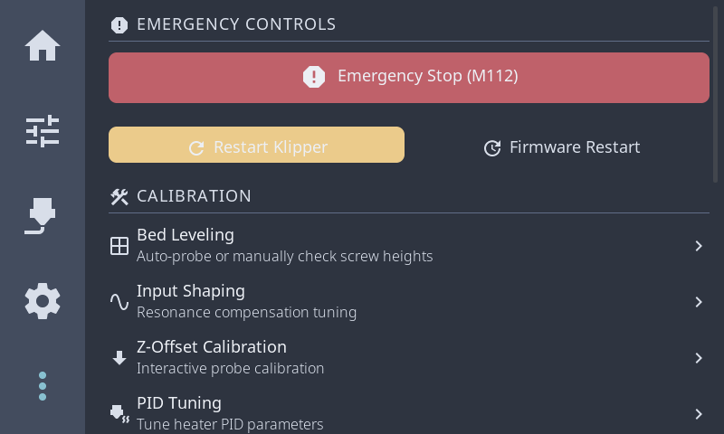
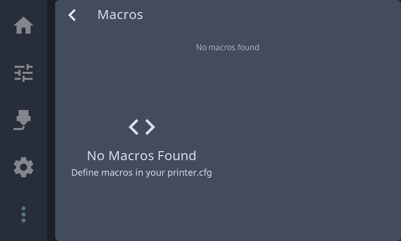
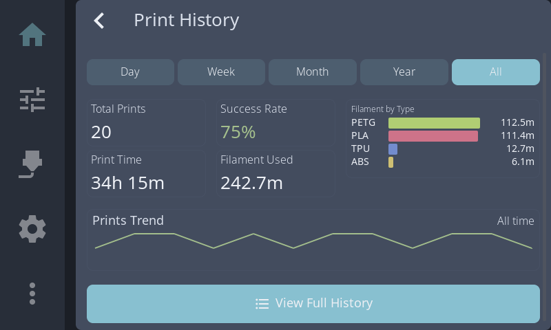

Access via the **More** icon in the navigation bar.

---

## Console *(beta feature)*

View G-code command history and Klipper responses. Requires [beta features](/docs/guide/beta-features/) to be enabled.

1. Navigate to **Advanced > Console**
2. Scroll through recent commands

**Color coding:**

- **White**: Commands sent
- **Green**: Successful responses
- **Red**: Errors and warnings

---

## Macro Execution

Execute custom Klipper macros:

1. Navigate to **Advanced > Macros**
2. Browse available macros (alphabetically sorted)
3. Tap a macro to execute

**Notes:**

- System macros (starting with `_`) are hidden by default
- Names are prettified: `CLEAN_NOZZLE` becomes "Clean Nozzle"
- Dangerous macros (`SAVE_CONFIG`, etc.) require confirmation

---

## Power Device Control

Control Moonraker power devices from the full power panel or the home panel quick-toggle button.

### Home Panel Quick Toggle

A **power-cycle button** appears on the home panel when power devices are configured:

- **Tap** to toggle your selected power devices on or off
- **Long-press** to open the full power panel overlay
- The button shows a **danger (red) variant** when devices are on, and **muted** when off

### Full Power Panel

1. Navigate to **Advanced > Power Devices** (hidden when no power devices are detected)
2. Toggle individual devices on/off with switches

**Main Power Button section:**

At the top of the power panel, a **"Main Power Button"** section lets you choose which devices the home panel quick-toggle controls:

- Selection chips appear for each discovered power device
- Tap chips to include or exclude devices from the home button
- Your selection is saved automatically

### Auto-Discovery

HelixScreen automatically discovers power devices from Moonraker when it connects to your printer. On first discovery, all devices are selected for the home panel button by default. The **Power Devices** row in the Advanced panel is hidden when no power devices are available.

**Notes:**

- Devices may be locked during prints (safety feature)
- Lock icon indicates protected devices

---

## Print History

View past print jobs:

**Dashboard view:**

- Total prints, success rate
- Print time and filament usage statistics
- Trend graphs over time

**List view:**

- Search by filename
- Filter by status (completed, failed, cancelled)
- Sort by date, duration, or name

**Detail view:**

- Tap any job for full details
- **Reprint**: Start the same file again
- **Delete**: Remove from history

---

## Notification History

Review past system notifications:

1. Tap the **bell icon** in the status bar
2. Scroll through history
3. Tap **Clear All** to dismiss

**Color coding:**

- Blue: Info
- Yellow: Warning
- Red: Error

---

## Timelapse Settings

Configure Moonraker-Timelapse (beta feature):

1. Navigate to **Advanced > Timelapse**
2. If the timelapse plugin is not installed, HelixScreen detects this and offers an **Install Wizard** to set it up
3. Once installed, configure settings:
   - Enable/disable timelapse recording
   - Select mode: **Layer Macro** (snapshot at each layer) or **Hyperlapse** (time-based)
   - Set framerate (15/24/30/60 fps)
   - Enable auto-render for automatic video creation

### Render Controls

Below the settings, a **Render Now** section shows:

- **Frame count**: How many frames have been captured during the current print
- **Render progress bar**: Appears during rendering with a percentage indicator
- **Render Now button**: Manually trigger video rendering from captured frames

### Recorded Videos

The bottom of the timelapse settings shows all rendered timelapse videos:

- View file names and sizes
- Delete individual videos (with confirmation)
- Videos are stored on your printer and managed by the timelapse plugin

### Notifications

During rendering, HelixScreen shows toast notifications:

- Progress updates at 25%, 50%, 75%, and 100%
- Success notification when rendering completes
- Error notification if rendering fails

---

**Next:** [Beta Features](/docs/guide/beta-features/) | **Prev:** [Settings](/docs/guide/settings/) | [Back to User Guide](/docs/guide/getting-started/)
