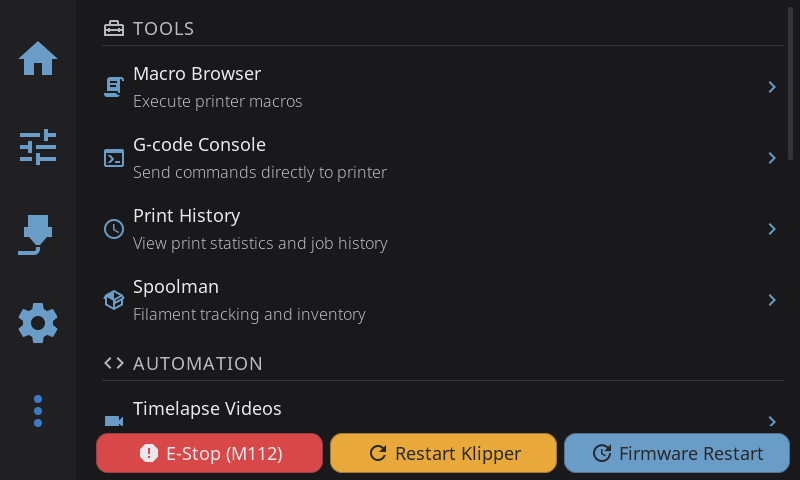
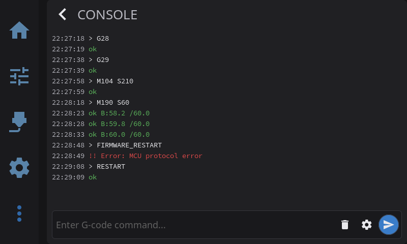
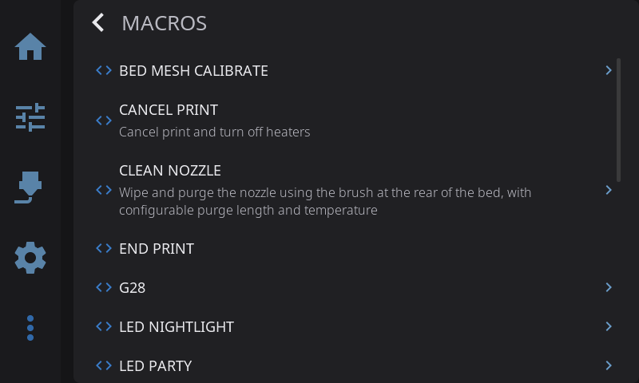
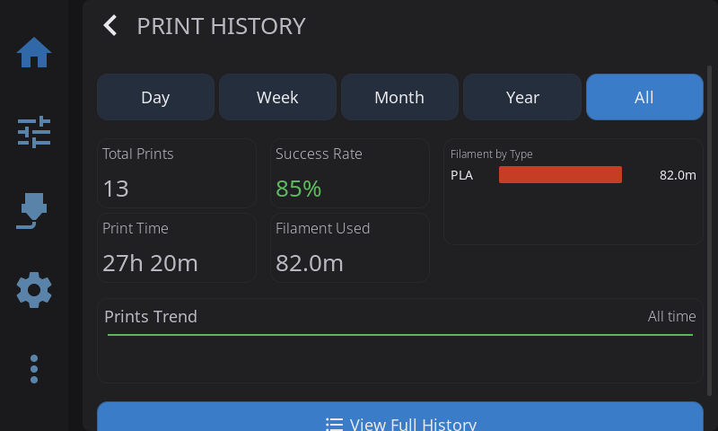

Access via the **More** icon in the navigation bar.

---

## G-code Console

A full-featured G-code terminal for sending commands directly to your printer and viewing Klipper responses in real time.

**Opening the console:**

- Navigate to **Advanced > G-code Console**, or
- Add the **G-code Console** widget to your home panel for one-tap access

**Sending commands:**

1. Type a G-code command in the input field at the bottom (e.g., `G28`, `M104 S210`)
2. Press **Enter** on the keyboard or tap the **send button**
3. The command appears with a `>` prefix, and Klipper's response streams in below

**Reusing a command (tap to paste):**

Tap any command in the console — the lines prefixed with `>` — and it drops straight back into the input field, ready to edit and send again. This is the quickest way to re-run a macro you use often, or to fix a typo without retyping the whole line.

- Tapping **only fills the input**. Nothing is sent until you tap the send button or press Enter, so a stray tap can never re-run a command by accident.
- Only commands are tappable. Klipper's responses (green) and errors (red) do nothing when tapped.
- Commands sent from **Mainsail, Fluidd, or a terminal** appear in the console too, and they can be tapped just the same.
- Scrolling still works normally — flicking the log to scroll won't paste anything.

**Command history with a USB keyboard:**

If you have a USB keyboard attached, press the **Up/Down arrow keys** in the input field to walk back through commands you've sent, the same way a terminal works. Up to 20 recent commands are remembered within the session. Tap to paste reaches further back — the log holds up to 200 lines — so on a touchscreen it's usually the better option.

**Color coding:**

- **White**: Commands you sent (prefixed with `>`)
- **Green**: Successful responses from Klipper
- **Red**: Errors and warnings (lines starting with `!!` or `Error`)
- **Colored spans**: AFC and Happy Hare plugins send colored output that renders inline

**Other features:**

- **Auto-scroll**: The console scrolls to show new messages automatically. Scroll up to pause auto-scroll and read history — it resumes when you send a new command
- **Timestamps**: On medium and larger screens, each line shows an `HH:MM:SS` timestamp
- **Clear button**: Tap the trash icon to clear the display (with confirmation)
- **Monospace font**: Console text uses Source Code Pro for easier reading of G-code output

**Filters:**

Open the console settings (the **tune/settings icon** in the console) to control which background chatter is hidden. Both filters are **on by default**, and your choices are saved:

| Filter | What it hides | Default |
|--------|---------------|---------|
| **Hide Temperature Reports** | Periodic `T:.../B:...` temperature status lines that Klipper streams continuously | On |
| **Hide Firmware Noise** | Raw debug output from printer firmware modules (the exact patterns are defined per printer model) | On |

Turn a filter **off** if you want to see that output — for example, turn off "Hide Temperature Reports" when you're watching heater behavior live, or turn off "Hide Firmware Noise" when troubleshooting a specific firmware module.

---

## Macro Execution

Browse and execute all of your Klipper macros.

**Opening the Macros panel:**

- Navigate to **Advanced > Macros**, or
- Add the **Macros** widget to your home panel for one-tap access

**Browsing macros:**

1. All macros from your Klipper configuration are listed alphabetically
2. Names are prettified for readability: `CLEAN_NOZZLE` becomes "Clean Nozzle"
3. System macros (starting with `_`) are hidden by default — reveal them using edit mode (below)
4. Tap any macro to execute it

**Macro parameters:**

Some macros accept parameters (variables or arguments defined in your Klipper config). When you tap a macro that has parameters:

- A **parameter input form** appears showing each parameter with its default value
- Edit the values you want to change, then tap **Run** to execute
- Parameters are pre-detected when HelixScreen connects to your printer, so there's no loading delay

If HelixScreen can't determine the parameters (e.g., complex Jinja2 templates), a freeform text field lets you type raw parameters.

**Dangerous macro protection:**

These macros show a confirmation dialog before executing:

- `SAVE_CONFIG` — writes configuration changes to disk
- `FIRMWARE_RESTART` / `RESTART` — restarts Klipper
- `SHUTDOWN` — shuts down the printer host
- `M112` / `EMERGENCY_STOP` — emergency stop

**Hiding macros you don't use:**

<!-- Screenshot: macros panel in edit mode, showing checkboxes and the header Save button -->

If your macro list is cluttered with macros you never run, you can hide them from the list:

1. **Press and hold** any macro for about a second to enter edit mode
2. Every macro now shows a **checkbox** on the left, and a **Save** button appears at the top of the panel
   - **Checked** = the macro stays visible in the normal list
   - **Unchecked** = the macro will be hidden
3. System macros (the ones starting with `_`, normally hidden) also show up here unchecked, so you can reveal one if you need it
4. Tap a macro's checkbox to change its state — tapping the row itself no longer runs the macro while you're in edit mode
5. Tap **Save** to apply your changes. Hidden macros disappear from the normal list immediately
6. To leave edit mode without saving, tap **Back** — your checkbox changes are discarded and the list is unchanged

> **Note:** Your hidden-macro choices are saved per printer and stick around across restarts, so switching to a different printer profile shows that printer's own macro list.

---

## Configure PRINT_START

HelixScreen's [pre-print skip toggles](printing.md#pre-print-options) — Auto bed level, Quad gantry level, Z-tilt adjust, Nozzle clean — can only skip a step if that step is written so it can be turned off. When those operations live *inside* your `PRINT_START` (or `START_PRINT`) macro, they run every time and the toggles can't reach them.

**Configure PRINT_START** reads your own macro, finds those operations, and — with your approval — rewrites the macro so each one becomes optional. Afterward, the matching toggle on the print screen actually skips it.

> **Safety:** This feature **edits your Klipper printer configuration** on the printer. It is a deliberate, consent-based action: nothing is changed until you review each operation and tap **Apply Changes**. A backup of your config is saved automatically before anything is written, and Klipper restarts once the changes are applied.

### Opening the wizard

1. Enable **Beta Features** first (see [Beta Features](/docs/guide/beta-features/)) — this tool lives behind the beta flag.
2. Navigate to **Advanced → Configure PRINT_START**.

HelixScreen may also prompt you on its own: when it notices skippable steps in your macro, a notification reading **"PRINT_START has N skippable operations"** appears with a **Configure** button that opens the same wizard.

If your macro is already set up (or has nothing that can be made optional), you'll see **"Your print start is already fully configured!"** instead, and the wizard won't open.

### Reviewing each operation

The wizard walks you through one operation at a time (a progress counter like **"1 of 3"** shows your place). For each one — Bed Mesh, Quad Gantry Leveling, Z-Tilt Adjustment, or Nozzle Cleaning — it asks **"Make [operation] Optional?"** and explains in plain language what changes.

You have two choices per operation:

| Button | What it does |
|--------|--------------|
| **Keep Required** | Leave this operation alone — it will always run |
| **Make Optional** | Rewrite it so the pre-print toggle can skip it |

> **Note:** Homing is never offered here — it's required for safe printing and can't be made skippable.

### Applying your changes

After the last operation, a **Ready to Apply** summary lists every change you approved under **"Your PRINT_START macro will be updated to give you control over:"**.

- The **"Create backup of printer.cfg before applying"** option is checked by default.
- A reminder notes that **"Klipper will restart to apply changes"**.
- Tap **Cancel** to discard everything, or **Apply Changes** to write them.

While applying, the wizard shows its progress (creating the backup, then writing the changes). When it finishes you'll see a **Setup Complete!** confirmation letting you know a backup was saved and the new skip options are now available in the print details before each print. Tap **Close** to finish.

> **Tip:** The changes are reversible. You can undo them later from the Macro Viewer, or re-run the wizard if you edit your macro again.

---

## Interactive Prompts

Some Klipper macros can ask you questions mid-run — "Which lane should I load?", "Purge complete?", "Tip formed cleanly?" — using Klipper's standard prompt protocol. HelixScreen renders these as a native touchscreen dialog automatically. This is common with multi-material systems like Happy Hare / ERCF, and with custom confirmation macros.

You don't configure anything. Any macro that emits the prompt protocol will pop up a dialog on your screen the moment it runs.

**A prompt dialog shows:**

- A **title** at the top (for example, the name of the operation)
- One or more lines of **explanatory text**
- **Buttons** you tap to answer — each button runs a G-code command and closes the dialog

Buttons are color-coded by the macro author to signal intent:

| Color | Typical meaning |
|-------|-----------------|
| **Blue** (primary) | The main / default action |
| **Green** | A confirming or "go" action |
| **Amber** | Caution — think before tapping |
| **Red** | A stop, cancel, or destructive action |

> **Note:** Colors are chosen by whoever wrote the macro — they're a hint, not a rule. Always read the button label. Macro authors can also specify an exact custom color.

Longer menus wrap onto multiple lines automatically, and some macros place a row of **footer buttons** across the bottom of the dialog (often used for "Cancel" or menu navigation). If a prompt is flagged as an error, a red warning icon appears next to the title.

> **Tip:** Tapping any button sends its command straight to the printer and dismisses the dialog. If you're not sure what a button does, check the macro that produced the prompt — HelixScreen simply displays whatever the macro defines.

---

## Probe Management

View and control your Z probe. HelixScreen auto-detects your probe type (Cartographer, Beacon, BLTouch, BTT Eddy, Mellow Fly Eddy, Voron Tap, Klicky, or standard probe) and shows type-specific controls.

1. Navigate to **Advanced > Probe Management** (only visible when a probe is detected)
2. View probe type, Z-offset, and sensor readings (coil temperature for Cartographer, sensor temperature for Beacon)
3. Use type-specific buttons (Calibrate, Touch Cal, Scan Cal, Auto-Cal, Deploy/Dock, etc.)
4. Access universal actions: Accuracy Test, Z-Offset Calibration, Bed Mesh
5. Edit probe configuration values (offsets, samples, speed, tolerance)

For full details, see [Calibration & Tuning — Probe Management](calibration.md#probe-management).

---

## Power Device Control

Control Moonraker power devices from the full power panel or the home panel quick-toggle button.

### Home Panel Quick Toggle

A **power-cycle button** appears on the home panel when power devices are configured:

- **Tap** to toggle your selected power devices on or off
- **Long-press** to open the full power panel overlay
- The button shows a **danger (red) variant** when devices are on, and **muted** when off

### Full Power Panel

1. Navigate to **Advanced > Power Devices**, or **Settings > System > Power Devices** (hidden when no power devices are detected)
2. Toggle individual devices on/off with switches

**Main Power Button section:**

At the top of the power panel, a **"Main Power Button"** section lets you choose which devices the home panel quick-toggle controls:

- Selection chips appear for each discovered power device
- Tap chips to include or exclude devices from the home button
- Your selection is saved automatically

### Auto-Discovery

HelixScreen automatically discovers power devices from Moonraker when it connects to your printer. On first discovery, all devices are selected for the home panel button by default. The **Power Devices** row in the Advanced panel is hidden when no power devices are available.

### Locking During Prints

A power device can be **locked while a print is running** so you can't accidentally cut power mid-job. This is controlled by Moonraker, not HelixScreen: any device configured with `locked_while_printing` in your `moonraker.conf` is affected.

A locked device behaves as follows **for the whole time a job owns the printer** — starting the moment you tap Start Print. The preparing phase counts too (heating, homing, and leveling before the first layer): the toolhead is already moving then, so cutting power mid-preparation is just as destructive as cutting it mid-print. Printing and paused states are covered as well:

- Its toggle switch is **disabled** — tapping it does nothing
- A **lock icon** appears on the row
- The status text reads **"Locked during print"**

When no job is running, the device unlocks and toggles normally again — that includes cancelling during preparation, which unlocks the device without a print ever having started. Devices without `locked_while_printing` are never locked.

---

## Print History

HelixScreen keeps a record of your completed, failed, and cancelled prints, sourced from Moonraker's job history. Open it from **Advanced > Print History**. You get a dashboard of statistics and trend charts, a searchable and sortable list of past jobs, and per-job details with reprint and delete.

See [Print History](/docs/guide/print-history/) for the full guide.

---

## Notification History

Review past system notifications:

1. Tap the **Notifications** widget on the Home screen
2. Scroll through history
3. Tap **Clear All** to dismiss

**Color coding:**

- Blue: Info
- Yellow: Warning
- Red: Error

---

## Timelapse

Record timelapse videos of your prints automatically using the [moonraker-timelapse](https://github.com/mainsail-crew/moonraker-timelapse) plugin.

### Setup

If the timelapse plugin is not installed, HelixScreen detects this and offers a guided **Install Wizard**:

1. Navigate to **Advanced > Timelapse Setup**
2. Follow the on-screen instructions to install the plugin via SSH
3. HelixScreen will configure your `moonraker.conf` automatically
4. After installation, the setup row is replaced by timelapse settings and video browser

### Settings

Navigate to **Settings > Printing > Timelapse** to configure:

- **Enable/disable** timelapse recording
- **Recording mode**: Layer Macro (snapshot at each layer) or Hyperlapse (time-based)
- **Framerate**: 15, 24, 30, or 60 fps
- **Auto-render**: Automatically create videos when prints finish

A quick **toggle button** also appears on the print status panel to enable/disable timelapse without leaving the print view.

### Video Browser

Navigate to **Advanced > Timelapse Videos** to browse your recorded timelapses:

- **Thumbnail grid** with responsive card sizing that adapts to your screen
- Each card shows a **video thumbnail**, filename, file size, and date
- **Tap** a card to play the video fullscreen (requires mpv or ffplay on your device)
- **Long-press** a card to delete it (with confirmation)
- Videos are stored on your printer and managed by the timelapse plugin

### Rendering

When frames have been captured during a print, a **render section** appears above the video grid:

- Shows the number of captured frames, print filename, and capture date
- A **progress bar** appears during rendering with status text
- Tap **Render Now** to manually create a video from captured frames
- When rendering completes, the video list refreshes automatically to show the new video
- A toast notification appears at the start and end of rendering

### Notifications

| Event | Notification |
|-------|-------------|
| Rendering starts | "Rendering timelapse..." |
| Rendering completes | "Timelapse rendered successfully" |
| Rendering fails | "Timelapse render failed" with error details |

---

**Next:** [Beta Features](/docs/guide/beta-features/) | **Prev:** [Print History](/docs/guide/print-history/) | [Back to User Guide](/docs/)
