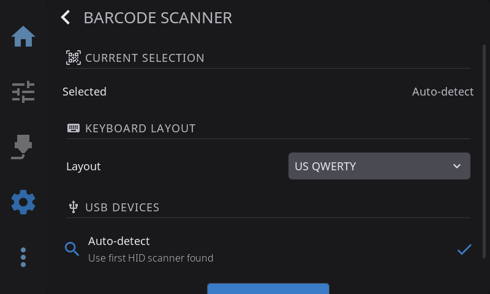

HelixScreen can read Spoolman QR codes from a USB or Bluetooth barcode scanner, so you can identify a spool by scanning it instead of picking from a list.

This guide covers both USB and Bluetooth scanners, and how to fix the most common Bluetooth pairing problem on Raspberry Pi.

Scanning is a shortcut for assigning spools — see [Filament Tracking & Spoolman](/guide/filament-tracking/) for what happens once a spool is linked.



The Barcode Scanner settings overlay lives at **Settings → Hardware & Devices → Spoolman → Barcode Scanner**.

---

## USB Scanners

Most USB barcode scanners present themselves to the Pi as a plain HID keyboard — no driver install needed.

1. Plug the scanner into any USB port.
2. Open **Settings → Hardware & Devices → Spoolman → Barcode Scanner**.
3. If the scanner appears under "USB devices", tap it to select. Otherwise "Auto-detect" will pick the first HID keyboard that isn't your physical keyboard.
4. Open the QR scanner overlay (wherever the app offers it — e.g. from the filament panel) and test by scanning a Spoolman QR code.

### Keyboard Layout

If scanned text comes out garbled, the scanner is emitting keycodes for a different keyboard layout than the one HelixScreen is decoding. Use the **Layout** setting under **Barcode Scanner → Keyboard Layout** to pick the layout your scanner is programmed to use (QWERTY is the default).

---

## Bluetooth Scanners

HelixScreen supports Bluetooth HID barcode scanners (the kind that pair as a keyboard-like device).

### Pairing

1. Power on the scanner. Make sure it's in Classic Bluetooth pairing mode (not BLE). The scanner's manual will have a config barcode to select Classic mode if needed — most default to Classic.
2. Open **Settings → Hardware & Devices → Spoolman → Barcode Scanner**, then under **Bluetooth Scanners** tap **Scan**.
3. When your scanner appears in the dropdown, tap **Pair**.
4. If pairing succeeds, the scanner becomes selected automatically.

### ⚠️ Scanner bonded but didn't attach as a keyboard

If you see a warning toast that the scanner bonded but didn't attach as a keyboard (it may also suggest adding `ClassicBondedOnly=false`), your adapter is refusing the HID connection because the scanner didn't perform a **bonded** pair.

This is a security default in BlueZ: HID devices must be bonded (cryptographic key exchanged and stored) before the kernel will route their keystrokes. Many inexpensive barcode scanners only support "Just Works" pairing, which produces a paired-but-not-bonded link — and gets rejected.

#### Fix

Relax the HID-bonded-only policy on your Pi. You'll need SSH access.

1. SSH to the Pi:
   ```bash
   ssh pi@helixpi.local
   ```
2. Edit the BlueZ input config:
   ```bash
   sudo nano /etc/bluetooth/input.conf
   ```
3. Find the line:
   ```
   #ClassicBondedOnly=true
   ```
   Uncomment it and change to:
   ```
   ClassicBondedOnly=false
   ```
4. Save and restart BlueZ:
   ```bash
   sudo systemctl restart bluetooth
   ```
5. In HelixScreen, forget any previous pairing for this scanner, then pair again. You should not see the warning this time and scanning into the QR overlay will work.

> **Security note:** `ClassicBondedOnly=false` lets any unbonded HID peripheral connect, which slightly widens the attack surface for keystroke injection. This is only a concern in hostile RF environments. For typical home and workshop use, the change is safe.

### BLE Mode

Some scanners support both Classic and BLE modes. BLE uses different pairing mechanics that always bond, so the issue above doesn't apply — but not all scanners advertise reliably in BLE. If Classic works, stick with it.

---

## Sharing a scanner with another tool (device blacklist)

If another program on the same Pi already reads your barcode scanner — for example [afc-spool-scan](https://github.com/AFCProject/afc-spool-scan), which loads spools straight into AFC — HelixScreen can get in its way. HelixScreen automatically claims the first keyboard-like device it finds, and a USB barcode scanner looks exactly like a keyboard, so both programs end up fighting over it.

You can tell HelixScreen to leave a specific device alone by adding its USB ID to a **blacklist**. A blacklisted device is ignored completely — HelixScreen won't use it for keyboard input or for the built-in scan overlay — leaving it free for the other tool. It still shows up in the Barcode Scanner device list so you can identify it.

### 1. Find the scanner's USB ID

The ID is a `vendor:product` pair like `002c:261a`. Find it either way:

- **In HelixScreen:** open **Settings → Hardware & Devices → Spoolman → Barcode Scanner**. Each entry in the USB device list shows its ID.
- **Over SSH:** run `lsusb` and look for your scanner. The ID is the pair right after `ID`, e.g. `Bus 001 Device 005: ID 002c:261a ...`.

### 2. Add it to your settings

Edit `~/helixscreen/config/settings.json` (the path varies by platform — see the table in [Configuration](../CONFIGURATION.md#configuration-file-location)) and add the ID to the `input` section:

```json
"input": {
  "device_blacklist": ["002c:261a"]
}
```

Use lowercase, and list as many devices as you need: `["002c:261a", "1a2c:4c5e"]`.

### 3. Restart HelixScreen

```bash
sudo systemctl restart helixscreen
```

After the restart, HelixScreen no longer opens that device, and your other scanner tool has it to itself.

---

## Troubleshooting

| Symptom | Fix |
|---------|-----|
| No scanner appears in the dropdown | Is Bluetooth enabled on your Pi? See [Bluetooth Setup](/guide/bluetooth-setup/). |
| "Pairing failed" (Connection timed out) | Scanner isn't in pairable mode. Power-cycle it and scan its Classic-mode config barcode. |
| "Pairing failed" (Host is down) | Scanner is flashing but refusing Classic connections. Power-cycle and retry; some scanners get stuck between BLE and Classic advertising. |
| "Scanner bonded but didn't attach as a keyboard" | Set `ClassicBondedOnly=false` — see above. |
| Scanner pairs, but scanned text types into the app's UI instead of being captured as a QR code | Open the QR scanner overlay before scanning. Outside the overlay, the scanner is just a keyboard. |
| Scanned text has wrong characters | Set the correct **Layout** under **Barcode Scanner → Keyboard Layout**. |
| Another tool (e.g. afc-spool-scan) stopped seeing the scanner after installing HelixScreen | Blacklist the device so HelixScreen ignores it — see [Sharing a scanner with another tool](#sharing-a-scanner-with-another-tool-device-blacklist). |

---

## Notes

- Only one scanner (USB or Bluetooth) is used at a time. If both are configured, the paired Bluetooth scanner wins.
- When a Bluetooth scanner is selected, HelixScreen captures its keystrokes exclusively so they don't leak into other UI widgets. USB scanners run in passive mode (some scanners rely on this) — if USB scanner keystrokes leak into focused text inputs, that is a known limitation.

---

**Next:** [Calibration & Tuning](/guide/calibration/) | **Prev:** [Label Printing](/guide/label-printing/) | [Back to User Guide](/guide/)
