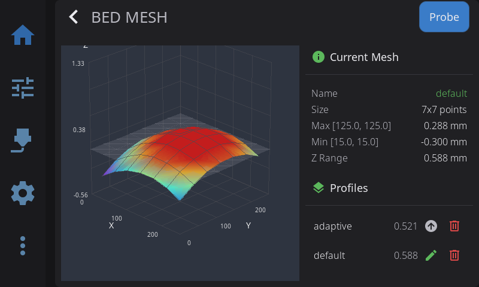
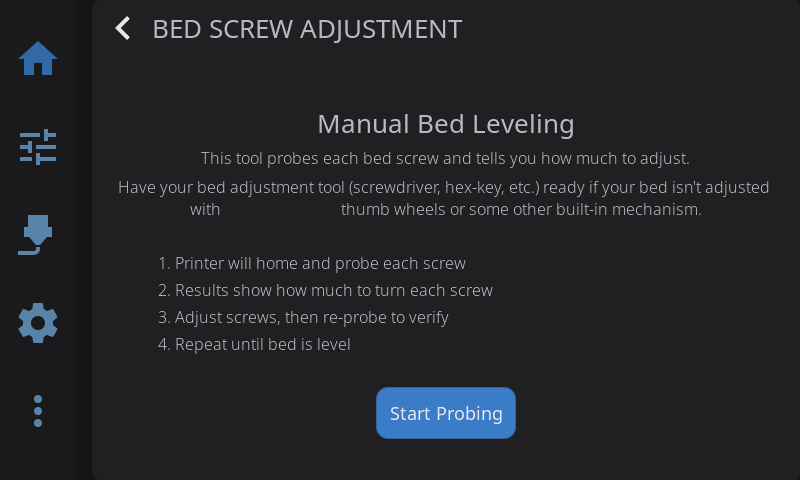
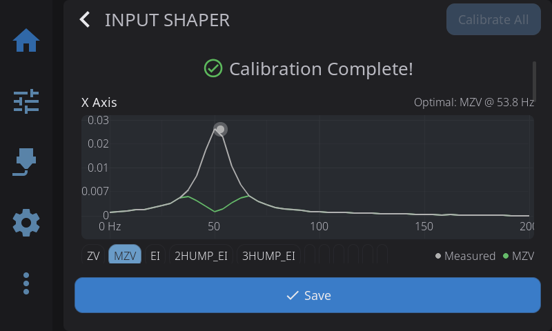
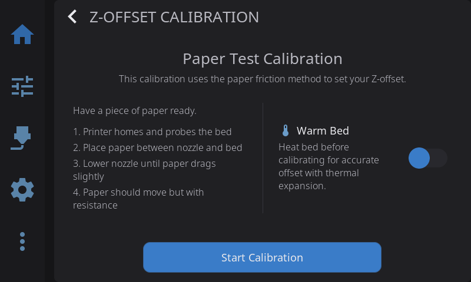
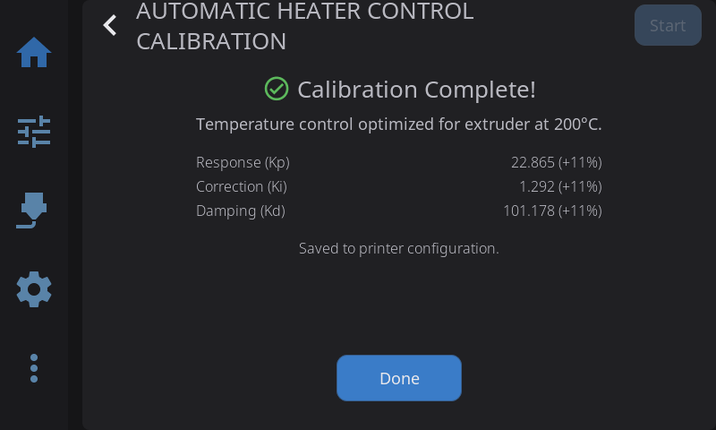

HelixScreen provides built-in tools for the most common Klipper calibration tasks.

> **Looking for touchscreen calibration?** See the [Touch Calibration Guide](/docs/guide/touch-calibration/).

---

## Bed Mesh



3D visualization of your bed surface:

- **Color gradient**: Blue (low) to Red (high)
- **Touch to rotate** the 3D view
- **Mesh profile selector**: Switch between saved meshes

**Actions:**

| Button | What It Does |
|--------|--------------|
| **Calibrate** | Run new mesh probing |
| **Clear** | Remove current mesh from memory |
| **Load** | Load a saved mesh profile |

The visualization mode (3D, 2D, or Auto) can be changed in **Settings > Display**.

---

## Screws Tilt Adjust



Assisted manual bed leveling:

1. Navigate to **Advanced > Screws Tilt**
2. Tap **Measure** to probe all bed screw positions
3. View adjustment amounts (e.g., "CW 00:15" = clockwise 15 minutes)
4. Adjust screws and re-measure until level

**Color coding:**

- **Green**: Level (within tolerance)
- **Yellow**: Minor adjustment needed
- **Red**: Significant adjustment needed

---

## Input Shaper



Tune vibration compensation for smoother, faster prints:

1. Navigate to **Advanced > Input Shaper**
2. Review your current shaper configuration displayed at the top
3. Pre-flight check verifies accelerometer is connected
4. Select axis to test (X or Y)
5. Tap **Calibrate** to run the resonance test (5-minute timeout applies)
6. View **frequency response chart** with interactive shaper overlay toggles
7. Review the **comparison table** showing recommended shaper and alternatives (frequency, vibration reduction, smoothing)
8. Tap **Apply** to use for this session or **Save Config** to persist

**Chart features:**
- Toggle different shaper types on/off to compare their frequency response curves
- Platform-adaptive: full interactive charts on desktop, simplified on embedded hardware
- Per-axis results shown independently


> **Requirement:** Accelerometer must be configured in Klipper for measurements. If no accelerometer is detected, the pre-flight check will show a warning.

---

## Probe Management

View and control your Z probe from **Advanced > Probe Management**. HelixScreen auto-detects your probe type and shows the appropriate controls.

**Supported probe types:**

| Probe | Detected As | Type-Specific Controls |
|-------|-------------|----------------------|
| **Cartographer** | Cartographer | Calibrate, Touch Cal, Scan Cal |
| **Beacon** | Beacon | Calibrate, Auto-Calibrate |
| **BTT Eddy / Mellow Fly Eddy** | Eddy Current | Calibrate, Drive Current Cal |
| **BLTouch** | BLTouch | Deploy, Stow, Reset, Self-Test |
| **Voron Tap** | Voron Tap | — |
| **Klicky** | Klicky | Deploy, Dock |
| **Standard probe** | Probe | — |

**Universal actions** (all probe types):

| Button | What It Does |
|--------|--------------|
| **Accuracy Test** | Runs `PROBE_ACCURACY` to check probe repeatability |
| **Z-Offset Cal** | Opens the interactive Z-offset calibration panel |
| **Bed Mesh** | Opens the bed mesh calibration panel |

**Configuration:** Tap any config row (X/Y offset, samples, speed, retract distance, tolerance) to edit probe settings directly — changes are saved to your Klipper config with a firmware restart.

---

## Z-Offset Calibration



Interactive panel for dialing in your Z-offset when not printing. Works with all probe types — Cartographer, Beacon, BLTouch, eddy current probes, and standard probes.

1. Navigate to **Advanced > Z-Offset**, or tap **Z-Offset Cal** in the Probe Management overlay
2. Optionally enable **Warm Bed** to heat the bed before calibrating (accounts for thermal expansion)
3. Tap **Start** — the printer homes and begins the calibration sequence
4. Use the **+/−** adjustment buttons to lower the nozzle (paper test: adjust until paper drags slightly)
5. Tap **Accept** when satisfied, or **Abort** to cancel
6. The offset is saved to your Klipper config automatically

HelixScreen picks the right calibration command for your setup (`PROBE_CALIBRATE`, `Z_ENDSTOP_CALIBRATE`, or `SET_GCODE_OFFSET`) based on your printer's detected probe configuration.

> **Quick access:** A **Z Calibration** button is also available on the Controls panel for one-tap access.

---

## Belt Tension *(Beta)*

Uneven belt tension is one of the most common causes of print quality issues on CoreXY and Cartesian printers. Loose or mismatched belts produce visible artifacts like layer shifts, vertical fine artifacts (VFAs), and ringing/ghosting. HelixScreen's Belt Tension tool measures the resonant frequency of each belt path and compares them, giving you a clear picture of your belt tension balance.

### How It Works

Every belt has a natural resonant frequency determined by its length, mass, and tension — just like a guitar string. Tighter belts vibrate at higher frequencies. On a CoreXY printer, the two diagonal belt paths (Path A and Path B) should have very similar frequencies, meaning their tension is balanced.

The Belt Tension tool:

1. Vibrates each belt path using `TEST_RESONANCES`
2. Records the vibration with your accelerometer
3. Computes a frequency spectrum (PSD) to find the peak resonant frequency
4. Compares the two paths and provides a recommendation

### Requirements

- **Accelerometer** (ADXL345, LIS2DW, or MPU) configured in your Klipper `printer.cfg`
- **CoreXY** or **Cartesian** kinematics (auto-detected)
- **Optional:** A `[pwm_cycle_time]` LED pin for stroboscopic fine-tuning

> **No accelerometer?** The strobe fine-tuning mode can still be used to visually identify belt resonance using a phone strobe app — no accelerometer needed for that step.

### Running a Belt Tension Check

1. Navigate to **Advanced > Belt Tension** (requires [beta features](/docs/guide/beta-features/) enabled)
2. Review the **hardware summary** card showing your detected kinematics, accelerometer status, strobe LED availability, and target frequency
3. Tap **Start Check**
4. The printer homes (if needed), then runs a resonance sweep on each belt path
5. A progress bar shows the measurement status ("Measuring Path A... / Path B...")

### Reading the Results

When the measurement completes, the results screen shows:

**Path A and Path B cards:**
- **Measured frequency** in Hz
- **Status indicator**: Good, Needs adjustment, or Out of range

**Comparison section:**
- **Frequency Delta** — the difference between Path A and B in Hz. Ideally under 5 Hz; over 15 Hz means adjustment is needed
- **Path Similarity** — how closely the vibration profiles match (Pearson correlation). Above 90% is excellent; below 70% suggests uneven tension

**Recommendation card:**
- A specific, actionable message like "Tighten Path A belt to match Path B" or "Belt tension looks good!"

**Status thresholds:**

| Status | Condition |
|--------|-----------|
| Good (green) | Within target frequency range |
| Needs adjustment (orange) | Moderately off target |
| Out of range (red) | Far from target, or large A/B imbalance |

### Interpreting Frequencies

**Target frequency** defaults to 110 Hz, which is typical for Voron-style CoreXY printers. Different printer designs may have different ideal frequencies — check your printer's documentation.

| Frequency | Meaning |
|-----------|---------|
| **Both paths match, near target** | Belt tension is balanced and correct |
| **Both paths match, but low** | Belts are balanced but too loose — tighten both equally |
| **Both paths match, but high** | Belts are balanced but overtightened — loosen both equally |
| **Paths differ significantly** | Tension is unbalanced — tighten the lower-frequency belt |

### Strobe Fine-Tuning Mode

After getting initial results, tap **Visual Fine-Tune (Strobe)** for precise belt tension matching. This mode vibrates the belt at a specific frequency while a strobe light flashes in sync — when the belt appears to "freeze" (stand still), you've found the resonant frequency.

**With a PWM strobe LED:**

If your printer has a `[pwm_cycle_time]` LED configured in Klipper, HelixScreen automatically syncs the LED strobe to the motor excitation frequency. Watch the belt under the strobe and adjust frequency with the **+0.5 Hz** / **-0.5 Hz** buttons until the belt appears stationary.

**Klipper configuration for strobe LED:**

```ini
[pwm_cycle_time strobe_led]
pin: <your_gpio_pin>    # Any available GPIO connected to an LED
value: 0                 # Start off
cycle_time: 0.01         # Default (will be changed dynamically)
```

**Without a strobe LED (phone app fallback):**

HelixScreen shows the current frequency and recommends phone strobe apps you can use:

- **Android:** Strobily, Strobe Light
- **iOS:** Strobe Light Tachometer, myStroboscope

Set the app to the displayed frequency, aim your phone at the belt, and adjust until the belt appears frozen.

**Locking frequencies:**

Use the **Lock A** and **Lock B** buttons to record the resonant frequency you found for each path.

### Tips

- **Run the check after any belt adjustment** to verify your changes had the desired effect
- **Tap "Test Again"** on the results screen to re-run without leaving the panel
- **Path A corresponds to the 1,1 diagonal** on CoreXY printers (both motors moving the same direction). Path B is the 1,-1 diagonal (motors moving opposite directions). Check your printer's documentation for which tensioner adjusts which path
- **Temperature matters** — belt tension can change slightly with temperature. Run the check at your typical operating temperature for the most accurate results
- **The frequency chart** (coming soon) will show the full frequency response curves for both paths, making it easier to spot issues like secondary peaks or broad resonance

---

## Heater Calibration (PID / MPC)



Calibrate temperature controllers for stable heating. HelixScreen supports two calibration methods:

- **PID** — Classic proportional-integral-derivative tuning. Works on all Klipper firmware.
- **MPC** *(Beta)* — Model Predictive Control. A physics-based thermal model that can provide more stable temperatures. Requires [Kalico](https://github.com/Luro02/klipper) firmware (a Klipper fork with MPC support).

### PID Calibration

1. Navigate to **Advanced > Heater Calibration**
2. Select **Nozzle** or **Bed**
3. Choose a **material preset** (PLA, PETG, ABS, etc.) or enter a custom target temperature
4. Optionally set **fan speed** — calibrating with the fan on gives more accurate results for printing conditions
5. Tap **Start** to begin automatic tuning

**During calibration:**
- **Live temperature graph** shows the heater cycling in real-time
- **Progress percentage** updates as calibration proceeds
- **Abort button** available if you need to stop early
- A **15-minute timeout** acts as a safety net for stuck calibrations

**When complete:**
- View new PID values (Kp, Ki, Kd) with **old-to-new deltas** so you can see what changed
- Tap **Save Config** to persist the new values to your Klipper configuration

> **Tip:** Run PID tuning after any hardware change (new heater, thermistor, or hotend) and with the fan speed you typically use while printing.

### MPC Calibration (Beta — Kalico Only)

If you are running Kalico firmware and have [beta features enabled](/docs/guide/beta-features/), a **Method** selector appears with MPC and PID options. HelixScreen auto-detects Kalico — the selector only appears when it is detected.

1. Navigate to **Advanced > Heater Calibration**
2. Select **MPC** in the Method selector (marked with a BETA badge)
3. Select **Nozzle** or **Bed**
4. Choose a target temperature preset
5. For nozzle calibration, select a **fan calibration level**: Quick (3 points), Detailed (5 points), or Thorough (7 points) — more points improve accuracy but take longer
6. If switching from PID to MPC for the first time, enter your **heater wattage** (check your heater's rating — typically 40–60W for hotends)
7. Tap **Start**

**First-time MPC switch:** If your heater is currently configured for PID, HelixScreen will automatically update your Klipper configuration to MPC mode and restart Klipper before beginning calibration. A progress screen shows "Updating Configuration..." during this step.

**When complete:**
- View MPC model parameters: Heat Capacity, Sensor Response, Ambient Transfer, and Fan Transfer (nozzle only)
- Results are automatically saved to your Klipper configuration

---

**Next:** [Settings](/docs/guide/settings/) | **Prev:** [Filament Management](/docs/guide/filament/) | [Back to User Guide](/docs/guide/getting-started/)
