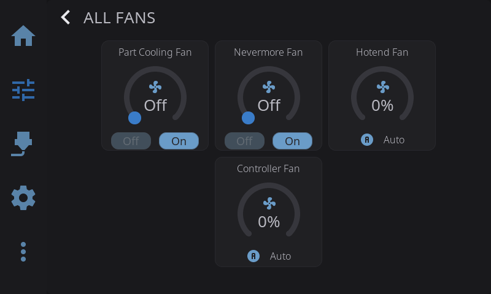
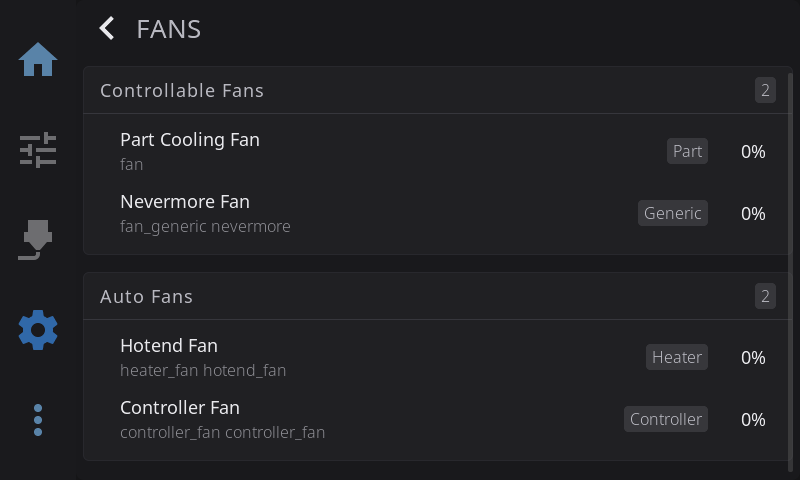

HelixScreen automatically discovers every fan your printer reports to Klipper and groups them by whether you can control them. You can adjust controllable fan speeds, watch automatic fans, and rename any fan so it's easier to recognise across the UI.

---

## Two Ways to Reach Fans

There are two related fan screens:

| Screen | Where | What it does |
|--------|-------|--------------|
| **Fan Control** | **Controls** panel — tap the cooling/fans card | Live speed control with animated dials |
| **Fan Settings** | **Settings > Hardware & Devices > Fans** | List of all fans, used mainly for renaming |

The Fan Control overlay is also reached from the fan widget on the Home dashboard and from the print status screen.

---

## Fan Types

HelixScreen identifies each fan by its Klipper configuration and shows a short type label:

| Type | Klipper config | Controllable? |
|------|----------------|---------------|
| **Part** | Part cooling fan (`[fan]`) | Yes |
| **Generic** | `[fan_generic]` | Yes |
| **Output Pin** | Creality-style `[output_pin]` fan | Yes |
| **Heater** | `[heater_fan]` (hotend cooling) | No — automatic |
| **Controller** | `[controller_fan]` (electronics cooling) | No — automatic |
| **Temp** | `[temperature_fan]` (thermostatic) | No — automatic |

**Controllable fans** are ones you can set a speed on directly. **Automatic fans** are managed by Klipper based on temperature or printer activity, so HelixScreen shows their current speed but doesn't let you change it.

---

## Fan Control Overlay

Open it from the **Controls** panel by tapping the cooling/fans card. Fans are shown in two groups:

- **Controllable fans** appear as circular dials. Drag the dial (or tap along its ring) to set the speed from 0–100%. The fan icon spins faster as the speed increases, and the new speed takes effect immediately.
- **Automatic fans** appear as read-only status cards. They show the current speed as a percentage, and the RPM as well when the fan reports a tachometer reading. You can't adjust these — their speed is set by Klipper.

> Speed changes you make are reflected immediately in the rest of the UI, even before the printer confirms the command.

---

## Renaming a Fan

Klipper fan names like `fan_generic exhaust_fan` aren't always friendly. You can give any fan a custom display name:

**From the Fan Settings overlay** (Settings > Hardware & Devices > Fans):

1. Tap a fan row in the list.
2. Enter a new name in the dialog.
3. Tap to confirm.

**From the Fan Control overlay:** long-press a fan dial or status card to open the same rename dialog.

The custom name is saved and appears everywhere that fan is shown in HelixScreen. The list also shows a running count of controllable and automatic fans, and a "No fans detected" message if your printer has none.

---

**Prev:** [Settings](/guide/settings/) | **Next:** [Sensors](/guide/sensors/) | [Back to User Guide](/guide/)
