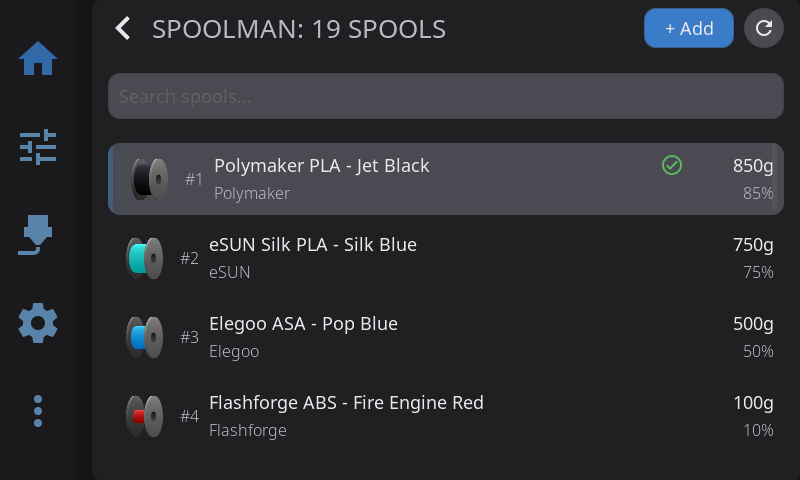

HelixScreen keeps track of what filament is loaded and how much of it is left — the material, brand, color, and remaining weight of each spool. This works two ways: a built-in tracker that runs on its own, and a deeper integration with [Spoolman](https://github.com/Donkie/Spoolman) if you run a Spoolman server for your filament inventory.

This page explains what gets tracked in each mode, how remaining weight is kept up to date, and how to connect Spoolman. For the hands-on filament controls (load, unload, purge, AMS slots), see [Filament Management](/guide/filament/).

---

## The Two Modes

| | Without Spoolman | With Spoolman |
|---|---|---|
| **What you set** | Material, color, brand, remaining weight per spool — entered on the touchscreen | Same, but pulled from your Spoolman inventory when you assign a spool |
| **Where it's stored** | On the printer (survives restarts and reboots) | In your Spoolman database, shared across every tool that reads it |
| **How usage is tracked** | HelixScreen estimates it from how much filament each print extrudes | Spoolman tracks consumption itself, through Moonraker; HelixScreen displays the result |
| **Best for** | A single printer, no inventory system | Managing many spools across one or more printers |

You don't have to choose up front — everything works without Spoolman, and connecting Spoolman later just adds the inventory and shared-database features on top.

---

## Tracking Without Spoolman

Out of the box, HelixScreen tracks filament on its own. Nothing to enable.

### Telling HelixScreen what's loaded

**Single spool (no AMS):** Tap the spool icon on the Filament panel to configure the **external spool** — set the material, color, and brand. Once set, the whole UI knows your filament: preset heat buttons show the right temperature, purge heats correctly, and the Home panel's Active Spool widget shows it. See [External Spool Configuration](filament.md#external-spool-configuration).

**AMS / multi-material:** Each slot carries its own material, color, vendor, and remaining weight. On systems with **RFID** readers (Creality CFS, Snapmaker U1), spool info is detected automatically when you seat a spool. On systems without RFID, tap a slot's **Spool Info** to enter it yourself. See [Editing Filament Properties](filament.md#editing-filament-properties).

This information persists on the printer — it survives restarts, and it's written where OrcaSlicer 2.3.2+ can read it, so your slicer's filament panel stays in sync. See [Syncing with OrcaSlicer](filament.md#syncing-with-orcaslicer-232-and-later-including-240).

### How remaining weight is estimated

When you set a spool's remaining weight, HelixScreen keeps it current on its own:

- When a print starts, it records the spool's current weight as a baseline.
- While printing, it watches how much filament the extruder pushes and converts that length into grams (using the material's density), lowering the remaining weight as the print runs.
- When the print pauses, finishes, or is canceled, it saves the updated weight.

This is an **estimate**, not a scale reading, so it's only as accurate as the starting weight and material you entered. For it to run, HelixScreen needs to know the material (to look up its density) and a starting weight above zero.

> **Note:** For AMS systems whose firmware already reports filament remaining on its own (some Creality CFS and Snapmaker U1 setups read it from the spool tag), HelixScreen defers to the hardware's number instead of estimating.

---

## Tracking With Spoolman

[Spoolman](https://github.com/Donkie/Spoolman) is a free, self-hosted filament inventory manager. Connect it and HelixScreen becomes a front-end to your spool library: assign real spools to the printer, browse your whole inventory on the touchscreen, and let Spoolman keep the authoritative record of how much filament each spool has left.

HelixScreen reaches Spoolman **through Moonraker** — you point Moonraker at your Spoolman server (HelixScreen sets this up for you), and Moonraker relays the requests. That means Spoolman's own consumption tracking and any other tools you connect all share the same numbers.

### Connecting Spoolman

You need a running Spoolman server on your network. Then, on the printer:

1. Open **Settings → Hardware → Spoolman**.
2. On the setup screen, enter your Spoolman server's **IP address / hostname** and **port** (the default is `7912`).
3. Tap **Connect**.

HelixScreen verifies the server is reachable and configures Moonraker automatically — you don't need to edit `moonraker.conf` by hand. Once connected, the same screen shows the server URL with **Change** and **Remove** options.

Full setting-by-setting reference: [Settings → Hardware → Spoolman](settings/hardware.md#spoolman).

### Weight sync

With Spoolman connected, HelixScreen doesn't decrement weight itself — Spoolman does, against whichever spool is active, as the print runs. HelixScreen periodically **reads** the updated weight back so the display stays current.

- Turn on **Sync with Spoolman** under **Settings → Hardware → Spoolman** to enable this polling.
- Choose a **Refresh Interval** — 30 seconds, 1 minute, 2 minutes, or 5 minutes. Shorter is more up to date but chattier on the network.
- Weights also refresh automatically whenever a print **starts, pauses, or completes**, so the numbers are fresh at the moments that matter even between polls.

> **Note:** Because Spoolman owns consumption for any spool you've assigned from it, HelixScreen's own estimator stands down for those spools — you won't get two systems fighting over the same number. HelixScreen only writes to Spoolman when *you* make an explicit change (assigning a spool, editing weight, or creating a spool).

### Browsing and assigning spools

Once connected, a few things light up:

- **Spool inventory panel** — Reach it from the **Filament** nav tab. A scrollable, searchable list of every spool in your Spoolman database, each shown with a color-coded 3D spool, its weight, and remaining percentage. Search by vendor, material, or color; filter by storage location. Tap a spool for a context menu to **set it active**, edit, print a label, duplicate, or delete.
- **Assign to the printer** — Setting a spool "active" tells HelixScreen (and Spoolman) that this is the spool currently feeding the printer. The Home panel's Active Spool widget reflects it.
- **Assign to an AMS slot** — In the slot editor, tap **Choose Saved Spool** to pick from Spoolman and auto-fill that slot's vendor, material, color, and temperatures. See [Editing Filament Properties](filament.md#editing-filament-properties).
- **Scan to assign** — If you print QR-coded spool labels, scan one to look the spool up in Spoolman and link it, instead of picking from the list. See [Barcode Scanner](/guide/barcode-scanner/) and [Label Printing](/guide/label-printing/).

### Adding a spool

Tap **+ Add** in the Spoolman panel to create a new spool in three steps:

1. **Select Vendor** — Search your existing vendors, or tap **+ New** to add one.
2. **Select Filament** — Pick an existing filament, or tap **+ New** to create one with its material, color, temperature ranges, and weight.
3. **Spool Details** — Set the remaining weight, price, lot number, and any notes.

HelixScreen creates the vendor, filament, and spool records together in Spoolman, so the new spool is ready to assign right away.

---

## Seeing How Much Is Left

However it's tracked, remaining filament shows up in the same places:

| Where | What it shows |
|---|---|
| **Active Spool widget** (Home panel) | Current spool's material, color, and remaining vs. total weight |
| **AMS sidebar** | Remaining weight of the loaded slot |
| **Spool Info editor** | A per-slot remaining bar with percentage and weight |
| **Spoolman inventory panel** | Weight and remaining percentage for every spool, with a warning icon on any spool that's running low (under 100 g) |

**Runout** — actually running out of filament mid-print — is handled by your filament sensors and multi-filament hardware, not by the weight number. The printer's firmware pauses the print; HelixScreen then guides you through reloading. On **AFC (Box Turtle)** and **Happy Hare**, a backup slot you configured can take over automatically (Endless Spool). On the **Creality CFS**, auto-refill is run by the box itself and always pauses first: it swaps only when auto-refill is on and another slot holds the exact same material and colour, and otherwise leaves the print paused for you. See [Reading Error States](filament.md#reading-error-states) and the Endless Spool notes in [Filament Management](filament.md#slot-context-menu).

> **Tip:** The remaining weight is only as good as the starting number. Whenever you load a fresh spool, set its full weight — either by entering it in the Spool Info editor or by assigning a fresh Spoolman spool — so the estimate has an accurate starting point.

---

## Which Should I Use?

- **Just want the touchscreen to know what's loaded and roughly how much is left?** The built-in tracking does that with nothing to install.
- **Juggling a lot of spools, or more than one printer?** Run Spoolman. You get a real inventory, shared across everything that talks to Moonraker, with Spoolman keeping the authoritative consumption record.

You can start without Spoolman and add it whenever you like — connecting it doesn't erase anything, it just layers the inventory features on top.

---

## See Also

- [Filament Management](/guide/filament/) — Load/unload, AMS slots, dryer control, and the spool editors referenced above
- [Settings → Hardware → Spoolman](settings/hardware.md#spoolman) — Every Spoolman setting in one place
- [Barcode Scanner](/guide/barcode-scanner/) — Scan Spoolman QR codes to identify spools
- [Label Printing](/guide/label-printing/) — Print spool labels with a QR code linking back to Spoolman

---

**Next:** [Bluetooth Setup](/guide/bluetooth-setup/) | **Prev:** [Filament Management](/guide/filament/) | [Back to User Guide](/guide/)
