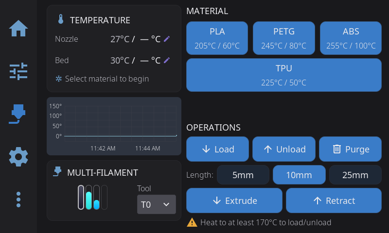
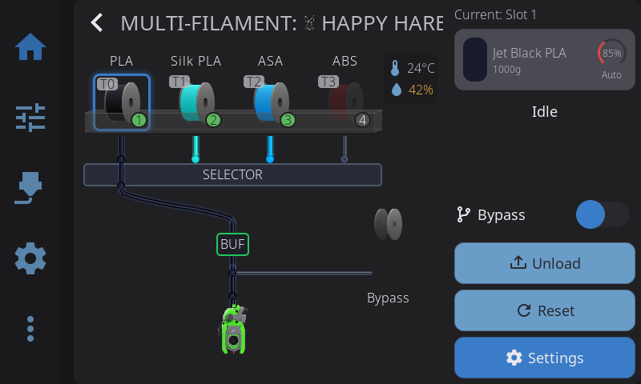
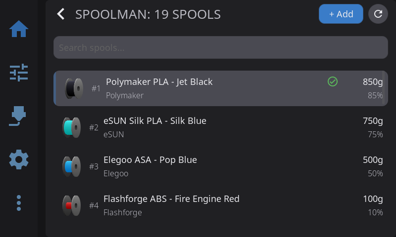

---

## External Spool Configuration

If you're not using an AMS or multi-material system, you can tell HelixScreen what filament is loaded by configuring an **external spool**. Tap the spool icon on the Filament panel to set the material, color, and brand. If Spoolman is configured, you can also link to a specific Spoolman spool.

Once configured, the external spool information is used throughout the UI:

- **Spool preset button** — A dynamic preset button appears on the Filament panel with your spool's material name and recommended temperatures. Tap it to pre-heat both the nozzle and bed to the correct temperatures for your loaded filament.
- **Temperature panel presets** — The Nozzle and Bed temperature panels also show a spool preset button for quick one-tap heating.
- **Purge temperature** — When you tap **Purge**, HelixScreen automatically passes the recommended nozzle temperature to the purge macro (as the `PURGE_TEMP` parameter), so macros that support it can heat to the right temperature.

The spool preset button only appears when the loaded material differs from the standard presets (PLA, PETG, ABS, TPU). For standard materials, just use the built-in preset buttons.

> **Tip:** The spool preset updates automatically when you change the external spool configuration — no need to close and reopen panels.

---

## Extrusion Panel

Manual filament control:

| Button | Action |
|--------|--------|
| **Extrude** | Push filament through nozzle |
| **Retract** | Pull filament back |

**Amount selector**: 5mm, 10mm, 25mm, 50mm
**Speed selector**: Slow, Normal, Fast

> **Safety:** Extrusion requires the hotend to be at minimum temperature (usually 180°C for PLA, higher for other materials).

---

## Load / Unload Filament

**To load filament:**

1. Heat the nozzle to appropriate temperature
2. Insert filament into extruder
3. Use **Extrude** button (10-25mm increments) until filament flows cleanly

**To unload filament:**

1. Heat the nozzle
2. Use **Retract** button repeatedly until filament clears the extruder

---

## AMS / Multi-Material Systems

For multi-material systems (Happy Hare, AFC-Klipper):

### Slot Status

- Visual display of all slots with material labels (PLA, PETG, ABS, ASA, etc.)
- Spool icons with color indicators for loaded filament
- Active slot highlighted — shows "Currently Loaded" with material and remaining weight
- Hub and bypass path visualization shows the filament routing

### Controls

- **Load**: Feed filament from selected slot to toolhead
- **Unload**: Retract filament back to buffer
- **Home**: Run homing sequence for the AMS

Tap a slot to select it before load/unload operations.

When an AMS slot is actively loaded, its material information drives the same spool preset behavior described in [External Spool Configuration](#external-spool-configuration) — you'll see the spool preset button on the Filament and Temperature panels, and purge macros receive the correct temperature automatically.

---

## Multiple Filament Systems

HelixScreen supports running multiple filament management backends at the same time. For example, a toolchanger printer might use both a Tool Changer backend and Happy Hare for different parts of the filament path.

When multiple backends are detected:

- A **backend selector** appears at the top of the AMS panel
- Tap to switch between systems (e.g. "Happy Hare" vs "Tool Changer")
- Each backend has its own slots and status display
- Slot assignments and controls are independent per backend

**Supported system types:**

| System | Description |
|--------|-------------|
| **Happy Hare** | MMU2, ERCF, 3MS, Tradrack, EMU |
| **AFC** | Box Turtle, OpenAMS, ViViD |
| **ValgACE** | ValgACE filament changer |
| **Tool Changer** | Toolchanger-based filament routing |
| **AD5X IFS** *(testing)* | FlashForge Adventurer 5X Intelligent Filament Switching |

Each system displays its own logo in the AMS panel header. Happy Hare and AFC show their firmware logos; specific hardware variants (ERCF, Box Turtle, ViViD, etc.) show hardware-specific logos when detected.

Single-backend setups are unaffected — the panel works exactly as before with no selector shown.

---

## Spoolman Integration

When Spoolman is configured:

- Spool name and material type displayed per slot
- Remaining filament weight shown
- Tap a slot to open **Spool Picker** and assign a different spool

### Spoolman Panel

Access via the **Filament** nav tab. Browse, search, and manage your entire spool inventory:

- **Search** — Filter spools by vendor, material, or color name
- **Context menu** — Tap a spool to set active, edit, or delete
- **3D spool visualization** — Color-coded fill level at a glance

### New Spool Wizard

Tap **+ Add** in the Spoolman panel to create a new spool in 3 steps:

1. **Select Vendor** — Search existing vendors or tap **+ New** to add one
2. **Select Filament** — Pick an existing filament or tap **+ New** to create one with material, color, temperature ranges, and weight
3. **Spool Details** — Set remaining weight, price, lot number, and notes

The wizard creates all records (vendor, filament, spool) atomically in Spoolman.

> **Tip:** You can print physical spool labels with a QR code linking to Spoolman. See [Label Printing](/docs/guide/label-printing/) for setup instructions.

---

## Dryer Control

If your AMS has an integrated dryer:

- Temperature display and control
- Timer settings
- Enable/disable drying cycle

---

**Next:** [Label Printing](/docs/guide/label-printing/) | **Prev:** [Motion & Positioning](/docs/guide/motion/) | [Back to User Guide](/docs/guide/getting-started/)
