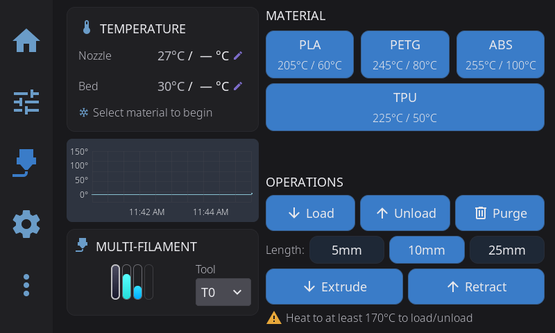
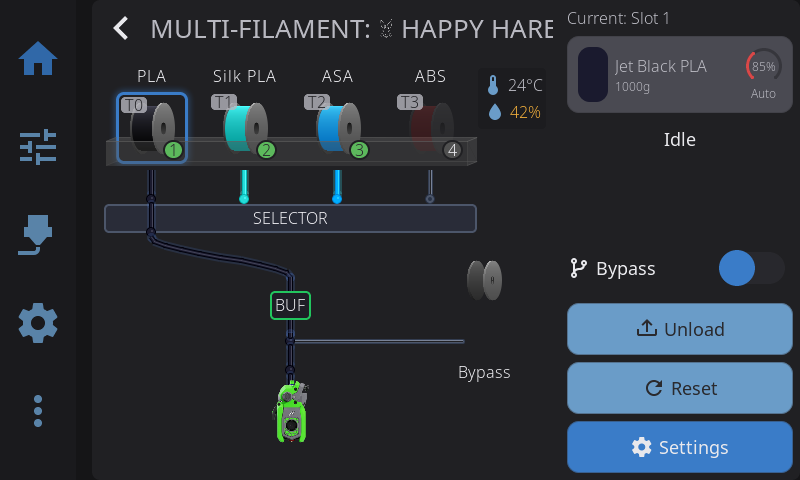

---

## External Spool Configuration

If you're not using an AMS or multi-material system, you can tell HelixScreen what filament is loaded by configuring an **external spool**. Tap the spool icon on the Filament panel to set the material, color, and brand. If Spoolman is configured, you can also link to a specific Spoolman spool.

Once configured, the external spool information is used throughout the UI:

- **Spool preset button** — A dynamic preset button appears on the Filament panel with your spool's material name and recommended temperatures. Tap it to pre-heat both the nozzle and bed to the correct temperatures for your loaded filament.
- **Temperature panel presets** — The Nozzle and Bed temperature panels also show a spool preset button for quick one-tap heating.
- **Purge temperature** — When you tap **Purge**, HelixScreen automatically passes the recommended nozzle temperature to the purge macro (as the `PURGE_TEMP` parameter), so macros that support it can heat to the right temperature.

The spool preset button only appears when the loaded material differs from the standard presets (PLA, PETG, ABS, TPU). For standard materials, just use the built-in preset buttons.

> **Tip:** The spool preset updates automatically when you change the external spool configuration — no need to close and reopen panels.

> **Tip:** You can change which filament type a preset button controls — long-press it to pick a different material. See [Reassigning a Preset's Filament Type](temperature.md#reassigning-a-presets-filament-type).

---

## Extrusion Panel

Manual filament control:

| Button | Action |
|--------|--------|
| **Extrude** | Push filament through nozzle |
| **Retract** | Pull filament back |

**Amount selector**: 5mm, 10mm, 25mm
**Speed selector**: Slow, Normal, Fast

> **Safety:** Extrusion requires the hotend to be at minimum temperature (usually 180°C for PLA, higher for other materials). If HelixScreen knows what filament is loaded — either from an [external spool](filament.md#external-spool-configuration) or an active AMS slot — it skips the cold-nozzle safety warning and auto-preheats to the correct temperature instead.

---

## Load / Unload / Purge

The Filament panel has dedicated **Load**, **Unload**, and **Purge** buttons. These run Klipper macros — HelixScreen auto-detects common names like `LOAD_FILAMENT`, `UNLOAD_FILAMENT`, and `PURGE` from your printer config.

### Customizing which macro runs

You can override any of these buttons to run a different macro:

1. Go to **Settings > Printer > Macro Buttons**
2. Scroll to the **Standard Macros** section
3. Tap the dropdown for **Load Filament**, **Unload Filament**, or **Purge**
4. Select **(Auto)** to use auto-detection, or pick any macro from your Klipper config

This works whether or not you have an AMS system. If a slot is left empty (no macro detected or configured), the button is disabled.

> **With an AMS system:** by default the Load and Unload buttons drive your filament system directly — slot-based load and unload through the AMS — rather than running a macro. Pick a macro yourself and **your choice wins**: the button runs your macro and the filament system's own handling is skipped for that operation. That is the point of the override, and it is worth knowing what it means, because your macro then owns everything the built-in path would have done — on AFC, for example, `TOOL_UNLOAD` no longer runs, so parking the shuttle and marking the lane are up to your macro. Set the slot back to **(Auto)** to hand the operation back to the filament system.
>
> The Purge button always uses your configured macro.

### Manual extrude/retract

For manual control without macros, use the **Extrude** and **Retract** buttons on the extrusion widget with selectable amounts (5mm, 10mm, 25mm) and speeds.

### What happens to the nozzle afterward

Loading or unloading heats the nozzle to material temperature. Two minutes after the operation finishes, HelixScreen turns the extruder heater back off — the delay lets you run several operations in a row without the nozzle cooling in between, and a running print is never touched.

If your filament system already handles this (AFC does), turn off **Settings > Safety & Notifications > Cool nozzle after filament ops** so only one of them is driving the heater. It's a per-printer setting. See [Safety settings](settings/safety.md#cool-nozzle-after-filament-ops).

---

## AMS / Multi-Material Systems

For multi-material systems (Happy Hare, AFC-Klipper, ACE, Tool Changer, etc.). The AMS panel has two main areas: the **slot view** on the left and the **sidebar** on the right.

### Slot View (Left)

The left side shows all your filament slots in a visual tray layout:

- **Spool icons** — Each slot displays a 3D spool visualization with its filament color
- **Material labels** — Material type (PLA, PETG, ABS, etc.) shown above each spool
- **Status badge** — Slot number with color-coded background (green = loaded, gray = empty, red = error)
- **Tool badge** — If a slot is assigned to a specific extruder tool (T0, T1, etc.), a badge appears in the corner

Below the slot grid, a **filament path diagram** shows the routing from slots through the hub/selector to the toolhead. This updates in real time during load/unload operations, including eject animations when retracting filament at the slot sensor.

Above the slot view, a **mini temperature graph** shows live nozzle, bed, and chamber temperatures (when a chamber sensor or heater is present) so you can monitor heating during filament operations without switching panels.

#### Reading Error States

When a slot runs into trouble, HelixScreen shows it visually so you don't have to dig through logs:

- **Error dot** — A small colored dot appears at the corner of a slot's spool when that slot reports a problem. **Red** means an error (jam, runout, hardware fault); **amber** means a warning. With animations enabled, the dot gently pulses to draw your eye.
- **Buffer-health tint** — On systems with a buffer between the slots and the toolhead (AFC TurtleNeck, or Happy Hare with sync feedback), the hub on the filament path diagram changes color as the buffer drifts toward a fault: green when healthy, yellow when approaching the fault threshold, and red when at or past it.

**To recover:**

- Use **Reset** in the sidebar (it reads **Home** on Happy Hare). This clears the error message your system is holding onto and then puts the system back to a known-good state. It is the right first move for almost every jam or fault, including one reported against a single slot.
- If filament from one slot is stuck partway down the tube, tap that slot. When your system can pull it back, the slot menu's second button changes from **Unload** to **Recover**. Tap it to draw the filament back toward the slot without heating the nozzle.
- For a system-wide problem that Reset does not shift, use **Recover** in the AMS Management overlay (Settings).

### Sidebar (Right)

The right sidebar shows the status of the currently loaded filament and provides quick-access controls.

**Currently loaded section:**

- **"Current: Slot N"** — Header showing which slot is active (or "Current: Bypass" when bypass is enabled)
- **Color swatch** — Large color indicator matching the loaded filament
- **Material name** — e.g., "Red PLA", "Prusament PETG"
- **Remaining weight** — Estimated filament remaining (e.g., "750g"), if available
- **Clog detection meter** — When your system has flow monitoring (encoder, FlowGuard, or AFC buffer), an arc meter shows the current flow rate percentage

**During load/unload operations**, the sidebar switches to a **step progress display** showing each stage of the operation. The exact steps come from your filament system, so they match what it actually does rather than a generic list.

On **AFC** (Box Turtle, OpenAMS):

- **Load into an empty toolhead:** Heat nozzle → Feed filament → Purge to bucket → Brush nozzle → Kick away → Load complete
- **Swap to a different slot:** Heat nozzle → Cut tip → Unload filament → Feed filament → Purge to bucket → Brush nozzle → Kick away → Load complete
- **Unload:** Heat nozzle → Cut tip → Retract filament

If AFC's `auto_home` is enabled in AFC.cfg, HelixScreen skips its home-first prompt — AFC homes the printer itself when needed.

On **Happy Hare**:

- **Load into an empty toolhead:** Heat nozzle → Select gate → Load filament → Purge → Load complete
- **Swap to a different slot:** Heat nozzle → Form tip → Cut tip → Unload → Select gate → Load filament → Purge → Load complete
- **Unload:** Heat nozzle → Form tip → Cut tip → Unload

Systems that don't publish a step list of their own get a shorter generic bar: Heat nozzle → Feed filament → Purge, with a tip step added for a swap.

Some steps only apply to how your machine is set up. A step your system never reaches stays greyed out instead of lighting up, so a bar that skips **Cut tip** or **Kick away** is normal, not a stall. Each step updates in real time so you can see exactly where the operation is.

**Action buttons** (hidden while an operation is in progress):

| Button | Action |
|--------|--------|
| **Bypass** (toggle) | Feed filament directly to the extruder, bypassing the AMS. Shown when your hardware supports bypass, or when you turn on **Enable Bypass Controls** - see [When Bypass Doesn't Appear](#when-bypass-doesnt-appear). The toggle is guarded: it can't be changed while a job holds the machine (a "Bypass cannot be changed while printing" warning appears), if a lane's filament is loaded it is unloaded first before bypass engages, and where a hardware sensor owns the bypass the toggle only reports that the sensor is in control. |
| **Unload** | Retract the currently loaded filament back to its slot |
| **Reset** | Reset the AMS system state (useful after jams or errors) |
| **Settings** | Open the AMS Management overlay for advanced controls |

### When Bypass Doesn't Appear

Some filament systems do not report a bypass position. On those, the Bypass toggle is hidden and no external spool appears on the filament path:

| System | Reason |
|--------|--------|
| Anycubic ACE Pro | The ACE protocol has no bypass |
| Snapmaker U1 | Each toolhead has its own path, so there is nothing to bypass |
| Tool changers (generic Klipper) | Each tool has its own path |
| QIDI Box | Not implemented in the QIDI backend yet |
| Happy Hare | Only when `[mmu_machine] has_bypass` is `0` |

The Creality CFS no longer appears here — it has a working external spool. See [CFS and the External Spool](#cfs-and-the-external-spool).

To show the controls anyway, turn on **Enable Bypass Controls** in Settings > Hardware & Devices > Multi-Filament System Management. The setting appears only when your firmware reports no bypass.

With it on, the external spool appears on the filament path beside your slots. Tap it to set material, color, and brand, or to link a Spoolman spool.

**On Happy Hare, the bypass itself also works.** `MMU_SELECT_BYPASS` does not check `has_bypass` - it deselects the gear steppers and reports gate -2 either way. Turn the setting on if your MMU has a bypass but reports `has_bypass: 0`. That happens with `mmu_vendor: Other` (which includes a QIDI Box driven through Happy Hare) and with a type-A selector whose bypass offset is not calibrated yet.

**On the other systems, the setting changes only what HelixScreen displays.** There is no bypass command to send, so the Bypass toggle reports that the operation is not supported. Use the external spool to record the material and color you loaded by hand: [filament tracking](/guide/filament-tracking/), spool presets, and purge temperatures all read from it. Load and unload with your own macros or from the Extrusion panel.

**On the systems where bypass genuinely engages** (AFC, AD5X IFS, Happy Hare, Creality CFS), it also quiets the pre-print filament checks. Filament fed through the bypass never passes through a slot, so a print started that way would otherwise be flagged for every tool it uses. See [Pre-Print Filament Check](print-monitoring.md#pre-print-filament-check). On the display-only systems above nothing is suppressed, because bypass never actually engages there.

**Always Show Bypass Spool**, in the same place, keeps the external spool on the filament path while bypass is disengaged. It applies to AFC systems only (Box Turtle, OpenAMS), which report a bypass sensor whether or not one is wired, so the spool is otherwise hidden until bypass is engaged.

### Slot Context Menu

**Tap any slot** to open a context menu with actions for that specific slot:

| Action | Description |
|--------|-------------|
| **Load** | Feed filament from this slot to the toolhead. Disabled if the slot is empty. |
| **Unload** | Retract filament from this slot. Only available if this slot is currently loaded. |
| **Eject** | Push filament fully out of the lane to release the spool, when the slot has filament in its lane but **not** loaded into the toolhead. Replaces the Unload button in that state. Only on backends that support per-lane eject (AFC and Happy Hare). |
| **Recover** | Pull filament that is stranded partway down the tube back toward its slot, without heating the nozzle. Takes the place of **Unload** when the system can tell that this slot's filament is stuck past the hub. |
| **Spool Info** | Open the filament editor to view or change material, color, vendor, and remaining weight. |
| **Select Spool** | Assign a saved Spoolman spool to this slot. Only shown when Spoolman is configured. |
| **Scan QR Code** | Scan a filament QR code to auto-fill spool data. Only shown when Spoolman is configured. |

On systems that support **Endless Spool**, the context menu also includes:

- **Backup Slot** — Choose a backup slot to automatically switch to if this spool runs out mid-print. The backup must hold a compatible material; a slot holding something else is marked **(incompatible)** and can't be picked. A slot holding the *same* material in a different grade — PLA-CF behind PLA, say — is marked **(different grade)** and *can* be picked: the swap will work, but filled filaments print slower and wear a brass nozzle, and this one happens mid-print without you there, so the label tells you before you choose it. This picker appears on **AFC (Box Turtle)** and on **single-unit Happy Hare** setups; a multi-unit Happy Hare shows its groups read-only, because the command that edits them acts on whichever unit is selected.

**The Creality CFS is different: there is nothing to pick.** Its auto-refill is managed entirely by the box's firmware, so the Backup Slot row appears **greyed out** and no backup arrows are drawn between the slots. The box decides for itself which slot can stand in, and it only accepts one holding the **exact same material and the exact same colour**. If nothing matches, or auto-refill is switched off, it does not swap at all: the print stays paused and HelixScreen tells you which of the two it was. Auto-refill itself can be turned on or off from the CFS device actions.

> **Clearing every backup at once:** To remove all failover assignments in one step — back to "a runout just stops the print" — open the AMS Management overlay and tap **Reset Endless Spool**. See [AMS Management (Settings Overlay)](#ams-management-settings-overlay) below.

> **Assigning tools:** Tool-to-slot mapping isn't set from the slot context menu — it's done from the **filament mapping card** that appears when you select a multi-tool file to print. See [Tool Mapping](#tool-mapping) below.

### Editing Filament Properties

Tap **Spool Info** in the slot context menu to open the filament editor. This lets you tell HelixScreen what's loaded in each slot — important for systems without automatic detection (RFID).

**What you can edit:**

- **Color** — Tap the color swatch to open a color picker
- **Vendor** — Select from a dropdown (e.g., Prusament, eSUN, Hatchbox)
- **Material** — Select the filament type (PLA, PETG, ABS, TPU, Nylon, etc.)
- **Remaining weight** — Tap the pencil icon to enable a slider and set how full the spool is (0–100%)

**Read-only info:**

- **Nozzle temperature range** — Recommended printing temperatures (e.g., 200–230°C)
- **Bed temperature** — Recommended bed temperature (e.g., 60°C)

**Spoolman actions** (when Spoolman is configured):

- **Choose Saved Spool** — Browse your Spoolman database and assign a spool. This auto-fills the vendor, material, color, and temperatures.
- **Scan QR Code** — Scan a filament spool's QR code to look it up in Spoolman
- **More actions button** (▾ dropdown) — Tap the dropdown arrow for additional actions:
  - **Spool Details** — View the full Spoolman spool record
  - **Unlink** — Remove the Spoolman association (appears only when a spool is linked)
  - **Print Label** — Print a physical label for this spool (appears only when a label printer is set up)

Tap **Save** to apply your changes, or **Cancel** to discard them.

> **Material names with punctuation or spaces.** On AFC and Happy Hare the material is stored
> by the firmware itself, so the name has to be something Klipper accepts. Names like `PLA+`,
> `PA6-CF`, `PETG-CF` and `Silk PLA` all save correctly. On older versions they were dropped
> on the way through - the save reported success and the material never reached the firmware,
> so it read back blank or kept the old value. If you have a Spoolman spool whose material
> name contains something HelixScreen cannot send (a semicolon, a quote, a backslash, or a
> non-English character), the save now tells you so: everything else - color, weight, Spoolman
> link - is still saved, and renaming the material in Spoolman using letters, digits, spaces
> and `+ - _ . ( ) /` fixes it.

### Tool Mapping

For multi-tool prints, you can control which AMS slot feeds each tool the slicer expects (T0, T1, T2, …). The mapping controls appear as a **filament mapping card** on the file detail screen — open a file from the print browser and, if your file uses multiple tools and your AMS supports editable tool mapping, the card shows a compact row of color pairs. Tap the card to open the **Filament Mapping** dialog.

In the dialog you get one row per tool in the file:

- **Map to closest colors with matching material** (toggle at the top) — When on, HelixScreen auto-assigns each tool to the loaded slot with the nearest color and a compatible material; the rows become read-only. When off, you assign tools yourself.
- **Manual assignment** — With the toggle off, tap a tool's row to pick which slot feeds it.
- **Mismatch warnings** — A warning icon appears on any row mapped to an empty slot or a slot whose material doesn't match what the tool needs.

Tap **Done** to keep your mapping, or **Cancel** to discard it.

> **Tip:** When you actually start the print, HelixScreen re-checks these mappings and stops with a **Check filament** dialog if any required tool points at an empty slot — unless bypass is engaged, in which case the mappings aren't feeding the print and the check is skipped. See [Print Monitoring & Failure Detection](print-monitoring.md#pre-print-filament-check).

> **Note:** The mapping card only appears on backends with editable tool mapping. On fixed 1:1 systems (Snapmaker U1, ACE) tools always map directly to their matching slot, so there's nothing to assign.

> **Note:** The card also hides itself while **bypass is engaged on a single-tool file**, because the print takes its filament from the external spool and the mapping decides nothing — showing it would offer an assignment the print ignores. The **Bypass active** note on the file detail screen appears in its place. A *multi-tool* file with bypass engaged still shows the card: those prints do use the lanes.

### Syncing with OrcaSlicer (2.3.2 and later, including 2.4.0)

When you edit spool info in HelixScreen — on any supported filament system (AD5X IFS, Snapmaker U1, ACE, CFS) — that information is saved to your printer in the standard location OrcaSlicer 2.3.2 and later reads automatically. Open OrcaSlicer after editing and your slot's vendor, material, color, and temperatures show up in the filament panel with no extra setup.

**AFC (Box Turtle) and Happy Hare** work the same way automatically — your lane assignments flow through to OrcaSlicer with nothing to configure.

Either way, your printer's filament info and OrcaSlicer stay in sync. The sync is one-way (your printer → OrcaSlicer): editing in OrcaSlicer doesn't change what's loaded in your AMS.

**Precise names on-screen, matchable names in OrcaSlicer.** You can name your filament as specifically as you like — "ASA-GF", "PLA Silk", "PPS-CF" — and HelixScreen keeps showing that exact name on the printer. OrcaSlicer only recognizes broader material families, so when HelixScreen syncs it automatically translates your precise name to the closest one OrcaSlicer knows. That's why a slot showing "ASA-GF" on your printer may appear as "ASA" in OrcaSlicer. This is expected — the color and temperatures still come across correctly, and OrcaSlicer now picks a real ASA preset instead of falling back to a generic PLA one.

> **Tip:** For an unusual material OrcaSlicer doesn't recognize at all, the slot may sync with its color and temperatures but no material selected, rather than a wrong guess. Just pick the filament yourself in OrcaSlicer that one time — your printer keeps showing the precise name.

> **Requirements:** OrcaSlicer 2.3.2 or newer, connected to the same printer's Moonraker. Nothing to enable on the HelixScreen side — it's automatic.

### AMS Management (Settings Overlay)

Tap **Settings** in the sidebar to open the AMS Management overlay with advanced controls:

- **Home** — Return the AMS to its home position
- **Recover** — Attempt to recover from an error state
- **Abort** — Cancel the current operation immediately
- **Bypass Mode** — Toggle direct-feed mode (if supported by hardware). The toggle refuses while a filament operation is running, and on systems that require it, while filament is still loaded - unload first. When a hardware sensor owns the bypass, this row becomes a read-only "Controlled by hardware sensor" indicator instead of a toggle. If your machine has no bypass according to its firmware, an **Enable Bypass Controls** toggle appears here instead - see [When Bypass Doesn't Appear](#when-bypass-doesnt-appear)
- **Always Show Bypass Spool** — Keep the external spool visible on the filament path even while bypass is disengaged (AFC systems only)
- **Keep Spool Info on Eject** — When a lane is emptied, keep its spool details so reloading the same spool after maintenance needs no re-selection (on by default). Turn it off to start fresh when a lane empties. This applies only to spools you selected in HelixScreen: a spool assigned elsewhere (such as Mainsail) clears with the lane. To have every assigned spool remembered no matter where it was picked, use the firmware's own retention instead (AFC: `remember_spool` in AFC.cfg) - HelixScreen follows the spool the firmware reports. Note that when the firmware's own retention is switched on for every lane, it takes precedence: this toggle then has no effect and shows as disabled with a note explaining why. Shown on systems whose firmware tracks spool ids per lane (such as AFC and Happy Hare); systems that detect spool swaps by tag always refresh on a swap regardless of this setting.
- **Reset Endless Spool** — Wipe every slot's backup assignment at once, so a runout stops the print until you set up failover again. Only appears on systems whose failover you can edit here (AFC, single-unit Happy Hare); hidden on CFS and AD5X, which manage it in firmware. Asks you to confirm before clearing. See [Endless Spool / Backup Slot](#slot-context-menu) above.
- **System status** — Current system state and firmware version

Below the top-level controls, **device-specific settings appear as expandable sections** that vary by hardware. Tap a section to open it; inside you'll find buttons, on/off toggles, and sliders for that group, and changes apply immediately.

**AFC (Box Turtle and friends)** exposes the richest set, organized into sections:

| Section | What's inside |
|---------|---------------|
| **Setup** | Run Calibration Wizard, Bowden Length, LED toggles (system + per-toolhead), Quiet Mode |
| **Speed Settings** | Forward and reverse move-speed multipliers |
| **Toolhead** | Sensor-to-nozzle, unload, and post-sensor clear distances (per tool) |
| **Maintenance** | Test All Lanes, Change Blade, Park, Clean Brush, Reset Motor Timer |
| **Hub & Cutter** | Cutter enable, cut distance, hub bowden length, assisted retract |
| **Tip Forming** | Ramming volume, unloading start speed, cooling-tube length and retraction |
| **Purge & Wipe** | Purge enable/length, brush-wipe enable |

Other backends show their own (usually smaller) set of sections, or none at all.

### Tips

- When an AMS slot is actively loaded, its material information drives spool preset behavior — you'll see a spool preset button on the Filament and Temperature panels, and purge macros receive the correct temperature automatically. See [External Spool Configuration](#external-spool-configuration) for details.
- The filament path diagram at the bottom of the slot view is interactive — you can tap slot entry points to trigger a load.
- During a load or unload, watch the step progress in the sidebar to track exactly where the operation is.

---

## Multiple Filament Systems

HelixScreen supports running multiple filament management backends at the same time. For example, a toolchanger printer might use both a Tool Changer backend and Happy Hare for different parts of the filament path.

When multiple backends are detected:

- A **backend selector** appears at the top of the AMS panel
- Tap to switch between systems (e.g. "Happy Hare" vs "Tool Changer")
- Each backend has its own slots and status display
- Slot assignments and controls are independent per backend

**Supported system types:**

| System | Description |
|--------|-------------|
| **CFS** | Creality Filament System (K2 series, plus K1/K1C/K1 Max with the official CFS upgrade) |
| **Happy Hare** | MMU2, ERCF, 3MS, Tradrack, EMU |
| **AFC** | Box Turtle, OpenAMS, ViViD |
| **ACE** | Anycubic ACE Pro (via ValgACE/BunnyACE/DuckACE Klipper drivers) |
| **Tool Changer** | Toolchanger-based filament routing |
| **AD5X IFS** | FlashForge Adventurer 5X Intelligent Filament Switching (requires ZMOD firmware v1.7.0 or newer) |
| **SnapSwap** | Snapmaker U1 4-toolhead changer (parallel, one independent toolhead per slot) |

Each system displays its own logo in the AMS panel header. Happy Hare and AFC show their firmware logos; specific hardware variants (ERCF, Box Turtle, ViViD, etc.) show hardware-specific logos when detected.

Single-backend setups are unaffected — the panel works exactly as before with no selector shown.

---

## Creality Filament System (CFS)

The CFS is an enclosed filament storage and delivery system for **Creality** printers. It ships on the **K2 series**, and is also supported on the **K1, K1C, and K1 Max** once you install Creality's official CFS upgrade kit and firmware. Each CFS unit holds 4 spools of filament, and up to 4 units can be connected (16 total slots). HelixScreen auto-detects CFS when connected, along with the set of commands your printer's firmware actually understands — there are three, and it works this out from the firmware itself rather than assuming based on your printer model.

> **K1 series note:** CFS on the K1, K1C, and K1 Max requires Creality's official CFS upgrade firmware (v2.3.5.33 or newer). Detection is automatic; no manual configuration is needed.

> **Running community firmware?** Some K2 Plus owners replace Creality's firmware with a community build that has its own rewritten CFS module. HelixScreen recognizes those automatically and supports them fully — slots, spools, colors, humidity and temperature all display, and loading, unloading and filament changes all work from the touchscreen. Nothing to configure.

### Slot Layout

CFS uses a **TNN address format** to identify each slot:

| Unit | Slot A | Slot B | Slot C | Slot D |
|------|--------|--------|--------|--------|
| Unit 1 | T1A | T1B | T1C | T1D |
| Unit 2 | T2A | T2B | T2C | T2D |
| Unit 3 | T3A | T3B | T3C | T3D |
| Unit 4 | T4A | T4B | T4C | T4D |

Each slot displays the detected filament color, material type (PLA, PETG, ABS, etc.), brand, and remaining filament length.

### RFID Detection

CFS units have built-in RFID readers that automatically detect Creality filament spools:

- Place a spool in any slot and its material info appears within seconds
- Supported materials include Hyper PLA, Hyper PETG, Hyper ABS, CR-PLA, CR-Silk, and more
- Remaining filament length is tracked automatically
- If a spool isn't recognized, a generic entry is shown — you can identify it manually

> **Tip:** If a slot shows incorrect info, remove and re-seat the spool to trigger a fresh RFID read.

### CFS Device Actions

Tap the menu icon on the CFS panel to access device actions:

| Action | What It Does |
|--------|--------------|
| **Refresh** | Re-read all RFID tags across all units — useful after swapping spools while the printer was off |
| **Auto-Refill** | Toggle automatic backup spool switching. A runout pauses the print either way; with this on, the box then swaps in another slot **only** if one holds the exact same material and colour, and resumes. With it off, or with no match, the print stays paused |
| **Nozzle Clean** | Trigger the nozzle cleaning routine using the CFS's built-in silicone strip |

### CFS and the External Spool

Every CFS printer has a spool holder that feeds the toolhead directly, next to the CFS, and HelixScreen's Bypass toggle drives it. How much the firmware does for you depends on which CFS firmware you have:

**Community K2 Plus firmware (Kalico port): the bypass is fully automatic.** Turn the Bypass toggle on and the printer takes over — it heats, moves to the waste bin, and waits for you to insert the filament into the holder. Feed it in, and the printer draws it to the toolhead and flushes. Turning the toggle off reverses the whole thing: the printer retracts and cuts, then asks you to pull the filament out. The external spool also appears on the filament path, and you can tap it to set material, color, and brand or link a Spoolman spool.

**Stock K1/K2 firmware (Creality's own): you feed the holder by hand.** Creality's firmware has no command that loads from the holder — even Creality's own screen leaves the feeding to you. When you turn the Bypass toggle on, HelixScreen stands the CFS down so it cannot push bay filament into the tube your spool is using, then watches the toolhead sensor: the moment it sees your filament, the external spool shows as active. Inserting and removing the filament updates this automatically. Turning the toggle off re-arms the CFS for normal printing. You can still tap the external spool to record material, color, and brand, and prints started from bypass skip the loaded-filament checks.

**Both firmwares:** the external spool is also published to your slicer. When bypass is available, the spool appears as one extra lane past the CFS's own lanes in OrcaSlicer's printer-adapter view (T4 beside T0–T3, for example), carrying the material, color, and spool info you set — so a single-tool file can be mapped straight onto it. Creality's firmware doesn't write this lane itself, so it disappears if the printer restarts until the next time you engage bypass or edit the spool.

Turning bypass on also switches the toolhead runout sensor on at the printer (stock firmware normally leaves it off outside CFS operations), so a bypass print is protected against running out mid-print. Turning bypass off restores the sensor's previous state.

> **Tip:** On stock firmware, turn bypass on *before* you feed the holder. The toolhead sensor can only attribute filament to the external spool while the bypass toggle is on — filament that appears without it is treated as unknown, not bypass.

---

## Snapmaker U1 (SnapSwap)

The Snapmaker U1 is a **4-toolhead changer**, not a shared-path AMS. Each of its four slots has its own independent toolhead, so the topology is **parallel** — every slot keeps its own spool permanently attached to its own tool. There is no hub or selector to share between slots.

That fixed slot-to-toolhead pairing is not the same thing as which toolhead prints which part of your file. When you start a print, the printer is told which head to use for each colour in the file, matching on the filament that is actually loaded. So a file sliced with its first colour red will print red even if your red spool sits in the third slot — you do not have to rearrange spools to match the slicing order.

The model preview on the print screen follows the same routing: each part of the model is drawn in the colour of the filament that will really print it, not in the slicer's slot order. If the preview colours look swapped compared to your slicing software, that is the preview showing you what the printer is actually going to do.

### RFID Detection

Each channel has an RFID reader that reads Snapmaker filament tags automatically:

- Material type and sub-type (e.g. "PLA SnapSpeed"), manufacturer, and brand appear per slot
- Color, recommended nozzle/bed temperatures, and spool weight come from the tag
- When you physically swap a spool, the new tag is detected and any stale metadata you'd previously entered for that slot is cleared automatically

You can still edit spool info manually from the slot context menu for spools without a tag.

### Runout and Resume

The U1 tracks filament with a motion sensor per tool. When a runout fires mid-print, HelixScreen prepares the printer before resuming — disabling the runout sensor, heating the tool, priming a short length of filament past the encoder, and re-enabling the sensor — so a plain Resume actually continues the print. If the motion sensor reports a runout but filament is still physically present (a stale sensor reading), HelixScreen recovers silently without prompting you.

> **Note:** Because each toolhead is independent, the Snapmaker backend has no Home, Recover, Reset, Bypass, or Endless Spool controls — those apply to shared-path AMS hardware only.

---

## MedusaHC (Hotend Changer)

MedusaHC swaps only the **hot end** — heater, thermistor and fan — rather than a whole
toolhead. It runs on top of klipper-toolchanger, so HelixScreen shows it as a tool changer
with **parallel** topology: each tool is its own independent path, with no hub or selector.

You don't need to configure anything. HelixScreen recognises a MedusaHC automatically when
your Klipper config has both a tool changer and MedusaHC's own dock sensors.

### Which tool is mounted

MedusaHC has a sensor at each dock, and HelixScreen trusts those sensors over what the
toolchanger *thinks* it picked up. That matters after a failed or partial pickup: the
toolchanger will still report the tool it was told to fetch, while the docks know it never
arrived.

If the sensors can't agree on what's on the head, HelixScreen shows an error rather than
guessing. That state is deliberately not shown as "no tool" — starting a tool change from
an unknown position risks driving the carriage into a dock. Clear it by running a tool
change or your printer's error-recovery macro from the console.

### The filament feeder

Because only the hot end travels, the filament is held by a servo gripper on the frame
instead of by the moving toolhead. You'll find **Open feeder** and **Close feeder** under
the AMS panel's **Settings** button, in Device Operations.

Use **Open feeder** to release the filament when you're clearing a jam or loading a fresh
spool by hand, then **Close feeder** to grip it again.

> **Note:** These are refused while a print is running. The gripper is the only thing
> holding your filament — releasing it mid-print drops the strand and ruins the job.

HelixScreen picks the right macro for your setup automatically, whether you're on the
original MedusaHC config or the newer Python controller.

If your setup uses different macro names — you've renamed them, or you're part-way through
migrating to the Python controller — you can choose them yourself. In the same Device
Operations screen, **Open feeder macro** and **Close feeder macro** list the macros found
on your printer. Leave them on **auto** to keep HelixScreen's automatic choice, which also
means you'll pick up the newer commands for free if you migrate later.

### Tool mapping

Tool mapping works the same as on any klipper-toolchanger machine — see
[Tool Mapping](#tool-mapping) above. You can point a G-code tool number at a different
physical tool, which is useful when a slicer project expects a different tool order than
your machine is loaded with.

### What HelixScreen remembers per tool

Your printer reports nothing about the filament in each hot end — no material, no colour,
no brand. So whatever you set in HelixScreen *is* the record, and it's kept for you:
material, colour, brand, spool name, and remaining weight, per tool.

That survives restarts and reconnects. It's stored on your printer via Moonraker rather
than only on the screen, and it uses the same records Mainsail writes, so spools you've
assigned there should show up here and vice versa.

One consequence worth knowing: nothing on a tool changer can detect that you physically
swapped a spool, so HelixScreen keeps showing what you last told it until you change it.
Edit the slot when you switch filament.

> **Note:** Like other tool changers, MedusaHC has no Unload, Bypass, Endless Spool or
> dryer controls — each tool is its own path, and those apply to shared-path AMS hardware.

---

## Spoolman Integration

Spoolman is an optional filament-inventory server. Once it's connected, the AMS panel shows saved spool data on each slot and lets you assign spools straight from your inventory:

- Spool name and material type shown per slot
- Remaining filament weight shown
- Tap a slot's **Spool Info** or **Select Spool** to assign a saved spool — see [Editing Filament Properties](#editing-filament-properties) and the [Slot Context Menu](#slot-context-menu)

Connecting a server, the full spool-inventory panel, the new-spool wizard, and how remaining weight is tracked all live on their own page: **[Filament Tracking & Spoolman](/guide/filament-tracking/)**.

---

## Filament Drying

Many filament materials absorb moisture from the air over time. Wet filament prints poorly — you may see popping, stringing, reduced layer adhesion, or a rough surface finish. Drying the filament before or during a print removes that moisture and restores print quality. Hygroscopic materials that benefit most include Nylon, PA-CF, TPU, and PETG; PLA is less sensitive but still benefits after long storage.

### Supported Systems

Dryer control is available on hardware that includes an integrated heated chamber:

| System | Notes |
|--------|-------|
| **Anycubic ACE Pro** | Built-in drying chamber with fan |
| **Happy Hare** | On MMU setups where a heater is configured |
| **QIDI Box** | PTC heater in the filament storage unit (QIDI PLUS4, Q2, MAX4) |

Systems without a dedicated drying chamber (AFC Box Turtle, Creality CFS, AD5X IFS, Snapmaker U1, tool changers) do not have dryer controls — the option won't appear for those.

### Using the Dryer

Open the dryer controls from the **multi-filament panel**:

1. Open the **Filament** panel from the sidebar.
2. Tap **Settings** to open the AMS Management overlay.
3. The dryer controls appear if your hardware supports drying.

From the dryer panel you can:

- **Set target temperature** — Use the slider or tap the value to type a temperature. The target is automatically clamped to the safe maximum for your unit (typically 55–90 °C depending on your hardware and firmware).
- **Set duration** — Choose how long to dry, in hours. Some systems accept a custom duration; others offer material-based presets.
- **Pick a material preset** — If presets are available, tap a material name (PLA, PETG, Nylon, etc.) to fill in the recommended temperature and time automatically.
- **Start drying** — Tap **Start** to begin. The heater activates and the chamber temperature climbs to your target.
- **Watch the countdown** — While drying, the panel shows the current chamber temperature, humidity (when a sensor is present), and the time remaining.
- **Stop early** — Tap **Stop** at any time to turn off the heater. Remaining time is discarded; it is safe to stop mid-session.

> **QIDI Box note:** QIDI Box drying control requires recent QIDI firmware that exposes the `box_extras` Klipper plugin. On older firmware, the heater still works but the session timer won't be tracked — the heater runs until you tap Stop.

### Typical Drying Parameters

These are general-purpose starting points. Your filament manufacturer's guidance takes priority.

| Material | Temperature | Time |
|----------|-------------|------|
| PLA | 45 °C | 4–6 h |
| PETG | 55 °C | 4–6 h |
| ABS / ASA | 60 °C | 4 h |
| TPU / TPE | 50 °C | 4–8 h |
| Nylon (PA) | 60 °C | 8–12 h |
| PA-CF / PA-GF | 60 °C | 8–12 h |

Filament that has been stored open for a long time may need the longer end of the range.

### Multi-Unit Setups

If you have multiple Box units connected, each unit has its own dryer with independent controls. The panel shows which unit you are controlling. You can run dryers on multiple units at the same time — each unit heats independently.

The humidity readout and the **Material Comfort** guidance below it belong to the unit you opened, and appear only when that unit actually has a humidity sensor. On older versions they followed the *first* unit instead, so a unit with no humidity sensor could show the readout (or a unit that had one could hide it) depending on what the first unit reported.

---

## See Also

- [Filament Tracking & Spoolman](/guide/filament-tracking/) — How remaining weight is tracked, with and without Spoolman, and how to connect a Spoolman server
- [Temperature Control](/guide/temperature/) — Preheat presets work with spool material info
- [Bluetooth Setup](/guide/bluetooth-setup/) — Required for Bluetooth-connected AMS and label printers
- [Label Printing](/guide/label-printing/) — Print physical spool labels with Spoolman data
- [Settings: Hardware & Devices](/guide/settings/hardware/) — AMS, Spoolman, and filament sensor configuration

---

**Next:** [Filament Tracking & Spoolman](/guide/filament-tracking/) | **Prev:** [Motion & Positioning](/guide/motion/) | [Back to User Guide](/guide/)
