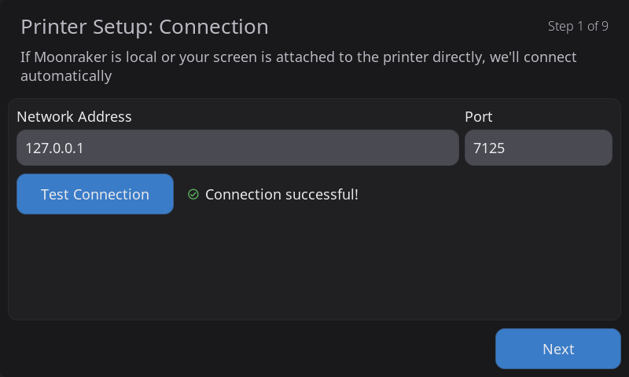
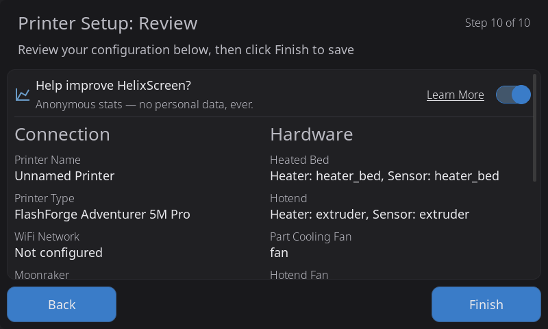

Welcome to HelixScreen — a modern touchscreen interface for Klipper 3D printers. It connects to your printer via Moonraker and provides intuitive controls for printing, temperature management, calibration, and more.

---

## Quick Reference

| Sidebar Icon | Panel | What You'll Do There |
|--------------|-------|----------------------|
| Home | Home | Monitor status, start prints, view temperatures |
| Tune | Controls | Move axes, set temperatures, control fans |
| Spool | Filament | Load/unload filament, manage AMS slots |
| Gear | Settings | Configure display, sound, network, sensors |
| More | Advanced | Calibration, history, macros, system tools |

---

## Navigation Basics

HelixScreen uses a consistent layout:

- **Left sidebar**: Five navigation buttons to switch between main panels
- **Back arrow**: Returns from sub-panels to the parent panel
- **Tap**: Select buttons, open panels, activate controls
- **Swipe**: Scroll through lists and long content

> **Note:** The Print Select panel is accessed by tapping the print area on the Home panel, not from the sidebar. The Controls and Filament panels require an active printer connection.

---

## Touch Screen Basics

HelixScreen supports these touch interactions:

| Gesture | Action |
|---------|--------|
| **Tap** | Select buttons, open panels, toggle options |
| **Swipe** | Scroll lists, move through content |
| **Long press** | Access alternate characters on keyboard |
| **Pinch/spread** | Zoom 3D views (G-code preview, bed mesh) |

Temperature displays are tappable shortcuts — tap the nozzle or bed temperature on the Home panel to jump directly to that temperature control panel.

---

## Connection Status

The Home panel shows your printer connection status:

| Indicator | Meaning |
|-----------|---------|
| Green checkmark | Connected and ready |
| Red X | Disconnected (auto-reconnect in progress) |
| Yellow exclamation | Klipper not ready (firmware restart needed) |

When disconnected, a toast notification appears and HelixScreen attempts to reconnect automatically every few seconds.

---

## First-Time Setup

When you first start HelixScreen, the Setup Wizard guides you through initial configuration.

### Setup Wizard Overview

The wizard walks you through these steps:

1. **Language selection** — Choose your interface language
2. **WiFi configuration** — Connect to your wireless network (if needed)
3. **Printer connection** — Enter your Moonraker address
4. **Hardware discovery** — Identify heaters, fans, sensors, and LEDs
5. **Touch calibration** — Calibrate your touchscreen (if applicable)
6. **Summary** — Review your configuration

You can re-run the wizard anytime via **Settings > Factory Reset**.

### WiFi Configuration


If your device needs WiFi:

1. Available networks appear in a list
2. Tap a network to select it
3. Enter the password using the on-screen keyboard
4. Tap **Connect** and wait for confirmation

The wizard shows signal strength for each network and indicates which one you're currently connected to. If you're using Ethernet, you'll see your connection status on the left — just skip ahead with **Next**.

### Printer Connection



Enter your Moonraker connection details:

- **Hostname or IP**: Your printer's address (e.g., `voron.local` or `192.168.1.100`)
- **Port**: Defaults to `7125` (auto-filled when you tap **Test Connection** if left empty)
- **API Key**: Only needed if Moonraker requires authentication

Tap **Test Connection** to verify before continuing. If the port field is empty, it auto-fills with the default port `7125`. HelixScreen auto-discovers printers on your network when possible — tap a discovered printer to auto-fill the connection details.

### Hardware Discovery



HelixScreen scans your Klipper configuration and identifies:

- **Heaters**: Hotend, bed, chamber (if present)
- **Fans**: Part cooling, hotend, auxiliary fans
- **Sensors**: Filament runout, probes, accelerometers
- **LEDs**: Chamber lights, status LEDs
- **AMS**: Multi-material systems (Happy Hare, AFC-Klipper)

For each category, confirm which hardware should be monitored and controlled. You can adjust these later in **Settings > Sensors** and **Settings > Hardware Health**.

### Touch Calibration

On touchscreen displays, you'll be prompted to tap calibration targets:

1. Tap each crosshair target as it appears (usually 4-5 points)
2. Tap as close to the center of each target as possible
3. Calibration saves automatically when complete

If your touchscreen feels inaccurate later, recalibrate via **Settings > Touch Calibration**.

---

## On-Screen Keyboard

The keyboard appears automatically for text input:

- **QWERTY layout** with number row
- **Long-press** for alternate characters (hold 'a' for '@', etc.)
- **?123 button**: Switch to symbols
- **ABC button**: Switch to letters
- **Shift**: Toggle uppercase

---

## USB Mouse & Keyboard

HelixScreen automatically detects USB mice and keyboards when plugged in at startup:

- **USB Mouse**: Works alongside the touchscreen — both are active simultaneously. A small white cursor dot appears on screen when a mouse is detected.
- **USB Keyboard**: Detected automatically. Useful for text entry fields like Wi-Fi passwords or console commands.
- **Combo devices** (e.g., Logitech K400 keyboard with trackpad): Both keyboard and trackpad functions work automatically.

Devices must be connected before HelixScreen starts. Hot-plugging is not currently supported — restart HelixScreen after connecting a new device.

**Manual override:** If auto-detection doesn't find your device, you can specify the path directly:
```bash
# In helixscreen.env
HELIX_MOUSE_DEVICE=/dev/input/event4
HELIX_KEYBOARD_DEVICE=/dev/input/event5
```

To find your device path, run `cat /proc/bus/input/devices` and look for your device name.

---

## Simulator Shortcuts

When using the SDL2 desktop simulator:

| Key | Action |
|-----|--------|
| **S** | Take screenshot (saves to /tmp/) |
| **Escape** | Exit application |

---

**Next:** [Home Panel](/docs/guide/home-panel/) | [Back to User Guide](/docs/guide/getting-started/)
