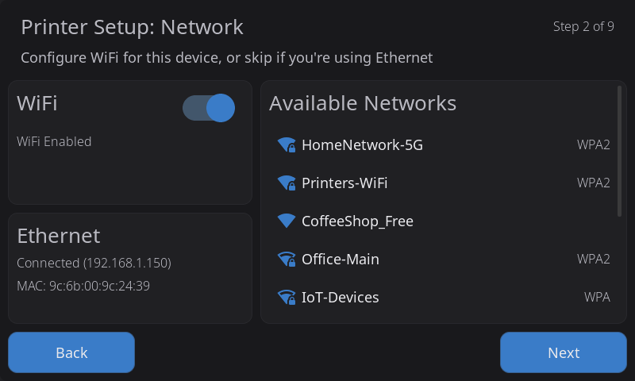
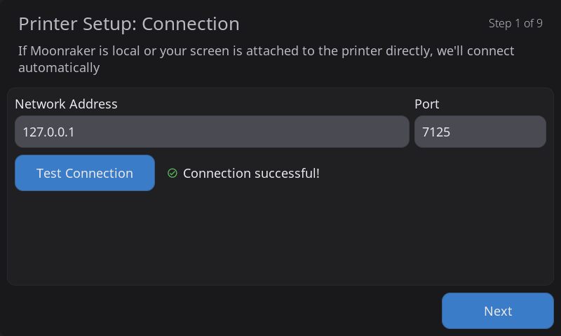

Welcome to HelixScreen — a modern touchscreen interface for Klipper 3D printers. It connects to your printer via Moonraker and provides intuitive controls for printing, temperature management, calibration, and more.

---

## Quick Reference

| Sidebar Icon | Panel | What You'll Do There |
|--------------|-------|----------------------|
| Home | Home | Monitor status, start prints, view temperatures |
| Tune | Controls | Move axes, set temperatures, control fans |
| Spool | Filament | Load/unload filament, manage AMS slots |
| Gear | Settings | Configure display, sound, network, sensors |
| More | Advanced | Calibration, history, macros, system tools |

---

## Navigation Basics

HelixScreen uses a consistent layout:

- **Left sidebar**: Five navigation buttons to switch between main panels
- **Home button**: Tapping Home returns to the Home panel (to whichever page you were last viewing). Tapping Home again while already on the Home panel jumps to the main (first) page.
- **Back arrow**: Returns from sub-panels to the parent panel
- **Tap**: Select buttons, open panels, activate controls
- **Swipe**: Scroll through lists and long content

> **Note:** The Print Select panel is accessed by tapping the print area on the Home panel, not from the sidebar. The Controls and Filament panels require an active printer connection.

---

## Touch Screen Basics

HelixScreen supports these touch interactions:

| Gesture | Action |
|---------|--------|
| **Tap** | Select buttons, open panels, toggle options |
| **Swipe** | Scroll lists, move through content |
| **Long press** | Access alternate characters on keyboard |
| **Swipe left/right on Home panel** | Switch between widget pages |
| **Pinch/spread** | Zoom 3D views (G-code preview, bed mesh) |

Temperature displays are tappable shortcuts — tap the nozzle or bed temperature on the Home panel to jump directly to that temperature control panel.

---

## Connection Status

The Home panel shows your printer connection status:

| Indicator | Meaning |
|-----------|---------|
| Green checkmark | Connected and ready |
| Red X | Disconnected (auto-reconnect in progress) |
| Yellow exclamation | Klipper not ready (firmware restart needed) |

When disconnected, a toast notification appears and HelixScreen attempts to reconnect automatically every few seconds.

---

## First-Time Setup

When you first start HelixScreen, the Setup Wizard guides you through initial configuration. You can re-run the wizard anytime via **Settings > System > Factory Reset**.

### Setup Wizard

The first time you launch HelixScreen, a setup wizard guides you through configuration. The wizard adapts to your hardware — steps that don't apply to your setup are automatically skipped.

**Core steps (always shown):**

1. **Printer Setup: Network** — Configure WiFi for this device, or skip if you're using Ethernet
2. **Printer Setup: Connection** — Enter your printer's Moonraker address. If Moonraker is local or your screen is attached directly to the printer, HelixScreen connects automatically. Otherwise, enter the host and tap **Test Connection** before continuing.
3. **Heater Selection** — Choose your bed and hotend heaters from the hardware detected on your printer
4. **Fan Selection** — Choose your part cooling and hotend fans
5. **Summary** — Review all your selections and save

**Conditional steps (shown when hardware is detected):**

| Step | Appears When |
|------|-------------|
| **Touch Calibration** | Resistive touchscreen detected (not yet calibrated) |
| **Language Selection** | Language not previously set on this device |
| **Printer Identification** | Printer model auto-detection suggests options (K1, K2, etc.) |
| **AMS / Filament System** | An AMS, CFS, Happy Hare, or other filament system is detected |
| **LED Configuration** | Addressable LED strips (NeoPixel, RGB) are discovered |
| **Filament Sensor Setup** | Multiple filament runout sensors are detected |
| **Input Shaper** | An accelerometer is detected on the printer |
| **Help Improve HelixScreen** | Shown on preset printers in place of the Summary step (see below) |

The **Help Improve HelixScreen** step asks whether to share anonymous usage statistics. No personal data is ever collected, and you can change this choice later in **Settings > System**. For details on what is and isn't collected, see the [Telemetry guide](/docs/legal/telemetry/).

The progress indicator (e.g., "Step 3 of 8") only counts the steps that apply to your setup — skipped steps aren't shown or counted.

### Preset Mode vs. Normal Setup

Some printers (for example the Creality K1 or the FlashForge Adventurer 5M) ship with a preset that already knows the hardware layout. On these devices the wizard runs in **preset mode**: it skips the heater, fan, AMS, LED, filament-sensor, input-shaper, and printer-identification steps, and shows the **Help Improve HelixScreen** telemetry step in place of the Summary. The result is a shorter, mostly automatic setup flow. On a printer without a preset, you'll see the full hardware-selection flow ending in the Summary step instead.

### Adding Another Printer

If you have beta multi-printer support enabled, you can add a second printer later from the printer manager. This re-runs the wizard for the new printer, but skips the WiFi and Language steps (those are device-wide and already configured). On the first step, the button reads **Cancel** instead of **Back** — tapping it discards the new printer and returns you to the one you were using. See [Beta Features](/docs/guide/beta-features/) for how to enable multi-printer support.

> **Tip:** You can always go back to previous steps using the **Back** button. The connection test in step 2 must pass before you can proceed.

For details on touch screen calibration, see the [Touch Calibration Guide](/docs/guide/touch-calibration/).

**What's next:** Once you finish the wizard, HelixScreen drops you on the Home panel, your main dashboard for status, prints, and temperatures — see the [Home Panel guide](/docs/guide/home-panel/).

### Network (WiFi) Configuration



This step appears on-screen as **Printer Setup: Network**. If your device needs WiFi:

1. Available networks appear in a list
2. Tap a network to select it
3. Enter the password using the on-screen keyboard
4. Tap **Connect** and wait for confirmation

The wizard shows signal strength for each network and indicates which one you're currently connected to. If you're using Ethernet, you'll see your connection status on the left — just skip ahead with **Next**.

### About WiFi Network Lists

Each network in the list can carry a small **band badge** — `2.4G` or `5G`, or `2.4/5G` when the same name is broadcast on both bands. It tells you which radio band the network lives on, which matters when a dual-band router uses one name for both: your panel follows whichever band it associates on. Badges only appear when the scan actually found networks on more than one band — on a 2.4GHz-only radio every row would read the same, so none of them do. Hardware that only supports 2.4GHz says so with a `(2.4GHz)` note next to the WiFi label in Network Settings.

### Managing WiFi After Setup

Later WiFi changes happen in **Settings > System > Network** (see [System Settings](settings/system.md#network-settings)) — pick a different network, add a hidden one, or switch the WiFi radio off entirely.

**Forgetting a network:** next to the connected network's name is a **trash icon**. Tapping it asks for confirmation, then removes the network *and its password* from this device — you'll need the password again to reconnect. Use this before passing a panel on, or when a network's password changed and reconnection keeps failing.

**Where passwords live:** WiFi passwords you enter are stored on the device itself — in the printer's own WiFi configuration where that is possible, and otherwise in HelixScreen's own credential file (`wifi_networks.json` in the HelixScreen config directory), which is readable only by its own user account and is never included in a debug bundle. Forgetting a network removes it from both places.

### Printer Connection



Enter your Moonraker connection details:

- **Hostname or IP**: Your printer's address (e.g., `voron.local` or `192.168.1.100`)
- **Port**: Defaults to `7125` (auto-filled when you tap **Test Connection** if left empty)
- **API Key**: Only needed if Moonraker requires authentication

If Moonraker is running locally — or your screen is attached directly to the printer — HelixScreen connects automatically, and you usually won't need to change anything here. Otherwise, enter the host and tap **Test Connection** to verify before continuing. If the port field is empty, it auto-fills with the default port `7125`.

**Tap Test Connection** is the answer to any connection doubt during setup. Until you finish the wizard, HelixScreen has no address to try except its default of "this machine", so on a separate display it will not reach Moonraker yet — that is expected, not a fault, and the wizard will not interrupt you with a connection error while you are still setting up. **Test Connection** reports the result for the address you actually entered, right on this step.

> **Changing the host later:** You can point HelixScreen at a different Moonraker host anytime from **Settings > System > Host** — see [System Settings](/docs/guide/settings/system/).

---

## On-Screen Keyboard

The keyboard appears automatically for text input:

- **QWERTY layout** (numbers via long-press on the top letter row)
- **Long-press** for alternate characters (hold 'a' for '@', etc.)
- **?123 button**: Switch to symbols
- **XYZ button**: Switch to letters
- **Shift**: Toggle uppercase

### Long-press characters

Every letter key has a second character on it, shown as a small grey glyph in the key's top-right corner. **Hold the key** to type it — you don't need to switch to the symbol layers.

| Hold | Get | Hold | Get | Hold | Get |
|------|-----|------|-----|------|-----|
| `q` | `1` | `a` | `@` | `z` | `*` |
| `w` | `2` | `s` | `#` | `x` | `"` |
| `e` | `3` | `d` | `$` | `c` | `'` |
| `r` | `4` | `f` | `_` | `v` | `:` |
| `t` | `5` | `g` | `&` | `b` | `;` |
| `y` | `6` | `h` | `-` | `n` | `!` |
| `u` | `7` | `j` | `+` | `m` | `?` |
| `i` | `8` | `k` | `(` |  |  |
| `o` | `9` | `l` | `)` |  |  |
| `p` | `0` |  |  |  |  |

The two punctuation keys beside the spacebar carry **three** characters each:

| Hold | Get | Also available by sliding |
|------|-----|---------------------------|
| `,` | `=` | `<` and `>` |
| `.` | `/` | `[` and `]` |

If you write Klipper macros, the ones worth memorising are **hold `f` for `_`**, **hold `h` for `-`**, **hold `j` for `+`**, and **hold `,` for `=`**. Those four cover most of what macro names and parameters need, and each is much faster than switching to `?123` and then `#+=`.

While you're holding a key, its alternate characters pop up above it. You can **slide your finger onto one** to pick it, or just lift your finger where it is to get the first one. Slide well away from the key before lifting to cancel without typing anything.

On the keys that offer several characters, **the one you pick becomes the new default**: hold `,` and slide to `<`, and from then on a plain hold of `,` gives you `<`, with the corner marking updated to match. The others stay available by sliding. This lasts for as long as HelixScreen is running — restarting restores the original order.

---

## USB Mouse & Keyboard

HelixScreen automatically detects USB mice and keyboards when plugged in at startup:

- **USB Mouse**: Works alongside the touchscreen — both are active simultaneously. A small white cursor dot appears on screen when a mouse is detected.
- **USB Keyboard**: Detected automatically. Useful for text entry fields like Wi-Fi passwords or console commands.
- **Combo devices** (e.g., Logitech K400 keyboard with trackpad): Both keyboard and trackpad functions work automatically.

Devices must be connected before HelixScreen starts. Hot-plugging is not currently supported — restart HelixScreen after connecting a new device.

**Manual override:** If auto-detection doesn't find your device, you can specify the path directly:
```bash
# In helixscreen.env
HELIX_MOUSE_DEVICE=/dev/input/event4
HELIX_KEYBOARD_DEVICE=/dev/input/event5
```

To find your device path, run `cat /proc/bus/input/devices` and look for your device name.

---

## Simulator Shortcuts

When using the SDL2 desktop simulator:

| Key | Action |
|-----|--------|
| **S** | Take screenshot (saves to /tmp/) |
| **D** | Toggle dark/light mode |
| **M** | Toggle memory stats overlay |
| **Cmd+Q** / **Win+Q** | Exit application |

---

**Next:** [Supported Printers](/docs/guide/supported-printers/) | [Back to User Guide](/docs/)
