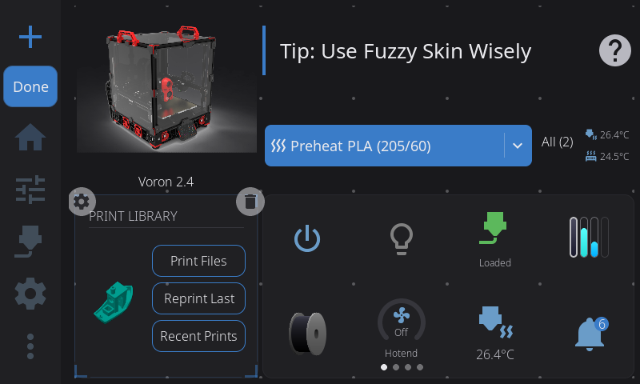
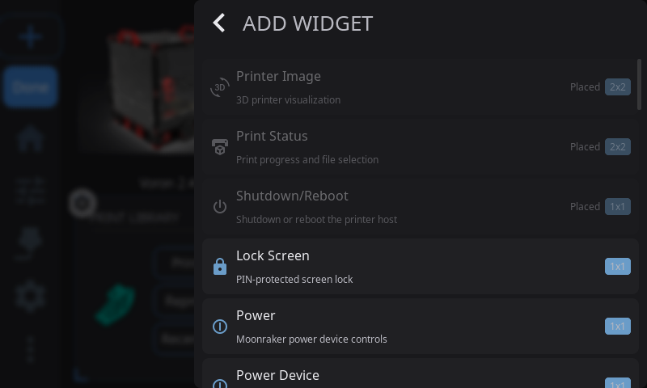
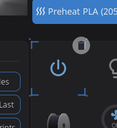
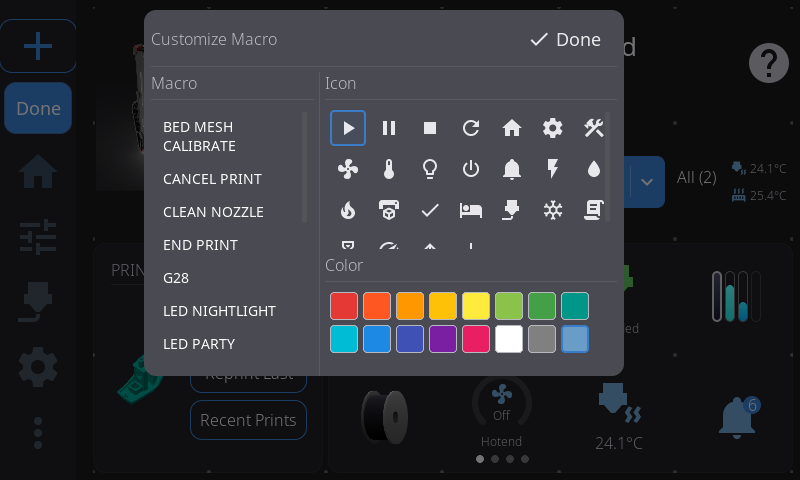
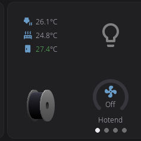
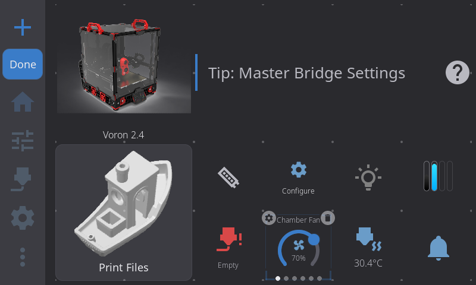
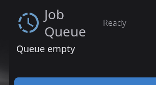
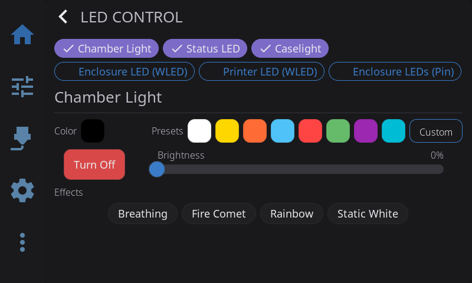
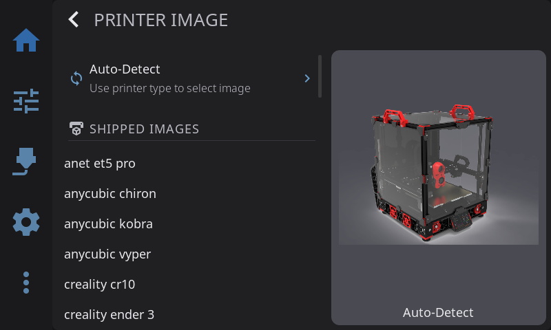
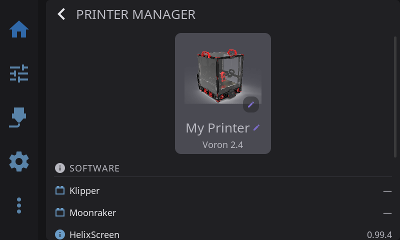

The Home Panel is your printer dashboard — a fully customizable grid of widgets spread across multiple pages, like home screens on a phone. You choose what appears, where it goes, how big each widget is, and can rearrange everything with drag-and-drop.

<!-- Screenshot: default home panel layout, idle printer -->

---

## The Widget Grid

Your dashboard is built from **widgets** — individual cards that display printer information and controls. Widgets live on a flexible grid:

- The grid is **8 columns by 5 rows** on standard and large screens (6x4 on small screens)
- Each widget occupies one or more grid cells
- Widgets cannot overlap — the grid enforces clean layouts
- **Everything saves automatically** and persists across restarts and updates

When you first launch HelixScreen, a default layout is created with your printer image, print status, tips, and commonly used widgets. From there, you can customize everything.

---

## Multiple Pages

Your dashboard can have **multiple pages** of widgets — just like home screens on a phone. Each page has its own independent grid layout.

### Navigating Between Pages

- **Swipe left or right** anywhere on the widget grid to move between pages
- **Dot indicators** at the bottom of the screen show which page you're on and how many pages you have
- If you only have one page, the dots and swiping are hidden — it works exactly like a single-page dashboard

### The Main Page

One page is designated as the **main page** (the first page by default). This is the page shown when you first connect to your printer or navigate to the Home panel.

**Home button behavior:**

- From any other panel, tapping the **Home** button takes you back to the Home panel — to whichever page you were last viewing
- Tapping **Home** again while already on the Home panel jumps to the **main page**
- So the main page is always at most **two taps** of the Home button away

### Adding a Page

1. Enter **Edit Mode** (long-press the widget grid)
2. Swipe to the **last page** — a **"+" tile** appears
3. Tap the **"+"** to create a new empty page
4. You can have up to **8 pages** maximum
5. Exit Edit Mode and start adding widgets to your new page

### Page Limit

The dashboard supports up to **8 pages**. Once you reach the limit, the "+" tile no longer appears.

---

## Edit Mode

Edit Mode is how you customize your dashboard layout. While in Edit Mode, all normal widget interactions (tapping to open overlays, etc.) are disabled so you can freely rearrange things.

**Page swiping in Edit Mode:** Swiping between pages is disabled while in Edit Mode so you can drag widgets without accidentally changing pages. The one exception is swiping past the last page to reach the "+" add-page tile. When you exit Edit Mode, normal page swiping is re-enabled.

### Entering Edit Mode

**Long-press** (press and hold for about half a second) **anywhere on the widget grid**. You'll see:

- A faint **grid of dots** appears showing the underlying grid structure
- **Corner brackets** appear on the widget under your finger, indicating it's selected
- All normal widget tap actions are disabled — you can touch anything without triggering it

The widget you long-pressed is automatically selected and ready to drag. You can start moving it immediately without lifting your finger.



### Selecting a Widget

- **Tap any widget** to select it — animated corner brackets appear at its edges
- The corner brackets **pulse** gently to indicate the active selection
- **Tap empty space** to deselect the current widget
- Only one widget can be selected at a time

### Moving a Widget

1. **Select** a widget by tapping it (or it's auto-selected when you enter Edit Mode)
2. **Press and drag** the widget to a new position
3. As you drag, a **snap preview** appears showing where the widget will land:
   - **Blue/accent preview** = valid drop position
   - **Red preview** = invalid position (would overlap another widget or go off-grid)
4. **Release** to drop the widget — it snaps into the grid position with a smooth animation
5. If the position is invalid, the widget returns to its original spot

A faint outline stays at the widget's original position while dragging so you can see where it came from.


### Resizing a Widget

Not all widgets are resizable — some (like Power and Shutdown) are always 1x1. For widgets that support resizing:

1. **Select** the widget by tapping it
2. Look for **thin edge lines** along the sides of the selected widget — these are the resize handles
3. **Drag from any edge** to resize in that direction
4. As you drag, two previews appear:
   - A thin border follows your finger exactly (pixel-tracking)
   - A grid-snapped preview shows the final size
5. The widget snaps to valid grid sizes based on its constraints:
   - Each widget has a **minimum** and **maximum** size (see the widget table below)
   - Resizing stops at the grid boundary
   - Resizing stops if it would overlap another widget
6. **Release** to apply the new size — the widget rebuilds at its new dimensions

Some widgets adapt their content based on size. For example, the Digital Clock shows just the time at 1x1, adds the date at 2x1, and shows uptime too at 2x2 or larger.


### Adding a Widget

There are two ways to add widgets:

1. While in Edit Mode, **long-press on an empty area** of the grid
2. The Widget Catalog opens

**The Widget Catalog** shows all available widgets in a scrollable list. Each entry shows:
- Widget name and description
- Size badge (e.g., "2x1")
- Widgets already on your dashboard are **dimmed** and labeled "Placed"

Tap any available widget to add it. HelixScreen places it near where you long-pressed, or finds the best available spot if that area is occupied. If the grid is completely full, you'll need to remove a widget first.



### Removing a Widget

1. **Select** the widget you want to remove
2. A **trash icon** appears — drag the widget to the trash, or tap the delete button
3. The widget is removed from your grid

Removing a widget doesn't delete any data — you can always add it back from the Widget Catalog.



### Configuring a Widget

Some widgets have settings you can change directly from Edit Mode. When you select one of these configurable widgets, a **gear icon** appears in the upper-left corner (the trash icon is in the upper-right).

**Configurable widgets:**

| Widget | What the gear button does |
|--------|--------------------------|
| **Temperatures** | Toggles between Stack and Carousel display mode |
| **Fan Speeds** | Toggles between Stack and Carousel display mode |
| **Temperature Sensors** | Toggles between single-sensor and Carousel display mode |
| **Fan** | Opens the fan picker — choose which fan to monitor |
| **Temperature Graph** | Opens a configuration modal — toggle sensors on/off and customize series colors |
| **Macro Button 1–5** | Opens the macro picker — choose which macro to assign |
| **Clog Detection** | Opens the Clog Detection config modal — set detection source, mode, and thresholds |

**To configure a widget:**

1. Enter Edit Mode (long-press the widget grid)
2. **Tap** the widget you want to configure — corner brackets and action buttons appear
3. **Tap the gear icon** in the upper-left corner
4. For Temperatures/Fan Speeds: the widget immediately switches between Stack and Carousel mode. Tap the gear again to switch back.
5. For Macro Buttons: a picker overlay opens listing all available Klipper macros. Tap a macro to assign it — the button updates immediately.




### Resetting to Defaults

Tap the **Reset** button in the Edit Mode toolbar to restore the default widget layout. This resets **all pages** back to a single page with the default layout — any extra pages you created are removed. Widget positions and sizes are reset, and the default set of enabled widgets is restored. Your per-widget settings (like display mode preferences) are preserved.

The default layout places:
- **Printer Image** in the top-left (2x2)
- **Print Status** below it (2x2)
- **Tips** across the top-right (4x2)
- Remaining enabled widgets auto-fill the rest of the grid

### Exiting Edit Mode

- Tap the **Done** button in the toolbar
- Or **navigate away** to any other panel — Edit Mode exits automatically and saves your changes

---

## Available Widgets

> **Sizes** are listed as columns x rows. For example, "2x1" means 2 columns wide and 1 row tall.

### Printer Info & Status

| Widget | Description | Default | Min | Max | Resizable | Hardware Required |
|--------|-------------|---------|-----|-----|-----------|-------------------|
| **Printer Image** | Your printer's photo. Tap to open the Printer Manager overlay where you can change the name, image, and see hardware info. | 2x2 | 1x1 | 4x3 | Yes | — |
| **Print Status** | Current print progress with filename, percentage, ETA, and elapsed time. Tap to open the full Print Status overlay when printing, or navigate to the file browser when idle. | 2x2 | 2x1 | 4x3 | Yes | — |
| **Print Stats** | Print history statistics — total prints, success rate, and total print time. Tap to open the full print history overlay. | 2x2 | 2x1 | 3x2 | Yes | — |
| **Job Queue** | Shows the number of queued print jobs. Tap to open the Job Queue Manager modal (see [Job Queue Manager](#job-queue-manager) below). | 2x2 | 2x1 | 4x3 | Yes | — |
| **Digital Clock** | Current time and date. Respects your 12/24-hour preference from display settings. Content adapts to size: time only at 1x1, time + date at 2x1, time + date + system uptime at 2x2+. | 2x1 | 1x1 | 3x3 | Yes | — |
| **Notifications** | Shows pending notification count with a severity badge (info/warning/error). Tap to open the notification history overlay. | 1x1 | 1x1 | 2x1 | Horizontal only | — |
| **Tips** | Rotating helpful tips about 3D printing and HelixScreen features. Tap any tip to see the full article. Tips rotate automatically. | 4x2 | 2x1 | 6x2 | Horizontal only | — |
| **Network** | Current network connection status — WiFi signal strength (with bar indicator) or Ethernet. | 1x1 | 1x1 | 2x1 | Horizontal only | — |
| **Camera** | Live webcam feed from your MJPEG stream. Tap to go fullscreen. Automatically detects webcams configured in Moonraker. See [Camera Widget](#camera-widget) below for setup tips. | 2x2 | 1x1 | 4x3 | Yes | Webcam configured |

### Temperature & Climate

| Widget | Description | Default | Min | Max | Resizable | Hardware Required |
|--------|-------------|---------|-----|-----|-----------|-------------------|
| **Nozzle Temperature** | Live nozzle temperature with an animated heating icon that pulses when the heater is active. Tap to open the temperature graph overlay. | 1x1 | 1x1 | 2x2 | Yes | — |
| **Bed Temperature** | Live bed temperature with current and target readings. Tap to open the temperature graph overlay. | 1x1 | 1x1 | 2x2 | Yes | — |
| **Temperatures** | Stacked view showing nozzle, bed, and chamber temperatures in one widget. Each row shows current temp and target. Also available in Carousel mode (see [Display Modes](#display-modes-stack-vs-carousel) below). Tap any reading to open the temperature graph. | 1x1 | 1x1 | 3x2 | Yes | — |
| **Temperature Sensors** | Monitor additional temperature sensors (chamber, enclosure heater, etc.) in a single-sensor or carousel view. You can add multiple instances, each configured to a different sensor. Also available in Carousel mode. | 1x1 | 1x1 | 2x1 | Horizontal only | Extra temp sensors |
| **Temperature Graph** | Live temperature chart with configurable sensor series. Shows colored lines for each sensor with optional target setpoint lines. Content adapts to size — larger sizes show legends, axis labels, gradients, and temperature readouts. Tap to open the full-screen graph overlay. Configure which sensors to display via the gear icon in Edit Mode. You can add multiple instances. | 2x2 | 1x1 | 6x4 | Yes | — |
| **Preheat** | Quick preheat buttons with material selection. Tap a material to instantly set nozzle and bed temperatures to that material's profile. | 3x1 | 2x1 | 4x1 | Horizontal only | — |
| **Humidity** | Enclosure humidity reading from a connected sensor. | 1x1 | 1x1 | 2x2 | Yes | Humidity sensor |

### Fans

| Widget | Description | Default | Min | Max | Resizable | Hardware Required |
|--------|-------------|---------|-----|-----|-----------|-------------------|
| **Fan Speeds** | Part cooling, hotend, and auxiliary fan speeds at a glance. Fan icons spin when running. Also available in Carousel mode with arc slider controls. Tap to open the Fan Control overlay. You can add multiple instances. | 1x1 | 1x1 | 3x2 | Yes | — |
| **Fan** | Monitor a single fan's speed. Tap to open a fan picker to choose which fan to display. You can add multiple instances, each showing a different fan. Configure via the gear icon in Edit Mode. | 1x1 | 1x1 | 2x1 | Horizontal only | — |

### Filament & Material

| Widget | Description | Default | Min | Max | Resizable | Hardware Required |
|--------|-------------|---------|-----|-----|-----------|-------------------|
| **Active Spool** | Shows the currently loaded Spoolman spool — displays the spool color, material type, brand, and remaining weight. Tap to edit the active spool. At compact sizes (1x1) shows just the colored spool icon; at wider sizes shows material details alongside. | 1x1 | 1x1 | 4x2 | Yes | Spoolman configured |
| **AMS Status** | Mini view of your multi-material spool slots showing filament colors and status. Tap for the full AMS panel. | 1x1 | 1x1 | 2x2 | Yes | AMS/MMU detected |
| **Filament Sensor** | Filament runout detection status. Shows whether filament is loaded. | 1x1 | 1x1 | 2x1 | Horizontal only | Filament sensor |
| **Width Sensor** | Live filament width reading from a diameter sensor. | 1x1 | 1x1 | 2x2 | Yes | Width sensor |
| **Clog Detection** | Filament clog and flow health monitor. Shows a clog/flow arc meter, and a buffer sync meter on Happy Hare printers. Tap to open the Buffer Status detail modal. Configurable via the gear icon in Edit Mode. See [Clog Detection Widget](#clog-detection-widget) below. | 1x1 | 1x1 | 2x2 | Yes | AMS/MMU detected |

### Lighting

| Widget | Description | Default | Min | Max | Resizable | Hardware Required |
|--------|-------------|---------|-----|-----|-----------|-------------------|
| **LED Light** | Quick on/off toggle for your printer's LEDs. Tap to open the full LED Control Overlay with color picker, brightness, effects, and WLED controls. | 1x1 | 1x1 | 2x1 | Horizontal only | LEDs configured |
| **LED Controls** | One-tap shortcut to open the LED color and brightness controls overlay directly. | 1x1 | 1x1 | 1x1 | No | LEDs configured |

### Controls & Automation

| Widget | Description | Default | Min | Max | Resizable | Hardware Required |
|--------|-------------|---------|-----|-----|-----------|-------------------|
| **Macro Button 1–5** | One-tap buttons to run configured macros. Up to 5 independently configurable slots. Assign a macro to each via the gear icon in Edit Mode. | 1x1 | 1x1 | 2x1 | Horizontal only | — |
| **Macros** | One-tap shortcut to open the [Macros](advanced.md#macro-execution) panel for browsing and executing Klipper macros. | 1x1 | 1x1 | 1x1 | No | — |
| **G-code Console** | One-tap shortcut to open the [G-code Console](advanced.md#g-code-console) overlay for sending commands and viewing Klipper responses. See [G-code Console Widget](#g-code-console-widget) below. | 1x1 | 1x1 | 1x1 | No | — |
| **Power** | Toggle all selected Moonraker power devices (PSU, lights, etc.) with one tap. | 1x1 | 1x1 | 1x1 | No | Power devices |
| **Power Device** | Toggle an individual Moonraker power device. You can add multiple instances, each bound to a different device. Shows the device name, state, and a customizable icon. | 1x1 | 1x1 | 1x1 | No | Power devices |

### System

| Widget | Description | Default | Min | Max | Resizable | Hardware Required |
|--------|-------------|---------|-----|-----|-----------|-------------------|
| **Shutdown/Reboot** | Shutdown or reboot your printer's host system. Shows a confirmation dialog before acting. | 1x1 | 1x1 | 1x1 | No | — |
| **Firmware Restart** | Restart the Klipper firmware. Useful when Klipper enters SHUTDOWN state. This widget automatically appears during firmware errors even if disabled. | 1x1 | 1x1 | 1x1 | No | — |
| **Lock Screen** | Locks the screen immediately with PIN protection. Only appears in the Widget Catalog after setting a PIN in Settings > Security. | 1x1 | 1x1 | 1x1 | No | PIN set in Settings |


### Hardware-Gated Widgets

Some widgets depend on specific hardware being detected by Klipper. If the hardware isn't present:

- The widget **won't appear** in the Widget Catalog
- If hardware is detected later (plugged in, configured), the widget becomes available automatically
- If hardware is removed after placing a widget, the widget **hides automatically** but keeps its grid position — it reappears if the hardware returns

| Widget | Required Hardware |
|--------|-------------------|
| Camera | Webcam configured in Moonraker (crowsnest, camera-streamer, etc.) |
| AMS Status | AMS, AFC (Box Turtle), Happy Hare, ACE (Anycubic ACE Pro), or compatible MMU system |
| Clog Detection | AMS, AFC, Happy Hare, or compatible MMU with clog/flow detection |
| LED Light / LED Controls | Any LED strip configured in Klipper (neopixel, dotstar, output_pin) |
| Power / Power Device | Moonraker power devices (PSU control, smart plugs) |
| Filament Sensor | `[filament_switch_sensor]` or `[filament_motion_sensor]` in Klipper |
| Humidity | `[temperature_sensor]` with humidity capability |
| Width Sensor | `[hall_filament_width_sensor]` in Klipper |
| Temperature Sensors | Extra `[temperature_sensor]` entries beyond nozzle and bed |

---

## Display Modes: Stack vs. Carousel

The **Temperatures**, **Fan Speeds**, and **Temperature Sensors** widgets each support two visual modes:

### Stack Mode (Default)

Compact vertical rows showing all values simultaneously. Each row has an icon, current reading, and target (if applicable). Best when you want to see everything at once without swiping.

### Carousel Mode

Full-size swipeable pages with one item per page. Indicator dots at the bottom show which page you're on. Swipe left and right to browse.

**Temperatures carousel** — each sensor (nozzle, bed, chamber) gets its own full-size page with a large animated icon and temperature readout. The nozzle icon pulses when heating. Tap any page to open the temperature graph overlay for that sensor.

**Fan Speeds carousel** — each fan gets an interactive page with a **270-degree arc slider**. Drag the arc to change fan speed directly, without opening a separate control panel. The fan icon spins at a speed proportional to the actual fan RPM.




### Switching Modes

Long-press the grid to enter Edit Mode, select the Temperatures, Fan Speeds, or Temperature Sensors widget, and tap the **gear icon** in the upper-left corner. Each tap toggles the mode. Your preference is saved per widget and persists across restarts.

---

## Widget Interactions

While **not** in Edit Mode, widgets respond to taps and other gestures:

| Widget | Tap Action |
|--------|------------|
| Printer Image | Opens Printer Manager overlay |
| Print Status | Opens Print Status overlay (printing) or File Browser (idle) |
| Print Stats | Opens print history overlay |
| Job Queue | Opens Job Queue Manager modal |
| Digital Clock | — (display only) |
| Notifications | Opens notification history |
| Tips | Opens the full tip article |
| Network | — (display only) |
| Camera | Opens fullscreen camera view |
| Nozzle Temperature | Opens temperature graph overlay |
| Bed Temperature | Opens temperature graph overlay |
| Temperatures | Opens temperature graph for the tapped sensor |
| Temperature Sensors | — (display only) |
| Temperature Graph | Opens full-screen temperature graph overlay |
| Preheat | Sets nozzle and bed temperature to the tapped material profile |
| Humidity | — (display only) |
| Fan Speeds (stack) | Opens Fan Control overlay |
| Fan Speeds (carousel) | Drag the arc slider to adjust speed directly |
| Fan | Opens fan picker to select which fan to display |
| AMS Status | Opens AMS panel overlay |
| Filament Sensor | — (display only) |
| Width Sensor | — (display only) |
| Clog Detection | Opens the Buffer Status detail modal |
| LED Light | Opens LED Control Overlay |
| LED Controls | Opens LED Control Overlay |
| Macro Button | Runs the configured macro immediately |
| Macros | Opens the Macros panel overlay |
| G-code Console | Opens the G-code Console overlay |
| Power | Toggles all selected power devices |
| Power Device | Toggles the individual power device |
| Shutdown/Reboot | Shows confirmation, then shuts down/reboots |
| Firmware Restart | Restarts Klipper firmware |
| Lock Screen | Locks the screen immediately; requires PIN to unlock |

---

## Job Queue Manager

Tap the **Job Queue** widget to open the queue manager — a full-screen modal for managing your print queue.

### Queue State

At the top, you'll see the current queue state:

- **Queue: Ready** — the queue is active and will auto-print jobs in order
- **Queue: Paused** — the queue is paused; queued jobs won't start automatically

Tap the **Start** or **Pause** button to toggle the queue state.

### Job List

Below the state indicator, all queued jobs are listed with:

- **Filename** — the name of the queued G-code file
- **Time queued** — how long the job has been waiting (e.g., "Queued 2h 15m ago", "Just queued")

### Actions

**Start a print:** Tap any job in the list. If the printer is idle, the job is removed from the queue and printing begins immediately. If the printer is already printing, HelixScreen will let you know.

**Delete a job:** Tap the **trash icon** on the right side of any job row. The job is immediately removed from the queue.

**Close:** Tap the **X** button in the top-right corner to close the modal.



### Sync with Other Interfaces

The job queue is managed by Moonraker, so jobs added from Mainsail, Fluidd, or the Moonraker API appear here automatically. Likewise, jobs deleted or started from HelixScreen are reflected in those other interfaces.

---

## Clog Detection Widget

The Clog Detection widget monitors your filament path health in real time — detecting clogs, flow issues, and buffer sync problems. It only appears when a compatible filament system is detected (Happy Hare, AFC, or another MMU with clog detection).

### What It Shows

The widget displays a **carousel** with one or two pages depending on your hardware:

**Page 1 — Clog/Flow Arc Meter** (always shown)

A 270-degree arc gauge that fills based on your clog or flow detection reading. The color shifts from green (healthy) through orange (warning) to red (danger) as the value increases. A red danger zone arc shows the warning threshold, and a peak marker tracks the highest reading seen.

The meter adapts to your detection backend:

| Backend | What the meter shows |
|---------|---------------------|
| **Encoder** | Clog percentage (0–100%) — how much the encoder reading deviates from expected |
| **Flowguard** | Symmetrical flow deviation (−100 to +100) — negative means tangle risk, positive means clog risk |
| **AFC** | Buffer fault proximity (0–100%) — how close the buffer is to a fault condition |

**Page 2 — Buffer Sync Meter** (Happy Hare with sync feedback only)

A visual representation of the physical buffer plunger position. Two nested rectangles show the buffer housing and plunger — the plunger slides up or down to indicate filament tension:

- **Center position** = balanced, healthy tension
- **Shifted up** = filament under compression (being pushed)
- **Shifted down** = filament under tension (being pulled)
- Color shifts from green → orange → red as the bias increases

A percentage label shows the exact bias reading (e.g., "+5%", "−10%"). Swipe between pages using the indicator dots at the bottom.

### Tapping the Widget

Tap the Clog Detection widget to open the **Buffer Status** modal — a detailed read-only view of your filament path health:

**Happy Hare printers show:**
- Filament tension description (e.g., "Slight tension", "Balanced")
- Spool motor state
- Gear sync status
- Clog detection mode and flow rate
- Full-size buffer meter visualization

**AFC printers show:**
- Advancing/trailing buffer state
- Distance to fault (in mm)
- Fault detection status

### Configuring Clog Detection

In Edit Mode, select the Clog Detection widget and tap the **gear icon** to open the configuration modal:

| Setting | Options |
|---------|---------|
| **Detection Source** | Auto (recommended), Encoder, Flowguard, or AFC |
| **Detection Mode** | Auto or Manual — in Manual mode, a G-code command is sent to the firmware |
| **Detection Length** | Filament distance threshold (Manual mode only) |
| **Danger Threshold** | Override the computed danger zone percentage |

**Auto** mode is recommended — HelixScreen automatically selects the best source based on your detected hardware.

---

## G-code Console Widget

The G-code Console widget gives you quick access to a full-featured command console for sending G-code commands directly to Klipper.

### Opening the Console

Tap the G-code Console widget on the Home Panel. A full-screen console overlay opens with your recent command history.

### Using the Console

**Sending commands:**
- Type a G-code command in the text field at the bottom (e.g., `G28`, `M114`, `FIRMWARE_RESTART`)
- Press **Enter** to send

**Navigating history:**
- Press the **Up arrow** to recall previous commands
- Press the **Down arrow** to move forward through history
- Commands are loaded from Moonraker's G-code store (up to 200 entries)

**Reading output:**
- Commands you sent appear in the scrolling log
- Klipper responses appear below each command
- **Error messages** are highlighted in red
- Color-coded output from plugins like AFC and Happy Hare is preserved
- Periodic temperature status messages (T:/B: reports) are filtered out to reduce noise

**Scrolling:**
- The console auto-scrolls to the newest entry as responses arrive
- Scroll up manually to pause auto-scroll and read older output
- Scroll back to the bottom to resume auto-scrolling

---

## Grid Layout Details

### Grid Dimensions

The grid adapts to your screen size:

| Screen Width | Grid Size | Total Cells |
|-------------|-----------|-------------|
| 480px and below | 6 columns x 4 rows | 24 |
| 481-700px | 6 columns x 4 rows | 24 |
| 701px and above | 8 columns x 5 rows | 40 |

### Auto-Placement

When widgets don't have an explicit position (newly added, or after a reset), HelixScreen places them automatically:

1. Larger widgets (multi-cell) are placed first to ensure they get contiguous space
2. Smaller widgets (1x1) fill the remaining gaps
3. Placement scans from top-left to bottom-right

### What Happens on Upgrade

When you update HelixScreen and new widgets are added:

- **Your existing layout is preserved** — nothing moves
- New widgets are appended with their default enabled/disabled state
- If a new widget is enabled by default, it auto-places into available grid space
- If the grid is full, new widgets stay disabled until you make room

If you downgrade and a widget type no longer exists, it's silently removed from your layout. Upgrading again restores it.

---

## Active Tool Badge

On printers with a toolchanger (IDEX, multi-head, tool-changing systems), the Home Panel displays an active tool badge:

- Shows the current active tool (e.g., "T0", "T1", "T2")
- Updates automatically when tools are switched during a print or via macros
- Color-coded to match the tool's filament color (if configured via Spoolman or AMS)
- Only visible on multi-tool printers — single-extruder printers won't see this

---

## Emergency Stop

The red **Emergency Stop** button in the top bar halts all printer motion immediately. By default, a confirmation dialog appears before executing. You can disable the confirmation in **Settings > Motion > E-Stop Confirmation**.

---

## LED Controls

Tap the **LED** widget to open the LED Control Overlay — a full control panel for all your printer's lighting. What you see depends on your hardware.

### Strip Selector

If you have more than one LED strip configured, a row of chips at the top lets you pick which strip to control. The overlay heading updates to show the selected strip name.

### Color & Brightness (Klipper Native LEDs)

For neopixel, dotstar, and other Klipper-native strips:

- **Color presets**: 8 preset swatches — White, Warm White, Orange, Blue, Red, Green, Purple, Cyan
- **Custom color**: Tap the custom color button to open an HSV color picker. Pick any color — HelixScreen automatically separates it into a base color and brightness level
- **Brightness slider**: Adjust from 0-100%, independent of color selection
- **Color swatch**: Shows the actual output color (base color adjusted by current brightness)
- **Turn Off**: Stops any active effects and turns off the selected strip



### Output Pin Lights

For `[output_pin]` lights (auto-detected by naming convention):

- **PWM pins**: Brightness slider from 0-100%
- **Non-PWM pins**: Simple on/off toggle
- Color controls are hidden since output pins don't support color

### LED Effects

If you have the [klipper-led_effect](https://github.com/julianschill/klipper-led_effect) plugin installed:

- Effect cards appear for each available effect, filtered to the currently selected strip
- The active effect is highlighted with an accent border
- **Stop All Effects** button kills all running effects at once
- Tap any effect card to activate it

### WLED Controls

For WLED network-connected strips:

- **On/Off toggle** to control the strip power
- **Brightness slider** from 0-100%
- **Preset buttons** for each WLED preset — fetched directly from your WLED device, with the active preset highlighted

### Macro Device Controls

Custom macro devices you've configured in [LED Settings](/docs/guide/settings/led-settings/) appear with controls matching their type:

- **On/Off devices**: Separate "Turn On" and "Turn Off" buttons
- **Toggle devices**: A single "Toggle" button
- **Preset devices**: Named buttons for each preset action

---

## Camera Widget

The Camera widget shows a live view from your webcam. It works with any MJPEG stream configured in Moonraker (crowsnest, camera-streamer, ustreamer, etc.).

### Setup

1. Make sure your webcam is working in Mainsail or Fluidd first
2. Open **Edit Mode** on the Home Panel (long-press)
3. Tap **+** to open the Widget Catalog
4. Add the **Camera** widget
5. Resize to your preferred size (up to 4x3)

Tap the camera feed to open a **fullscreen view**. Tap again or press back to return.

### Performance Tip

For the best camera streaming performance on Raspberry Pi, install `libturbojpeg0`:

```bash
sudo apt install libturbojpeg0
```

This enables SIMD-accelerated JPEG decoding, which is **3-5x faster** than the built-in software decoder. HelixScreen detects and uses it automatically — no configuration needed. Without it, the camera still works fine, just with slightly higher CPU usage.

> **Note:** This only applies to Raspberry Pi. The installer attempts to install this package automatically, but if it fails (e.g., offline install), you can add it later with the command above.

---

## Printer Manager

**Tap the Printer Image widget** to open the Printer Manager overlay. This is your central place to view and customize your printer's identity.

### Changing the Printer Name

1. Tap the **printer image** on the Home Panel to open the Printer Manager
2. Tap the **printer name** (shown with a pencil icon) — it becomes an editable text field
3. Type your new name (e.g., "Workshop Voron", "Printer #2")
4. Press **Enter** to save, or **Escape** to cancel

The name defaults to "My Printer" if left empty. It's saved to your config file and persists across restarts.

> **Tip:** You can also set the name directly in the config file under the `printer.name` key — see [Configuration Reference](../CONFIGURATION.md#name).

### Changing the Printer Image

1. Tap the **printer image** on the Home Panel to open the Printer Manager
2. Tap the **printer image** again (marked with a pencil badge) to open the Image Picker
3. The picker shows a scrollable list on the left and a live preview on the right
4. Choose from one of three sources:
   - **Auto-Detect** (default) — HelixScreen selects an image based on your printer type reported by Klipper
   - **Shipped Images** — Over 25 pre-rendered images covering Voron, Creality, FlashForge, Anycubic, RatRig, FLSUN, and more
   - **Custom Images** — Your own images (see below)
5. Tap an image to select it — your choice takes effect immediately



### Using Custom Printer Images

You can use your own printer photo or rendering:

**Option A: Copy to the custom images folder**

| Platform | Custom images directory |
|----------|----------------------|
| MainsailOS (Pi) | `~/helixscreen/config/custom_images/` |
| AD5M Forge-X | `/opt/helixscreen/config/custom_images/` |
| AD5M Klipper Mod | `/root/printer_software/helixscreen/config/custom_images/` |
| K1 Simple AF | `/usr/data/helixscreen/config/custom_images/` |

Copy a PNG, JPEG, BMP, or GIF file into the directory, then open the Image Picker — your image appears under the Custom Images section.

**Option B: Import from a USB drive**

1. Insert a USB drive containing image files into your printer's host
2. Open the Image Picker
3. A **USB Import** section appears at the bottom showing images found on the drive
4. Tap an image to import it — HelixScreen copies and converts it automatically
5. Once imported, the image appears under Custom Images and the drive can be removed

**Image requirements:**
- Formats: PNG, JPEG, BMP, or GIF
- Maximum file size: 5 MB
- Maximum dimensions: 2048x2048 pixels (resize before importing if larger)
- HelixScreen automatically generates optimized display variants

**Removing a custom image:**

Delete the image files from the `custom_images/` directory via SSH:

```bash
cd ~/helixscreen/config/custom_images/   # adjust path for your platform
rm my-printer.png my-printer-300.bin my-printer-150.bin
```

If the deleted image was active, HelixScreen falls back to auto-detect.

### Software Versions

Below the identity card, the overlay displays current software versions for Klipper, Moonraker, and HelixScreen, with update indicators when new versions are available.

### Hardware Capabilities

A row of chips shows detected hardware capabilities: Probe, Bed Mesh, Heated Bed, LEDs, ADXL, QGL, Z-Tilt, and others depending on your Klipper configuration.



### Managing Multiple Printers

> Requires [beta features](/docs/guide/beta-features/) to be enabled and at least two printers configured.

When you have multiple printers configured, the Printer Manager overlay shows a **Manage Printers** button at the bottom. Tap it to open the printer management screen (same as Settings > Printers).

You can also switch printers directly from the **navigation bar**. When multiple printers are configured, a badge with your printer's name appears in the nav bar. Tap it to see a quick-switch menu listing all your printers — tap any printer to switch instantly.

#### Adding Your First Extra Printer

1. Enable [beta features](/docs/guide/beta-features/) if you haven't already
2. Go to **Settings** > **Printers** (under the Printer section)
3. Tap **Add Printer**
4. The Setup Wizard launches — enter the new printer's IP address and port, select hardware, and complete the wizard
5. After the wizard finishes, you're connected to the new printer

#### Switching Between Printers

**Quick switch (fastest):**
1. Tap the **printer name badge** in the navigation bar (bottom of screen)
2. Tap the printer you want to switch to
3. HelixScreen reconnects and shows a "Connected to [name]" toast

**From Settings:**
1. Go to **Settings** > **Printers**
2. Tap the printer you want to switch to
3. The active printer is marked with a checkmark

#### Removing a Printer

1. Go to **Settings** > **Printers**
2. Tap the **trash icon** next to the printer you want to remove
3. Confirm the deletion
4. You cannot delete the printer you're currently connected to, and you cannot delete the last remaining printer

> **Note:** Removing a printer only removes it from HelixScreen. It does not affect the printer itself, its Klipper configuration, or Moonraker.

---

**Next:** [Printing](/docs/guide/printing/) | **Prev:** [Getting Started](/docs/guide/getting-started/) | [Back to User Guide](/docs/)
