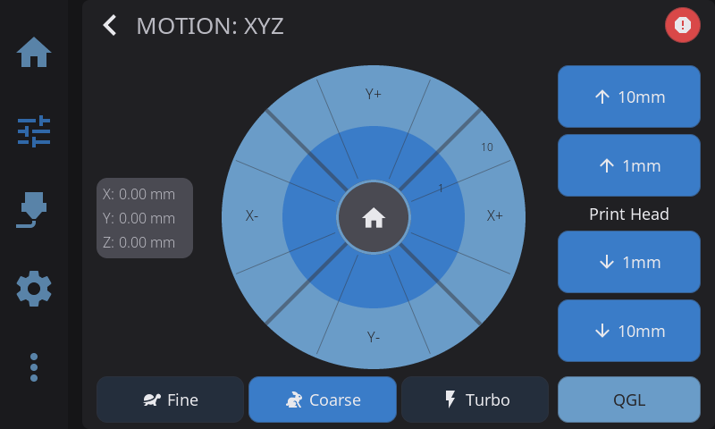
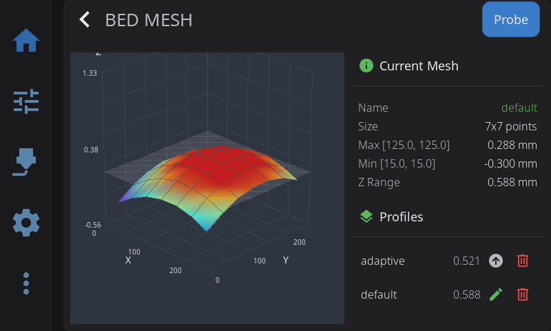

Your printer's touchscreen should show you more than temperatures and a progress bar. HelixScreen is a full-featured touch interface for Klipper printers that puts everything at your fingertips — things you'd normally need to open Mainsail or Fluidd for.

**What you get that other touchscreen UIs don't:**

- **A real dashboard** — Drag-and-drop widgets across multiple pages. Temperature graphs, fan controls, camera feeds, power toggles, favorite macros. You decide what's on screen, not the developer.
- **3D visualization** — Rotate your bed mesh with your finger. Preview G-code layers before printing. See input shaper frequency response charts right on the screen.
- **Multi-material that works** — AFC, Happy Hare, ACE, CFS, AD5X IFS, Snapmaker U1, tool changers. Seven backends, tested on real hardware. Per-unit dryer controls, environment monitoring, Spoolman integration.
- **Exclude objects** — Tap the failing part on an overhead map to exclude it mid-print. No more scrapping an entire plate for one bad object.
- **Runs on hardware you already own** — ~15MB RAM on embedded targets (a few times more on 64-bit Pi, still well under what other touchscreen UIs need). No X11, no browser, no desktop environment. Directly on the framebuffer. From a Creality K1 to a Pi Zero 2 W to a random mini-ITX box with an HDMI touchscreen.
- **Looks good** — 17 theme presets with a live editor, responsive layouts from 480x320 to 1024x600, GPU-accelerated blur. Light and dark modes. (Ultrawide and portrait screens are alpha — see [Which displays are supported?](FAQ.md#which-displays-are-supported).)
- **Smart setup** — A first-run wizard auto-detects your printer from a database of 80+ models and configures everything. 9 languages.

---

## Quick Reference

| Sidebar Icon | Panel | What You'll Do There |
|--------------|-------|----------------------|
| Home | Home | Monitor status, start prints, view temperatures |
| Tune | Controls | Move axes, set temperatures, control fans |
| Spool | Filament | Load/unload filament, manage AMS slots |
| Gear | Settings | Configure display, sound, LED, network, sensors |
| More | Advanced | Calibration, history, macros, system tools |

---

## Guide Contents

### [Getting Started](/guide/getting-started/)
Navigation basics, touch gestures, connection status, first-time setup wizard, WiFi configuration, and keyboard input.

### [Supported Printers](/guide/supported-printers/)
Which printers get deep, model-specific integration — and exactly what works on each. Covers the FlashForge Adventurer 5M/5X (IFS), Creality K1/K2 (CFS), QIDI Box, Snapmaker U1, Anycubic ACE, and how every other Klipper printer is auto-detected.

### [Home Panel](/guide/home-panel/)
Your printer dashboard — status area, configurable home widgets (temperature, network, LED, AMS, power, notifications, and more), active tool badge for toolchanger printers, emergency stop, and the Printer Manager with custom images. Customize which widgets appear and their order in Edit Mode — long-press the dashboard, then tap the **+** button on the navigation bar to open the Widget Catalog. Long-press the lightbulb widget for full LED controls with color, brightness, effects, and WLED presets.

### [Printing](/guide/printing/)
The full printing workflow — file selection, preview, pre-print options, monitoring active prints, tune overlay, Z-offset baby steps, pressure advance, exclude object, and post-print summary.

### [Print Monitoring & Failure Detection](/guide/print-monitoring/)
The pre-print filament check that catches an empty slot before a multi-color print starts, and the on-screen response to camera-based print-failure detection on supported printers (Snapmaker U1, Creality K2).

### [Temperature Control](/guide/temperature/)
Nozzle and bed temperature panels, multi-extruder selector for printers with multiple extruders, material presets, and live temperature graphs.

### [Motion & Positioning](/guide/motion/)
Jog pad controls, homing, distance increments, and emergency stop.

### [Filament Management](/guide/filament/)
Extrusion controls, load/unload procedures, AMS multi-material systems with multi-backend support (run Happy Hare, AFC, ACE, or Tool Changer simultaneously), Spoolman integration, and dryer control.

### [Filament Tracking & Spoolman](/guide/filament-tracking/)
How HelixScreen tracks material, color, and remaining weight — with the built-in tracker or a connected Spoolman server. Covers the difference between the two modes, how usage is estimated during a print, connecting a Spoolman server, and browsing your spool inventory on the touchscreen.

### [Bluetooth Setup](/guide/bluetooth-setup/)
Enable Bluetooth on Raspberry Pi or BTT Pi when it's disabled for UART, or add a USB Bluetooth dongle when your MCU uses the serial port.

### [Label Printing](/guide/label-printing/)
Print spool labels to Brother QL, Phomemo, Niimbot, or MakeID thermal printers via Network, USB, or Bluetooth. Setup, label sizes, and troubleshooting.

### [Barcode Scanner](/guide/barcode-scanner/)
Set up a USB or Bluetooth barcode scanner to read Spoolman QR codes. Includes the `ClassicBondedOnly=false` fix for Bluetooth HID scanners that fail the "bonded device" check.

### [Calibration & Tuning](/guide/calibration/)
Bed mesh visualization, screws tilt adjust, input shaper resonance testing, Z-offset calibration, and PID tuning.

### [Touch Calibration](/guide/touch-calibration/)
Fix taps that land in the wrong spot — run the calibration wizard from Settings, force it on any touchscreen, or recalibrate from the command line.

### [Settings](/guide/settings/)
Display, theme, sound, LED, network, sensors, touch calibration, hardware issues, safety, machine limits, factory reset, help & support (debug bundles, Discord, docs), and About sub-overlay (version info, updates, branding, contributors).

### [Fans](/guide/fans/)
Discovered fans grouped by controllable vs. automatic, fan types, live speed control via animated dials, RPM readouts, and per-fan renaming.

### [Sensors](/guide/sensors/)
Filament switch and motion sensors with per-sensor role assignment (None, Runout, Toolhead, Entry), read-only probe/width/humidity/accelerometer/color/temperature sensors, and chamber heater/sensor assignment.

### [Security & Screen Lock](/guide/security/)
Set, change, or remove a PIN screen lock, auto-lock tied to the display sleep timeout, the lock-screen keypad with emergency-stop access, and what a factory reset clears.

### [Camera](/guide/camera/)
Webcam viewing via the home widget and standalone fullscreen viewer, rotation and flip configuration, stream status states, and performance throttling.

### [Print History](/guide/print-history/)
History dashboard with time-range statistics and trend charts, searchable/filterable/sortable job list, per-job details, and reprinting a previous job.

### [Advanced Features](/guide/advanced/)
Console, macro execution, power device control (with home panel quick-toggle and device selection), print history, notification history, and timelapse settings.

### [Beta Features](/guide/beta-features/)
How to enable beta features, the full beta feature list, and update channel selection.

### [Tips & Best Practices](/guide/tips/)
Workflow shortcuts, quick troubleshooting table, and a "which panel do I use?" reference.

---

## Other Resources

- [Troubleshooting](/reference/troubleshooting/) — Solutions to common problems
- [Configuration](/reference/configuration/) — Detailed configuration options
- [FAQ](/reference/faq/) — Frequently asked questions
- [Installation](/installation/) — Installation instructions
- [Creality K1C Setup](guide/creality-k1c-setup.md) — Rooting, community firmware, and HelixScreen install for the K1/K1C/K1 Max
- [Upgrading](/upgrading/) — Version upgrade instructions

---

*HelixScreen — Making Klipper accessible through touch*
