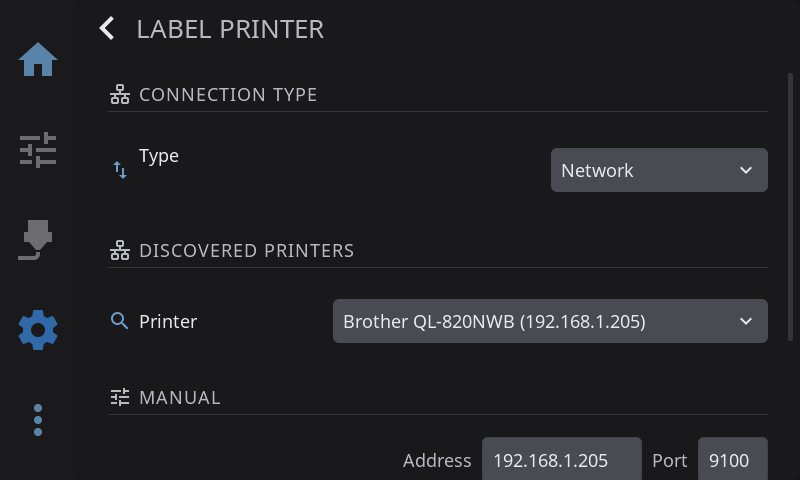

Print spool labels directly from HelixScreen to a compatible thermal label printer. Labels include spool name, material type, color swatch, temperatures, and a QR code linking back to Spoolman.

> **Two ways to print labels:** Most of this guide covers **thermal label printers** — dedicated devices (Brother, Phomemo, Niimbot, MakeID) that print one label at a time onto a roll or tape. If you don't own one, HelixScreen can also print onto **Avery-style sheet labels** using a normal networked office printer (inkjet or laser). See [Office-Printer (Sheet) Labels](#office-printer-sheet-labels) below.

---

## Supported Printers

HelixScreen supports five families of label printers:

| Brand | Connection | Models |
|-------|------------|--------|
| **Brother QL** | Network (TCP) or Bluetooth | QL-820NWB, QL-810W, QL-800, TD-*, RJ-* |
| **Brother PT** | Bluetooth | PT-P300BT, PT-P710BT, PT-P910BT, and other P-Touch models with Bluetooth |
| **Phomemo** | USB or Bluetooth | M110, M120, M02, Q199, and other M*/Q* series |
| **Niimbot** | Bluetooth only | B21, D11, D110 |
| **MakeID** | Bluetooth only | E1 (advertises as "YichipFPGA-XXXX"), L1, M1 — 9/12/16mm continuous tape |

> **Note:** Bluetooth label printing requires a Bluetooth adapter on your HelixScreen device (Raspberry Pi 4/5 have built-in Bluetooth). Devices without Bluetooth hardware will only see Network and USB options. If Bluetooth is disabled for UART, see the [Bluetooth Setup Guide](/guide/bluetooth-setup/).

---

## Setting Up Your Label Printer

### Step 1: Open Label Printer Settings

1. Go to **Settings → Hardware & Devices → Spoolman → Label Printer**
2. Tap to open the Label Printer settings overlay



### Step 2: Select Connection Type

Choose your printer's connection method:

| Type | When to Use |
|------|-------------|
| **Network** | Brother QL printers connected via Ethernet or WiFi |
| **USB** | Phomemo printers connected via USB cable |
| **Bluetooth** | Any supported printer paired via Bluetooth |

> **Bluetooth** only appears when HelixScreen detects Bluetooth hardware on your device.

### Step 3: Configure Your Printer

**For Network printers:**
1. Enter the printer's IP address
2. Port defaults to 9100 (standard for Brother QL)

**For USB printers:**
1. Connect the printer via USB
2. HelixScreen auto-detects the printer

**For Bluetooth printers:**
1. Turn on your label printer and make sure it's in pairing mode
2. Tap **Scan** to discover nearby printers
3. Select your printer from the dropdown
4. If the printer isn't yet paired, HelixScreen will prompt to pair it (most label printers use "Just Works" pairing — no PIN required)

### Step 4: Choose Label Size

Select the label size that matches your loaded label roll:

**Brother QL sizes:** 29mm, 62mm, 29x90mm, and more (300 DPI)

**Brother PT sizes:** 3.5mm, 6mm, 9mm, 12mm, 18mm, 24mm continuous tape (180 DPI). Tape width is **auto-detected** — HelixScreen reads the installed tape cassette and adjusts the label layout automatically. Narrow tapes (≤9mm) use a compact minimal layout.

**Phomemo sizes:** 40x30mm, 50x30mm, and more (203 DPI)

**Niimbot B21 sizes:** 50x30mm, 40x30mm, 50x50mm, 40x20mm, 50x80mm (203 DPI)

**Niimbot D11/D110 sizes:** 12x40mm, 12x22mm, 12x30mm, 12x50mm, 12x60mm, 12x70mm (203 DPI)

**MakeID E1 sizes:** 9x30mm, 12x30mm, 12x40mm, 16x30mm, 16x40mm (203 DPI)

> **Tip:** The size list updates automatically based on the detected printer model. A Niimbot D11 shows different sizes than a B21.

### Step 5: Choose Label Preset

| Preset | Description |
|--------|-------------|
| **Standard** | Full label with spool name, material, color, temps, and QR code |
| **Compact** | Condensed layout for smaller labels |
| **QR Only** | A QR code only — no material or color text |

---

## Printing a Label

1. Navigate to the **Spoolman** panel (via Filament tab)
2. Find the spool you want to label
3. Tap the **Print Label** button
4. The label prints automatically using your configured printer

A toast notification confirms success or shows an error message.

---

## Office-Printer (Sheet) Labels

No thermal label printer? If you have an ordinary networked office printer (inkjet or laser), HelixScreen can print spool labels onto **Avery-style sheet labels** instead. It lays out multiple spool labels on a standard Letter or A4 sheet of peel-off labels, and prints over the network — no drivers or extra software required. Under the hood HelixScreen talks to the printer using IPP (Internet Printing Protocol), the same standard your computer uses for "driverless" printing.

This is a completely separate path from the thermal label printers above — you configure it in the same **Label Printer** settings screen, but you pick your office printer instead of a thermal one.

### Step 1: Set the Connection Type to Network

1. Go to **Settings → Hardware & Devices → Spoolman → Label Printer**
2. Under **Connection Type**, set **Type** to **Network**

### Step 2: Pick Your Office Printer

Under **Discovered Printers**, open the **Printer** dropdown. HelixScreen automatically scans your network for printers. Office printers that support driverless printing appear with an **[IPP]** tag after their name, for example:

```
Office HP LaserJet [IPP]
```

Select the printer with the **[IPP]** tag. HelixScreen fills in its address and sets the port automatically (IPP printers use port **631**).

> **If your printer doesn't show up:** Make sure it's powered on, connected to the same network, and has driverless / AirPrint / IPP printing enabled (most modern printers do by default). You can also type the printer's IP address into the **Manual** field under the Network section, but selecting the discovered **[IPP]** entry is the reliable way to turn on IPP mode.

### Step 3: Choose the Sheet (Label Size)

Once an IPP printer is selected, the **Label Size** dropdown lists Avery-style sheet templates instead of thermal roll sizes. Pick the one that matches the label sheets you loaded in the printer:

| Sheet | Layout |
|-------|--------|
| **Avery 5160** | 30 labels, 1" x 2-5/8" (Letter) |
| **Avery 5163** | 10 labels, 2" x 4" (Letter) |
| **Avery 5167** | 80 labels, 1/2" x 1-3/4" (Letter) |
| **Avery 5195** | 60 labels, 2/3" x 1-3/4" (Letter) |
| **Avery 5199** | 4 labels, 3-1/2" x 4" (Letter) |
| **Avery 8126** | 2 labels, 8-1/2" x 5-1/2" (Letter) |
| **Avery L7160 / L7159 / L7161 / L7163** | 14–24 labels per A4 sheet |

Pick your **Preset** (Standard, Compact, or QR Only) the same way as for thermal printers.

### Step 4: Print a Label onto a Sheet

1. Navigate to the **Spoolman** panel (via the Filament tab)
2. Find the spool you want to label and tap **Print Label**
3. Because your printer is set to an office (IPP) printer, a **Sheet Label Print** dialog appears instead of printing right away:

| Option | What it does |
|--------|--------------|
| **Template** | Shows the sheet you selected in settings (read-only) |
| **Labels** | How many copies of this label to print on the sheet |
| **Start at** | Which position on the sheet to begin at (**Position 1**, **Position 2**, …) |

4. Tap **Print** to send the job, or **Cancel** to back out

The **Start at** option lets you reuse a partially-used sheet: if you've already peeled off the first few labels, choose the position of the first blank label so HelixScreen skips the used ones and prints into the empty spots. HelixScreen remembers your **Labels** choice for next time.

### Notes and Limits

- Requires a networked printer that supports driverless (IPP) printing — most inkjet and laser printers made in the last several years do.
- Only the Avery-style sheet sizes listed above are available in this mode. Thermal roll and tape sizes only apply to thermal label printers.
- Bluetooth and USB connection types are for thermal printers only. Sheet printing is always over the network.
- Use the **Test Print** button in Label Printer settings to confirm the printer responds before printing real spool labels.

---

## Troubleshooting

### Bluetooth printer not found during scan

- Make sure the printer is powered on and in discoverable mode
- Move the printer closer to the HelixScreen device (Bluetooth range is typically 10 meters)
- Try scanning again — some printers take a few seconds to advertise

### Print says "success" but nothing prints

- Check that the printer has labels loaded and isn't in an error state (paper jam, cover open)
- For Bluetooth printers, try turning the printer off and on, then print again
- Check the label size setting matches the actual label roll loaded in the printer

### "Bluetooth not available" error

- Your device doesn't have Bluetooth hardware, or it's disabled
- On Raspberry Pi, check that Bluetooth is enabled: `bluetoothctl show` should list an adapter
- If Bluetooth is disabled for UART (common in Klipper setups), see the [Bluetooth Setup Guide](/guide/bluetooth-setup/) for how to enable it or add a USB dongle
- The Bluetooth plugin (`libhelix-bluetooth.so`) must be present next to the HelixScreen binary

### "No USB printer detected"

- Unplug and replug the USB cable
- Try a different USB port
- Check that the printer is powered on

### Niimbot printer not connecting

- Niimbot printers use BLE (Bluetooth Low Energy), which requires Bluetooth 4.0 or later
- Make sure no other app (like the Niimbot phone app) is currently connected to the printer — BLE only allows one connection at a time
- Power cycle the printer and try again

### Niimbot first print is slow

- The first print after connecting takes a few extra seconds — HelixScreen needs to initialize the BLE connection and warm up the printer's thermal subsystem
- Subsequent prints are faster because the connection stays alive between jobs

### MakeID printer not working

- MakeID E1 advertises as "YichipFPGA-XXXX" over Bluetooth — look for this name during scanning
- Make sure no other app (like the MakeID phone app) is connected to the printer
- MakeID printers use Bluetooth Classic (RFCOMM), so any Bluetooth adapter that supports standard Bluetooth will work (BLE-only dongles are not required)
- Power cycle the printer and try again if the first attempt fails

### Brother PT printer not printing

- Brother PT printers connect via Bluetooth Classic (RFCOMM), not BLE — make sure your Bluetooth adapter supports standard Bluetooth profiles
- The printer must be paired at the OS level first, then configured in HelixScreen with its Bluetooth MAC address
- If auto-detection shows "No tape installed", check that a tape cassette is properly seated in the printer
- If the label is blank or cut incorrectly, the tape width may not have been detected properly — power cycle the printer and try again
- For narrow tapes (3.5mm, 6mm), labels use a minimal format with less detail — this is expected

---

**Next:** [Barcode Scanner](/guide/barcode-scanner/) | **Prev:** [Bluetooth Setup](/guide/bluetooth-setup/) | [Back to User Guide](/guide/)
