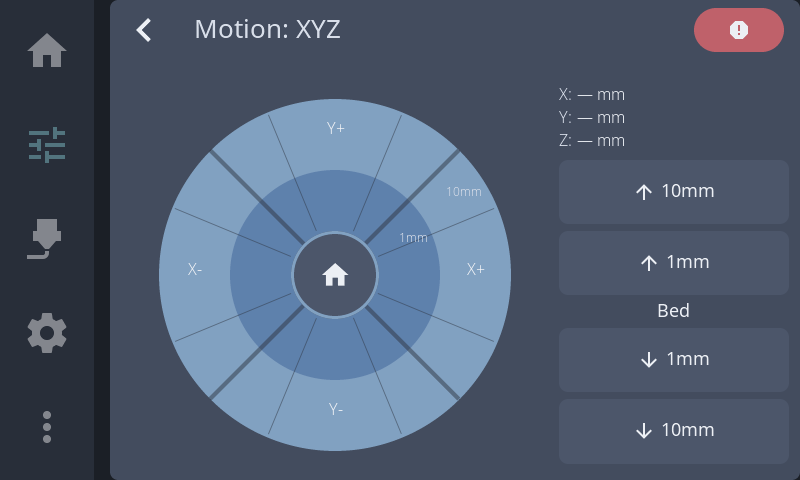

---

## Jog Pad

- **X/Y crosshair**: Tap directions to move print head horizontally
- **Z buttons**: Up/down arrows for vertical movement
- **Position display**: Shows current X, Y, Z coordinates

---

## Homing

| Button | Action |
|--------|--------|
| **Home All** | Homes X, Y, and Z axes |
| **Home XY** | Homes only X and Y |
| **Home Z** | Homes only Z (requires X/Y homed first on most printers) |

---

## Distance Increments

Select movement distance per button press:

- **0.1mm**: Fine positioning
- **1mm**: Standard adjustments
- **10mm**: Moderate moves
- **100mm**: Large repositioning

Smaller increments give more control but require more taps.

---

## Emergency Stop

The E-Stop button halts all printer motion immediately. By default, requires confirmation to prevent accidental presses. This can be configured in **Settings > Safety**.

---

**Next:** [Filament Management](/docs/guide/filament/) | **Prev:** [Temperature Control](/docs/guide/temperature/) | [Back to User Guide](/docs/guide/getting-started/)
