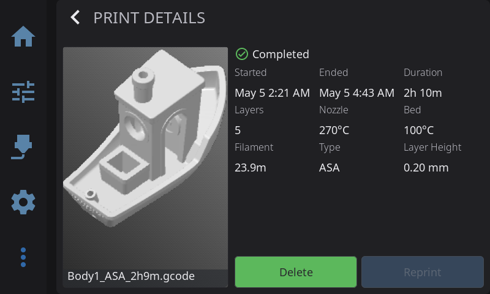

HelixScreen keeps a record of your completed, failed, and cancelled prints (sourced from Moonraker's job history). The history view has two parts: a dashboard with summary statistics and trend charts, and a full searchable list with per-job details and reprinting.

Open it from **Advanced > Print History**.

---

## History Dashboard

The dashboard opens with a summary across a selectable time range and two charts.

### Time filters

A row of filter buttons sets the time range for the statistics and charts:

**Day · Week · Month · Year · All**

All is the default. For accurate lifetime figures, the All Time view pulls Total Prints, Print Time, and Filament Used from Moonraker's server-side history totals rather than the recently cached jobs; the Success Rate and the charts are still based on your most recent jobs.

### Statistics

Four stat cards summarise the selected range:

| Stat | What it shows |
|------|---------------|
| **Total Prints** | Number of jobs in the range |
| **Print Time** | Total time spent printing |
| **Filament Used** | Total filament used (mm, m, or km) |
| **Success Rate** | Percentage of jobs that completed successfully |

The success rate is the share of jobs in the range that finished with a **Completed** status (completed jobs ÷ total jobs).

### Charts

- A **trend** sparkline shows how many prints occurred over the selected period (hourly for Day, daily for Week/Month, monthly for Year).
- A **filament-by-type** chart breaks down filament usage by material (PLA, PETG, etc.), showing the top types by amount.

If you have no print history yet, an empty state is shown instead of the stats and charts.

Tap **View Full History** to open the detailed list.

---

## History List

The full list shows individual jobs and gives you tools to find a specific one.

### Search, filter, and sort

- **Search** — type to filter jobs by filename; a clear button resets it.
- **Status filter** — All, Completed, Failed, or Cancelled.
- **Sort** — Date (newest), Date (oldest), Duration, or Filename.

Each row shows the job's filename, status, and key details. When filters are active and nothing matches, the list tells you no jobs match; otherwise the empty state hints that completed prints will appear there.

---

## Print Details & Reprinting

Tap a job to open its detail view, which shows:

- Filename and status (Completed / Cancelled / Failed / In Progress) with a matching icon
- Start time, end time, and duration
- Layer count and layer height
- Nozzle and bed temperatures
- Filament used and filament type
- A thumbnail, when one is available

From the detail view you can:

- **Reprint** — re-run the job. HelixScreen jumps to the Print Select file detail for that file so you can start it again. Reprint is only available when the original file still exists on the printer; if it's been removed, you'll see a notice instead.
- **Delete** — remove the job from the history.
- **View Timelapse** — shown only when a timelapse is available for that job.

---

**Prev:** [Camera](/guide/camera/) | **Next:** [Advanced Features](/guide/advanced/) | [Back to User Guide](/guide/)
