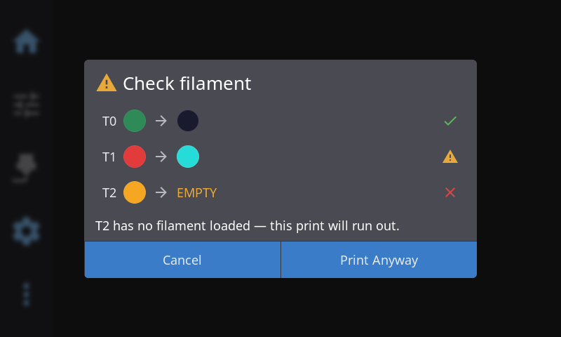
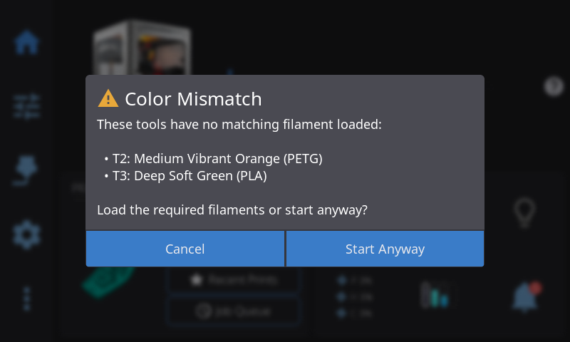
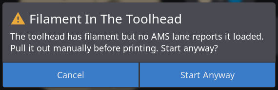
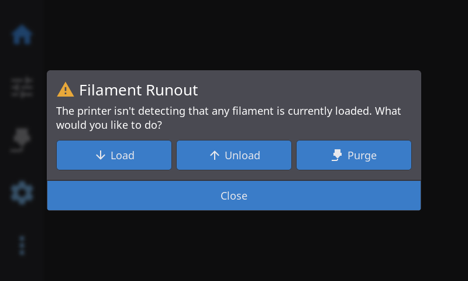

HelixScreen watches over a print in two ways: it runs a series of filament checks *before* a job starts (an empty required slot stops with **Check filament**; unassigned tools, a grade or material change, stray filament in the toolhead, and a too-light spool each raise their own warning below), and — on printers that support it — it reacts when the printer's own camera spots a print going wrong. This page covers both.

---

## Pre-Print Filament Check

When you start a multi-color or multi-tool print, HelixScreen compares what the sliced file expects in each tool against what's actually loaded in your filament system. If a required tool points at an **empty slot**, HelixScreen stops and shows a **Check filament** dialog before anything heats up or moves — so you don't discover the problem halfway through a long print.

This check runs automatically. You don't turn it on; it's part of starting any print on a system with a multi-slot filament backend (AMS, CFS, IFS, Box Turtle, Happy Hare, etc.). On a single-extruder printer with no such system, there are no slots to compare against, so this dialog never appears — filament presence there is handled by your runout sensor instead.

**Printing from bypass is the other exception.** When bypass is engaged, filament goes straight to the extruder without passing through any slot, so there is no slot for the check to look at and every tool would read as unfed. Rather than warn about all of them, HelixScreen skips the slot checks for as long as bypass stays engaged — and tells you so: the file details show a **Bypass active** note (and, for a single-tool file, hide the filament mapping card entirely — the lanes aren't feeding this print, so there is nothing to assign), and if the material you set on the external spool doesn't match what the file was sliced for (for example, the file says ASA but the spool holds PLA), you get one **Material Mismatch** warning naming the spool. A same-material *grade* difference there — file sliced ASA-GF, spool holding plain ASA — raises the [Filament Grade Mismatch](#the-filament-grade-mismatch-dialog) warning below instead. Tap **Start Anyway** to print regardless. Disengage bypass and the slot checks come back on the next print — you don't have to restart anything.

### What the check looks at

For every tool the file uses (T0, T1, T2, …), HelixScreen compares the slot mapped to that tool against the slicer's intent:

| Result | What it means | Row glyph |
|--------|---------------|-----------|
| **Match** | The mapped slot has filament, and its material and color line up with the file | Green check (✓) |
| **Color differs** | Right material, but the loaded color doesn't match the file's color | Amber warning (⚠) |
| **Material differs** | The loaded material doesn't match what the tool needs | Amber warning (⚠) |
| **Empty slot** | The tool maps to a slot with no filament in it | Red cross (✗) |

### The Check filament dialog

The dialog appears when at least one required tool maps to an empty slot **and** you are not printing from bypass — an empty slot is the one condition serious enough to stop a print. When it opens, you see one row per tool:

- A **`Tx`** label (the tool number)
- The **slicer's intended color** as a swatch
- An **arrow**
- The **actually-loaded color** as a swatch, or an **`EMPTY`** label if that slot has no filament
- A **severity glyph** (✓ / ⚠ / ✗) on the right

Below the rows, a short explanation calls out the first blocking problem, for example:

> *T1 needs filament in slot 2, which is empty — this print will run out.*

**Buttons:**

| Button | Action |
|--------|--------|
| **Remap…** | Opens the tool-to-slot mapping so you can point the tool at a slot that has filament. Only shown when your filament system supports remapping — it's hidden on ACE and single-extruder (no-AMS) systems. |
| **Cancel** | Backs out without printing. Load or map the missing filament, then start again. |
| **Print Anyway** | Starts the print despite the warning. Use this only if you know the check is wrong (for example, filament is physically loaded but not yet detected). |

> **Note:** An empty slot is the only thing that raises this dialog. A **material or color mismatch does not stop the print** — those are advisory. They show up as a warning icon on the filament mapping card when you pick the file (see [Tool Mapping](filament.md#tool-mapping)), and if the dialog is already open for an empty slot, mismatched tools show an amber warning glyph on their row too.

> **Tip:** If you meant to load that filament, tap **Cancel**, sort out the slot from the [AMS panel](filament.md#ams--multi-material-systems), and start the print again — the check re-runs each time. It also re-runs the moment your filament system's state changes, so loading a slot (or engaging bypass) while the file is still open clears the warning without reopening it.

### The Color Mismatch dialog

There's a second, separate dialog you may see right after the first one clears. Where **Check filament** is about a tool pointing at a slot that's *empty*, **Color Mismatch** is about a tool that doesn't point at a slot **at all** — the file asks for a tool your filament system has no lane assigned to. That happens most often when a file was sliced for more tools than your system has, or when automatic matching couldn't find a home for one of them.

It lists each unmatched tool with the color and material the file wants:

> *T2: Medium Vibrant Orange (PETG)*

**Buttons:**

| Button | Action |
|--------|--------|
| **Cancel** | Backs out without printing. Assign the tool from [Tool Mapping](filament.md#tool-mapping), then start again. |
| **Start Anyway** | Starts the print regardless. Your printer's firmware decides what to do when it reaches that tool. |

The name is a little misleading — despite "Color Mismatch", a merely *wrong* color never raises it. It only appears when a tool has no matching filament at all.

Like the empty-slot check, this one is skipped while you're printing from bypass — for a single-tool file, which is the normal bypass case. A multi-tool file with bypass engaged gets its own warning instead: the printer may refuse to load a lane while bypass filament is in the toolhead.

### The Filament Grade Mismatch dialog

Some filaments are the same plastic with something mixed into it. **PLA-CF** is PLA with chopped carbon fibre; **ASA-GF** is ASA with glass fibre; wood, marble, metal and glow-in-the-dark filaments carry a powder. Those all print differently from the plain version — slower, because the filler thickens the melt, and they grind away at a brass nozzle, which is why they normally want a hardened one. A slicer profile for a filled filament is not the profile for its plain counterpart.

Marketing suffixes are the opposite case. **PLA+**, **ABS+** and the like are the same plastic with a toughener, printed on the same hardware with much the same settings, and **Silk** and **Matte** are finishes rather than fillers.

So when the loaded filament is the same material as the file wants but a different *grade*, HelixScreen shows **Filament Grade Mismatch** rather than the Material Mismatch dialog — the polymer is right, so calling it a material mismatch would be misleading, but the difference is still worth a look. It is a warning, never a block, and **PLA vs PLA+** raises nothing at all.

The wording depends on which way round it is, because the risk isn't symmetric:

| Situation | What you're told |
|-----------|------------------|
| The **loaded** spool is the filled one (file wants PLA, lane holds PLA-CF) | That filled filament runs at a lower flow rate and needs a hardened nozzle — this is the direction that can wear out a brass nozzle |
| The **file** is the filled one (file wants PLA-CF, lane holds PLA) | That it will print slower and hotter than the loaded spool needs — a waste of time, not a hardware risk |

**Buttons:** **Start Anyway** prints as-is; **Cancel** backs out so you can load the right spool.

Your tool mapping is unaffected either way. HelixScreen still routes the tool to that lane, exactly as it did before — the grade difference changes what you're told, not where the filament comes from.

### The Filament In The Toolhead dialog

The dialogs above compare what the *file* needs against what your slots hold. This one looks at the toolhead itself: filament is sitting in it, but no lane in your filament system reports having loaded it. That usually means leftovers — filament that was on its way in or out when an earlier job was cancelled or aborted, and never got seated in a lane. Rather than silently print on top of unknown material, HelixScreen asks first:

> *The toolhead has filament but no AMS lane reports it loaded. Pull it out manually before printing. Start anyway?*

**Buttons:**

| Button | Action |
|--------|--------|
| **Start Anyway** | Starts the print with the stray filament left in the toolhead. Reasonable when you know what it is and it matches the file — the tail of the spool you just printed with, for example. |
| **Cancel** | Backs out. Pull the filament out by hand (or load it properly from a lane), then start the print again. |

Only filament systems that can actually tell raise this dialog — AFC (Box Turtle), Happy Hare, Creality CFS, and FlashForge AD5X IFS. On a system that can't determine it, the dialog never appears, and printing from bypass skips it too: bypass means the toolhead filament is the external spool's, which is exactly what you intended.

### The Not Enough Filament dialog

This one is about quantity, not identity: when you print from the **external spool** and HelixScreen knows how much filament is left on it — a spool tracked through Spoolman with its remaining weight recorded — it compares that against what the file is expected to use before starting:

> *This print needs about 108g but the spool has about 62g remaining. Start anyway?*

**Buttons:**

| Button | Action |
|--------|--------|
| **Start Anyway** | Starts the print. Often reasonable: the estimate comes from the slicer's numbers, and spools frequently hold a little more than their label says — a small shortfall may still fit. |
| **Cancel** | Backs out. Swap in a fuller spool (or a fresh one) and start again. |

The estimate uses the file's own filament weight when the slicer recorded it; when it only recorded a length, HelixScreen converts it using the material set on the spool. Two honest silences: spools whose remaining weight is unknown are never compared (there is nothing to compare against), and spools sitting in AMS slots are not covered by this dialog — slot-level tracking belongs to your filament system.

---

## Filament Runout During a Print

When the runout sensor stops detecting filament during a print, **the printer's own firmware pauses the job** - that happens before HelixScreen is involved at all. HelixScreen notices the pause and shows the **Filament Runout** modal so you can recover without dropping to the console.

| Button | Action |
|--------|--------|
| **Load** | Runs your load sequence (heat → feed → purge) to bring fresh filament to the nozzle. On an AMS system this loads from the active slot. |
| **Unload** | Retracts the remaining filament so you can swap the spool before loading. |
| **Purge** | Extrudes a little filament to clear the old color or confirm flow. |
| **Close** | Dismisses the modal — resume the print from the status screen once filament is loaded. |

This modal is what handles the recovery on tool-changer and single-extruder printers, on any multi-filament system running from an external spool (bypass), and on the Anycubic ACE and QIDI Box - those two report nothing of their own when filament runs out. Bypass prints get extra protection automatically: when you engage bypass, HelixScreen switches on the toolhead runout sensor at the printer if the filament system's own software had left it off, and switches it back when you disengage.

Systems that *do* raise their own runout alert show that alert instead, so one runout never produces two dialogs. What actually happens next differs by system:

- **AFC (Box Turtle) and Happy Hare** can switch to a backup slot, if you configured one and it holds compatible filament. Otherwise their alert offers the recovery buttons.
- **Creality CFS** always pauses the print first. The box only swaps spools when auto-refill is switched on *and* another slot holds the exact same material **and** colour. If either condition is missing it says so and the print simply stays paused until you load filament and resume.
- **FlashForge AD5X IFS** does not switch spools at all on stock firmware. Its alert tells you filament ran out and offers Resume, Purge, and an IFS reset.

---

## Print-Failure Detection

Some printers include their own camera-based failure detection that watches for problems like spaghetti (a print that has detached and turned into a tangle). When that hardware flags a defect, HelixScreen surfaces it on the touchscreen so you can decide what to do without walking over to a web interface.

**This is hardware-specific.** The interactive on-screen response described below currently applies to the **Snapmaker U1** running its stock firmware, whose defect-detection module reports failures HelixScreen can catch. Creality K2 printers handle AI monitoring differently — see [Creality K2 AI detection](#creality-k2-ai-detection) below.

### What happens on a detection (Snapmaker U1)

When the U1's detector flags a spaghetti-type failure, the printer pauses the print on its own, and HelixScreen pops up a **Print issue detected** dialog describing the problem. You get three choices:

| Button | Action |
|--------|--------|
| **Resume** | Continues the paused print. |
| **Abort** | Cancels the print. |
| **Reduce Sensitivity** | Tells the printer to be less trigger-happy about flagging issues, and leaves the dialog open so you can then Resume or Abort. Use this if you're getting false alarms. |

> **Note:** Only spaghetti-type failures are surfaced this way today. The U1's other defect codes (dirty bed, residue, dirty nozzle) are recognized internally but don't currently raise this dialog.

> **Note:** The dialog shows the text description of the detected issue; it does not include a live camera still.

### Is it always on?

Failure detection is **on by default** on supported hardware, and there's currently no on-screen setting to switch it off or change how it responds. If you're getting false alarms, tap **Reduce Sensitivity** when the dialog appears — that tells the printer to be less aggressive about flagging issues.

### Creality K2 AI detection

Creality's **K2 Plus** and **K2 Pro** ship their own camera-based AI print monitoring in firmware. HelixScreen never runs that detection or shows its results — the most it can do is ask the printer to switch its own monitoring on for a print, offered as an **AI detection** pre-print option.

**On current Creality firmware that option does not appear, and that is expected.** HelixScreen only offers it when the printer's firmware provides the command that drives it, and stock K2 firmware registers no AI command at all. Creality's AI stack is also disabled in the printer's own settings and driven by background services that HelixScreen replaces when it takes over the screen, so there would be nothing for the toggle to switch on.

If you run firmware that does provide the command, the option appears in **Pre-Print Options** when you open a file, **off by default**. Turn it on and the printer runs its own monitoring for that print, handling any detection itself.

> **Note:** Because this is handled entirely by the printer, the Resume / Abort / Reduce Sensitivity dialog above does **not** apply to K2 AI detection.

---

## See Also

- [Filament Management](/guide/filament/) — AMS slots, tool mapping, and loading filament
- [Printing](/guide/printing/) — Starting prints, pre-print options, and monitoring during a print
- [Supported Printers](/guide/supported-printers/) — Which detection and filament features each model supports

---

**Next:** [Temperature Control](/guide/temperature/) | **Prev:** [Printing](/guide/printing/) | [Back to User Guide](/guide/)
