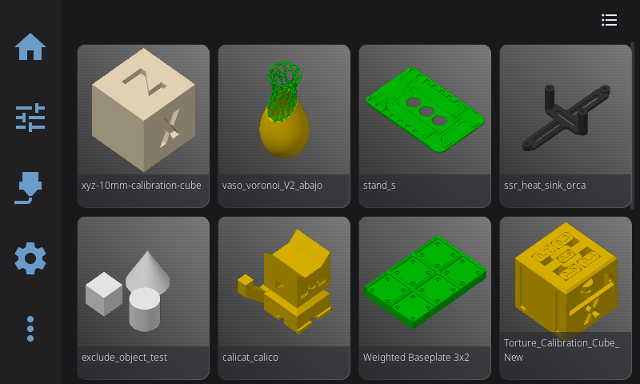
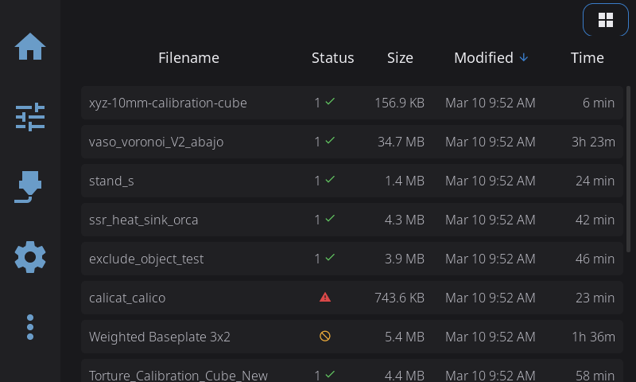
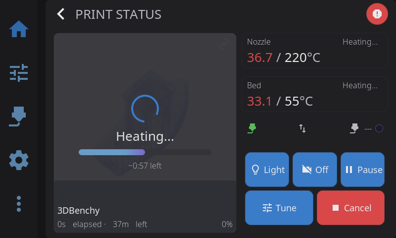

Everything about selecting, starting, monitoring, and tuning your prints.

---

## Selecting a File

1. From the **Home panel**, tap the print file area (shows "Select a file" when idle)
2. Browse your G-code files from Moonraker's virtual SD card

**File source tabs:**

If your printer exposes a USB drive, the top-left of the panel shows **Printer** and **USB** tabs. Tap a tab to switch which storage the file browser lists — **Printer** shows files on the printer's storage (Moonraker's virtual SD card), **USB** shows files on the attached USB drive. The tabs only appear when more than one source is available.

**View options:**

- **Card View** (default): Thumbnails with file info — estimated time, filament usage, slicer
- **List View**: Compact view for browsing many files (toggle with the grid icon in top-right)

List view shows filename, print status, file size, modification date, and estimated print time in a sortable table. Tap any column header to sort.

**Sorting options** (tap the sort button):

- Name (A-Z or Z-A)
- Modified date (newest or oldest first)
- Size (largest or smallest)
- Print time (longest or shortest)

---

## Sending Prints from OrcaSlicer

Files you slice in OrcaSlicer can be sent straight to your printer over the network, where they show up in the file browser above — no USB stick or web upload needed. **OrcaSlicer 2.4.0 or newer** added a native Klipper/Moonraker connection that makes this work out of the box; HelixScreen needs nothing configured on its side.

In OrcaSlicer:

1. Open **Printer Settings** (the gear next to your printer profile) → **Connection** (or the printer/network icon in the device area).
2. Set the host type to **Moonraker (Klipper)**.
3. Enter your printer's address — the same IP or hostname your printer's web interface (Mainsail/Fluidd) uses, e.g. `http://192.168.1.50` or `http://myprinter.local`.
4. **API key** (only if your Moonraker requires one): paste the key from your Moonraker config. Most home setups can leave this blank.
5. Click **Test** — OrcaSlicer confirms it can reach the printer.

Once connected, OrcaSlicer's **Print** button uploads the sliced file and (optionally) starts it. The file appears in HelixScreen's file browser like any other, and you can also start it from the touchscreen.

> **Older OrcaSlicer (2.3.x):** the native Moonraker option isn't available. Either upgrade to 2.4.0+, use the older **Octo (Klipper)** host type, or just export the G-code and copy it through Mainsail/Fluidd.

> **Filament presets come along for the ride:** if your AMS slots are configured in HelixScreen, OrcaSlicer pre-selects matching filament presets automatically — see the [Filament guide](filament.md#syncing-with-orcaslicer-232-and-later-including-240).

---

## File Preview

Tap a file to see the preview panel:

- **3D G-code preview**: Rotatable with touch, showing the toolpath
- **Metadata**: Estimated time, filament weight, layer count, material, and layer height
- **Pre-print steps**: Shows which calibration steps will run before printing (e.g., bed mesh)
- **Timelapse toggle**: Enable recording if you have the timelapse plugin installed

---

## Pre-Print Options

Before starting, you can enable or disable:

| Option | What It Does |
|--------|--------------|
| Auto bed level | Run bed mesh calibration before print |
| Quad gantry level | Run QGL calibration (for gantry printers) |
| Z-tilt adjust | Run Z-tilt calibration |
| Nozzle clean | Execute your cleaning macro |

These options modify the G-code on-the-fly — if you disable "Auto bed level" but your G-code contains `BED_MESH_CALIBRATE`, HelixScreen comments it out so it doesn't run.

> **Tip:** Pre-print options remember your preferences per slicer. If you always run bed mesh before PrusaSlicer prints, that preference persists.

---

## Starting a Print

1. Select your file
2. Review and set pre-print options
3. Tap **Start Print**

The UI switches to the Print Status panel automatically.

---

## During a Print

The Print Status panel shows:

- **Circular progress indicator** with percentage
- **Time elapsed** and **time remaining**
- **Current layer** / total layers
- **Filament used** — live consumption updated during printing
- **Filename** and thumbnail

**Print controls:**

| Button | Action |
|--------|--------|
| **Light** | Toggles the printer's LED/case light. Only appears when HelixScreen has a controllable light configured. |
| **Pause** | Parks nozzle safely, pauses print |
| **Resume** | Continues from paused state |
| **Cancel** | Stops print (confirmation required). By default, waits for the printer's cancel routine to finish. If **Cancel Escalation** is enabled in **Settings > Safety & Notifications**, an emergency stop triggers automatically after the configured timeout. |
| **Tune** | Opens Print Tune overlay for real-time adjustments |

### View Toggle (Progress / Complete)

When the G-code viewer is active during a print, a small floating button appears in the top-left corner. Tap it to switch between:

- **Progress view** (default): Shows layers printed so far in solid color with a faded "ghost" preview of unprinted layers above.
- **Complete view**: Shows the entire finished object with all layers solid — useful for seeing what the final print will look like.

The icon shows a cube (tap to see the complete model) or stacked layers (tap to return to progress view). The toggle resets automatically when a new print starts.

If the print contains multiple objects, an **objects list** button also appears in that corner; the view toggle shifts to the right to make room.

### Timelapse Toggle

If the Moonraker-Timelapse plugin is installed, a **timelapse button** appears in the print controls. Tap it to enable or disable recording for the current print. The button shows a camera icon and toggles between "On" and "Off" states.

During printing, frame captures happen automatically based on your timelapse settings (per-layer or time-based). When the print finishes, the video renders automatically if auto-render is enabled.

---

## Print Tune Overlay

Access by tapping **Tune** during an active print.

| Parameter | Range | What It Does |
|-----------|-------|--------------|
| Speed % | 50-200% | Overall print speed multiplier |
| Flow % | 75-125% | Extrusion rate multiplier |

The overlay also includes Z-Offset / baby-step controls (see below).

**When to adjust:**

- **Speed %**: Slow down (60-80%) for intricate details or if you see layer separation. Speed up for large infill areas.
- **Flow %**: Increase (105-110%) if you see gaps between extrusion lines. Decrease (95-98%) for blobs or over-packed lines.

> **Note:** Tune adjustments are temporary and only affect the current print. The next print uses your slicer's original values.

> **Fan speed:** Part cooling fan speed is not adjusted from the Tune overlay. Current fan speeds are shown on the Print Status panel; tap that fan row to open the separate fan control overlay.

---

## Z-Offset / Baby Steps

Fine-tune your first layer height while printing:

**Adjustment increments:**

- **-0.05mm / -0.01mm**: Nozzle closer to bed (more squish)
- **+0.01mm / +0.05mm**: Nozzle further from bed (less squish)

**Signs you need to adjust:**

| Symptom | Problem | Fix |
|---------|---------|-----|
| Lines not sticking, curling up | Nozzle too high | Tap **-0.01** or **-0.05** |
| Rough first layer, scratching sounds | Nozzle too low | Tap **+0.01** or **+0.05** |
| Gaps between lines | Nozzle too high | Tap **-0.01** |
| Elephant foot, ridges | Nozzle too low | Tap **+0.01** or **+0.05** |

**Saving your Z-Offset:**

1. Get the first layer looking good
2. Tap **Save Z-Offset** to write to Klipper config
3. Future prints use this as the starting point

> **Tip:** Make small adjustments (0.01mm) and wait for the printer to complete a few moves before judging the result.

---

## Exclude Object

If your slicer supports object labels (OrcaSlicer, SuperSlicer):

1. Tap **Exclude Object** during a print
2. See a list of printable objects
3. Select an object to skip (e.g., a failed part)
4. **Undo** is available for 5 seconds after exclusion

This lets you salvage a print when one object fails without canceling the entire job.

---

## After a Print

When a print completes, a **completion modal** appears showing:

- **Total print time** and slicer estimate comparison
- **Layers printed** (current / total)
- **Filament consumed** (formatted as mm, meters, or km)
- Notification sound plays (if enabled in Sound Settings)
- Print is logged to history

Once a print has finished — whether it completed, was cancelled, or failed — a **Reprint** button replaces the Cancel button in the print controls. Tap it to start the same file again without browsing back to it.

---

---

## See Also

- [Calibration & Tuning](/docs/guide/calibration/) — Bed mesh, input shaper, and Z-offset affect print quality
- [Advanced Features](/docs/guide/advanced/) — G-code console for manual commands during printing
- [Temperature Control](/docs/guide/temperature/) — Detailed temperature management and presets

---

**Next:** [Temperature Control](/docs/guide/temperature/) | **Prev:** [Home Panel](/docs/guide/home-panel/) | [Back to User Guide](/docs/)
