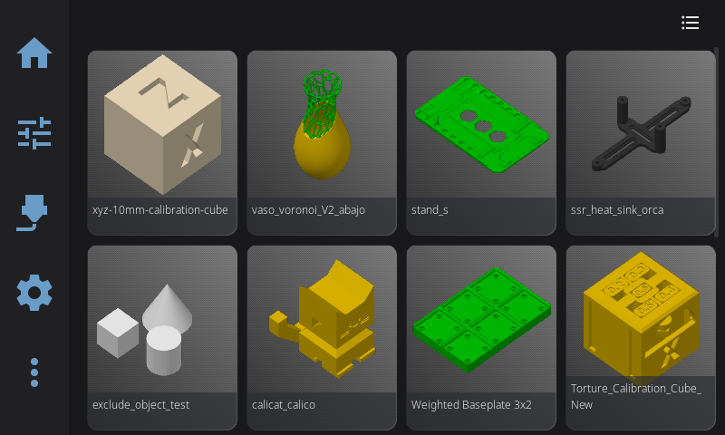
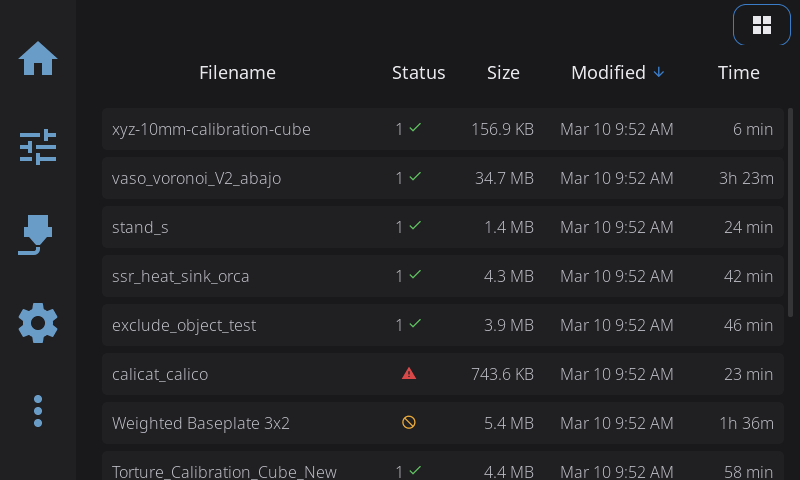
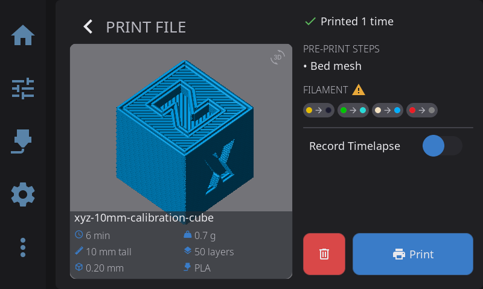
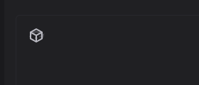
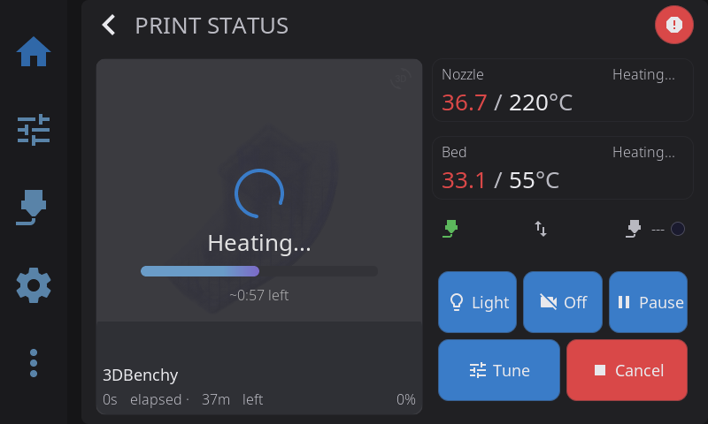
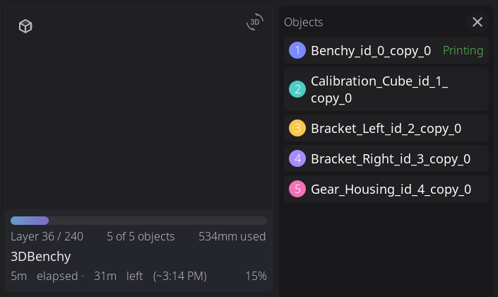

Everything about selecting, starting, monitoring, and tuning your prints.

---

## Selecting a File

1. From the **Home panel**, tap the print file area (shows "Select a file" when idle)
2. Browse your G-code files from Moonraker's virtual SD card

**File source tabs:**

If your printer exposes a USB drive, the top-left of the panel shows **Printer** and **USB** tabs. Tap a tab to switch which storage the file browser lists — **Printer** shows files on the printer's storage (Moonraker's virtual SD card), **USB** shows files on the attached USB drive. The tabs only appear when more than one source is available.

**View options:**

- **Card View** (default): Thumbnails with file info — estimated time, filament usage, slicer
- **List View**: Compact view for browsing many files (toggle with the grid icon in top-right)

List view shows filename, print status, file size, modification date, and estimated print time in a sortable table. Tap any column header to sort.

**Sort columns** (tap a column header to sort):

- Filename (A-Z or Z-A)
- Size (largest or smallest)
- Modified (newest or oldest first)
- Time (longest or shortest)

---

## Sending Prints from OrcaSlicer

Files you slice in OrcaSlicer can be sent straight to your printer over the network, where they show up in the file browser above — no USB stick or web upload needed. **OrcaSlicer 2.4.0 or newer** added a native Klipper/Moonraker connection that makes this work out of the box; HelixScreen needs nothing configured on its side.

In OrcaSlicer:

1. Open **Printer Settings** (the gear next to your printer profile) → **Connection** (or the printer/network icon in the device area).
2. Set the host type to **Moonraker (Klipper)**.
3. Enter your printer's address — the same IP or hostname your printer's web interface (Mainsail/Fluidd) uses, e.g. `http://192.168.1.50` or `http://myprinter.local`.
4. **API key** (only if your Moonraker requires one): paste the key from your Moonraker config. Most home setups can leave this blank.
5. Click **Test** — OrcaSlicer confirms it can reach the printer.

Once connected, OrcaSlicer's **Print** button uploads the sliced file and (optionally) starts it. The file appears in HelixScreen's file browser like any other, and you can also start it from the touchscreen.

> **Older OrcaSlicer (2.3.x):** the native Moonraker option isn't available. Either upgrade to 2.4.0+, use the older **Octo (Klipper)** host type, or just export the G-code and copy it through Mainsail/Fluidd.

> **Filament presets come along for the ride:** if your AMS slots are configured in HelixScreen, OrcaSlicer pre-selects matching filament presets automatically — see the [Filament guide](filament.md#syncing-with-orcaslicer-232-and-later-including-240).

---

## File Preview

Tap a file to see the preview panel:

- **3D G-code preview**: Rotatable with touch, showing the toolpath
- **Metadata**: Estimated time, filament weight, layer count, material, and layer height
- **Pre-print steps**: Shows which calibration steps will run before printing (e.g., bed mesh)
- **Timelapse toggle**: Enable recording if you have the timelapse plugin installed

---

## Pre-Print Options

Before starting, you can enable or disable:

| Option | What It Does |
|--------|--------------|
| Auto Bed Mesh | Run bed mesh calibration before print |
| Quad gantry level | Run QGL calibration (for gantry printers) |
| Z-tilt adjust | Run Z-tilt calibration |
| Clean Nozzle | Execute your cleaning macro |

These options modify the G-code on-the-fly — if you disable "Auto Bed Mesh" but your G-code contains `BED_MESH_CALIBRATE`, HelixScreen comments it out so it doesn't run.

> **Note:** This only works for operations in the sliced file itself. If a step like bed mesh or QGL lives *inside* your `PRINT_START` macro, HelixScreen can't comment it out — run [Advanced → Configure PRINT_START](advanced.md#configure-print_start) once to make those steps skippable, and then these toggles will control them.

> **Tip:** Pre-print options remember your preferences per slicer. If you always run bed mesh before PrusaSlicer prints, that preference persists.

---

## Starting a Print

1. Select your file
2. Review and set pre-print options
3. Tap **Start Print**

The UI switches to the Print Status panel automatically.

### Before the print actually begins

Some printers do a lot of work before the first layer: homing, heating a bed to
soak temperature, and on some machines a full bed mesh. Depending on the printer,
that work runs either inside its own `PRINT_START` macro or ahead of the job. On a
K2 Plus with **Auto Bed Mesh** enabled it regularly takes seven to ten minutes.

The Print Status panel shows the pre-print steps and an estimated time for this
whole period, with the new file's name and preview - the previous job's result is
cleared the moment you tap Start Print.

While the pre-print steps are showing:

- **Cancel** is available and always stops the print from starting. If the printer
  is mid-way through a leveling pass it will finish that motion first, because a
  running macro cannot be interrupted - but the print will not begin, and the
  screen reports it as cancelled rather than as a failure.
- **Pause** is unavailable, since there is no print to pause yet.
- **Tune** works. Speed and flow adjustments carry into the print. A Z-offset
  change made here may be overwritten by the printer's own start macro, so it is
  usually better to adjust once printing has begun.

The rest of the screen tracks this window too. The home panel's print card shows
the preparing job from the moment you tap **Start Print** — thumbnail, a progress
bar for the pre-print steps, and the current step — and tapping it opens the
Print Status panel rather than the file browser. Controls that would move the
toolhead (jog controls, filament load/unload, tool changes) stay unavailable
until the first layer actually begins.

> **Note:** On a multi-color print, HelixScreen checks your loaded filament before it starts and will stop with a **Check filament** dialog if a required tool maps to an empty slot. Printing from bypass skips that check, since the filament never passes through a slot. On printers with camera-based failure detection, it can also react to a print going wrong mid-job. See [Print Monitoring & Failure Detection](/guide/print-monitoring/).

---

## During a Print

The Print Status panel shows:

- **Circular progress indicator** with percentage
- **Time elapsed** and **time remaining**
- **Current layer** / total layers
- **Filament used** — live consumption updated during printing
- **Filename** and thumbnail

> **Note:** Exact layer counts and the most accurate time-remaining estimate require your slicer to report layer info to Klipper via `SET_PRINT_STATS_INFO`. If the count or ETA looks off, see [Troubleshooting → Layer count is wrong, stuck at 0, or total layers missing](../TROUBLESHOOTING.md#layer-count-is-wrong-stuck-at-0-or-total-layers-missing).

> **If Klipper errors mid-print:** HelixScreen automatically shows a full-screen recovery dialog when the printer shuts down, errors, or disconnects. See [Troubleshooting → When the Printer Errors or Disconnects (Recovery Dialog)](../TROUBLESHOOTING.md#when-the-printer-errors-or-disconnects-recovery-dialog) for what each button does and when to use it.

**Print controls:**

| Button | Action |
|--------|--------|
| **Light** | Toggles the printer's LED/case light. Only appears when HelixScreen has a controllable light configured. |
| **Pause** | Parks nozzle safely, pauses print |
| **Resume** | Continues from paused state |
| **Cancel** | Stops print (confirmation required). By default, waits for the printer's cancel routine to finish. If **Cancel Escalation** is enabled in **Settings > Safety & Notifications**, an emergency stop triggers automatically after the configured timeout. |
| **Tune** | Opens Print Tune overlay for real-time adjustments |

### View Toggle (Progress / Complete)

When the G-code viewer is active during a print, a small floating button appears in the top-left corner. Tap it to switch between:

- **Progress view** (default): Shows layers printed so far in solid color with a faded "ghost" preview of unprinted layers above.
- **Complete view**: Shows the entire finished object with all layers solid — useful for seeing what the final print will look like.

The icon shows a cube (tap to see the complete model) or stacked layers (tap to return to progress view). The toggle resets automatically when a new print starts.

If the print contains multiple objects, an **objects button** (a skip-objects icon) also appears in that corner. Tap it to open the Objects list — one of the two ways to exclude an object, see [Exclude Object](#exclude-object) below. The view toggle shifts to the right to make room.

### Timelapse Toggle

If the Moonraker-Timelapse plugin is installed, a **timelapse button** appears in the print controls. Tap it to enable or disable recording for the current print. The button shows a camera icon and toggles between "On" and "Off" states.

During printing, frame captures happen automatically based on your timelapse settings (per-layer or time-based). When the print finishes, the video renders automatically if auto-render is enabled.

---

## Print Tune Overlay

Access by tapping **Tune** during an active print.

| Parameter | Range | What It Does |
|-----------|-------|--------------|
| Speed % | 50-200% | Overall print speed multiplier |
| Flow % | 75-125% | Extrusion rate multiplier |

The overlay also includes Z-Offset / baby-step controls (see below).

**When to adjust:**

- **Speed %**: Slow down (60-80%) for intricate details or if you see layer separation. Speed up for large infill areas.
- **Flow %**: Increase (105-110%) if you see gaps between extrusion lines. Decrease (95-98%) for blobs or over-packed lines.

> **Note:** Speed and Flow adjustments are temporary and only affect the current print. The next print uses your slicer's original values. Z-Offset is the exception - see below.

> **Fan speed:** Part cooling fan speed is not adjusted from the Tune overlay. Current fan speeds are shown on the Print Status panel; tap that fan row to open the separate fan control overlay.

---

## Z-Offset / Baby Steps

Fine-tune your first layer height, during a print or while idle.

**Getting there:**

- **During a print:** the **Tune** button on the Print Status screen.
- **Any time:** the **Z-Offset** row on the Controls panel. It shows the current offset and opens the same controls.

**Adjusting:**

Choose a step size (0.05 / 0.025 / 0.01 / 0.005 mm), then tap up/down to raise or lower the nozzle.

**Signs you need to adjust:**

| Symptom | Problem | Fix |
|---------|---------|-----|
| Lines not sticking, curling up | Nozzle too high | Tap **down** |
| Rough first layer, scratching sounds | Nozzle too low | Tap **up** |
| Gaps between lines | Nozzle too high | Tap **down** |
| Elephant foot, ridges | Nozzle too low | Tap **up** |

**Saving your Z-Offset:**

1. Get the first layer looking good
2. Tap **Save Z-Offset** to write to Klipper config
3. Future prints use this as the starting point

**If there is no Save Z-Offset button**, your printer's firmware stores the offset
itself and there is nothing to save - what you dialed in is already kept and is
re-applied at the start of the next print. This is the case on the FlashForge
AD5M / AD5X running ZMOD, and on the Snapmaker U1.

> **AD5M / AD5X (ZMOD):** the firmware clears the *live* offset when a print
> ends, so other interfaces can show 0.000 while idle even though your real
> offset is stored and will be used. HelixScreen shows the stored value instead,
> so the number on the Z-Offset row is what your next print will actually use.

> **Tip:** Make small adjustments (0.01mm) and wait for the printer to complete a few moves before judging the result.

---

## Exclude Object

On a multi-object print you can stop printing a single object and let the rest finish — the way to salvage a job when one part fails or detaches. Your slicer must label the objects in the G-code (OrcaSlicer and SuperSlicer do this); on a file without labels there is nothing to pick and the feature stays out of your way.

There are two ways to exclude an object during a print:

**Press and hold the object in the viewer.** In the G-code viewer (2D or 3D), press and hold your finger on the failing object for about a second — deliberately longer than a normal tap, so an accidental touch can't cancel a part. A confirmation appears: *"Stop printing "name"? This cannot be undone after 5 seconds."*

**Use the Objects list.** Tap the **objects button** — the skip-objects icon in the viewer's top-left corner, shown only on multi-object prints. An **Objects** list slides in beside the viewer; in thumbnail mode you also get an overhead bed map with numbered objects matching the list. Tap the object you want to skip and the same confirmation appears.

After you confirm:

- The object is drawn red and translucent in the viewer
- A toast offers **Undo** for 5 seconds — tap it in that window and nothing is sent to the printer
- Once the 5 seconds pass, the exclusion is sent and is final

When the Objects list is closed, a short tap on an object in the viewer (no hold) doesn't exclude anything — it just draws corner brackets around the object so you can see which one is which. With the list open, a short tap behaves like tapping the object's row in the list and asks for confirmation.

---

## After a Print

When a print completes, a **completion modal** appears showing:

- **Total print time** and slicer estimate comparison
- **Layers printed** — the job's total layer count
- **Filament consumed** (formatted as mm, meters, or km)
- Notification sound plays (if enabled in Sound Settings)
- Print is logged to history

Once a print has finished — whether it completed, was cancelled, or failed — a **Reprint** button replaces the Cancel button in the print controls. Tap it to start the same file again without browsing back to it.

---

## Recovering After a Power Loss

If the power dies mid-print, some printers keep a recovery point of the interrupted job. When HelixScreen connects to one of these printers and finds a recovery waiting, a dialog offers to pick the print back up:

- **Resume** — continues the interrupted file from where the power failed
- **Discard** — clears the recovery data so the printer starts fresh next time

The dialog names the file and warns that the layer in progress when the power dropped may not line up perfectly — a small seam at the resume point is normal.

This works on Creality's Klipper firmware (K1, K1C, K1 Max, K2 Plus, Ender 3 V3, Hi, and i7) and on the Snapmaker U1. On the Creality printers, HelixScreen asks the printer itself to confirm that a recoverable print exists before offering Resume — if the printer's own check does not pass, the offer never appears, because resuming without it can make the printer home straight through the part left on the bed.

The offer appears once per connection while the printer is idle; if it went unanswered, it comes back the next time HelixScreen connects.

For everything else HelixScreen watches for during and around a print, see [Print Monitoring & Failure Detection](/guide/print-monitoring/).

---

---

## See Also

- [Calibration & Tuning](/guide/calibration/) — Bed mesh, input shaper, and Z-offset affect print quality
- [Advanced Features](/guide/advanced/) — G-code console for manual commands during printing
- [Temperature Control](/guide/temperature/) — Detailed temperature management and presets

---

**Next:** [Print Monitoring & Failure Detection](/guide/print-monitoring/) | **Prev:** [Home Panel](/guide/home-panel/) | [Back to User Guide](/guide/)
