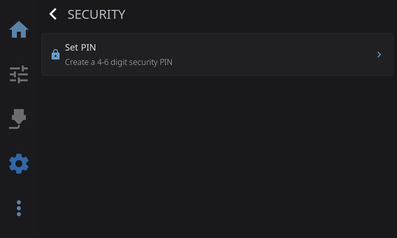
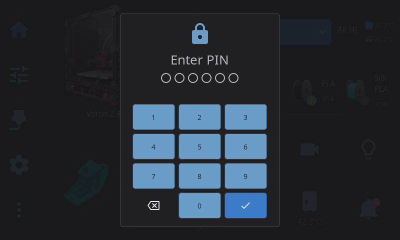

HelixScreen can lock the screen behind a numeric PIN to prevent unauthorized access to your printer controls. Set a 4–6 digit PIN, optionally lock automatically when the display goes to sleep, and unlock with an on-screen keypad.

Open the Security overlay from **Settings > System > Security**.

---

## Setting a PIN

When no PIN is configured, the only option shown is **Set PIN**:

1. Tap **Set PIN**.
2. Enter a 4–6 digit numeric PIN.
3. Enter the same PIN again to confirm.

PINs must be numeric and between 4 and 6 digits — other entries are rejected. Once a PIN is set, the Change PIN, Remove PIN, and Auto-lock options appear.

---

## Changing or Removing a PIN

When a PIN is already set:

- **Change PIN** — enter your current PIN first, then enter and confirm a new one.
- **Remove PIN** — enter your current PIN to confirm, then the PIN is cleared and the lock is disabled.

Both actions require the current PIN, so someone who doesn't know it can't change or remove it.

---

## Auto-lock

The **Auto-lock** toggle (shown only when a PIN is set) ties the screen lock to the display sleep timeout. When auto-lock is on, the screen locks automatically as the display wakes from sleep or screensaver/dim — so the printer is protected whenever it's been idle. You'll need to enter your PIN to use the screen again.

> The display sleep timeout itself is configured under display settings. Auto-lock simply hooks into that same idle behaviour rather than having its own separate timer — there's no separate "lock after X minutes" setting to configure.

Auto-lock only engages after the display has actually gone idle (dimmed or slept on its own). Previewing a screensaver from settings does **not** lock the screen, since you're clearly right there using it.

### Locking manually

You can also lock the screen instantly at any time using the **Lock** widget on the Home dashboard, if it's added to your home widgets (long-press the Home panel to enter Edit Mode, then tap **+** to add it from the Widget Catalog). One tap locks the screen and shows the keypad.

The Lock widget shows a closed padlock when a PIN is set and an open padlock when one isn't. If you tap it while no PIN is set, it opens the Security settings so you can create one instead.

---

## While the Screen Is Locked

When locked, a full-screen overlay covers the UI with a numeric keypad:

- Tap the digits to enter your PIN; dots fill in as you type.
- Tap the **checkmark** to confirm and unlock.
- Use the **backspace** key to correct a mistake.
- If the PIN is wrong, a brief error message appears and you can try again.

Entering fewer than 4 digits and tapping the checkmark shows a "PIN must be at least 4 digits" reminder rather than counting it as a wrong attempt.

**Emergency Stop stays available.** Whenever a print is running or paused, a red Emergency Stop button appears in the top-right corner of the lock screen, so you can always halt the printer in an emergency without unlocking it first. When the printer is idle there's nothing to stop, so the button isn't shown.

---

## Forgot Your PIN?

Both **Change PIN** and **Remove PIN** require you to enter your current PIN first, so there's no way to clear the lock from the Security screen if you don't remember it. If you're locked out, the way back in is a **Factory Reset** (see below), which wipes the PIN along with everything else.

Because of this, pick a PIN you'll remember. There's no recovery code and no "reset by email" — this is a local lock on a printer touchscreen, not an online account.

---

## Storage & Factory Reset

Your PIN is never stored in plain text — only a one-way hash of it is saved, so the actual digits can't be read back out of your settings. **Don't try to edit this value by hand** in the settings file; set, change, or clear the PIN through the Security screen, which handles the hashing for you.

A **Factory Reset** (**Settings > System > Factory Reset**) clears all HelixScreen settings, which includes your security PIN and the auto-lock preference. After a reset, the screen lock is disabled until you set a new PIN. A factory reset only touches HelixScreen's own settings — it doesn't change anything in Klipper, Moonraker, or the files on your printer.

---

## What the Lock Does and Doesn't Do

The screen lock is a convenience feature that keeps someone from tapping through your printer controls at the machine — handy in a shared shop, classroom, or makerspace. It is **not** full device security.

While the screen is locked, the printer keeps doing whatever it was already doing. The lock only covers the touchscreen: it does not affect Moonraker, the web interface, SSH, or anything else reaching the printer over the network. Anyone with network or physical access to the underlying hardware can still get in. Treat it as a "keep hands off the screen" lock, not a way to secure the machine itself.

---

**Next:** [Camera](/guide/camera/) | **Prev:** [Sensors](/guide/sensors/) | [Back to User Guide](/guide/)
