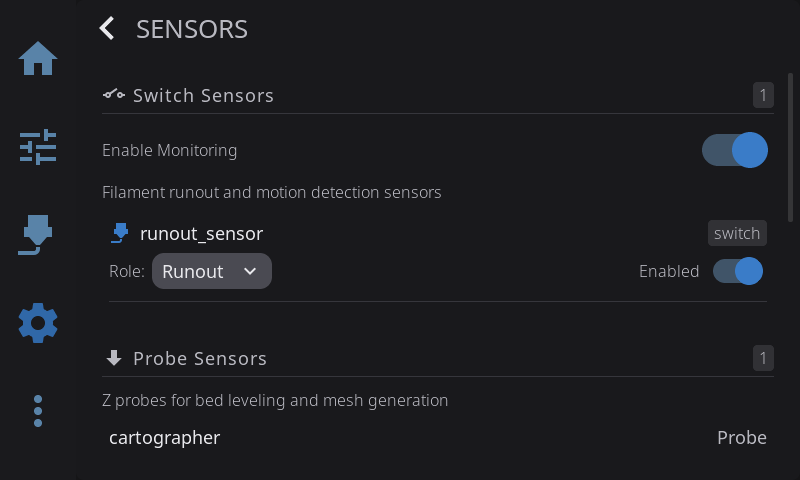

HelixScreen discovers the sensors your printer reports to Klipper and groups them by type. Filament switch/motion sensors and filament width sensors are configurable — you assign each one a role and choose whether it's monitored. The remaining sensor types are shown as read-only information.

Open the Sensor Settings overlay from **Settings > Hardware & Devices > Sensors**.

---

## Switch Sensors (Filament Runout & Motion)

The **Switch Sensors** section lists standalone filament sensors — both switch-style runout sensors and motion (encoder) sensors. Sensors that belong to a multi-material system (AMS/CFS) are filtered out and managed by that system instead.

### Master toggle

An **Enable Monitoring** switch at the top of the section turns filament sensor monitoring on or off for all switch sensors at once.

### Per-sensor role

Each sensor row has a role dropdown. Choose how that sensor is used:

| Role | Meaning |
|------|---------|
| **None** | Sensor discovered but not assigned — not monitored |
| **Runout** | Primary runout detection — used to detect filament running out |
| **Toolhead** | Toolhead/nozzle proximity sensor |
| **Entry** | Entry-point detection sensor |

Each sensor also has an enable toggle, which appears once a role other than **None** is assigned. Changing a role or toggle saves immediately.

> The sensor's hardware kind (switch vs. motion) is detected automatically and shown on the row — it isn't something you set. Roles are what you assign.

---

## Width Sensors (Flow Compensation)

If your printer has a filament width sensor, it appears in its own **Width Sensors** section. These sensors sit in the filament path and continuously measure the diameter of the filament passing through — HelixScreen recognizes two kinds:

| Type | How it measures |
|------|-----------------|
| **TSL1401CL** | An optical (line-scan) sensor that reads the filament's shadow |
| **Hall** | A magnetic sensor that reads the filament's thickness |

### What flow compensation does

Real filament isn't perfectly round or perfectly 1.75 mm — it varies slightly along the spool. A width sensor measures the *actual* diameter in real time so Klipper can adjust how much it extrudes: thinner filament gets pushed a little faster, thicker filament a little slower. The result is more consistent extrusion and fewer thin or over-packed walls, especially with cheaper or older filament.

Klipper performs the compensation itself. HelixScreen's job is to show you the live measurement and let you pick which sensor is in charge.

### Enabling a width sensor

Each width sensor row has two controls:

- **Role** dropdown — set this to **Flow Compensation** to make the sensor active, or **None** to ignore it. Only one sensor can hold the Flow Compensation role at a time; assigning it to a second sensor clears it from the first.
- **Enabled** toggle — turns the selected sensor's monitoring on or off.

Changes save immediately. Once a sensor is enabled with the Flow Compensation role, its live measured diameter (for example, "1.75mm") appears on the **Width** dashboard widget you can add to the Home Panel.

> When no width sensor is enabled, the Width dashboard widget and diameter reading simply don't appear — nothing else changes.

---

## Clog & Flow Detection

If your printer has a multi-material system or buffer with flow monitoring (Happy Hare, AFC, or a compatible MMU), HelixScreen can watch the filament path for **clogs and flow problems** while you print. This is a live health check on the filament actually moving — if the filament stops feeding the way it should, that usually means a clog, a jam, or a run-out.

There are three kinds of flow-monitoring hardware HelixScreen understands:

| Source | What it watches |
|--------|-----------------|
| **Encoder** | A wheel that counts filament movement — reports a clog percentage (how far the reading has drifted from expected) |
| **Flowguard** | Bidirectional flow monitoring — flags both under-feeding (clog risk) and over-feeding (tangle risk) |
| **AFC buffer** | A spring-loaded buffer — reports how close it is to a fault condition |

### Where it shows up

Clog and flow detection surface through the **Clog Detection** dashboard widget — an arc gauge that stays green while flow is healthy and shifts toward orange and red as trouble builds. You add and configure it from the Home Panel rather than this Sensors screen. See **[Clog Detection Widget](home-panel.md#clog-detection-widget)** for the full widget walkthrough, and the [Filament guide](/guide/filament/) for the same meter shown in the filament sidebar.

**What happens on a real clog:** the meter turns red and shows a warning, but the actual pause is handled by your printer's firmware (Happy Hare or AFC). HelixScreen visualizes the problem; the firmware stops the print.

### Configuring it

On the Home Panel, long-press to enter **Edit Mode**, tap the **Clog Detection** widget to select it, then tap the **gear icon**. The Clog Detection config modal opens with these settings:

| Setting | What it controls |
|---------|------------------|
| **Source** | Which flow-monitoring hardware feeds the meter. **Auto** (recommended) picks the best one your printer has; or force **Encoder**, **Flowguard**, or **AFC**. Only sources your hardware actually reports are shown. |
| **Detection Mode** | **Auto** lets the firmware decide when a clog has happened. **Manual** lets you set a fixed detection length (below) — choosing it sends a configuration command to the firmware. |
| **Detection Length** | *(Manual mode only)* How far the filament can under-feed — from **2 mm to 30 mm** — before it's treated as a clog. Shorter trips sooner (more sensitive); longer is more tolerant of normal variation. |
| **Danger Zone** | Where the red warning band starts on the gauge, from **0% to 90%**. Leave it at **0** to let HelixScreen compute a sensible threshold from the firmware's own headroom. This only affects the on-screen warning band — it does not change when the firmware pauses. |

Tap **Save** to apply, or **Cancel** to discard.

> **Tuning tip:** start with **Auto** source and **Auto** mode — that works for most setups. Only switch to Manual and shorten the Detection Length if real clogs are slipping through unnoticed, or lengthen it if you're getting false alarms on filament that's actually fine.

---

## Read-Only Sensor Types

The remaining sections list sensors for information only — there's nothing to configure here. A section only appears when at least one sensor of that type is detected.

| Section | What it covers | Type labels shown |
|---------|----------------|-------------------|
| **Probe Sensors** | Z probes for bed leveling and mesh | BLTouch, Smart Effector, Eddy, Probe |
| **Humidity Sensors** | Chamber and dryer humidity monitoring | BME280, HTU21D, SHT3X, AHT10, AHT20, AHT20-F |
| **Accelerometers** | Input shaper calibration sensors | ADXL345, LIS2DW, LIS3DH, MPU9250, ICM20948 |
| **Color Sensors** | TD-1 filament color detection | TD-1 |
| **Temperature Sensors** | MCU, host, and auxiliary temperature monitoring | MCU, Host, Aux |

> Probes, humidity, accelerometer, color, and temperature sensors are display-only — HelixScreen shows their readings but there's nothing to set on this screen.

---

## Chamber Assignment

Inside the **Temperature Sensors** section, two dropdowns let you override auto-detection if your chamber heater or sensor isn't named "chamber":

- **Chamber Heater** — pick which generic heater is your chamber heater (or leave on **Auto**, or disable with **None**).
- **Chamber Sensor** — pick which temperature sensor reports chamber temperature (Auto / a specific sensor / None).

The **Auto** option shows the currently detected name in parentheses, or "(none detected)" when nothing matched.

---

**Next:** [Security & Screen Lock](/guide/security/) | **Prev:** [Fans](/guide/fans/) | [Back to User Guide](/guide/)
