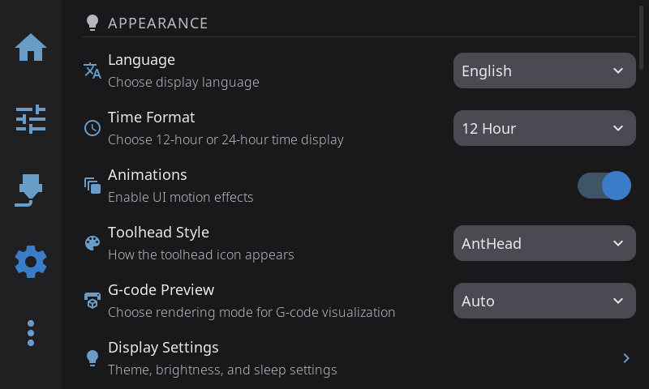

Access via the **Gear icon** in the navigation bar. Settings are organized into six categories, each opening a sub-panel.

| Category | What's Inside |
|----------|---------------|
| [Display & Sound](/guide/settings/display-sound/) | Language, timezone, time format, animations, widget labels, bed mesh render, dark mode, themes, brightness, screen dim/sleep, screensaver, sounds, volume, sound themes |
| [Printing](/guide/settings/printing/) | Toolhead style, G-code preview, Z movement, machine limits, retraction, material temperatures, timelapse, macro buttons |
| [Hardware & Devices](/guide/settings/hardware/) | Hardware issues, printers, multi-filament system management, fans, sensors, LED settings, power devices, Spoolman |
| [Safety & Notifications](/guide/settings/safety/) | E-Stop confirmation, confirm before running macros, allow cold load/unload, cool nozzle after filament ops, cancel escalation, escalation timeout, print completion alert |
| [System](/guide/settings/system/) | Security, network, host, touch & input, performance, plugins, telemetry, log level, restart, factory reset |
| [Help & About](/guide/settings/help-about/) | Debug bundles, Discord, documentation, About sub-overlay (version info, updates, print hours, branding) |

---

**Next:** [Advanced Features](/guide/advanced/) | **Prev:** [Calibration & Tuning](/guide/calibration/) | [Back to User Guide](/guide/)
