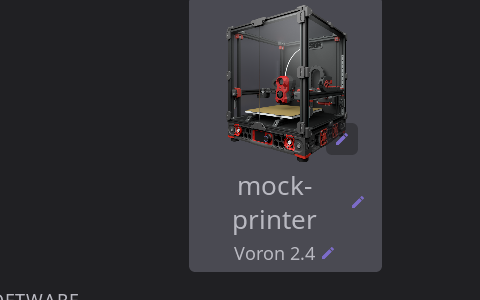
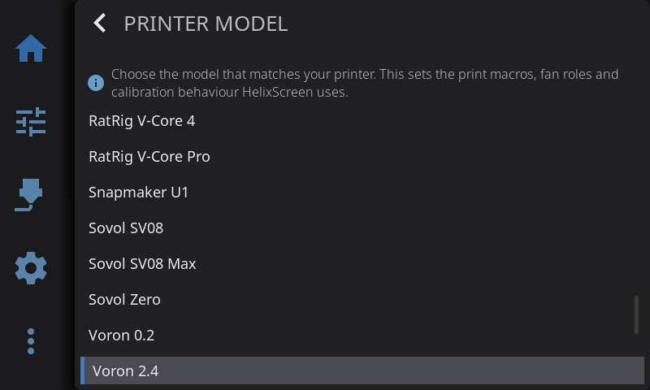

HelixScreen works with **any Klipper printer running Moonraker**. On top of that universal baseline, a number of printers get deep, model-specific integration — their filament systems, chamber heaters, cameras, and quirks are wired up so they "just work."

This page is the detailed breakdown of what actually works on those specially-supported machines. For the at-a-glance status list of every platform, see the [Which printers are supported?](../FAQ.md#which-printers-are-supported) table in the FAQ. For step-by-step setup, see the [Installation Guide](/installation/).

---

## Two things worth knowing first

**1. You don't have to run it on the printer.** Some printers can run HelixScreen directly on their own built-in touchscreen (see the list below). But HelixScreen is a Moonraker client, so for *any* printer you can also run it on a separate Raspberry Pi, mini PC, or tablet with a touchscreen and control the printer over the network. See [Can I run HelixScreen on a separate device?](../FAQ.md#can-i-run-helixscreen-on-a-separate-device-instead-of-on-my-printer) and [Remote Screen Setup](../INSTALL.md#remote-screen-setup-run-on-a-separate-device).

**2. Your printer is auto-detected.** The first-run setup wizard identifies your printer from a database of 90+ models — filling in the right name, image, bed size, probe type, and preset options automatically. The **printer type** this sets drives features and calibration dialogs; the image picker in Printer Manager is cosmetic only. When detection isn't confident enough to commit (best guess under 85%), no type is saved and the wizard's **Printer Setup: Identity** step has you pick your model by hand instead.

**Wrong model picked? It's a one-tap fix in Printer Manager.** The model row on the printer's Printer Manager card (tap the printer image on the Home panel) opens the same model picker the wizard's identity step uses — pick your model and it applies on the spot, no re-setup needed. HelixScreen also watches for this itself: if the saved type stops matching what detection finds on the printer, you're asked once whether to **Re-identify** (re-run the identity step) or **Keep current**. Re-adding the printer or re-running the wizard via Factory Reset (which wipes settings) is only needed for edge cases — see [Wrong printer model identified](../TROUBLESHOOTING.md#wrong-printer-model-identified).

One caveat:

- Device-specific install packages (Creality K1, FlashForge Adventurer 5M, and similar) run the wizard in **preset mode**, which *skips* printer identification entirely — the printer type on those installs comes from the install package itself, not from detection. If such an install is showing the wrong printer (for example, an AD5M package running against a different machine), the fix is to install the HelixScreen package built for your hardware (or the generic remote-screen setup) — no settings change can override the preset.

If your printer isn't in the database at all, it still works fully via generic detection (see [Every Other Klipper Printer](#every-other-klipper-printer) below).

> **What the status labels mean:** Throughout this page and the FAQ, **Tested** = the HelixScreen team verified it on real hardware; **Supported** = works, with the noted firmware; **Community** = a community user confirmed it, but we haven't tested it ourselves; **Preliminary** = support exists from the printer's published config but isn't hardware-verified. If you run HelixScreen on hardware we haven't tested, [let us know](/guide/settings/help-about/) — reports are how printers move up the list.

---

## Deeply Integrated Printers

These printers get dedicated, model-specific support beyond the generic baseline.

### FlashForge Adventurer 5M / 5M Pro

Runs directly on the printer's built-in 4.3" screen as a replacement for the stock UI.

**What works:**
- Full temperature, motion, bed mesh (with 3D visualization), fan, and macro control on the printer's own display
- Reliable on-device operation tuned for the AD5M's embedded hardware
- **Firmware-managed Z-offset** when running ZMOD — the offset is stored by the firmware, and HelixScreen shows the stored value while idle rather than the 0.000 the firmware leaves in Klipper between prints. See [Printing → Z-Offset](printing.md#z-offset--baby-steps)

**Requirements:** Forge-X or Klipper-Mod firmware (which provides Moonraker). See [Installation → Adventurer 5M](../INSTALL.md#flashforge-adventurer-5m--5m-pro).

**Status:** Tested.

---

### FlashForge Adventurer 5X

The AD5X's four-color **IFS (Intelligent Filament System)** is fully integrated, and HelixScreen runs on the printer's built-in 4.3" screen.

**What works:**
- **4-slot IFS** — load, unload, and select filament per slot, with per-slot color and material tracking and per-port filament-presence sensors
- **Automatic tool-to-port mapping** for multi-color prints (T0–T15 → physical ports), correct even with slot renumbering enabled
- **External-spool bypass mode** for feeding a spool directly — engages runout protection on the toolhead sensor automatically, and publishes the spool to OrcaSlicer as an extra lane
- **[Spoolman](/guide/filament-tracking/) integration** for assigning tracked spools to slots
- **Infinite Spool Mode** reporting — when a slot runs out, the IFS automatically switches to another slot with the same filament type *and* color, if one is loaded. HelixScreen tells you this plainly on the runout screen and in the AMS panel
- **Firmware-managed Z-offset** — ZMOD stores the offset itself, so there is no Save step. HelixScreen shows the *stored* value while the printer is idle, where other interfaces read 0.000, and adjusts from it correctly. See [Printing → Z-Offset](printing.md#z-offset--baby-steps)

**Requirements:** ZMOD firmware v1.7.0 or newer (a community firmware mod, separate from FlashForge stock). See [Installation → Adventurer 5X](../INSTALL.md#flashforge-adventurer-5x).

**Status:** Tested.

> **Good to know:** Infinite Spool Mode works out of the box with stock ZMOD (always on, no toggle). The optional [bambufy](https://github.com/function3d/bambufy) / [lessWaste](https://github.com/Hrybmo/lesswaste) plugins add a backup on/off toggle in their own Mainsail/Fluidd dialog; HelixScreen reports which is active but does not expose the toggle itself. Virtual channels beyond 4 tools aren't visualized in the UI yet. Some units display a random solid color during sleep — if you see this, set the sleep timeout to Never.

---

### Creality K1 / K1C / K1 Max / K1 SE

Runs on the K1's built-in screen. K1C and K1 Max are the most thoroughly tested of the family.

**What works:**
- Full temperature, motion, bed mesh, fan, camera, and macro control on the printer's own display
- **Chamber heater control** on the K1 Max
- **Optional CFS support** — with Creality's official CFS upgrade kit and firmware (v2.3.5.33+), HelixScreen detects and drives the K1-series filament system (see [Creality Filament System](filament.md#creality-filament-system-cfs))

**Requirements:** Community firmware that includes Moonraker (stock K1 firmware has none) — Guilouz, Simple AF, or Guppy Mod — plus root access. See [Installation → Creality K1 Series](../INSTALL.md#creality-k1-series).

**Status:** Supported.

> **Good to know:** The K1 series is HelixScreen's most memory-constrained platform (256 MB RAM). It's single-extruder — no toolchanger.

---

### Creality K2 Plus / K2 Pro

Runs on the K2's built-in screen and — unlike the K1 — **works with stock firmware and stock Moonraker**, no custom firmware required. This is the flagship CFS integration.

**What works:**
- **Full CFS multi-material** — up to 4 units × 4 slots (16 colors): per-slot color, material type, and remaining filament length; per-unit temperature and humidity; load/unload
- **Auto-refill / backup spool** switching, run by the CFS itself, and tool-to-slot color mapping. A runout always pauses the print first, and the box only swaps to another slot when auto-refill is on and that slot holds the exact same material *and* colour - otherwise the print stays paused
- **CFS dryer and humidity monitoring** per unit
- **External-spool bypass** — toggle it in the AMS panel: the CFS is stood down, the toolhead runout sensor is switched on for protection, and the spool is published to OrcaSlicer as an extra lane. See [Filament → CFS and the External Spool](filament.md#cfs-and-the-external-spool)
- **Chamber heater** control (K2 Pro / Plus)
- **AI print monitoring** available as a pre-print option. Filament runout is detected and acted on by the printer's own firmware, which pauses the job; HelixScreen reports what the CFS decided and offers the recovery buttons

**Requirements:** Stock firmware works out of the box. See [Installation → Creality K2 Series](../INSTALL.md#creality-k2-series).

**Status:** Tested — runs natively with CFS support.

> **Community firmware:** the list above describes **stock** Creality firmware. Some owners replace it with a community build that swaps in its own rewritten CFS module — those are auto-detected and fully supported, including load, unload and filament changes. See [Filament → CFS](filament.md#creality-filament-system-cfs).

> **Good to know:** The K2's portrait panel is software-rotated to landscape — that is the supported configuration. Running it un-rotated with the portrait layout is alpha and mostly untested. On this lower-power CPU, animations and 3D bed-mesh rendering may be throttled. The CFS material database is fetched from Creality's cloud.

---

### QIDI Plus 4 / Q2 / Max 4

The 4-series QIDI printers integrate the **QIDI Box** filament changer. The Q2 and Max 4 can run HelixScreen on-device; the Plus 4 (and the 3-series X-Smart 3 / X-Plus 3 / X-Max 3 / Q1 Pro) use a serial TJC display that HelixScreen can't drive on-device, so those are **remote-control only** — run HelixScreen on a separate device pointed at the printer's Moonraker.

**What works:**
- **QIDI Box filament changer** (4, 8, 12, or 16 slots) — per-slot status, tool-to-slot mapping, and load / unload / change-tool control
- **QIDI Box drying** — the box's PTC heater is controllable from the shared [dryer screen](filament.md#filament-drying)
- **Chamber heater** control on enclosed models
- **QIDI-specific print-start tracking** (homing → bed heat → nozzle clean → Z-tilt → mesh → nozzle heat → chamber heat)
- WiFi configuration works out of the box

**Requirements:** Stock firmware works (runs standard Moonraker); community stacks like FreeDi and FreeQIDI are also supported. On-device install applies to the Q2 and Max 4 only; everything else is [remote control](../INSTALL.md#remote-screen-setup-run-on-a-separate-device).

**Status:** Supported.

> **Good to know:** HelixScreen owns no QIDI hardware — the Q2 is community-validated. The QIDI Box write path (load/unload) is still being field-validated, and Max 4 box control differs from the Q2 and is a work in progress.

---

### Snapmaker U1 (SnapSwap)

A true 4-toolhead changer, running on the U1's built-in 3.5" screen. Each of the four heads is independent — there's no shared filament path.

**What works:**
- **4 independent toolheads** with fast tool changes (T0–T3, roughly 5 seconds, no purge tower)
- **Per-slot filament data** — material type and sub-type, brand, and color, read from the print job even when the RFID reader is off
- **RFID filament recognition** via the built-in reader
- **Per-extruder feed/load state and runout handling** with automatic resume
- **Firmware-managed Z-offset** and dedicated print-start tracking; near-certain auto-detection

**Requirements:** SSH access — either stock firmware 1.2+ (via its **Root access** option) or PAXX Extended Firmware (SSH on by default). Reinstall after any firmware update. See [Installation → Snapmaker U1](../INSTALL.md#snapmaker-u1).

**Status:** Tested (on PAXX 1.2.x–1.4.x; stock-firmware support is newly added — testers wanted).

> **Good to know:** The U1's 480×320 display is the smallest resolution HelixScreen supports; a few panels have known layout tightness there. Physical cameras work normally. Writing filament data back to RFID tags works only on PAXX firmware.

**Remote screen — view and control from Mainsail/Fluidd:** On **PAXX Extended Firmware**, the U1's built-in "gui" webcam feed shows the live HelixScreen UI, and you can tap it to drive the on-screen controls remotely — the same as touching the physical panel.

To set it up:

1. Open the firmware settings web UI at `http://<printer-ip>/firmware-config/` (log in with your Mainsail/Fluidd credentials) and set **Remote Screen** to **Enabled**.
2. That's it — the setting restarts HelixScreen and Moonraker for you, registers the **"gui"** webcam, and starts the screen server.
3. Open your printer in Mainsail or Fluidd (you must be logged in). The screen appears as the **"gui"** webcam — select it in the camera view.
4. To control it, browse to `http://<printer-ip>/screen/` and tap the image. Taps, presses, and drags drive the HelixScreen UI live.

Notes:
- Use the firmware settings web UI, not a hand edit of the config file. Setting `web remote_screen` in `extended2.cfg` by hand is **not enough** — the "gui" webcam won't appear, because the web UI toggle also enables the `[webcam gui]` section in `extended/moonraker/04_remote_screen.cfg` and restarts Moonraker. If you must do it by hand, do all three, then restart HelixScreen and Moonraker.
- The feed is a still-image snapshot refreshed a few times per second, not smooth video — fine for monitoring and tapping through menus, not for watching animations.
- This is **PAXX-only** for now. Stock firmware is not yet confirmed to expose the feed.
- If the "gui" webcam shows **"No Signal"** or a stale/black frame, HelixScreen hasn't restarted since the toggle was turned on — restart HelixScreen or reboot the printer.

---

### Anycubic Kobra + ACE Pro, and Sovol SV06 ACE

The **Anycubic ACE Pro** filament system is integrated on the Kobra 2 Pro, Kobra 3 / 3 V2 / 3 Max, and Kobra S1 / S1 Max, as well as the Sovol SV06 ACE. These are typically run via community firmware, either on-device or remotely.

**What works:**
- **Native ACE filament system** — per-slot color and material, load/unload, and [filament drying](filament.md#filament-drying) (the ACE has a heated drying chamber)

**Requirements:** Community firmware such as [Rinkhals](https://github.com/jbatonnet/Rinkhals) (Anycubic) providing Moonraker. ACE integration needs the community `ace_status.py` Moonraker component (ValgACE) — if it's missing, HelixScreen shows a prompt telling you to install it.

**Status:** Community (auto-detected; not yet tested on our hardware).

---

### Other dedicated builds

| Printer | What's special | Status |
|---|---|---|
| **Creality Sonic Pad** | Dedicated 32-bit ARM build for the Sonic Pad's screen. Requires [SonicPad-Debian](https://github.com/Jpe230/SonicPad-Debian) — the only firmware tested; stock Creality OpenWrt is untested | Supported |
| **Elegoo Centauri Carbon** | Runs on-device with [OpenCentauri COSMOS](https://docs.opencentauri.cc/klipper-conversion/cosmos/cosmos/) firmware; ships with factory white-balance camera calibration | Tested |
| **Creality Hi** | Auto-detected Cartesian bedslinger with optional CFS | Preliminary |

---

## Multi-Material Systems on Any Printer

Some filament systems aren't tied to a specific printer model — HelixScreen detects them from Klipper whenever they're present, on any machine:

- **Happy Hare** (ERCF, Tradrack, 3MS, EMU, and other MMUs)
- **AFC-Klipper** (Box Turtle, OpenAMS, ViViD)
- **klipper-toolchanger** (multi-toolhead setups)
- **MedusaHC** (hotend changer, commonly on a Duender) - detected on top of klipper-toolchanger

Full details on each are in [Filament Management](filament.md#ams--multi-material-systems).

---

## Every Other Klipper Printer

If your printer isn't in the list above, it still works — it just uses generic detection instead of a model-specific profile. Point HelixScreen at your printer's Moonraker (port `7125`) and it inspects the live Klipper config, automatically enabling every panel your hardware supports:

- Nozzle and bed temperatures (with a multi-extruder selector when present)
- Motion, homing, and emergency stop
- Bed mesh, including 3D visualization
- Fans, LED / WLED lighting, and power devices
- Camera, when a Moonraker webcam is configured
- Macros, console, and the file browser / print controls
- Firmware retraction, chamber heating, input shaper, exclude-objects, and [Spoolman](/guide/filament-tracking/) — each when detected
- Timelapse, when the Moonraker-Timelapse plugin is installed

The printer database (90+ models across Voron, RatRig, Prusa-on-Klipper, Elegoo Neptune, Sovol, Anycubic, Artillery, FLSUN, Kingroon, Zero G, and more) adds the finishing touches — your printer's name, image, bed size, and preset options. A printer that isn't in the database misses only those cosmetic and preset details; every control above still works.

---

## Don't See Your Printer?

- Check the full [status table in the FAQ](../FAQ.md#which-printers-are-supported) — it lists more platforms than the deep-dives above.
- Any Klipper + Moonraker printer works via generic detection, even if it's unlisted.
- If you get it running on hardware we haven't tested, tell us on [Discord](/guide/settings/help-about/) so we can add it — community reports are how the list grows.

---

## See Also

- [FAQ: Which printers are supported?](../FAQ.md#which-printers-are-supported) — Quick status table for every platform
- [Installation Guide](/installation/) — Per-platform setup instructions
- [Getting Started](/guide/getting-started/) — The first-run setup wizard, including printer identification
- [Filament Management](/guide/filament/) — AMS, CFS, IFS, and multi-material details for the systems above

---

**Next:** [Home Panel](/guide/home-panel/) | **Prev:** [Getting Started](/guide/getting-started/) | [Back to User Guide](/guide/)
