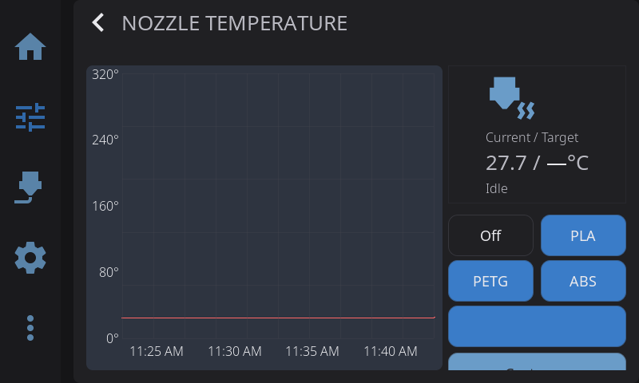

---

## Nozzle Temperature Panel

- **Current temperature**: Live reading from thermistor
- **Target input**: Tap to enter exact temperature
- **Presets**: Quick buttons for common temperatures
- **Temperature graph**: History over time

---

## Bed Temperature Panel

Same layout as nozzle control:

- Current and target temperature
- Presets for common materials
- Temperature graph

---

## Temperature Presets

Built-in presets:

| Material | Nozzle | Bed | Chamber |
|----------|--------|-----|---------|
| Off | 0°C | 0°C | 0°C |
| PLA | 210°C | 60°C | — |
| PETG | 240°C | 80°C | — |
| ABS | 250°C | 100°C | 50°C |

Tap a preset to set the target temperature immediately. If your printer has a chamber heater, presets that include a chamber temperature will set it automatically — materials that don't need an enclosed chamber (PLA, PETG) leave the chamber heater off.

### Spool Preset

When you have a filament loaded — either via an [external spool configuration](filament.md#external-spool-configuration) or an active AMS slot — and the material doesn't match one of the standard presets (PLA, PETG, ABS, TPU), an additional **spool preset** button appears below the standard presets.

The spool preset shows the material name and recommended temperature (e.g., "PA-CF (265°C)"). Tap it to set the temperature for that specific material. This appears on both the Nozzle and Bed temperature panels.

---

## Multi-Extruder Temperature Control

On printers with multiple extruders, an extruder selector appears at the top of the Temperature Control panel:

- **Tap an extruder** to switch which one you are controlling
- Each extruder has independent temperature targets and presets
- Toolchanger printers show tool names (T0, T1) rather than "Nozzle 1", "Nozzle 2"
- The selector only appears when Klipper reports more than one extruder

Single-extruder printers are unaffected — the panel works exactly as before.

---

## Chamber Temperature Panel

If your printer has a chamber heater or chamber temperature sensor configured in Klipper, you can access the Chamber Temperature panel by tapping the chamber row in the **Temperatures** widget on the Home Panel.

- **Heated chambers** (`heater_generic chamber`): Full control panel with current/target temperature, presets, and a live temperature graph with a green trace
- **Sensor-only chambers** (`temperature_sensor chamber`): Monitoring mode — shows the current chamber temperature and graph, with a "Monitoring" status instead of heating controls. Presets and target input are hidden since there's no heater to control.

The chamber panel works identically to the nozzle and bed panels, just with chamber-specific presets and colors.

**Cooldown:** When you tap **Off** or cool down the printer, HelixScreen also turns off the chamber heater (if present) along with the nozzle and bed.

---

## Temperature Graph Overlay

Tap any temperature card (nozzle, bed, or chamber) on the Controls or Print Status panels to open the unified temperature graph overlay. This single overlay replaces the separate per-heater graphs with a combined view.

### Layout

The overlay has a **side-by-side layout**:

- **Left (66%)** — Live temperature graph with all sensors plotted together
- **Right (33%)** — Heater controls for whichever sensor you tapped (presets, target temperature, custom input)

If you have a chamber sensor with no heater, the right column shows the current temperature but hides the preset buttons and custom input since there's nothing to control.

### Sensor Chips

Above the graph, a row of **sensor chips** lets you toggle which traces are visible:

- Each chip shows a colored dot matching its graph line and the sensor name
- Tap a chip to show or hide that sensor's trace
- When you open the overlay from a specific card, only the relevant sensor is shown by default — tap other chips to add more traces
- Chips wrap across multiple lines if you have many sensors

### Graph Features

- **Solid line** — Current temperature
- **Dashed line** — Target temperature (for heaters)
- **Auto-scaling Y axis** — Adjusts range automatically based on visible temperatures
- **Color-coded traces** — Nozzle (red), Bed (cyan), Chamber (green), additional sensors (yellow, purple, orange, blue)

### Multi-Extruder Support

When multiple extruders are configured, the nozzle controls include an extruder selector row. Tap an extruder to switch which one the right-column presets and target apply to. Each extruder's temperature trace is shown independently on the graph.

### Setting Temperature

From the right column:

- Tap a **material preset** (Off, PLA, PETG, ABS) to set that temperature immediately
- If a non-standard filament is loaded, tap the **spool preset** to set the recommended temperature for that material
- Tap **Custom...** to enter an exact temperature via the on-screen keypad

---

**Next:** [Motion & Positioning](/docs/guide/motion/) | **Prev:** [Printing](/docs/guide/printing/) | [Back to User Guide](/docs/)
