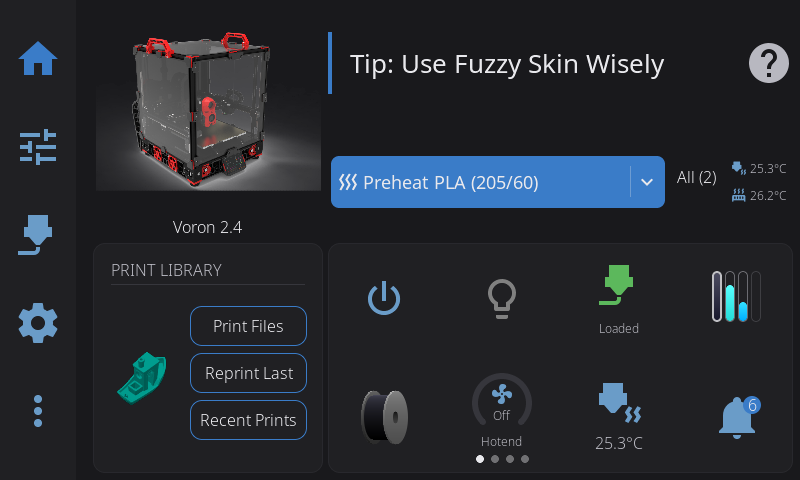

Your printer's touchscreen should show you more than temperatures and a progress bar. HelixScreen is a full-featured touch interface for Klipper printers that puts everything at your fingertips — things you'd normally need to open Mainsail or Fluidd for.

**What you get that other touchscreen UIs don't:**

- **A real dashboard** — Drag-and-drop widgets across multiple pages. Temperature graphs, fan controls, camera feeds, power toggles, favorite macros. You decide what's on screen, not the developer.
- **3D visualization** — Rotate your bed mesh with your finger. Preview G-code layers before printing. See input shaper frequency response charts right on the screen.
- **Multi-material that works** — AFC, Happy Hare, ACE, CFS, AD5X IFS, tool changers. Six backends, tested on real hardware. Per-unit dryer controls, environment monitoring, Spoolman integration.
- **Exclude objects** — Tap the failing part on an overhead map to exclude it mid-print. No more scrapping an entire plate for one bad object.
- **Runs on anything** — ~13MB of RAM, no X11, no browser, no desktop environment. Directly on the framebuffer. From a Creality K1 to a Pi Zero 2 W to a random mini-ITX box with an HDMI touchscreen.
- **Looks good** — 17 theme presets with a live editor, responsive layouts from 480x320 to ultrawide, GPU-accelerated blur. Light and dark modes.
- **Smart setup** — A first-run wizard auto-detects your printer from a database of 70+ models and configures everything. 9 languages.

---

## Quick Reference

| Sidebar Icon | Panel | What You'll Do There |
|--------------|-------|----------------------|
| Home | Home | Monitor status, start prints, view temperatures |
| Tune | Controls | Move axes, set temperatures, control fans |
| Spool | Filament | Load/unload filament, manage AMS slots |
| Gear | Settings | Configure display, sound, LED, network, sensors |
| More | Advanced | Calibration, history, macros, system tools |

---

## Guide Contents

### [Getting Started](/docs/guide/getting-started/)
Navigation basics, touch gestures, connection status, first-time setup wizard, WiFi configuration, and keyboard input.

### [Home Panel](/docs/guide/home-panel/)
Your printer dashboard — status area, configurable home widgets (temperature, network, LED, AMS, power, notifications, and more), active tool badge for toolchanger printers, emergency stop, and the Printer Manager with custom images. Customize which widgets appear and their order via **Settings > Home Widgets**. Long-press the lightbulb widget for full LED controls with color, brightness, effects, and WLED presets.

### [Printing](/docs/guide/printing/)
The full printing workflow — file selection, preview, pre-print options, monitoring active prints, tune overlay, Z-offset baby steps, pressure advance, exclude object, and post-print summary.

### [Temperature Control](/docs/guide/temperature/)
Nozzle and bed temperature panels, multi-extruder selector for printers with multiple extruders, material presets, and live temperature graphs.

### [Motion & Positioning](/docs/guide/motion/)
Jog pad controls, homing, distance increments, and emergency stop.

### [Filament Management](/docs/guide/filament/)
Extrusion controls, load/unload procedures, AMS multi-material systems with multi-backend support (run Happy Hare, AFC, ACE, or Tool Changer simultaneously), Spoolman integration, and dryer control.

### [Bluetooth Setup](/docs/guide/bluetooth-setup/)
Enable Bluetooth on Raspberry Pi or BTT Pi when it's disabled for UART, or add a USB Bluetooth dongle when your MCU uses the serial port.

### [Label Printing](/docs/guide/label-printing/)
Print spool labels to Brother QL, Phomemo, Niimbot, or MakeID thermal printers via Network, USB, or Bluetooth. Setup, label sizes, and troubleshooting.

### [Barcode Scanner](/docs/guide/barcode-scanner/)
Set up a USB or Bluetooth barcode scanner to read Spoolman QR codes. Includes the `ClassicBondedOnly=false` fix for Bluetooth HID scanners that fail the "bonded device" check.

### [Calibration & Tuning](/docs/guide/calibration/)
Bed mesh visualization, screws tilt adjust, input shaper resonance testing, Z-offset calibration, and PID tuning.

### [Settings](/docs/guide/settings/)
Display, theme, sound, LED, network, sensors, touch calibration, hardware health, safety, machine limits, factory reset, help & support (debug bundles, Discord, docs), and About sub-overlay (version info, updates, branding, contributors).

### [Advanced Features](/docs/guide/advanced/)
Console, macro execution, power device control (with home panel quick-toggle and device selection), print history, notification history, and timelapse settings.

### [Beta Features](/docs/guide/beta-features/)
How to enable beta features, the full beta feature list, and update channel selection.

### [Tips & Best Practices](/docs/guide/tips/)
Workflow shortcuts, quick troubleshooting table, and a "which panel do I use?" reference.

---

## Other Resources

- [Troubleshooting](/docs/reference/troubleshooting/) — Solutions to common problems
- [Configuration](/docs/reference/configuration/) — Detailed configuration options
- [FAQ](/docs/reference/faq/) — Frequently asked questions
- [Installation](/docs/installation/) — Installation instructions
- [Upgrading](/docs/upgrading/) — Version upgrade instructions

---

*HelixScreen — Making Klipper accessible through touch*
